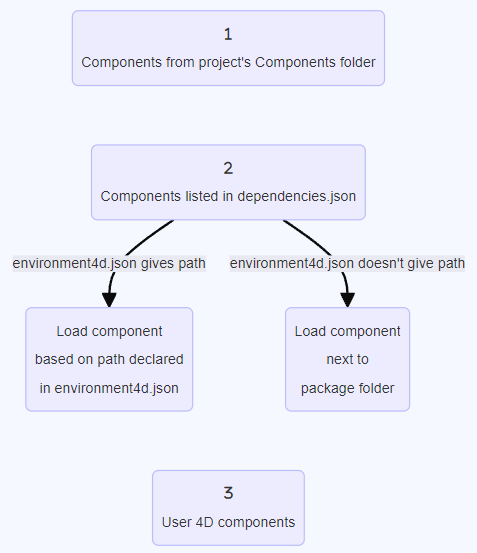

Un componente 4D es un conjunto de código y/o de formularios 4D que representan una o varias funcionalidades que pueden añadirse y utilizarse en sus proyectos. For example, the [4D SVG](https://github.com/4d/4D-SVG) component adds advanced commands and an integrated rendering engine that can be used to display SVG files.

You can [develop](../Extensions/develop-components.md) and [build](../Desktop/building.md) your own 4D components, or download public components shared by the 4D community that [can be found on GitHub](https://github.com/search?q=4d-component\&type=Repositories).

## Componentes interpretados y compilados

Los componentes pueden ser interpretados o [compilados](../Desktop/building.md). La carpeta del paquete de un componente puede contener:

- ya sea una carpeta Proyecto (componente interpretado)
- o un archivo .4DZ (componente compilado)

Un proyecto 4D que se ejecuta en modo interpretado puede utilizar componentes interpretados o compilados. Un proyecto 4D que se ejecuta en modo compilado no puede utilizar componentes interpretados. En este caso, sólo se pueden utilizar componentes compilados.

## Cargando componentes

### Básicos

Para cargar un componente en su proyecto 4D, usted puede:

- hacer referencia al componente en el archivo **dependencies.json** (y, opcionalmente, en el archivo **environment4d.json**)
- o copia los archivos del componente en la [carpeta **Components** de su proyecto](architecture.md#components).

Si se instala el mismo componente en distintos lugares, se aplica un [orden de prioridad].

### dependencies.json

1. Haga referencia al nombre del componente en el archivo **dependencies.json** de su proyecto 4D. Este archivo de manifiesto debe ser guardado en la carpeta **Sources** de la carpeta del proyecto 4D, por ejemplo:
   ```
   /MyProjectRoot/Project/Sources/dependencies.json
   ```
2. De forma predeterminada, copia la carpeta del paquete del componente (_es decir_, la carpeta raíz del proyecto del componente) al mismo nivel que la carpeta del paquete de su proyecto de 4D, por ejemplo:
   ```
   /MyProjectRoot/
   /MyProjectComponentRoot/
   ```

Thanks to this architecture, you can simply copy all your components at the same level as your projects and reference them in your **dependencies.json** files if necessary. Además, puede personalizar la ruta de sus componentes, ver abajo.

El contenido del archivo **/Sources/dependencies.json** debe tener la siguiente estructura:

```json
{
	"dependencies": {
		"myComponent1" : {},
		"myComponent2" : {}
	}
}
```

... donde "myComponent1" y "myComponent2" son los nombres de los componentes, ubicados al mismo nivel que la carpeta de paquetes de su proyecto, que desea cargar en su proyecto.

### environment4d.json

If you want to customize the location of the components that are [declared in the **dependencies.json** file](#dependenciesjson), you can use a **environment4d.json** file. Este archivo permite declarar las rutas de las dependencias que no se almacenan en el mismo nivel que la carpeta del proyecto.

Puede utilizar rutas absolutas o relativas, expresadas en sintaxis POSIX como se describe en [este párrafo](../Concepts/paths#posix-syntax). Las rutas relativas son relativas al archivo environment4d.json.

Ejemplos:

```json
{
	"dependencies": {
		"myComponent1" : "MyComponent1",
		"myComponent2" : "../MyComponent2",
        "myComponent3" : "file:///Users/jean/MyComponent3"
    }
}
```

The **environment4d.json** file can be stored in your project package folder or in one of its parent folders, at any level (up to the root). The benefit of this architecture is that you can store this environment file in a parent folder of your projects and decide not to commit it, allowing you to have your local component organization.

:::note

Si la ruta de un componente declarado en el archivo **environment4d.json** no se encuentra cuando se inicia el proyecto, el componente no se carga y obtiene el estado _No encontrado_ [status](dependency-status), incluso si existe una versión del componente junto a la carpeta de paquetes del proyecto.

:::

### Prioridad

Dado que los componentes pueden instalarse de distintas formas, se aplica un orden de prioridad cuando se hace referencia al mismo componente en varias ubicaciones:

**Máxima prioridad**

1. Componentes almacenados en la carpeta [**Components** del proyecto](architecture.md#components).
2. Componentes declarados en el archivo **dependencies.json**.
3. Componentes 4D internos del usuario (por ejemplo, 4D NetKit, 4D SVG...)

**Prioridad más baja**



Cuando un componente no puede cargarse debido a otra instancia del mismo componente situada en un nivel de prioridad superior, recibe el [estado] _Overloaded_ (#estado de dependencia). El componente cargado tiene el [estado](#dependency-status) _Overloading_.

## Monitoreo de dependencias del proyecto

En un proyecto abierto, puede obtener información sobre las dependencias y su estado de carga actual en el panel **Dependencias**.

Para mostrar el panel Dependencias:

- con 4D, seleccione el ítem de menú **Diseño/Dependencias del Proyecto** (entorno de desarrollo),<br/>
  

- con 4D Server, seleccione el ítem de menú **Ventana/Dependencias del Proyecto**.<br/>
  

A continuación se muestra el panel Dependencias. Las dependencias se ordenan por nombre en orden alfabético:


### Origen de dependencia

El panel Dependencias enumera todas las dependencias del proyecto, sea cual sea su origen, es decir, de dónde procedan. El origen de la dependencia lo suministra la etiqueta bajo su nombre:


Se soportan los siguientes orígenes:

| Etiqueta de origen      | Descripción                                                                        |
| ----------------------- | ---------------------------------------------------------------------------------- |
| Componente 4D           | Componente 4D integrado, almacenado en la carpeta `Components` de la aplicación 4D |
| Source                  | Componente declarado en el archivo [`dependencies.json`](#dependenciesjson)        |
| Entorno                 | Componente declarado en el archivo [`environnement4d.json`](#environment4djson)    |
| Componente del proyecto | Componente ubicado en la carpeta [`Components`](architecture.md#components)        |

**Clic derecho** en una línea de dependencia y selecciona **Mostrar en el disco** para revelar la ubicación de una dependencia:


:::note

Este elemento no se muestra si la relación está inactiva porque no se encuentran sus archivos.

:::

### Filtrado de dependencias

Por defecto, se listan todas las dependencias identificadas por el gestor de dependencias, sea cual sea su [estado](#dependency-status). Puede filtrar las dependencias mostradas según su estado seleccionando la pestaña correspondiente en la parte superior del panel Dependencias:


- **Activo**: dependencias que están cargadas y pueden ser utilizadas en el proyecto. Incluye dependencias _overloading_, las cuales son realmente cargadas. Las dependencias _Overloaded_ se enumeran en el panel **Conflicts** junto con todas las dependencias en conflicto.
- **Inactivo**: dependencias que no están cargadas en el proyecto y no están disponibles. Hay muchas razones posibles para este estado: archivos que faltan, incompatibilidad de versiones...
- **Conflicto**: dependencias que se cargan pero que sobrecargan al menos otra dependencia de menor [nivel de prioridad](#prioridad). También se muestran las dependencias sobrecargadas para que pueda comprobar el origen del conflicto y tomar las medidas oportunas.

### Estado de dependencia

Las dependencias que requieren la atención del desarrollador se indican mediante una **etiqueta de estado** a la derecha de la línea y un color de fondo específico:


Las siguientes etiquetas de estado están disponibles:

- **Overloaded**: la dependencia no se carga porque está sobrecargada por otra dependencia con el mismo nombre en un [nivel de prioridad] superior(#prioridad).
- **Overloading**: la dependencia está cargada y está sobrecargando una o más dependencias con el mismo nombre en un [nivel de prioridad] inferior(#prioridad).
- **Not found**: la dependencia se declara en el archivo dependencies.json pero no se encuentra.
- **Inactive**: la dependencia no se carga porque no es compatible con el proyecto (por ejemplo, el componente no está compilado para la plataforma actual).
- **Duplicated**: la dependencia no se carga porque existe otra dependencia con el mismo nombre en la misma ubicación (y está cargada).

Al pasar el ratón por encima de la línea de dependencia, se muestra un mensaje que ofrece información adicional sobre el estado:


