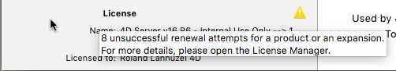

The **Monitor** page displays dynamic information concerning database use as well as information about the system and the 4D Server application.

> En Windows, parte de la información del sistema que se muestra en esta página se recupera a través de las herramientas del "Analizador de rendimiento" de Windows. Sólo se puede acceder a estas herramientas cuando el usuario que abrió la sesión donde se lanzó 4D Server tiene la autorización de administración necesaria.

## Área gráfica

El área gráfica permite ver la evolución en tiempo real de varios parámetros: el uso de la CPU, el tráfico de red y el estado de la memoria. Se selecciona el parámetro que se va a mostrar a través de un menú que se encuentra en el centro de la ventana:

- **CPU Usage**: Overall CPU usage of the machine, for all applications taken together. La parte específica de 4D Server en esta tasa de uso se ofreced en el área de información "Procesadores".
- **Network**: Number of bytes received per second by the machine (server or client). El número de bytes enviados se suministra en el área de información "Red".
- **Physical memory**: Quantity of RAM memory of machine used by 4D Server. En el área de información "Memoria" se ofrece una visión más detallada del uso de la memoria.
- **Virtual memory**: Quantity of virtual memory used by the 4D Server application. Esta memoria es asignada por el sistema en función de las necesidades de la aplicación. El valor que se encuentra en la parte inferior derecha del área indica la cantidad de memoria que se está utilizando actualmente. El valor que se encuentra en la parte superior izquierda indica la cantidad máxima de memoria virtual utilizable. El valor máximo se calcula dinámicamente en función de la configuración general de la memoria de la aplicación.
- **Cache**: Quantity of cache memory used by the 4D Server application. El valor que se encuentra en la parte inferior derecha del área indica la cantidad de memoria que se está utilizando actualmente. The value found at the bottom right of the area indicates the quantity of memory currently being used.

Tenga en cuenta que cuando se selecciona esta opción, el desplazamiento del área gráfica se ralentiza, ya que un análisis eficaz de la memoria caché se realiza generalmente durante un período de observación bastante largo.

## Visión general del área

El área "Visión general" ofrece diferente información sobre el sistema, la aplicación y las licencias instaladas en la máquina 4D Server.

- **System Information**: Computer, system and IP address of server
- **Application Information**: Internal version number of 4D Server and Volume Shadow Copy status
- **Maximum connections**: Number of simultaneous connections allowed by type of server
- **License**: Description of license. Cuando la licencia producto o una de sus expansiones adjuntas vence en menos de 10 días, por ejemplo en el caso de una licencia de suscripción, 4D Server intenta renovar automáticamente la licencia desde la cuenta del usuario 4D. En este caso, si la renovación automática ha fallado por alguna razón (error de conexión, estado de la cuenta inválido, contrato no prolongado...), se muestra un icono de advertencia junto a la licencia para alertar al administrador del servidor. Se puede mostrar información adicional sobre el estado de la renovación de la licencia en un consejo cuando se pasa el ratón por sobre el área:

Usually, you will need to check the [**Licences Manager**](Admin/licenses.md).

## Área Detalles

El área "Detalles" repite parte de la información mostrada en el área gráfica y ofrece también información adicional.

- **Hard drive**: Overall capacity of the hard disk and distribution of the space used by the database data (data file + data index), the space used by other files and the free space available.
- **Memory**: RAM memory installed on the machine and amount of memory used by 4D Server, by other applications or that is free. La memoria utilizada por 4D Server también puede mostrarse dinámicamente en el área gráfica.
- **Processors**: Instant occupancy rate for processor(s) of the machine by 4D Server and by other applications. Esta tasa se recalcula constantemente. La tasa de ocupación por 4D Server también puede mostrarse dinámicamente en el área gráfica.
- **Network**: Instantaneous number of bytes sent and received by the machine (server or client). Este valor se actualiza constantemente. El número de bytes recibidos también puede mostrarse dinámicamente en el área gráfica.
