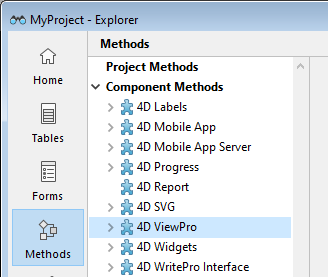
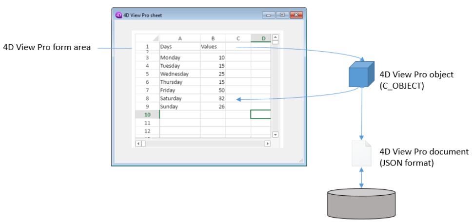

4D View Pro is a [4D component](Concepts/components.md) that includes a [4D form area](FormObjects/viewProArea_overview.md) and specific [commands](commands.md). Le permite integrar las funcionalidades avanzadas de hoja de cálculo en sus proyectos.


Una hoja de cálculo es una aplicación que contiene una cuadrícula de celdas en las que se puede introducir información, ejecutar cálculos o mostrar imágenes. 4D View Pro is powered by the [SpreadJS spreadsheet solution](https://developer.mescius.com/spreadjs) integrated in 4D.

La integración de áreas de 4D View Pro en sus formularios le permite importar y exportar documentos de hojas de cálculo utilizando los comandos 4D View Pro.

## Instalación y activación

Las funcionalidades de 4D View Pro se incluyen directamente en 4D, lo que facilita su despliegue y gestión. No se requiere ninguna instalación adicional.

Sin embargo, 4D View Pro requiere una licencia. Es necesario activar esta licencia en su aplicación para poder utilizar sus funcionalidades. Cuando se utiliza este componente sin licencia, el contenido de un objeto que requiere una función de 4D View Pro no se muestra en tiempo de ejecución, sino que se muestra un mensaje de error:


## Inserción de un área 4D View Pro

4D View Pro documents are displayed and edited manually in a [4D form object](FormObjects/viewProArea_overview.md) named 4D View Pro. Para seleccionar este objeto, haga clic en la última herramienta de la barra de objetos:


You can also select a preconfigured 4D View Pro area in the [Object library](FormEditor/objectLibrary.md).

> 4D View Pro areas can also be [created and used offscreen](commands/vp-run-offscreen-area.md).

You can [configure the area](configuring.md) using the Property List and 4D View Pro commands.

## Fundamentos de la selección, la entrada y de la navegación

Las hojas de cálculo se componen de líneas y columnas. A cada línea se le asocia un número. A cada columna se le asocia una letra (o grupo de letras una vez que el número de columnas supera el número de letras del alfabeto). La intersección de una línea y de una columna constituye una celda. Las celdas pueden ser seleccionadas y sus contenidos editados.

### Selección de celdas, columnas y líneas

- Para seleccionar una celda, basta con hacer clic en ella o utilizar las flechas de dirección del teclado. Su contenido (o fórmula) se muestra dentro de la celda.

- Para seleccionar varias celdas continuas, arrastre el ratón de un extremo a otro de la selección. También puede hacer clic en los dos extremos de la selección mientras mantiene presionada la tecla Mayús.

- To select all cells in the spreadsheet, click on the cell at the top left of the area:
  

- Para seleccionar una columna, haga clic en la letra (o conjunto de letras) correspondiente.

- Para seleccionar una línea, haga clic en el número correspondiente.

- To select a group of cells that are not continuous, hold down the **Ctrl** key (Windows) or **Command** key (Mac) and click on each cell to be selected.

- Para deseleccionar las celdas, basta con hacer clic en cualquier lugar de la hoja de cálculo.

### Entrada de datos

Hacer doble clic en una celda permite pasar al modo de entrada en la celda correspondiente. Si la celda no está vacía, el cursor de inserción se coloca después del contenido de la celda.


Los datos pueden introducirse directamente una vez seleccionada una celda, incluso si el cursor de inserción no está visible. La entrada entonces reemplaza el contenido de la celda.

The **Tab** key validates the cell input and selects the cell to its right. Combining the **Shift + Tab** keys validates the cell input and selects the cell to its left.

The **Carriage return** key validates the cell input and selects the cell below it. Combining the **Shift + Carriage return** keys validates the cell input and selects the cell above it.

Las teclas de dirección (flechas) permiten mover una celda en la dirección indicada por la flecha.

### Utilización del menú contextual

Las áreas 4D View Pro se benefician de un menú contextual automático que ofrece funciones de edición estándar como copiar y pegar, pero también funciones básicas de hoja de cálculo:


> Las funciones Copiar/Cortar y Pegar del menú contextual sólo funcionan dentro del área de la hoja de cálculo, no tienen acceso al portapapeles del sistema. System shortcuts such as **Ctrl+c/Ctrl+v** works however and can be used to exchange data between the area and other applications.

Dependiendo del área seleccionada, también están disponibles las siguientes opciones:

- click on a column or row header: **Insert**, **Delete**, **Hide**, or **Unhide** the contents
- haga clic en una celda o en un rango de celdas:
  - **Filter**: allows hiding row through filters (see "Filtering rows" in the [SpreadJS documentation](https://developer.mescius.com/spreadjs/docs/)).
  - **Sort**: sorts the column contents.
  - **Insert Comment**: allows user to enter a comment for an area. When a comment has been entered for an area, the top left cell of the area displays a small red triangle:\
    

## Utilizando los comandos de 4D View Pro

Los comandos 4D View Pro se pueden utilizar en el editor de código 4D, al igual que los comandos de lenguaje 4D.

Since 4D View Pro is a built-in 4D component, you can access its list of commands from the Explorer, in the **Component Methods** section:



For a detailed list, see [Commands](commands.md).

### Abordando un área 4D View Pro

Un área 4D View Pro maneja varios objetos y elementos.



Most of 4D View Pro commands require a _vpAreaName_ parameter, which is the [**4D View Pro form area name**](FormObjects/viewProArea_overview.md) (4D form object). This name is the [object name](FormObjects/properties_Object.md#object-name) property.

Por ejemplo, si quiere definir el número total de columnas de un área llamada "myVpArea", escriba:

```4d
VP SET COLUMN COUNT("myVpArea";5)
```

> When loading a 4D View Pro object in a form area, 4D generates the [On VP Ready](../Events/onVpReady.md) form event once the whole area is loaded. Debe ejecutar todo código 4D View Pro que maneje el área en este evento, de lo contrario se devuelve un error.

### Utilización de objetos de rango

Some 4D View Pro commands require a _rangeObj_ parameter. En 4D View Pro, un rango es un objeto que hace referencia a un área en una hoja de cálculo. Esta área puede estar compuesta de una o varias celdas. Using 4D View Pro commands, you can create ranges and pass them to other commands to read from or write to specific locations in your document.

Por ejemplo, para crear un objeto rango para las siguientes celdas:


You can use the [VP Cells](commands/vp-cells.md) method:

```4d
var $myRange : Object
$myRange:=VP Cells("ViewProArea";2;4;2;3) // C5 a D7
```

You can then pass `$myRange` to another 4D View Pro method to modify these cells (for example add a border to the set of cells with [VP SET BORDER](commands/vp-set-border.md)).

Los objetos rango 4D View Pro se componen de varias propiedades:

- area - El nombre del área 4D View Pro
- rangos - Una colección de objeto(s) rango. Las propiedades disponibles en cada objeto de rango dependen del tipo de objeto rango. For example, a column range object will only include the _.column_ and _.sheet_ properties.

| Propiedad |                                                                                       | Tipo       | Descripción                                                                                                               | Disponible para                                                |
| --------- | ------------------------------------------------------------------------------------- | ---------- | ------------------------------------------------------------------------------------------------------------------------- | -------------------------------------------------------------- |
| area      |                                                                                       | text       | Nombre de objeto formulario área 4D View Pro                                                                              | siempre disponible                                             |
| ranges    |                                                                                       | collection | Colección de rangos                                                                                                       | siempre disponible                                             |
|           | \[ ].name        | text       | Nombre de rango                                                                                                           | name                                                           |
|           | \[ ].sheet       | number     | Índice de la hoja (por defecto, índice de la hoja actual) (el conteo comienza en 0) | celda, celdas, línea, líneas, columna, columnas, todos, nombre |
|           | \[ ].row         | number     | Índice de la línea (el conteo comienza en 0)                                                           | celda, celdas, línea, líneas                                   |
|           | \[ ].rowCount    | number     | Número de líneas                                                                                                          | celdas, líneas                                                 |
|           | \[ ].column      | number     | Índice de la columna (el conteo comienza en 0)                                                         | celda, celdas, columna, columnas                               |
|           | \[ ].columnCount | number     | Conteo de columnas                                                                                                        | celdas, columnas                                               |

## Importar y exportar documentos

4D View Pro soporta la importación y exportación de varios formatos de documentos:

- .4vp
- .xlsx
- .txt y .csv
- .sjs
- .pdf (sólo para exportación)

For more details, check out the description of [VP IMPORT DOCUMENT](commands/vp-import-document.md) and [VP EXPORT DOCUMENT](commands/vp-export-document.md).
