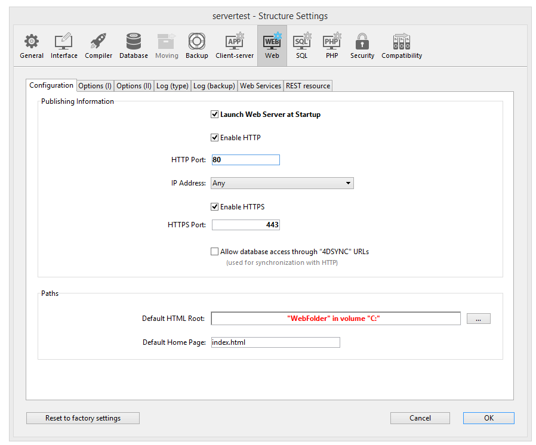
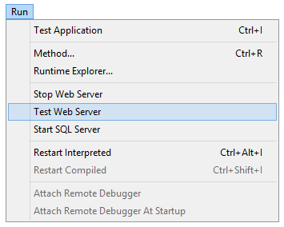

4D ofrece varias herramientas integradas para iniciar, detener o supervisar el servidor web integrado.

## Iniciar el servidor Web 4D

> Para poder lanzar el servidor web de 4D o 4D Server, debe tener una licencia "4D Web Application". For more information, please refer to the [4D Web site](https://www.4d.com).

Un proyecto 4D puede iniciar y monitorizar un servidor web para la aplicación principal (host) así como para cada componente alojado.

El servidor web principal de 4D puede iniciarse de diferentes maneras:

- Utilizando un botón o comando de menú.
  - 4D: **Run\>Start Web Server** menu 
  - 4D Server: **Start HTTP server** button of the HTTP Server page 

- Se inicia automáticamente cada vez que se abre la aplicación 4D. To do this, display the **Web\/Configuration** page of the Settings and select the **Launch Web Server at Startup** check box: 

- Programmatically, by calling the [`webServer.start()`](API/WebServerClass.md#start) function or `WEB START SERVER` command.

The web server of any component can be launched by calling the [`webServer.start()`](API/WebServerClass.md#start) function on the component's web server object.

> No es necesario relanzar la aplicación 4D para iniciar o detener el servidor web.

## Detener el servidor Web 4D

El servidor web principal de 4D puede detenerse de diferentes maneras:

- Using the **Run\>Stop Web Server** menu of 4D or the **Stop HTTP server** button of the HTTP Server page of 4D Server (both items show **Start...** when the server is not already started).

- Programmatically, by calling the [`webServer.stop()`](API/WebServerClass.md#stop) function or `WEB STOP SERVER` command.

The web server of any component can be stopped by calling the `webServer.stop()` function on the component's web server object.

## Probar el servidor Web 4D

The **Test Web Server** command can be used to make sure the built-in web server is functioning correctly (4D only). This command is accessible in the **Run** menu when the web server is launched:

Al seleccionar este comando, la página de inicio del sitio web publicado por la aplicación 4D se muestra en una ventana de su navegador web predeterminado:

Este comando permite verificar que el servidor web, la visualización de la página de inicio, etc. funcionan correctamente. The page is called using the _localhost_ URL, which is the standard shortcut designating the IP address of the machine on which the web browser is executed. The command takes into account the [TCP publication port](#http-port) number specified in the settings.

## Borrar la caché

En cualquier momento, puede vacíar la caché de las páginas y de las imágenes que contiene (si, por ejemplo, ha modificado una página estática y quiere volver a cargarla en la caché).

Para ello, puede:

- 4D: click on the **Clear Cache** button in the [Web/Options (I) page](../settings/web.md) of the Settings dialog box.
- 4D Server: click on the **Clear Cache** button in the HTTP page of the 4D Server Administration window.

La caché se borra inmediatamente.

> You can also use the [/4DCACHECLEAR](#cacheclear) URL.

## Explorador de ejecución

The **Watch** page (**Web** heading) in the Runtime Explorer displays web server information, particularly:

- **Web Cache Usage**: indicates the number of pages present in the web cache as well as its use percentage. Esta información sólo está disponible si el servidor web está activo y si el tamaño de la caché es mayor que 0.

- **Web Server Elapsed Time**: indicates the duration of use (in hours:minutes:seconds format) of the Web server. Esta información sólo está disponible si el servidor web está activo.

- **Web Hits Count**: indicates the total number of HTTP requests received since the web server boot, as well as an instantaneous number of requests per second (measure taken between two Runtime Explorer updates). Esta información sólo está disponible si el servidor web está activo.

## URL para la administración

Las URL de administración del sitio web le permiten controlar el sitio web publicado en su servidor. 4D Web Server accepts four particular URLs: _/4DSTATS_, _/4DHTMLSTATS_, /_4DCACHECLEAR_ and _/4DWEBTEST_.

> _/4DSTATS_, _/4DHTMLSTATS_ and _/4DCACHECLEAR_ are only available to the Designer and Administrator of the database. Si el sistema de contraseñas 4D no ha sido activado, estas URLs están disponibles para todos los usuarios. /4DWEBTEST está siempre disponible.

### /4DSTATS

The **/4DSTATS** URL returns several items of information in an HTML table (displayable in a browser):

| Elemento                  | Descripción                                                              |
| ------------------------- | ------------------------------------------------------------------------ |
| Tamaño actual de la caché | Tamaño actual de la caché del servidor web (en bytes) |
| Tamaño máximo de la caché | Tamaño máximo de la caché (en bytes)                  |
| Cached Object Max Size    | Tamaño máximo de cada objeto en la caché (en bytes)   |
| Cache Use                 | Porcentaje de caché utilizado                                            |
| Cached Objects            | Number of objects found in the cache, **including pictures**             |

Esta información puede permitirle comprobar el funcionamiento de su servidor y, eventualmente, adaptar los parámetros correspondientes.

> The `WEB GET STATISTICS` command allows you to also obtain information about how the cache is being used for static pages.

### /4DHTMLSTATS

The _/4DHTMLSTATS_ URL returns, also as an HTML table, the same information as the _/4DSTATS_ URL. The difference is that the **Cached Objects** field only counts HTML pages (without counting picture files). Moreover, this URL returns the **Filtered Objects** field.

| Elemento                  | Descripción                                                                          |
| ------------------------- | ------------------------------------------------------------------------------------ |
| Tamaño actual de la caché | Tamaño actual de la caché del servidor web (en bytes)             |
| Tamaño máximo de la caché | Tamaño máximo de la caché (en bytes)                              |
| Cached Object Max Size    | Tamaño máximo de cada objeto en la caché (en bytes)               |
| Cache Use                 | Porcentaje de caché utilizado                                                        |
| Cached Objects            | Number of objects found in the cache, **without pictures**                           |
| Objetos filtrados         | Número de objetos en la caché que no se cuentan por URL, en particular, las imágenes |

### /4DCACHECLEAR

The _/4DCACHECLEAR_ URL immediately clears the cache of the static pages and images. Por tanto, permite "forzar" la actualización de las páginas que han sido modificadas.

### /4DWEBTEST

The _/4DWEBTEST_ URL is designed to check the web server status. Cuando se llama a esta URL, 4D devuelve un archivo texto con los campos HTTP siguientes llenos:

| Campo HTTP | Descripción                                              | Ejemplo                                                                                                                                                                                                                                                                                                                                            |
| ---------- | -------------------------------------------------------- | -------------------------------------------------------------------------------------------------------------------------------------------------------------------------------------------------------------------------------------------------------------------------------------------------------------------------------------------------- |
| Fecha      | fecha actual en el formato RFC 822                       | Mon, 7 Dec 2020 13:12:50 GMT                                                                                                                                                                                                                                                                                       |
| Server     | 4D/Número de versión                                     | 4D/18.5.0 (Build 18R5.257368)                                                                                                                                                                                                                                                   |
| User-Agent | nombre y versión @ dirección IP del cliente | Mozilla/5.0 (Windows NT 10.0; Win64; x64) AppleWebKit/537.36 (KHTML, like Gecko) Chrome/86.0.4240.183 Safari/537.36 @ 127.0.0.1 |

## Logs

4D le permite generar dos historiales de peticiones web:

- a debug log, useful in the web server development phase (_HTTPDebugLog.txt_),
- a standardized web request log, rather used for statistic purposes (_logweb.txt_).

Both log files are automatically created in the **Logs** folder of the application project.

### HTTPDebugLog.txt

The [http debug file](webServerConfig.md#debug-log) can be enabled using the [`web server` object](webServerObject.md) or the `WEB SET OPTION` command.

Este archivo de historial registra cada petición HTTP y cada respuesta en modo bruto (raw). Se registran las solicitudes completas, incluidos los encabezados; opcionalmente, también se pueden registrar las partes del cuerpo.

Los siguientes campos se registran tanto para la solicitud como para la respuesta:

| Nombre del campo | Descripción                                                                           |
| ---------------- | ------------------------------------------------------------------------------------- |
| SocketID         | ID del socket utilizado para la comunicación                                          |
| PeerIP           | Dirección IPv4 del host (cliente)                                  |
| PeerPort         | Puerto utilizado por host (cliente)                                |
| TimeStamp        | Timestamp en milisegundos (desde el inicio del sistema)            |
| ConnectionID     | Conexión UUID (UUID del VTCPSocket utilizado para la comunicación) |
| SequenceNumber   | Número de operación único y secuencial en la sesión de historial                      |

### logweb.txt

The [web log recording file](webServerConfig.md#log-recording) can be enabled using the [`web server` object](webServerObject.md), the `WEB SET OPTION` command, or the **Web/Log (type)** page of the settings. Debe seleccionar el formato de historial.

#### CLF/DLF

Each line of the file represents a request, such as:
_host rfc931 user \[DD/MMM/YYYY:HH:MM:SS] "request" state length_
Each field is separated by a space and each line ends by the CR/LF sequence (character 13, character 10).

El formato DLF (Combined Log Format) es similar al formato CLF (Common Log Format) y utiliza exactamente la misma estructura. Simplemente añade dos campos HTTP adicionales al final de cada petición: Referer y User-agent. Esta es la descripción de los formatos CLF/DLF (no personalizables):

| Nombre del campo                                                     | Descripción                                                                                                                                                                                                                                                                                                                                                                  |
| -------------------------------------------------------------------- | ---------------------------------------------------------------------------------------------------------------------------------------------------------------------------------------------------------------------------------------------------------------------------------------------------------------------------------------------------------------------------- |
| host                                                                 | Dirección IP del cliente (por ejemplo: "192.100.100.10)                                                                                                                                                                                                                                   |
| rfc931                                                               | información no generada por 4D, siempre es - (un signo menos                                                                                                                                                                                                                                                                                              |
| user                                                                 | nombre de usuario como está autenticado, o - (un signo menos). Si el nombre de usuario contiene espacios, se remplazan por _ (un guión bajo).                                                                                                                                     |
| DD/MMM/YYYY:HH:MM:SS | DD: día, MMM: una abreviatura de 3 letras para el nombre del mes (Jan, Feb,...), YYYY: año, HH: hora, MM: minutos, SS: segundos. La fecha y hora son locales al servidor. |
| request                                                              | solicitud enviada por el cliente (por ejemplo, GET /index.htm HTTP/1.0                                                                                                                                                                                                                                                    |
| state                                                                | respuesta dada por el servidor                                                                                                                                                                                                                                                                                                                                               |
| length                                                               | tamaño de los datos devueltos (excepto el encabezado HTTP) o 0                                                                                                                                                                                                                                                                                            |
| Referer                                                              | Sólo DLF- Contiene la URL de la página que apunta al documento solicitado.                                                                                                                                                                                                                                                                                   |
| User-agent                                                           | DLF únicamente - Contiene el nombre y la versión del navegador o del software del cliente en el origen de la solicitud                                                                                                                                                                                                                                                       |

#### ELF/WLF

El formato ELF (Extended Log Format) está muy extendido en el mundo de los navegadores HTTP. Puede utilizarse para construir historiales sofisticados que respondan a necesidades específicas. Por esta razón, el formato ELF se puede personalizar: es posible elegir los campos que se van a registrar, así como su orden de inserción en el archivo.

El formato WLF (WebStar Log Format) fue desarrollado específicamente para el servidor 4D WebSTAR.

##### Configurar los campos

Al elegir el formato ELF o WLF, el área "Web Log Token Selection" muestra los campos disponibles para el formato elegido. Deberá seleccionar cada campo para incluirlo en el registro. Para ello, marque los campos deseados.

> No puede seleccionar el mismo campo dos veces.

La siguiente tabla enumera los campos disponibles para cada formato (en orden alfabético) y describe su contenido:

| Campo                                                  | ELF | WLF | Valor                                                                                                                                                                                                                            |
| ------------------------------------------------------ | --- | --- | -------------------------------------------------------------------------------------------------------------------------------------------------------------------------------------------------------------------------------- |
| BYTES_RECEIVED                    |     | X   | Número de bytes recibidos por el servidor                                                                                                                                                                                        |
| BYTES_SENT                        | X   | X   | Número de bytes enviados por el servidor al cliente                                                                                                                                                                              |
| C_DNS                             | X   | X   | Dirección IP del DNS (ELF: campo idéntico al campo C_IP)                                                                                                                 |
| C_IP                              | X   | X   | Dirección IP del cliente (por ejemplo 192.100.100.10)                                                                                                         |
| CONNECTION_ID                     |     | X   | Número de identificación de la conexión                                                                                                                                                                                          |
| CS(COOKIE)                          | X   | X   | Información sobre las cookies contenidas en la petición HTTP                                                                                                                                                                     |
| CS(HOST)                            | X   | X   | Campo Host de la petición HTTP                                                                                                                                                                                                   |
| CS(REFERER)                         | X   | X   | URL de la página que apunta al documento solicitado                                                                                                                                                                              |
| CS(USER_AGENT) | X   | X   | Información sobre el software y el sistema operativo del cliente                                                                                                                                                                 |
| CS_SIP                            | X   | X   | Dirección IP del servidor                                                                                                                                                                                                        |
| CS_URI                            | X   | X   | URI sobre el que se realiza la petición                                                                                                                                                                                          |
| CS_URI_QUERY | X   | X   | Parámetros de consulta de la petición                                                                                                                                                                                            |
| CS_URI_STEM  | X   | X   | Parte de la solicitud sin los parámetros de la consulta                                                                                                                                                                          |
| DATE                                                   | X   | X   | DD: día, MMM: abreviación de 3 letras para el mes (Jan, Feb,...), YYYY: año                                   |
| METHOD                                                 | X   | X   | Método HTTP utilizado para la solicitud enviada al servidor                                                                                                                                                                      |
| PATH_ARGS                         |     | X   | Parámetros CGI: cadena situada después del caracter "$"                                                                                                                                                          |
| STATUS                                                 | X   | X   | Respuesta ofrecida por el servidor                                                                                                                                                                                               |
| TIME                                                   | X   | X   | HH: hora, MM: minutos, SS: segundos                                                                                                                                              |
| TRANSFER_TIME                     | X   | X   | Tiempo solicitado por el servidor para generar la respuesta                                                                                                                                                                      |
| USER                                                   | X   | X   | Nombre de usuario si está autenticado; en caso contrario, - (signo menos). Si el nombre de usuario contiene espacios, se sustituyen por _ (subrayado) |
| URL                                                    |     | X   | URL solicitado por el cliente                                                                                                                                                                                                    |

> Las fechas y horas se indican en GMT.

#### Frecuencia del backup

Since a _logweb.txt_ file can become considerably large, it is possible to set up an automatic archiving mechanism. La activación de una copia de seguridad puede basarse en un periodo de tiempo determinado (expresado en horas, días, semanas o meses), o en función del tamaño del archivo; cuando se alcanza el plazo establecido (o el tamaño del archivo), 4D cierra y archiva automáticamente el archivo de registro actual y crea uno nuevo.

When the web log file backup is triggered, the log file is archived in a folder named "Logweb Archives," which is created at the same level as the _logweb.txt_ file.

El fichero archivado se renombra según el siguiente ejemplo "DYYY_MM_DD_Thh_mm_ss.txt". For instance, for a file archived on September 4, 2020 at 3:50 p.m. and 7 seconds: “D2020_09_04_T15_50_07.txt.” y 7 segundos: “D2020_09_04_T15_50_07.txt.”

#### Parámetros de backup

The automatic backup parameters for the logweb.txt are set on the **Web/Log (backup)** page of the Settings:

First you must choose the frequency (days, weeks, etc.) or the file size limit criterion by clicking on the corresponding radio button. A continuación, debe especificar el momento preciso de la copia de seguridad si es necesario.

- **No Backup**: The scheduled backup function is deactivated.

- **Every X hour(s)**: This option is used to program backups on an hourly basis. Puede introducir un valor entre 1 y 24 .
  - **starting at**: Used to set the time at which the first back up will begin.

- **Every X day(s) at X**: This option is used to program backups on a daily basis. Introduzca 1 si desea realizar una copia de seguridad diaria. Cuando esta opción está marcada, debe indicar la hora a la que debe comenzar la copia de seguridad.

- **Every X week(s), day at X**: This option is used to program backups on a weekly basis. Introduzca 1 si desea realizar una copia de seguridad semanal. Enter 1 if you want to perform a weekly backup. When this option is checked, you must indicate the day(s) of the week and the time when each backup must be started. You can select several days of the week if desired.

- **Every X month(s), Xth day at X**: This option is used to program backups on a monthly basis. Introduzca 1 si desea realizar una copia de seguridad mensual. Enter 1 if you want to perform a monthly backup.

- **Every X MB**: This option is used to program backups based on the size of the current request log file. Una copia de seguridad se activa automáticamente cuando el archivo alcanza el tamaño especificado. Puedes definir un límite de tamaño de 1, 10, 100 o 1000 MB.
