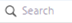
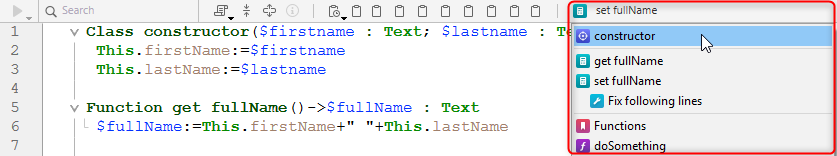

4D tiene un poderoso editor de código integrado que ofrece un amplio conjunto de funcionalidades para la edición de código altamente productivo, como la finalización inteligente de código, la navegación de código, la depuración, la búsqueda y más.


El editor de código funciona como un editor de texto. Escribir un método o una clase suele ser una combinación de escribir texto, seleccionar componentes y arrastrar elementos desde el Explorador u otras ventanas. También se pueden utilizar varias funciones de tecleo predictivo para crear métodos más rápidamente.

Puede desplazarse por el contenido de métodos, clases y funciones, que pueden incluir hasta 32.000 líneas de código o 2 GB de texto.

El Editor de Código 4D ofrece una comprobación básica de errores de sintaxis. Cuando se ejecuta el código se realiza una comprobación adicional de errores. For more information on how to handle errors, see [Debugging](../Debugging/basics.md).

## Interface

### Toolbar (Barra de herramientas)

Cada ventana del Editor de Código tiene una barra de herramientas que ofrece acceso instantáneo a las funciones básicas relacionadas con la ejecución y edición de código.

| Elemento                      | Icono                                                                             | Descripción                                                                                                                                                                                                                                                                                                                                                                                                                                                                                                                                                                                                                                                                                                                                                                                                                                                                                                                                                                                                                                                                                                                                                                                                                |
| ----------------------------- | --------------------------------------------------------------------------------- | -------------------------------------------------------------------------------------------------------------------------------------------------------------------------------------------------------------------------------------------------------------------------------------------------------------------------------------------------------------------------------------------------------------------------------------------------------------------------------------------------------------------------------------------------------------------------------------------------------------------------------------------------------------------------------------------------------------------------------------------------------------------------------------------------------------------------------------------------------------------------------------------------------------------------------------------------------------------------------------------------------------------------------------------------------------------------------------------------------------------------------------------------------------------------------------------------------------------------- |
| **Ejecución del método**      |                     | Cuando se trabaja con métodos, cada ventana del Editor de Código tiene un botón que puede utilizarse para ejecutar el método actual. Using the menu associated with this button, you can choose the type of execution:<ul><li> **Run new process**: Creates a process and runs the method in standard mode in this process.</li><li>**Run and debug new process**: Creates a new process and displays the method in the Debugger window for step by step execution in this process.</li><li>**Run in Application process**: Runs the method in standard mode in the context of the Application process (in other words, the record display window).</li><li>**Run and debug in Application process**: Displays the method in the Debugger window for step by step execution in the context of the Application process (in other words, the record display window).</li></ul>For more information on method execution, see [Calling Project Methods](../Concepts/methods.md#calling-project-methods). |
| **Find in method**            |                                | Displays the [_Search_ area](#find-and-replace).                                                                                                                                                                                                                                                                                                                                                                                                                                                                                                                                                                                                                                                                                                                                                                                                                                                                                                                                                                                                                                                                                                                                                           |
| **Macros**                    |                              | Inserta una macro en la selección. Haga clic en la flecha desplegable para mostrar una lista de macros disponibles. For more information on how to create and instantiate macros, see [Macros](#macros).                                                                                                                                                                                                                                                                                                                                                                                                                                                                                                                                                                                                                                                                                                                                                                                                                                                                                                                                                                   |
| **Expand all / Collapse all** |        | Estos botones permiten expandir o contraer todas las estructuras de flujo de control del código.                                                                                                                                                                                                                                                                                                                                                                                                                                                                                                                                                                                                                                                                                                                                                                                                                                                                                                                                                                                                                                                                                                           |
| **Method information**        |        | Displays the [Method Properties](../Concepts/methods.md#project-method-properties) dialog box (project methods only).                                                                                                                                                                                                                                                                                                                                                                                                                                                                                                                                                                                                                                                                                                                                                                                                                                                                                                                                                                                                                                                                   |
| **Last clipboard values**     |  | Muestra los últimos valores almacenados en el portapapeles.                                                                                                                                                                                                                                                                                                                                                                                                                                                                                                                                                                                                                                                                                                                                                                                                                                                                                                                                                                                                                                                                                                                                                |
| **Portapapeles**              |                        | Nueve portapapeles disponibles en el editor de código. You can [use these clipboards](./write-class-method.md#multiple-copy-paste-and-numbering-of-clipboards) by clicking on them directly or by using keyboard shortcuts. You can use a [Preferences option](Preferences/methods.md#options-1) to hide them.                                                                                                                                                                                                                                                                                                                                                                                                                                                                                                                                                                                                                                                                                                                                                                                                                                                             |
| **Navigation dropdown**       |                        | Le permite navegar dentro de métodos y clases con contenido etiquetado automáticamente o marcadores declarados manualmente. Ver abajo                                                                                                                                                                                                                                                                                                                                                                                                                                                                                                                                                                                                                                                                                                                                                                                                                                                                                                                                                                                                                                                                      |

### Área de edición

Aquí es donde se escribe y edita el código. El editor aplica automáticamente sangrías al texto del código y colorea los distintos elementos sintácticos para que la estructura del código sea clara.

Puede personalizar la visualización del área de edición. Toda personalización se transmite automáticamente a todas las ventanas del editor de código:

| Option                                 | Descripción                                                                                                                                                                                                                                                                                               | Definido en...                                                                                                                                                     |
| -------------------------------------- | --------------------------------------------------------------------------------------------------------------------------------------------------------------------------------------------------------------------------------------------------------------------------------------------------------- | ------------------------------------------------------------------------------------------------------------------------------------------------------------------------------------------------------------------ |
| **fuente** y **tamaño de fuente**      | Define la fuente y el tamaño de los caracteres que se utilizarán en el área de edición                                                                                                                                                                                                                    | **Preferences** > [**Methods**](../Preferences/methods.md) or **Method > View** > **Bigger Font** or **Smaller Font**                                                                                              |
| **style and color of syntax elements** | Asignar un color y/o estilo específico a cada tipo de elemento del lenguaje 4D.  También puede cambiar los distintos colores utilizados en la interfaz del área de edición (resaltado, fondo, etc.).                                   | Haga clic derecho en un elemento lingüístico (variable, palabra clave, etc.) > **Style** submenu. Or **Preferences** > [**Methods**](../Preferences/methods.md) |
| **spaces**                             | You can display the spaces between words using dots (.) en lugar de espacios en blanco. Esta opción se aplica a todos los elementos del código (nombres de comandos, variables, comentarios, etc.). | **Method > View > White Spaces**                                                                                                                                                                                   |
| **themes**                             | Puedes seleccionar el tema Dark o Light, o definir uno personalizado                                                                                                                                                                                                                                      | **Preferences** > [**Methods**](../Preferences/methods.md)                                                                                                                                                         |
| **width of code indentations**         | Define el ancho de las sangrías de código                                                                                                                                                                                                                                                                 | **Preferences** > [**Methods**](../Preferences/methods.md)                                                                                                                                                         |

#### Barras de cambio

Las barras de colores muestran al instante dónde se han modificado las líneas de código desde que se abrió el método:


Las barras de modificación cambian de color para indicar si las modificaciones se han guardado o no:

- amarillo: se ha modificado la línea y aún no se ha guardado el método.
- verde: se ha modificado la línea y se ha guardado el método.

### Área listas

El área listas permite visualizar una o varias listas de elementos necesarios para escribir métodos y clases (comandos, constantes, formularios, etc.). Puede elegir el número y el contenido de las listas que aparecen en la ventana.

Por defecto, el editor de código muestra cuatro listas. Puede ocultar o mostrar todas las listas haciendo clic en el icono situado en la parte inferior derecha de la ventana. 

Puede ampliar o reducir el ancho relativo de cada área lista arrastrando una de sus particiones. También es posible ajustar el tamaño del área lista en relación con el del área de edición arrastrando la línea divisoria entre ambas.

- Al hacer doble clic en un elemento de una lista, éste se inserta en el área de edición, en la posición del cursor.
- To **modify the contents** of a list, click on the title area of the list concerned: a pop-up menu appears, enabling you to choose the type of item to be displayed.


- Para añadir o eliminar una lista, haga clic en el área del título de una de las listas y elija el comando correspondiente en el menú emergente.
  The **Remove this list** command is disabled when you click on the last list. If you want to hide all the lists, you must either click on the **show or hide lists**  button at the bottom right of the window or hide them by default in the **Preferences**.

- Puede ocultar las listas en todas las ventanas de las siguientes maneras:
  - Select the **View > Lists** option in the **Method** menu (a check mark indicates whether lists are displayed)
  - Uncheck the **Preferences** > **Methods** > **Options** > **Show Lists** option. For the modifications made in the **Preferences** dialog box to be taken into account, any open methods, classes or functions must first be closed then reopened.

#### Listas de elementos disponibles

Puede mostrar las siguientes listas de elementos en el área de listas de la ventana del Editor de código:

- **All tables and fields**: Database table and field names in the form of a hierarchical list. Cuando inserta un nombre de campo en el método haciendo doble clic sobre su nombre, 4D lo inserta respetando la sintaxis y añade el nombre de la tabla o subtabla según el caso.
- **Table** (submenu): Field names of the table selected using the submenu.
- **Current table**: Field names of the current table (available in triggers, form methods and object methods).
- **Project forms**: Database project form names. Cuando hace doble clic en el nombre de un formulario de proyecto, 4D lo inserta respetando la sintaxis: el nombre del formulario se inserta entre comillas.
- **Table forms**: Database table and form names in the form of a hierarchical list. Cuando inserta un nombre de formulario en un método haciendo doble clic en su nombre, 4D lo inserta respetando la sintaxis: el nombre del formulario se inserta entre comillas y va precedido del nombre de la tabla y de un punto y coma. Por ejemplo: [Table];"Form".
- **Methods**: Database project method names.
- **All folders**: Names of object folders and subfolders set in the database displayed in the form of a hierarchical list. Las carpetas pueden utilizarse para organizar los objetos de forma personalizada. Se gestionan desde la página de inicio del Explorador.
- **Folders** (submenu): Contents of the folder selected using the submenu.
- **Macros**: Macro names defined for the database (see [Creating and using macros](#creating-and-using-macros)).
- **Commands**: 4D language commands in alphabetical order.
- **Commands by themes**: 4D language commands classified by theme in the form of a hierarchical list.
- **Menu bars**: Names and numbers of menu bars [created with the 4D Menu bar editor](../Menus/creating.md).
- **Constants**: 4D constants and those of any plug-ins, classified by theme in the form of a hierarchical list.
- **Listas**: nombres de las listas.
- **All plug-in commands**: Commands for all the plug-ins installed in the database (if any), classified by theme in the form of a hierarchical list.
- **SQL Keywords**: set of keywords recognized by the 4D SQL syntax parser. Esta lista incluye comandos (por ejemplo, SELECT), cláusulas (por ejemplo, WHERE) y funciones (ABS).
- **SQL Functions**: 4D SQL functions.

**Note:** Except for the Macros element, all the lists are in alphabetical order.

#### Guardar como plantilla

Puede guardar las listas definidas en la ventana del Editor de código en forma de plantilla. Una vez guardada la plantilla, los parámetros establecidos en ella se utilizarán para cada nueva ventana del Editor de código que se abra.

Los siguientes parámetros se almacenan en la plantilla:

- Tamaño relativo de las áreas de edición y de la lista
- Número de listas
- Ubicación y contenido de cada lista
- Ancho relativo de cada lista

To save a Code Editor window as a template, choose **Method** > **Save As Template**. La plantilla se guarda inmediatamente (no aparece ningún diálogo). It is stored in the **Preferences** of the 4D application. Si ya existe una plantilla anterior, se sustituye.

### Área de puntos de ruptura

Esta áreaa, situada a la izquierda del área de edición, le permite visualizar los números de línea e insertar puntos de interrupción directamente junto a instrucciones específicas. Los puntos de interrupción son útiles durante la fase de depuración de su programación. Detienen la ejecución de su código en lugares específicos y muestran el depurador.

For more information on break points, see the [Debugging](../Debugging/breakpoints.md#breakpoints) section.

Puede mostrar u ocultar los números de línea en el área de puntos de interrupción para cada ventana del Editor de código.

- To enable or disable the display of line numbers by default,  choose **Preferences** > **Methods** > **Show line numbers**.
- To modify this display separately for each window of the Code Editor, choose **Method** > **View** > **Line Numbers**.

La visualización de los números de línea facilita la orientación en la ventana. The **Method** > **Go to Line Number...** command in the also lets you take advantage of this display.

This type of search is useful when used in conjunction with the [compiler](../Project/compiler.md), which flags runtime errors by the line number in which they occur.

### Barra de estado

La barra de estado situada en la parte inferior derecha de la ventana del editor muestra la posición del cursor en todo momento:


- **Ln**: Line number
- **Col**: Column number, i.e., the level in the hierarchy of programming structures. El primer nivel es 0. El número de columna es útil para la depuración, ya que esta información puede ser proporcionada por el intérprete en caso de error en el código.
- **Ch**: Location of character in the line.
- : Hide/display lists.

Al situar el cursor en un comando, función o parámetro(s), la barra de estado muestra la sintaxis del comando. If you write or select a parameter, the area shows the current parameter in **bold**:


### Despliegue de navegación

La lista desplegable de navegación le ayuda a organizar su código y a navegar más fácilmente dentro de sus clases y métodos:



Some tags are added automatically, and you can complement the dropdown list using [markers](#manual-tagging).

#### Navegación en el código

Haga clic en un elemento de la lista desplegable para acceder a su primera línea en el código. You can also navigate with arrow-keys and press **Enter**.

#### Etiquetado automático

Los constructores, las declaraciones de métodos, las funciones y los atributos calculados se etiquetan automáticamente y se añaden a la lista desplegable.

Cuando no hay ninguna etiqueta en la clase/método, la herramienta muestra "Sin etiqueta".

Los siguientes elementos se añaden automáticamente:

| Icono                                                                       | Elemento                                                          |
| --------------------------------------------------------------------------- | ----------------------------------------------------------------- |
|                          | Sin etiqueta                                                      |
|                | Class constructor o declaración de método                         |
|  | Atributo calculado (get, set, orderBy y query) |
|                      | Nombre de la función de clase                                     |

#### Etiquetado manual

Añadiendo marcadores en su código, puede añadir las siguientes etiquetas a la lista desplegable:

| Icono                                                   | Elemento                       |
| ------------------------------------------------------- | ------------------------------ |
|  | MARK: etiqueta |
|  | TODO: etiqueta |
|    | FIXME: tag     |

Se declaran añadiendo comentarios como:

```4d
// FIXME: Corrige los siguientes elementos
```

Declarations are not case-sensitive; writing `fixme:` has the same effect.

Adding a hyphen after the `MARK:` tag draws a separating line in the code editor and the dropdown menu. Así que escribiendo esto:


Esto es lo que resulta:


All markers located inside functions are indented in the dropdown list, except for the `MARK:` tags located at the end of functions and not followed by instructions. Estos aparecerán en el primer nivel.

#### Orden de visualización

Las etiquetas se muestran en su orden de aparición dentro del método/clase.

Para mostrar las etiquetas de un método o de una clase en orden alfabético, realice una de las siguientes acciones:

- **right-click** the dropdown tool
- hold **Cmd** on macOS or **Alt** on Windows, and click the dropdown tool

> Las etiquetas dentro de las funciones se mueven con sus elementos padres.

### Atajos

Múltiples funcionalidades del editor de código de 4D están disponibles a través de atajos de teclado por defecto.

:::info macOS

Under macOS, use the **Command** key instead of the **Ctrl** key mentioned (Windows).

:::

| **Shortcut**                                                                                                                                                                                        | **Acción**                                                                                                                                                                       |
| --------------------------------------------------------------------------------------------------------------------------------------------------------------------------------------------------- | -------------------------------------------------------------------------------------------------------------------------------------------------------------------------------- |
| **Selection and navigation**                                                                                                                                                                        |                                                                                                                                                                                  |
| Doble clic                                                                                                                                                                                          | Seleccionar un nombre de elemento del lenguaje                                                                                                                                   |
| [Alt]+doble clic                                                                                                                                | Seleccionar un nombre de elemento del lenguaje que contenga espacios (constante, método, etc.)                                                |
| [Shift]+[flecha derecha]                                                                    | Crear y ampliar la selección, caracter por caracter, hacia la derecha, o Reducir la selección, caracter por caracter, desde la izquierda                                         |
| [Shift]+[flecha izquierda]                                                                  | Reducir la selección, caracter por caracter, desde la derecha o Crear y ampliar la selección, caracter por caracter, hacia la izquierda                                          |
| [Shift]+[flecha abajo]                                                                      | Crear y ampliar una selección, línea por línea, de arriba abajo                                                                                                                  |
| [Shift]+[flecha arriba]                                                                     | Crear y ampliar una selección, línea por línea, desde abajo hacia arriba                                                                                                         |
| [Ctrl]+[Shift]+[flecha derecha]         | Crear y ampliar la selección, palabra por palabra, desde la derecha                                                                                                              |
| [Ctrl]+[Shift]+[flecha izquierda]       | Reducir la selección, palabra por palabra, desde la derecha, o crear y ampliar la selección, palabra por palabra, desde la izquierda                                             |
| [Ctrl]+[flecha derecha]                                                                     | Mover el punto de inserción, palabra por palabra, de izquierda a derecha                                                                                                         |
| [Ctrl]+[flecha izquierda]                                                                   | Mover el punto de inserción, palabra por palabra, de derecha a izquierda                                                                                                         |
| [Alt]+[flecha abajo]                                                                        | Mover la(s) línea(s) donde está el cursor hacia abajo                                                                                      |
| [Alt]+[flecha arriba]                                                                       | Mover la(s) línea(s) donde está el cursor a la parte superior                                                                              |
| [Home]                                                                                                                                          | Colocar el punto de inserción al comienzo de la línea                                                                                                                            |
| [End]                                                                                                                                           | Coloca el punto de inserción al final de la línea                                                                                                                                |
| [Ctrl]+[Home]                                                                               | Colocar el punto de inserción al comienzo del método                                                                                                                             |
| [Ctrl]+[End]                                                                                | Coloca el punto de inserción al final del método                                                                                                                                 |
| [Shift]+[Home]                                                                              | Seleccionar todos los caracteres de la línea situados a la izquierda del cursor                                                                                                  |
| [Shift]+[End]                                                                               | Selecciona todos los caracteres de la línea que están a la derecha del cursor                                                                                                    |
| [PgUp]                                                                                                                                          | Desplazar el contenido del método, página a página, de abajo a arriba (no modifica el punto de inserción)                                                     |
| [PgDn]                                                                                                                                          | Desplazar el contenido del método, página a página, de arriba abajo (no modifica el punto de inserción)                                                       |
| [**Introspection**](#goto-definition)                                                                                                                                                               |                                                                                                                                                                                  |
| [Ctrl]+K o [Alt]+doble clic                                                                 | Same as [**Goto definition**](#goto-definition) command                                                                                                                          |
| [Ctrl] (Windows) o [Alt] (macOS)+pasar sobre un token | Subraye el token (elemento lingüístico identificado). Click on the underlined token = same as [**Goto definition**](#goto-definition) command |
| [**Find and replace**](#find-and-replace)                                                                                                                                                           |                                                                                                                                                                                  |
| [Ctrl]+F                                                                                                                                        | Buscar                                                                                                                                                                           |
| [Ctrl]+G                                                                                                                                        | Buscar siguiente                                                                                                                                                                 |
| [Ctrl]+[Shift]+G                                                                            | Buscar anterior                                                                                                                                                                  |
| [Ctrl]+E                                                                                                                                        | Buscar el siguiente                                                                                                                                                              |
| [Ctrl]+[Shift]+E                                                                            | Buscar el mismo anterior                                                                                                                                                         |
| [Ctrl]+[Alt]+F                                                                              | Reemplazar                                                                                                                                                                       |
| [Ctrl]+[Alt]+G                                                                              | Reemplazar siguiente                                                                                                                                                             |
| [Ctrl]+[Alt]+[Shift]+G                  | Reemplazar anterior                                                                                                                                                              |
| [**Clipboards**](#clipboards)                                                                                                                                                                       |                                                                                                                                                                                  |
| [Shift]+clic o [Alt]+clic en el icono del portapapeles                                      | Copiar el texto seleccionado en el portapapeles                                                                                                                                  |
| [Ctrl]+[Shift]+tecla numérica                                                               | Copiar el texto seleccionado en el portapapeles numérico                                                                                                                         |
| [Ctrl]+clic en el icono del portapapeles                                                                                                        | Pegar el contenido de un portapapeles en la posición del cursor                                                                                                                  |
| [Ctrl]+tecla numérica                                                                                                                           | Pegar el contenido del portapapeles numérico en la posición del cursor                                                                                                           |

:::tip

Most of these shortcuts can be customized in the [4D Preferences](../Preferences/shortcuts.md) dialog box.

:::

## Edición de código

4D utiliza técnicas estándar de edición de texto para digitar y editar en el Editor de código.

El editor de código utiliza convenciones de visualización (estilo, color) para los elementos de sintaxis. You can [customize these conventions](#customizing-the-editing-area). A medida que digita, cuando valida su entrada, 4D evalúa el texto de la línea y aplica el formato de visualización adecuado. 4D también indenta cada línea a su nivel adecuado en relación con la línea precedente cuando utiliza estructuras de programación (If, End if...).

Puede utilizar las teclas de flecha para moverse rápidamente de línea a línea. Utilizar las teclas de flecha para desplazarse por varias líneas es más rápido que hacer clic porque el editor tarda en evaluar la línea en busca de errores.

En Windows, el editor de código incluye un editor de código de entrada (IME) para facilitar la edición de código en sistemas japoneses o chinos.

The Code Editor includes numerous [navigation shortcuts](#shortcuts).

#### Uso de la barra invertida

The backslash character (`\`) has a specific support in the 4D language:

- inserted at the end of lines, it allows to write a single statement on [several lines](../Concepts/quick-tour.md#code-on-several-lines).
- it allows to define [escape sequences](../Concepts/quick-tour.md#escape-sequences).

:::caution

The backslash character (`\`) is used as a separator in [pathnames under Windows](../Concepts/paths.md#windows). In general, 4D will correctly interpret Windows pathnames entered in the Code Editor by replacing the single backslash with a double backslash. For instance, `C:\MyDocuments` will become `C:\\MyDocuments`. However, if you write `"C:\MyDocuments\New"`, 4D will display `"C:\\MyDocuments\New"`. In this case, the second backslash is interpreted incorrectly as `\N` (an existing [escape sequence](../Concepts/quick-tour.md#escape-sequences)). You must therefore enter a double backslash when you want to have a backslash in front of a character used in one of the escape sequences recognized by 4D.

:::

### Arrastrar y soltar

Desde el Explorador, puede arrastrar y soltar tablas, campos, formularios, métodos proyecto, constantes o comandos 4D. Cuando arrastra y suelta un elemento, 4D siempre utiliza la sintaxis correcta. For example, if you drag the field name First Name from the `[People]` table, it appears in the Code Editor as `[People]First Name`. Similarly, if you drag the Form name Input from the People table, it appears in the Code Editor as `[People];"Input"`.

When you insert a command by dragging it from the **Commands** page of the Explorer, it appears with its syntax (which consists of all of its parameters) in the Code Editor. Esta funcionalidad simplemente le recuerda los parámetros que espera el comando. A continuación, puede utilizar una sintaxis que se adapte mejor a su uso.

También puede arrastrar y soltar dentro de un método, clase, función o entre dos diferentes. En el Editor de código, el mecanismo de arrastrar y soltar se activa en cuanto se selecciona una parte del texto.
By default, the drag-and-drop mechanism **moves** the selected text. In order to **copy** it, hold down the **Ctrl** key (Windows) or the **Option** key (macOS) during the operation.

### Alternancia entre mayúsculas y minúsculas

You can automatically modify the case of selected characters using the commands in **Methods** > **Case** or the context menu of the editor:

- **Uppercase** / **Lowercase**: Switch the selected characters to uppercase or lowercase.
- **camelCase** / **CamelCase** : Switch the selected characters to "camel case". Consiste en cambiar cada primera letra de un grupo de palabras adjuntas a mayúsculas. Este tipo de notación se utiliza a menudo para las nomenclaturas variables. hireDate y PurchaseDate son ejemplos de dos variantes de la notación cameyúsculas.

Cuando aplica uno de estos comandos a una selección de texto, se eliminan los espacios y los caracteres "_" y la primera letra de cada palabra pasa a ser mayúscula.

### Intercambiar expresión

The **Swap Expression** function can be used to reverse the arguments of an expression assigning a value. Por ejemplo,

`variable1:=variable2`

se convierte en

`variable2:=variable1`

Esta función es extremadamente útil para invertir un conjunto de asignaciones utilizadas para obtener o definir propiedades, o para corregir errores de entrada. To use this function, select the line(s) to be modified, then choose **Method** > **Swap Expression** or use the context menu of the area. To use this function, select the line(s) to be modified, then choose <strong x-id="1">Method</strong> > <strong x-id="1">Swap Expression</strong> or use the context menu of the area.

### Portapapeles

Además de la operación estándar de copiar y pegar, 4D ofrece dos funciones adicionales que le permiten trabajar con el contenido de diferentes portapapeles:

- El programa almacena en memoria las 10 últimas acciones de "copiar" o "cortar" realizadas en el Editor de código durante la sesión actual. Cada uno de los diferentes contenidos guardados de esta manera puede ser reutilizado en cualquier momento. To do this, use the **Clipboard History** command of the Code Editor context menu or the "Last Clipboard values" button of the toolbar:

  

  Se muestran las primeras palabras de los elementos copiados o cortados. Seleccione un elemento para insertarlo en la ubicación actual del cursor.

- Nine additional numbered clipboards are available and can be employed directly using the buttons of the Code Editor toolbar or [using keyboard shortcuts](#shortcuts):


### Líneas móviles

You can move the line where the cursor is directly without selecting it first using the **Move Lines Up** and **Move Lines Down** commands in the **Method** menu. You can also do this using the **Alt/Option** + **Up Arrow** or **Down Arrow** [keyboard shorcut](#shortcuts).

### Funciones de autocompletar

El editor de código ofrece funciones de autocompletado. 4D muestra automáticamente sugerencias basadas en los primeros caracteres tecleados.

En el ejemplo siguiente, al teclear la cadena "poli" aparece un triángulo azul que indica que hay varias sugerencias disponibles:


When the characters you enter correspond to a single possibility, this suggested value appears greyed out (and is inserted if you hit the **Tab** key):
 ---> 

> If you checked the **Insert () and closing } ) ] "** option in the **Methods** page of the **Preferences**, 4D will also automatically add **()** after a 4D command, keyword or project method that requires one or more mandatory arguments (after accepting a suggestion or completion):
>  -> 

Autocompletion also works with code structures (e.g. If..End if, For each...End for each): when you enter the first part of the structure, the Code Editor will automatically suggest the closing part:


If there are several suggestions available, 4D displays them in a pop-up list when you hit the **Tab** key:


La lista está en orden alfabético. Choose the value by double-clicking it or scroll the list using the arrow keys of the keyboard and then hit **Enter**, **Carriage Return** or **Tab** to insert the selected value.

By default, you can also insert a suggested value by hitting one of the following delimiter `( ; : = < [ {` keys after selecting a value: the value inserted is then followed by the delimiter, ready for data entry.

  +  **(** key --> 

> You can disable the use of delimiters for inserting suggested values in **Preferences** > **Methods** > **Options**.

You can press the **Esc** key to close the pop-up list or you can continue typing while it is open. Los valores sugeridos en la lista emergente se actualizan a medida que se introducen los caracteres adicionales.

Si los caracteres tecleados corresponden a distintos tipos de objetos, la lista los muestra en su estilo actual. Se pueden mostrar los siguientes tipos de objetos:

- Comandos 4D
- Comandos SQL
- Métodos Usuario
- Nombres de las tablas
- Nombres de los campos
- Constantes
- Variables declaradas en el método
- Nombres de propiedad objeto
- Comandos del Plug-in
- Palabras claves 4D
- Palabras clave SQL
- Macros (mostradas entre < >)

> For practical reasons, you can disable the automatic display of the list of suggestions for **constants**, **(local or interprocess) variables and object attributes**, **tables** and/or **prototypes**. These options are found in **Preferences** > **Methods** > **Options**

#### Nombres de propiedad objeto

4D muestra automáticamente sugerencias que distinguen mayúsculas y minúsculas de todos los nombres de propiedades de objetos válidos en el código 4D cuando:

- escribe un punto "." después de un objeto o
- use the Tab key after a dereferenced object pointer "->".


> The `length` property is always included for use with collections.

Una vez creados, los nombres de las propiedades se almacenan en una lista global interna y están disponibles cada vez que un método/clase/función se abre, se cierra o cambia de foco.


La lista de sugerencias se actualiza dinámicamente mientras se edita el código. Al cambiar de una ventana a otra, los nombres de las propiedades nuevas/editadas se añaden siempre a la lista global. La lista también se actualiza cuando se previsualiza un método, clase o función en el Explorador.

Cuando se reinicia la base de datos, la lista se reinicia.

> You can disable the automatic display of object properties in **Preferences** > **Methods** > **suggestions**.

## Buscar y reemplazar

The Code editor has powerful **find and replace** features that apply to the current window.

En la barra de herramientas de toda ventana de método se puede mostrar un área de buscar y reemplazar:


To display this area, click on the **Find in method** icon of the [toolbar](#toolbar) or select a find or replace function either through a [**shortcut**](#shortcuts) or a command from the **Edit > Find** submenu. You can close this area at any moment by clicking on the **x** button at the rightmost side of the toolbar.

:::tip

The **Find in Design** feature in the 4D toolbar or in the **Edit** menu is not specific to the Code editor but may be used to search for a value among all the methods and classes.

:::

### Buscar

Select **Find > Find...** in the **Edit** menu or type **Ctrl+F** (Windows)/**Cmd+F** (macOS) to display/enable the _Search_ area.

La búsqueda definida en esta área se realizará en el código situado en la ventana.

The **find** entry area enables you to enter the string to be searched for. Esta área es un combo box que almacena las últimas 10 cadenas que se han buscado o reemplazado durante la sesión. If you highlight text before choosing the **Find...** command, it will appear in this area. Entonces puede utilizar este texto o reemplazarlo por otro.

Una vez introducida o seleccionada una cadena, se resaltan todas las ocurrencias encontradas en la ventana abierta y en la parte derecha del área se muestra el número total de aciertos encontrados. También indica la posición actual del cursor entre todos los aciertos.

Hit the **Enter** key to select closest occurrence to the cursor. You can also click on the **Next / Previous** buttons  to select all occurrences sequentially towards the beginning or end of the current method, starting from the initial location of the cursor, or use the **Find Next** and **Find Previous** commands of the [**Edit** menu](#shortcuts).

#### Opciones

- **Case Sensitive** : Take the case of characters as they were entered in the find area into account. Esta opción también tiene en cuenta los caracteres diacríticos. Por ejemplo, una búsqueda de "MyVar" no encontrará "myVar"; una búsqueda de "dej" no encontrará "déjà".
- **Whole Word** : Limit the search to exact occurrences of the word being searched for. Cuando esta opción está marcada, por ejemplo, una búsqueda de "cliente" no encontrará ni "clientes" ni "micliente" Por defecto, esta opción no está marcada; por lo tanto, una búsqueda de "var" encontrará "Myvar", "variation", etc.

### Reemplazar

Click on the **v** toggle button on the left side of the _Search_ area to display/hide the _Replace_ area. You can also select **Find > Replace...** in the **Edit** menu or type **Ctrl+Alt+F** (Windows)/**Cmd+Alt+F** (macOS) .

The _Replace_ entry area is used to define the character string that will replace the one defined above.

Click the **Replace** button to launch the search with all defined options and replace the first occurrence found. 4D inicia la búsqueda a partir del punto de inserción del texto actual y continúa hasta el final del método. It is then possible to continue finding/replacing using the **Replace Next** and **Replace Previous** commands of the [**Edit** menu](#shortcuts).

Click the **Replace all** button to replace all the occurrences corresponding to the search criteria directly in the open method.

### Buscar lo mismo

The **Find Same** command is used to find character strings identical to the one selected. Este comando sólo está activo si ha seleccionado al menos un caracter en el Editor de código.

La búsqueda realizada es del tipo "Buscar siguiente" en la ventana actual del editor de código.

The **Find Same Next** and **Find Same Previous** commands are used to find character strings _strictly_ identical to the ones selected. Por ejemplo, las mayúsculas y minúsculas deben coincidir.

### Marcar todo

The **Edit > Bookmark All** command is enabled when a search has already been specified in the find or replace dialog box. Cuando selecciona este comando, 4D pone un marcador en cada línea que contiene un elemento correspondiente al criterio de búsqueda "actual". Esto facilita la localización de todos los resultados de la búsqueda. For more information about bookmarks, refer to [Bookmarks](#bookmarks).

## Advertencias y errores

Gracias al Verificador en vivo de código 4D, la sintaxis, la consistencia y la estructura del código introducido se comprueban automáticamente para evitar errores de ejecución. Por ejemplo, el Verificador en vivo de código puede detectar que falta un paréntesis derecho o que utilizo un atributo dataclass desconocido.

El Verificador en vivo de código se activa en tres niveles:

- cuando escriba código en el editor de código,
- when you [check the syntax](../Project/compiler.md#check-syntax) in the compiler,
- when you [compile](../Project/compiler.md) the project.

4D comprueba automáticamente la sintaxis del código para ver si es correcta. Si introduce texto o selecciona un componente que no es correcto, 4D muestra un símbolo para indicar la expresión incorrecta.

Se muestran dos tipos de símbolos:

- **warnings** : Warnings are intended to draw your attention to statements that might lead to execution errors. No impiden la compilación.
- **errors**: errors are anomalies that prevent the code from being executed correctly. Deben ser corregidos, de lo contrario el proyecto no se compilará.

Al pasar el ratón por encima del símbolo, un mensaje de ayuda muestra la causa del error:


El Verificador en vivo de código se activa mientras ingresa el código. Cuando una línea de un método, clase o función esté marcada como de sintaxis incorrecta, compruebe y corrija la entrada. Si la línea es correcta, 4D elimina el símbolo de error. Al guardar o cerrar la ventana, se valida todo el método.

You can format the current line (without advancing to the next line) by pressing the **Enter** key on the numeric keypad. 4D evalúa la línea, le da formato, marca cualquier error y coloca el punto de inserción al final de la línea.

El Verificador en vivo de código verifica lo siguiente:

- errores de sintaxis básicos (operadores equivocados, errores ortográficos y similares)
- the structure of statements (`If`, `End if` and so on)
- coincidencia de caracteres en el código, tales como paréntesis o corchetes (ver el consejo más abajo)
- las llamadas de atributos y funciones según su modelo (ORDA) y las definiciones de clase de usuario. Por ejemplo, el Verificador de código en vivo genera un error cuando una llamada a un atributo calculado de base de datos no es compatible con el tipo de atributo calculado declarado.

:::tip

Cuando escribe un caracter de encierro, 4D indica la coincidencia enmarcando los caracteres de inicio/fin con rectángulos grises por defecto:


You can modify the way 4D indicates matching enclosing characters or disable this feature in the [**Preferences**](../Preferences/methods.md#options-1).

:::

El Verificador en vivo de código no puede detectar algunos errores que solo ocurren durante la ejecución. Los errores de ejecución son detectados por 4D cuando se ejecuta el código. However, keep in mind that the [compiler](../Project/compiler.md) also provides indispensable help for detecting errors.

## Mensajes de ayuda

El Editor de código ofrece diversa información contextual utilizando consejos de ayuda. Aparecen al pasar el ratón sobre un objeto.

:::tip

The [status bar](#status-bar) also provides contextual information.

:::

- **Errors**: When you mouse over the symbol indicating an error to the left of the editing area, a help tip displays the cause of the error (see [Syntax errors](#syntax-errors)).

- **4D command documentation**: When you move the mouse over a 4D command or function, a help tip provides its syntax along with a brief description of how it works.
  

- **Variable type and description**: When you mouse over a variable, a help tip shows its type (if it has been explicitly defined in the method) and associated comment, if any.
  

- **Project methods or functions**: When you mouse over a project method or class function, a help tip displays:

  - o los comentarios especificados en el Explorador.
  - or the first few lines of the method or class function if it includes comments (lines beginning with // or /_..._/ comment block). Es práctica habitual insertar la documentación del método, así como sus parámetros, en forma de comentarios al principio del método. Puede obtener esta información directamente en el mensaje de ayuda, sólo asegúrese de eliminar primero todo comentario que se encuentre en el Explorador.
    Comments at the beginning of a method:
    
    Help tip in another method:
    

- You can also create a **dedicated documentation file** named `<MethodName>.md` in the `<package>/documentation` folder. See [Viewing documentation in the code editor](../Project/documentation.md#viewing-documentation-in-the-code-editor)

## Comentar / Descomentar

The 4D language supports [comments](../Concepts/quick-tour.md#comments), which are inactive lines of code. El editor de código no aplica ningún estilo particular dentro de los comentarios. La longitud de los comentarios está limitada al tamaño máximo de 32.000 caracteres por línea.

There are two kinds of comments: `//comment` (single line comment) and `/*comment*/`(inline comments or multiline comment blocks).

Comments can be created by typing `/` characters. Or, the **Comment/Uncomment** command, found in the **Method** menu as well as in the Code Editor context menu is used to mark a group of selected lines of code as single line comments, or, on the contrary, to remove the single line comment characters from a selection. To use this command, select the code to be marked as commented, then select the **Comment/Uncomment** command:

 --> 

When the selection contains only active code, the **Comment** command is applied. Cuando la selección incluye tanto código activo como líneas comentadas, se añade a estas últimas un par adicional de caracteres de comentario ( // ); de este modo, conservarán su estado inicial de comentadas si la línea se "descomenta" posteriormente When the selection contains only commented lines, the **Uncomment** command is applied.

> The **Comment/Uncomment** command only operates with full lines --- it cannot be used to comment only part of a line.

## Expandir / Contraer

El código 4D situado dentro de bucles y condiciones puede ahora contraerse o expandirse, para facilitar la lectura de los métodos:

- Expanded code:
  

- Collapsed code:
  

Si sitúa el ratón sobre el botón de expansión [...], aparece un mensaje de ayuda que muestra las primeras líneas del código oculto.

Se puede seleccionar, copiar, pegar o eliminar una porción de código contraída. Todas las líneas incluidas en él se copiarán, pegarán o borrarán respectivamente. Cuando se pega una parte del código, se expande automáticamente.

Hay varias formas de expandir y contraer código:

- Haga clic en los iconos de expandir/contraer ([+] y [-] en Windows) o en el botón de abrir [...]
- Use the commands of the **Method > Collapse/Expand** submenu:

  - **Collapse Selection** / **Expand Selection**: collapses or expands all the code structures found in the text selection.
  - **Collapse Current Level** / **Expand Current Level**: collapses or expands the code structure at the level where the cursor is located. These commands are also available in the **context menu** of the editor.
  - **Collapse All** / **Expand All**: collapses or expands all the loops and conditions of a method. Estos comandos también están disponibles en la barra de herramientas del editor.

## Bloques

Los bloques pueden definirse por:

- Comillas
- Paréntesis
- Una estructura lógica (If/Else/End if, While/End while, Repeat/Until Case of/End case)
- Paréntesis

### Seleccionar bloque envolvente

The **Select Enclosing Block** function is used to select the "enclosing block" of the code containing the insertion point.

Si ya se ha seleccionado un bloque de texto, la función selecciona el bloque adyacente del nivel inmediatamente superior, y así sucesivamente, hasta seleccionar todo el método.

Pressing **Ctrl+Shift+B** (Windows) or **Command+Shift+B** (macOS) enables you to reverse this operation and deselect the last enclosing block selected.

**Note:** If the insertion point is placed in an `If` or `Else` type structure, the enclosing block will be the one containing, respectively, the `If` or `Else` statement.

### Inicio del bloque o fin del bloque

Two commands make it easier to move around within code structures (e.g. `If...Else...End if`):

- **Start Of Block**: places the cursor at the start of the current structure, just before the initial keyword.
- **End Of Block**: places the cursor at the end of the current structure, just after the final keyword.

These commands are found in the **Method** menu as well as the context menu of the editor. También puede utilizar los siguientes atajos:

- Windows: **Ctrl + up arrow** or **Ctrl** + **down arrow**‚
- macOS: **Command** + **up arrow** or **Command** +**down arrow**.

## Marcadores

4D le permite asociar marcadores con ciertas líneas en sus métodos. A continuación, puede navegar rápidamente por el código pasando de un marcador a otro utilizando comandos específicos.


Un marcador se desplaza junto con su línea original si se insertan líneas adicionales en el método. Los marcadores se guardan con los métodos.

Bookmarks are managed using the **Bookmarks** submenu of the **Method** menu:

- **Toggle**: Associates a bookmark with the current line (where the cursor is located) if it does not already have one or removes the existing bookmark if it does. This function is also available using the **Toggle Bookmark** command of the editor's context menu or using the **Ctrl+F3** (Windows) or **Command+F3** (macOS) keyboard shortcut.
- **Remove All**: Removes all bookmarks from the foreground window.
- **Goto Next** / **Goto Previous**: Enables browsing among bookmarks in the window. Al seleccionar uno de estos comandos, el cursor se sitúa en el primer caracter de la línea asociada al marcador en cuestión. You can also use the keyboard shortcuts **F3** (go to next) or **Shift+F3** (go to previous).

:::info

You can use bookmarks as markers for lines that contain an [item found by a search](#find). En este caso, 4D añade automáticamente los marcadores. For more information, refer to [Bookmark all](#bookmark-all).

:::

## Revelar en el Explorador

The **Reveal in Explorer...** command opens an Explorer window with the target element selected. To do this, place the cursor inside the element's name or select it, then choose **Method** > **Reveal in Explorer...** .

## Buscar los llamantes

The **Search Callers** command in the **Method** menu is only enabled for project methods. Busca todos los objetos (otros métodos o menús) que hacen referencia al método proyecto.

**Note:** The **Search Callers...** command is also available in **Explorer** > **Methods**

Este comando muestra sus resultados en una nueva ventana.

## Ir a definición

The **Goto Definition** command opens the definition of an element referenced in the Code Editor. To do this, place the cursor inside the object name or select it, and choose **Method** > **Goto Definition...** or use the context menu of the editor.

:::tip

This feature is also available through the keyboard shortcut **Ctrl+K** (Windows) / **Command+K** (macOS) or  **Alt+double-click**.

:::

The effect of the **Goto Definition...** command varies depending on the target element:

- con un método proyecto, muestra el contenido del método en una nueva ventana del Editor de código
- con un nombre clase o una función clase, abre la clase en el Editor de código
- with a built-in 4D command or function, it has the same effect as the [**Show documentation**](#show-documentation) command.

## Mostrar la documentación

The **Show documentation...** command opens the documentation for the target element. To do this, place the cursor inside the element's name or select it, then choose **Method** > **Show documentation...** or use the contextual menu. El efecto varía en función del elemento objetivo. Por ejemplo:

- Selecting a project method or a user class and choosing **Show documentation...** selects the method in the Explorer and switches to the documentation tab
- Selecting a 4D command, function, or class name and choosing **Show documentation...** displays the online documentation.
- If no element is selected, the command opens the documentation of the method currently opened in the Code Editor, [if any](../Project/documentation.md).

:::tip

To display the documentation of a 4D "classic" language command, select the command name or simply place the cursor in the name and press **F1**. La documentación del comando se muestra en una nueva ventana de su navegador predeterminado. 4D looks for the documentation depending on the settings made in the Preferences (see [Documentation location](../Preferences/general.md#documentation-location)).

:::

## Buscar referencias

The **Search References...** command found in the **Method** menu or the context menu of the Code Editor finds all the objects (methods and forms) in the project where the current item of the method is referenced (used).

El elemento actual es el seleccionado o aquel en el que se encuentra el cursor. Puede ser un nombre de campo, un nombre de variable, un comando, una cadena, etc. For example, the following action looks for all the occurrences of the _vlNbCmd_ variable in the database:


Este comando muestra sus resultados en una nueva ventana.

## Macros

Puede utilizar macrocomandos en sus métodos. El uso de macrocomandos permite ahorrar mucho tiempo durante la entrada de código.

Un macro-comando es una parte de código 4D accesible permanentemente y que puede insertarse en cualquier parte de sus métodos, sea cual sea el tipo de la base abierta. Las macros pueden contener todo tipo de texto, comandos y constantes 4D, así como también etiquetas especiales, que se sustituyen en el momento de la inserción de la macro por valores derivados del contexto del método. For instance, a macro may contain the tag `<method_name/>;` at the time of macro insertion, this tag will be replaced by the name of the current project method.

Las macros se almacenan en uno o varios archivos en formato XML (texto). Pueden colocarse en una lista del editor de código; también pueden llamarse utilizando el menú contextual del editor o utilizando la función de entrada predictiva.

Las macros 4D están escritas en formato XML. Puede utilizar el archivo de macros por defecto de 4D tal como está o modificarlo.

### Ubicación de las macros

4D loads the macros from a folder named **Macros v2**. Las macros deben estar en forma de uno o varios archivos XML ubicados en esta carpeta.

La carpeta "Macros v2" puede ser ubicada:

- En la carpeta 4D activa de la máquina. Las macros son compartidas para todas las bases.
  **Note:** The location of the active 4D folder varies according to the operating system used. For more information, refer to the description of the [Get 4D folder](https://doc.4d.com/4Dv19R4/4D/19-R4/Get-4D-folder.301-5739515.en.html) command in the 4D _Language Reference_ manual.
- Junto al archivo de estructura de la base. Las macros sólo se cargan para esta estructura.
- For components: in the **Components** folder of the database. Las macros sólo se cargan si el componente está instalado.

Estas tres ubicaciones pueden utilizarse simultáneamente: es posible instalar una carpeta "Macros v2" en cada una de ellas. The macros will be loaded in the following order: 4D folder, structure file, component 1... component X.

### Macros por defecto

4D ofrece un conjunto de macros por defecto que contienen, por ejemplo, palabras clave de flujo de control. These macros are included in the default "_Macros.xml_" file, placed in the "Macros v2" folder that is created in the active 4D folder of the machine during the initial startup of 4D.

Posteriormente, puede modificar este archivo o el contenido de la carpeta como desee (ver el párrafo siguiente). En caso de problemas con esta carpeta, se puede borrar y 4D la volverá a crear en el siguiente inicio.

### Añadir macros personalizadas

Puede añadir macros personalizadas en el archivo "Macros.xml" utilizando un editor de texto estándar o por programación. También puede añadir archivos XML de macros personalizados en esta carpeta.

En modo local, el archivo de macros puede abrirse mientras se utiliza 4D. La lista de macros disponibles se actualiza en cada evento de activación de 4D. Por ejemplo, es posible traer el editor de texto al primer plano, modificar el archivo de macros y, a continuación, volver al método: la nueva macro estará entonces disponible en el Editor de código.

No se muestran macros vacías o erróneas.

#### Comprobación de la sintaxis de las macros personalizadas

Los archivos de macrocomandos de 4D deben ser conformes al estándar XML. This means more particularly that XML declaration `<?xml version="1.0" ...?>` and document declaration `<!DOCTYPE macros SYSTEM "http://www.4d.com/dtd/2007/macros.dtd">` statements are mandatory at the beginning of a macro file in order for it to be loaded. Se soportan los diferentes tipos de codificación XML. No obstante, se recomienda utilizar una codificación compatible con Mac/PC (UTF-8). 4D ofrece un DTD que puede utilizarse para validar los archivos de macros. Este archivo se encuentra en la siguiente ubicación:

- Windows: \Resources\DTD\macros.dtd
- Mac OS: :Contents:Resources:DTD:macros.dtd

Si un archivo de macros no contiene las declaraciones o no puede validarse, no se carga.

#### Síntaxis de macros 4D

Las macros 4D se crean utilizando etiquetas XML personalizadas llamadas "elementos"

Some tags indicate the start and end of the definition (double tags of the type `<tag> </tag>`), others are replaced by insertion context values (`<tag/>`).

De conformidad con las especificaciones XML, algunas etiquetas de elementos pueden incluir atributos. A menos que se indique lo contrario, estos atributos son opcionales y se utiliza un valor por defecto cuando se omiten. La sintaxis de los elementos con atributos es la siguiente:

- Double tags: `<tag attribute="value"> </macro>`
- Single tags: `<tag attribute="value"/>`

If the element accepts several attributes, you can group them in the same line of command, separated by a space:
`\<tag attribute1="value" attribute2="value" attribute3="value"... >`

Aquí está la lista de etiquetas y su modo de uso:

| **Etiquetas de elementos** | **Description**                                                                                                                                                                                                                                                                                                                                                                                                                                                                                                                                                                                                                                                                                                                                                                    |
| -------------------------- | ---------------------------------------------------------------------------------------------------------------------------------------------------------------------------------------------------------------------------------------------------------------------------------------------------------------------------------------------------------------------------------------------------------------------------------------------------------------------------------------------------------------------------------------------------------------------------------------------------------------------------------------------------------------------------------------------------------------------------------------------------------------------------------- |
| `<macros> </macros>`       | Inicio y fin del archivo macro (etiqueta obligatoria).                                                                                                                                                                                                                                                                                                                                                                                                                                                                                                                                                                                                                                                                                          |
| `<macro> </macro>`         | Inicio y fin de la definición de una macro y sus atributos.                                                                                                                                                                                                                                                                                                                                                                                                                                                                                                                                                                                                                                                                                                        |
|                            | _Atributos_:                                                                                                                                                                                                                                                                                                                                                                                                                                                                                                                                                                                                                                                                                                                                                       |
|                            | - name: Nombre\*\*de la macro tal y como aparece en los menús y en las listas del Editor de código (atributo obligatorio).                                                                                                                                                                                                                                                                                                                                                                                                                                                                                                                                                                                                      |
|                            | * type_ahead_text: Cadena de caracteres\*\* que debe introducirse para llamar a la macro utilizando la función type-ahead (también conocida como autocompletar)\*.                                                                                                                                                                                                                                                                                                                                                                                                                                                                                                                    |
|                            | - in_menu: booleano que indica si la macro se puede llamar utilizando el menú contextual\*. Valores = "true" (por defecto) o "false"                                                                                                                                                                                                                                                                                                                                                                                                                                                                                                                                                                       |
|                            | * type_ahead: Booleano que indica si la macro puede llamarse utilizando la función de tecleo predictivo (o autocompletar)\*. Valores = "true" (por defecto) o "false"                                                                                                                                                                                                                                                                                                                                                                                                                                                                                                                   |
|                            | - method_event: se utiliza para activar la llamada automática de la macro en función de la fase actualde manejo de cada método (creación, cierre, etc.). Values = "on_load": The macro is triggered on the opening of each method, "on_save": The macro is triggered when each method is saved (closing of a modified method or saving using the File>Save command, "on_create": The macro is triggered when each method is created, "on_close": The macro is triggered when each method is closed. |
|                            | "on_save" y "on_close" pueden utilizarse conjuntamente --- en otras palabras, ambos eventos se generan cuando se cierra un método modificado. Por otro lado, "on_create" y "on_load" nunca se generan de forma consecutiva. Este atributo puede utilizarse, por ejemplo, para preformatear los métodos cuando se crean (comentarios en el área de encabezado) o para registrar información como la fecha y la hora en que se cierran.                                                                                                                                                                                       |
|                            | * version: Used to activate the new mode of supporting text selections for the macro (see the "About the `<method>` Tag" section below). Para activar este nuevo modo, pase el valor "2". Si omite este atributo o pasa la version="1", se conserva el modo anterior.                                                                                                                                                                                                                                                                                                                                                                                                                           |
|                            | - in_toolbar: booleano que indica si la macro debe estar presente en el menú del botón Macro de la barra de herramientas. Valores= "true" (por defecto) o "false".                                                                                                                                                                                                                                                                                                                                                                                                                                                                                                                         |
| `<selection/>`             | Etiqueta reemplazada por el texto seleccionado cuando la macro se inserta. La selección puede estar vacía.                                                                                                                                                                                                                                                                                                                                                                                                                                                                                                                                                                                                                                         |
| `<text> </text>`           | Inicio y fin del código que debe insertarse en el método. Se añadirá un retorno de carro antes y después del código.                                                                                                                                                                                                                                                                                                                                                                                                                                                                                                                                                                                                                               |
| `<method> </method>`       | Inicio y fin del nombre del método proyecto y de su parámetro (opcional). El método se ejecuta cuando se llama a la macro. Puede pasar un parámetro de la forma ("param1;param2;..."). Este parámetro se recibirá en el método utilizando las variables $1, $2, etc. For additional information about this tag, refer to the "About the `<method>` Tag" section below.                                                                                                                                                                                                                                       |
| `<caret/>`                 | Ubicación del punto de inserción en el código una vez insertada la macro.                                                                                                                                                                                                                                                                                                                                                                                                                                                                                                                                                                                                                                                                                          |
| `<user_4D/>`               | Etiqueta reemplazada por el nombre del usuario 4D actual.                                                                                                                                                                                                                                                                                                                                                                                                                                                                                                                                                                                                                                                                                                          |
| `<user_os/>`               | Etiqueta reemplazada por el nombre de usuario actual del sistema.                                                                                                                                                                                                                                                                                                                                                                                                                                                                                                                                                                                                                                                                                                  |
| `<method_name/>`           | Etiqueta reemplazada por el nombre del método actual.                                                                                                                                                                                                                                                                                                                                                                                                                                                                                                                                                                                                                                                                                                              |
| `<method_path/>`           | Tag replaced by path syntax (as returned by [`METHOD Get path`](https://doc.4d.com/4dv19R/help/command/en/page1164.html) of the current method.                                                                                                                                                                                                                                                                                                                                                                                                                                                                                                                                                                                                 |
| `<date/>`                  | Etiqueta reemplazada por la fecha actual.                                                                                                                                                                                                                                                                                                                                                                                                                                                                                                                                                                                                                                                                                                                          |
|                            | _Atributo_:                                                                                                                                                                                                                                                                                                                                                                                                                                                                                                                                                                                                                                                                                                                                                        |
|                            | * format: formato 4D utilizado para mostrar la fecha. Si no se define ningún formato, se utilizará el formato predeterminado. Valores = número de formato 4D (0 a 8).                                                                                                                                                                                                                                                                                                                                                                                                                                                                                                                           |
| `<time/>`                  | Etiqueta reemplazada por la hora actual.                                                                                                                                                                                                                                                                                                                                                                                                                                                                                                                                                                                                                                                                                                                           |
|                            | _Atributo_:                                                                                                                                                                                                                                                                                                                                                                                                                                                                                                                                                                                                                                                                                                                                                        |
|                            | - format: formato 4D utilizado para mostrar la hora. Si no se define ningún formato, se utilizará el formato predeterminado. Valores = número de formato 4D (0 a 6).                                                                                                                                                                                                                                                                                                                                                                                                                                                                                                                            |
| `<clipboard/>`             | Etiqueta reemplazada por el contenido del portapapeles.                                                                                                                                                                                                                                                                                                                                                                                                                                                                                                                                                                                                                                                                                                            |
|                            | _Atributo_:                                                                                                                                                                                                                                                                                                                                                                                                                                                                                                                                                                                                                                                                                                                                                        |
|                            | * index: portapapeles a pegar. Valores = número del portapapeles (0 a 9).                                                                                                                                                                                                                                                                                                                                                                                                                                                                                                                                                                                                                                       |

- Macros can be called using the context menu of the Code Editor or using the type-ahead function (see the following section).<br s-id="1" />
  \*\* If you want to conform to XML language specifications, you must not use extended characters (accented characters, quotation marks, etc.).

- Si desea ajustarse a las especificaciones del lenguaje XML, no debe utilizar caracteres extendidos (caracteres acentuados, comillas, etc.).

Este es un ejemplo de definición de una macro:

| **Contenido de la macro**                                                            | **Comments**                                                                                                                                                 |
| ------------------------------------------------------------------------------------ | ------------------------------------------------------------------------------------------------------------------------------------------------------------ |
| `<?xml version="1.0"...?>`                                                           | Declaración XML                                                                                                                                              |
| `<!DOCTYPE macros SYSTEM>`                                                           | Declaración del documento                                                                                                                                    |
| `<macros>`                                                                           | Inicio del archivo XML de macros                                                                                                                             |
| `<macro name="RecordLoop">`                                                          | Inicio de la definición y del nombre de la macro                                                                                                             |
| `<text>`                                                                             | Inicio del código de la macro                                                                                                                                |
| For($i;1;Records in selection(`<Selection/>`)) | The `<Selection/>` tag will be replaced by the selected code in the 4D method at the time of macro insertion (for instance, a table name) |
| SAVE RECORD(`<Selection/>`)                                       |                                                                                                                                                              |
| NEXT RECORD(`<Selection/>`)                                       |                                                                                                                                                              |
| End for                                                                              |                                                                                                                                                              |
| `</text>`                                                                            | Fin del código macro                                                                                                                                         |
| `</macro>`                                                                           | Fin de la definición de macro                                                                                                                                |
| `</macros>`                                                                          | Fin del archivo XML de macros                                                                                                                                |

#### Acerca de la etiqueta \`<method>

The `<method>` tag allows you to generate and use macro-commands that execute 4D project methods. Esto permite a los desarrolladores crear funciones sofisticadas que pueden distribuirse mediante macrocomandos asociados a los componentes. For example, the following macro will cause the _MyMethod_ method to be executed with the name of the current method as parameter:

`<method>MyMethod("<method_name/>")</method>`

El código de un método llamado se ejecuta en un nuevo proceso. Este proceso se cierra una vez se ejecuta el método.

> <strong x-id="1">Note:</strong> The structure process remains frozen until the called method execution is completed. Debe asegurarse de que la ejecución es rápida y de que no hay riesgo de que bloquee la aplicación. If this occurs, use the **Ctrl+F8** (Windows) or **Command+F8** (Mac OS) command to "kill" the process.

### Llamando macros

Por defecto, las macros pueden llamarse mediante el menú contextual o la barra de herramientas del editor de código, de la función de autocompletar o de una lista específica en la parte inferior de la ventana del editor de código.

Tenga en cuenta que para cada macro es posible restringir la posibilidad de llamarla utilizando el menú contextual y/o la función de autocompletar.

#### Menú contextual y barra de herramientas

By default, all macros can be called via the context menu of the Code Editor (using the **Insert macro** hierarchical command) or the **Macros** button of the toolbar.

The _in_menu_ attribute of the `<macro>` tag is used to set whether or not the macro appears in this menu.

En el menú contextual, las macros se muestran en el orden del archivo "Macros.xml" y de cualquier archivo XML adicional. Por lo tanto, es posible cambiar el orden modificando estos archivos.

#### Autocompletar

By default, all macros are accessible using the autocomplete (aka type-ahead) function (see [Writing a method](./write-class-method.md)). The _type_ahead_ attribute of the `<macro>` tag can be used to exclude a macro from this type of operation.

**Note:** If the macro contains the `<selection/>` tag, it will not appear in the autocomplete pop-up window.

#### Lista del editor de código

You can display your macros in a list of the Code Editor (see [Writing a method](./write-class-method.md)). Basta con hacer doble clic en el nombre de una macro de la lista para llamarla. No es posible excluir una macro específica de esta lista.

### Notas de compatibilidad

El soporte de macros puede cambiar de una versión de 4D a otra. Con el fin de mantener la compatibilidad entre las diferentes versiones y conservar sus personalizaciones, 4D no elimina ninguna versión anterior. Si desea utilizar las últimas funciones disponibles, debe adaptar su versión en consecuencia.

#### Variables de selección de texto para métodos

It is recommended to manage text selections using the [GET MACRO PARAMETER](https://doc.4d.com/4dv19/help/command/en/page997.html) and [SET MACRO PARAMETER](https://doc.4d.com/4dv19/help/command/en/page998.html) commands. Estos comandos pueden utilizarse para superar la partición de los espacios de ejecución del proyecto local/componente y permitir así la creación de componentes dedicados a la gestión de macros. Para activar este modo para una macro, debe declarar el atributo Version con el valor 2 en el elemento Macro. In this case, 4D no longer manages the predefined variables _textSel,_textReplace, etc. and the [GET MACRO PARAMETER](https://doc.4d.com/4dv19/help/command/en/page997.html) and [SET MACRO PARAMETER](https://doc.4d.com/4dv19/help/command/en/page998.html) commands are used. Este atributo debe declararse así:

`<macro name="MyMacro" version="2">`<br/>
`--- Text of the macro ---`<br/>
`</macro>`

Si no se pasa este atributo, el modo anterior se mantiene.

#### Incompatibilidades relacionadas con el estándar XML

Para que los archivos de macros respeten la norma XML, deben observarse reglas sintácticas estrictas. Esto puede provocar incompatibilidades con el código de las macros creadas con versiones anteriores e impedir la carga de archivos XML. Las siguientes son las principales fuentes de mal funcionamiento:

- Comments of the "// my comment" type, allowed inside `<macro>` elements in previous versions of 4D, are not compatible with the XML syntax. The lines of comments must respect the standard `"<!-- my comment -->"` form.
- The `<>` symbols used more particularly for interprocess object names must be encoded. For example, the `<>params` variable must be written `&lt;>params`.
- The initial `<macros>` declaration tag could be omitted in previous versions of 4D. Ahora es obligatorio; de lo contrario, el archivo no se cargará.
