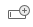
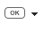
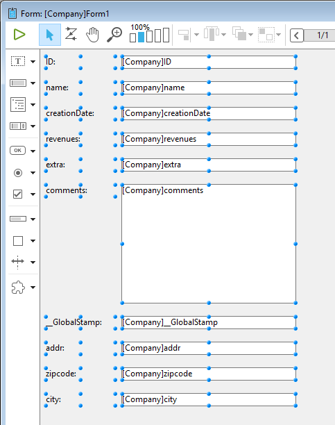
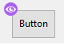
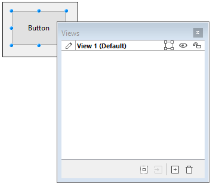
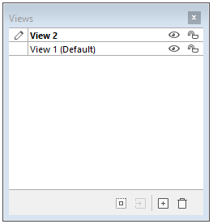
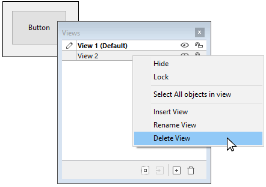
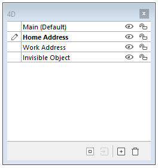
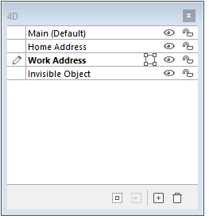

4D ofrece un completo editor de formularios que le permite modificar su formulario hasta conseguir el efecto que desea. Con el editor de formularios puede crear y eliminar objetos formulario, manipularlos directamente y definir las propiedades de los mismos.

## Interface

La interfaz del editor de formularios muestra cada formulario JSON en su propia ventana, que tiene una barra de herramientas y otra de objetos. Puede tener varios formularios abiertos al mismo tiempo.

### Opciones de visualización

Puede mostrar u ocultar varios elementos de la interfaz en la página actual del formulario:

- **Formulario heredado**: objetos formulario heredados (si hay un [formulario heredado](forms.md#inherited-forms)).
- **Página 0**: objetos de [página 0](forms.md#form-pages). Esta opción permite distinguir entre los objetos de la página actual del formulario y los de la página 0.
- **Papel**: bordes de la página de impresión, que se muestran como líneas grises. Este elemento sólo puede aparecer por defecto en los formularios de tipo ["para impresión"](properties_FormProperties.md#form-type).
- **Reglas**: Reglas de la ventana del editor de formularios.
- **Marcadores**: las líneas de control de salida y los marcadores asociados que muestran los límites de las diferentes áreas del formulario. Este elemento sólo puede aparecer por defecto en los [formularios lista](properties_FormProperties.md#form-type).
- **Etiquetas de los marcadores**: etiquetas de los marcadores, disponibles sólo cuando se muestran las líneas de control de salida. Este elemento sólo puede aparecer por defecto en los [formularios lista](properties_FormProperties.md#form-type).
- **Límites**: límites del formulario. Cuando se selecciona esta opción, el formulario se muestra en el editor de formularios tal y como aparece en el modo Aplicación. De esta manera puede ajustar su formulario sin tener que cambiar al modo Aplicación para ver el resultado.

> Los parámetros de [**Tamaño basado en**](properties_FormSize.md#size-based-on), [**Margen horizontal**](properties_FormSize.md#hor-margin) y [**Margen vertical**](properties_FormSize.md#vert-margin) de las propiedades del formulario afectan los límites del formulario. Cuando se utilizan estos parámetros, los límites se basan en los objetos del formulario. Cuando se modifica el tamaño de un objeto que se encuentra junto al límite del formulario, el rectángulo de delimitación se modifica para reflejar ese cambio.

#### Visualización por defecto

Cuando se abre un formulario en el editor, los elementos de la interfaz se muestran u ocultan por defecto, según:

- las opciones de **Visualización por defecto del nuevo formulario** definidas en las Preferencias - las opciones no marcadas no pueden mostrarse por defecto.
- el [tipo de formulario](properties_FormProperties.md#form-type) actual:
  - Los marcadores y las etiquetas de los marcadores siempre se muestran por defecto en los formularios de listas
  - Papel aparece por defecto en los formularios "a imprimir".

#### Mostrar/Ocultar elementos

Puede mostrar u ocultar elementos en cualquier momento en la ventana actual del editor de formularios seleccionando **Mostrar** en el menú **Formulario** o en el menú contextual del editor de formularios:


### Reglas

Las reglas laterales e inferiores le ayudan a posicionar los objetos en el formulario. Pueden [mostrarse u ocultarse](#display-options).

Seleccione **Definición de regla...** en el menú **Formulario** para cambiar las unidades de medida de modo que el formulario muestre pulgadas, centímetros o píxeles.

### Toolbar (Barra de herramientas)

La barra de herramientas del editor de formularios ofrece un conjunto de herramientas para manipular y modificar el formulario. Cada ventana tiene su propia barra de herramientas.


La barra de herramientas contiene los siguientes elementos:

| Icono                                            | Nombre                                                      | Descripción                                                                                                                                                                                                                                                                                                                                                                                                               |
| ------------------------------------------------ | ----------------------------------------------------------- | ------------------------------------------------------------------------------------------------------------------------------------------------------------------------------------------------------------------------------------------------------------------------------------------------------------------------------------------------------------------------------------------------------------------------- |
|          | Ejecutar el formulario                                      | Se utiliza para probar la ejecución del formulario. Al presionar este botón, 4D abre una nueva ventana y muestra el formulario en su contexto (lista de registros para un formulario lista y página de registro actual para un formulario detallado). El formulario se ejecuta en el proceso principal.                                                |
|        | [Herramienta de selección](#selecting-objects)              | Permite seleccionar, desplazar y cambiar el tamaño de los objetos del formulario<p>.**Nota**: cuando se selecciona un objeto de tipo Texto o Cuadro de Grupo, presionando la tecla **Enter** se pasa al modo edición.</p>                                                                                                                                                 |
|           | [Orden de entrada](#data-entry-order)                       | Pasa al modo "Orden de entrada", donde es posible ver y cambiar el orden de entrada actual del formulario. Tenga en cuenta que las marcas permiten ver el orden de entrada actual, sin dejar de trabajar en el formulario.                                                                                                                                                                |
|           | [Mover](#moving-objects)                                    | Pasa al modo " Desplazamiento ", en el que es posible llegar rápidamente a cualquier parte del formulario utilizando la función de arrastrar y soltar en la ventana. El cursor toma la forma de una mano. Este modo de navegación es especialmente útil cuando se hace zoom en el formulario.                                                                             |
|             | [Zoom](#zoom)                                               | Permite modificar la escala de visualización del formulario (100% por defecto). Puede pasar al modo "Zoom" haciendo clic en la lupa o pulsando directamente en la barra correspondiente a la escala deseada. Esta función se detalla en la sección anterior.                                                                                           |
|        | [Alineación](#aligning-objects)                             | Este botón está asociado a un menú que permite alinear los objetos en el formulario. It is enabled (or not) depending on the objects selected.<br/>Disabled if one selected object position is locked by a CSS property                                                                                                                                                |
|     | [Distribución](#distributing-objects)                       | Este botón está asociado a un menú que permite repartir los objetos en el formulario. It is enabled (or not) depending on the objects selected.<br/>Disabled if one selected object position is locked by a CSS property                                                                                                                                               |
|            | [Nivel](#layering-objects)                                  | Este botón está asociado a un menú que permite cambiar el nivel de los objetos en el formulario. Se activa (o no) en función de los objetos seleccionados.                                                                                                                                                                                                             |
|            | [Agrupar/Desagrupar](#grouping-objects)                     | Este botón está asociado a un menú que permite agrupar y desagrupar la selección de objetos del formulario. Se activa (o no) en función de los objetos seleccionados.                                                                                                                                                                                                  |
|    | [Visualización y gestión de páginas](forms.html#form-pages) | Esta área permite pasar de una página de formulario a otra y añadir páginas. Para navegar entre las páginas del formulario, haga clic en los botones de flecha o en el área central y elija la página que desea visualizar en el menú que aparece. Si pulsa el botón flecha derecha mientras se muestra la última página del formulario, 4D le permite añadir una página. |
|   | [Vista previa CSS](#css-preview)                            | Este botón se utiliza para seleccionar el modo CSS a utilizar.                                                                                                                                                                                                                                                                                                                                            |
|            | [Gestión de vistas](#vistas)                                | Este botón muestra u oculta la paleta de vistas. Esta función se detalla en la sección Utilizar las vistas de objeto.                                                                                                                                                                                                                                                                     |
|         | [Visualización de escudos](#shields)                        | Cada clic en este botón provoca la visualización sucesiva de todos los tipos de escudos de formulario. El botón también está vinculado a un menú que permite seleccionar directamente el tipo de escudo a mostrar.                                                                                                                                                                        |
|          | [Biblioteca de objetos preconfigurada](objectLibrary.html)  | Este botón muestra la librería de objetos preconfigurada que ofrece numerosos objetos con ciertas propiedades que han sido predefinidas.                                                                                                                                                                                                                                                                  |
|  | [Generador de list box](#list-box-builder)                  | Este botón crea nuevos list box de tipo selección de entidades.                                                                                                                                                                                                                                                                                                                                           |
|     | [Insertar campos](#insertar-campos)                         | Este botón inserta en el formulario todos los campos (excepto los de tipo objeto y blob) de la tabla del formulario, junto con sus etiquetas y respetando las normas de la interfaz.                                                                                                                                                                                                   |

### Barra de objetos

La barra de objetos contiene todos los objetos activos e inactivos que se pueden utilizar en los formularios 4D. Algunos objetos se agrupan por temas. Cada tema incluye varias alternativas entre las que puede elegir. Cuando la barra de objetos tiene el foco, puede seleccionar los botones utilizando las teclas del teclado. La siguiente tabla describe los grupos de objetos disponibles y su tecla de acceso directo asociada.

| Botón                                      | Agrupar                                                                                                                                                                                                                                                                                                                                                     | Llave |
| ------------------------------------------ | ----------------------------------------------------------------------------------------------------------------------------------------------------------------------------------------------------------------------------------------------------------------------------------------------------------------------------------------------------------- | :---: |
|       | [Text](FormObjects/text.md) / [Group Box](FormObjects/groupBox.md)                                                                                                                                                                                                                                                                                          |   T   |
|      | [Entrada](FormObjects/input_overview.md)                                                                                                                                                                                                                                                                                                                    |   F   |
|    | [Lista jerárquica](FormObjects/list_overview.md) / [List Box](FormObjects/listbox_overview.md)                                                                                                                                                                                                                                                              |   L   |
|      | [Combo Box](FormObjects/comboBox_overview.md) / [Lista desplegable](FormObjects/dropdownList_Overview.md) / [Menú emergente de imágenes](FormObjects/picturePopupMenu_overview.md)                                                                                                                                                                          |   P   |
|     | [Botón](FormObjects/button_overview.md) / [Botón imagen](FormObjects/pictureButton_overview.md) / [Rejilla de botones](FormObjects/buttonGrid_overview.md)                                                                                                                                                                                                  |   B   |
|      | [Botón de radio](FormObjects/radio_overview.md)                                                                                                                                                                                                                                                                                                             |   R   |
|   | [Casilla de verificación](FormObjects/checkbox_overview.md)                                                                                                                                                                                                                                                                                                 |   C   |
|  | [Indicador de progreso](FormObjects/progressIndicator.md) / [Regla](FormObjects/ruler.md) / [Stepper](FormObjects/stepper.md) / [Spinner](FormObjects/spinner.md)                                                                                                                                                                                           |   I   |
|  | [Rectángulo](FormObjects/shapes_overview.md#rectangle) / [Línea](FormObjects/shapes_overview.md#line) / [Óvalo](FormObjects/shapes_overview.md#oval)                                                                                                                                                                                                        |   S   |
|   | [Splitter](FormObjects/splitters.md) / [Control de pestañas](FormObjects/tabControl.md)                                                                                                                                                                                                                                                                     |   D   |
|     | [Área de plug-in ](FormObjects/pluginArea_overview.md) / [Subformulario](FormObjects/subform_overview.md) / [Área Web](FormObjects/webArea_overview.md) / [4D Write Pro](FormObjects/writeProArea_overview.md) / [4D View Pro](FormObjects/viewProArea_overview |   X   |

Para dibujar un tipo de objeto, seleccione el botón correspondiente y luego trace el objeto en el formulario. Después de crear un objeto, puede modificar su tipo utilizando la lista de propiedades. Para dibujar un tipo de objeto, seleccione el botón correspondiente y luego trace el objeto en el formulario. Las líneas se limitan a horizontales, 45° o verticales, los rectángulos se limitan a cuadrados y los óvalos se limitan a círculos.

La variante actual del tema es el objeto que se insertará en el formulario. Al hacer clic en la parte derecha de un botón, se accede al menú de variantes:


Puede presionar dos veces el botón para que permanezca seleccionado incluso después de haber trazado un objeto en el formulario (selección continua). Esta función facilita la creación de varios objetos sucesivos del mismo tipo. Para cancelar una selección continua, haga clic en otro objeto o herramienta.

### Lista de propiedades

Tanto los formularios como los objetos de formulario tienen propiedades que controlan el acceso al formulario, la apariencia del mismo y el comportamiento del formulario cuando se utiliza. Las propiedades del formulario incluyen, por ejemplo, el nombre del formulario, su barra de menú y su tamaño. Las propiedades de los objetos incluyen, por ejemplo, su nombre, sus dimensiones, su color de fondo y su fuente.

Puede visualizar y modificar las propiedades de los objetos y formularios utilizando la lista de propiedades. Muestra las propiedades del formulario o de los objetos en función de lo que se seleccione en la ventana del editor.

Para mostrar/ocultar la lista de propiedades, seleccione **Lista de propiedades** en el menú **Formulario** o en el menú contextual del editor de formularios. También puede mostrarlo haciendo doble clic en una área vacía del formulario.

#### Atajos

Puede utilizar los siguientes atajos en la Lista de propiedades:

- **Tecla de flecha**s ↑ ↓: se utiliza para pasar de una celda a otra.
- **Teclas flechas** ← →: se utiliza para expandir/contraer los temas o entrar en el modo de edición.
- **PgUp** y **PgDn**: selecciona la primera o la última celda visible de la lista mostrada.
- **Inicio** y **Fin**: selecciona la primera o la última celda de la lista.
- **Ctrl+clic** (Windows) o **Comando+clic** (macOS) sobre un evento: utilizado para seleccionar/deseleccionar cada evento de la lista, según el estado inicial del evento sobre el que se ha hecho clic.
- **Ctrl+clic** (Windows) o **Comando+clic** (macOS) en la etiqueta de un tema: Permite contraer/expandir todos los temas de la lista.
- **Ctrl+clic** (Windows) o **Comando+clic** (macOS) sobre un valor de propiedad mostrado en **negrita**: restablece la propiedad a su valor por defecto.

## Manipulación de objetos formulario

### Añadir objetos

Puede añadir objetos en los formularios de varias maneras:

- Dibujando el objeto directamente en el formulario después de seleccionar su tipo en la barra de objetos (ver [Utilizando la barra de objetos](#using-the-object-bar))
- Arrastrando y soltando el objeto desde la barra de objetos
- Mediante operaciones de arrastrar y soltar o copiar y pegar sobre un objeto seleccionado de la [librería de objetos](objectLibrary.md) preconfigurada,
- Arrastrando y soltando un objeto desde otro formulario,
- Arrastrando y soltando un objeto desde el Explorador (campos) o desde otros editores del modo Diseño (listas, imágenes, etc.)

Una vez insertado el objeto en el formulario, puede modificar sus características utilizando el editor de formularios.

Puede trabajar con dos tipos de objetos en sus formularios:

- **Objetos estáticos** (líneas, marcos, imágenes de fondo, etc.): estos objetos se utilizan generalmente para definir la apariencia del formulario y sus etiquetas, así como para la interfaz gráfica. Están disponibles en la barra de objetos del editor de formularios. Están disponibles en la barra de objetos del editor de formularios. También puede definir sus atributos gráficos (tamaño, color, fuente, etc.) Los objetos estáticos no tienen variables asociadas como los objetos activos. Sin embargo, se pueden insertar objetos dinámicos en objetos estáticos.

- **Objetos activos**: estos objetos realizan tareas o funciones en la interfaz y pueden adoptar muchas formas: campos, botones, listas desplazables, etc. Cada objeto activo está asociado a un campo o a una variable.

### Seleccionar los objetos

Antes de poder realizar cualquier operación en un objeto (como cambiar el ancho de la línea o la fuente), debe seleccionar el objeto que desea modificar.

Para seleccionar un objeto utilizando la barra de herramientas:

1. Haz clic en la herramienta Flecha en la barra de herramientas.<p></p>

<p>Cuando se mueve el puntero en el área del formulario, se convierte en un puntero estándar con forma de flecha</p>.

2. Haga clic en el objeto que desea seleccionar. Las asas de redimensionamiento identifican el objeto seleccionado.<p></p>

Para seleccionar un objeto utilizando la Lista de propiedades:

1. Seleccione el nombre del objeto en la lista desplegable de objetos situada en la parte superior de la lista de propiedades. Con estos dos métodos, puede seleccionar un objeto que esté oculto por otros objetos o que se encuentre fuera del área visible de la ventana actual.
   Para deseleccionar un objeto, haga clic fuera del límite del objeto o **Mayúsculas+clic** en el objeto.

> \> It is also possible to select objects by double-clicking them in the result window of ""Find in design" operation.

### Selección de múltiples objetos

Es posible que desee realizar la misma operación en más de un objeto de un formulario, por ejemplo, para mover los objetos, alinearlos o cambiar su apariencia. 4D le permite seleccionar varios objetos al mismo tiempo. Hay varias formas de seleccionar varios objetos:

- Seleccione **Seleccionar todo** en el menú Edición para seleccionar todos los objetos.
- Haga clic con el botón derecho en el objeto y elija el comando **Seleccionar objetos del mismo tipo** en el menú contextual.
- Mantenga presionada la tecla **Mayús** y haga clic en los objetos que desee seleccionar.
- Comience en una ubicación fuera del grupo de objetos que desea seleccionar y arrastre un marco (a veces llamado rectángulo de selección) alrededor de los objetos. Al soltar el botón del ratón, si alguna parte de un objeto se encuentra dentro o toca los límites del rectángulo de selección, ese objeto queda seleccionado.
- Mantenga presionada la tecla **Alt** (Windows) o la tecla **Opción** (macOS) y dibuje un rectángulo de selección. Se selecciona todo objeto que esté completamente encerrado por el marco.

La imagen siguiente muestra el dibujo de un rectángulo para seleccionar dos objetos:


Para deseleccionar un objeto que forma parte de un grupo de objetos seleccionados, mantenga presionada la tecla **Mayús** y haga clic en el objeto. Los demás objetos permanecen seleccionados. Para deseleccionar todos los objetos seleccionados, haga clic fuera de los límites de todos los objetos.

### Duplicar los objetos

Puede duplicar todo objeto de formulario, incluidos los objetos activos. Las copias de los objetos activos conservan todas las propiedades del objeto original, incluidos el nombre, el tipo, la acción estándar, el formato de visualización y el método objeto.

Puede duplicar un objeto directamente con la herramienta Duplicar de la paleta Herramientas o utilizar la caja de diálogo Duplicar varios para duplicar un objeto más de una vez. Además, a través de esta caja de diálogo, se puede definir la distancia entre dos copias.

Para duplicar uno o más objetos:

1. Seleccione el objeto u objetos que desea duplicar.
2. Elija **Duplicar** en el menú **Edición**. 4D crea una copia de cada objeto seleccionado y coloca la copia delante y justo al lado del original.
3. Mueva la copia (o las copias) a la ubicación deseada.
   Si vuelve a elegir el elemento de menú Duplicar, 4D crea otra copia de cada objeto y la mueve exactamente a la misma distancia y dirección de la primera copia. Si necesita distribuir copias del objeto a lo largo de una línea, debe utilizar el siguiente procedimiento. Duplique el objeto original, mueva la copia a otro lugar del formulario y luego duplique la copia. La segunda copia se coloca automáticamente en la misma posición que la primera copia tenía en relación con el objeto original. Las copias posteriores también se sitúan en la misma relación con sus originales. La siguiente figura explica el funcionamiento de la ubicación relativa de las copias:


#### Duplicar muchos

La caja de diálogo "Duplicar muchos" aparece cuando se selecciona uno o más objetos y se elige el comando **Duplicar muchos...** del menú **Objeto**.


- En el área superior, introduzca el número de columnas y líneas de objetos que desea obtener. Por ejemplo, si desea tres columnas y dos líneas de objetos, introduzca 3 en el área Columna(s) y 2 en el área Línea(s). Si desea tres nuevas copias horizontales de un objeto, introduzca 4 en el área Columna(s) y deje el valor por defecto, 1, en el área Línea(s).

- Para las líneas y columnas, defina el desplazamiento que desea aplicar a cada copia. El valor debe expresarse en puntos. It will be applied to each copy, or copies, in relation to the original object. For example, if you want to leave a vertical offset of 20 points between each object and the height of the source object is 50 points, enter 70 in the column’s “Offset” area.

- Si desea crear una matriz de variables, seleccione la opción **Numerar las variables** y seleccione la dirección en la que se van a numerar las variables, ya sea por línea(s) o por columna(s).
  Esta opción sólo se activa cuando el objeto seleccionado es una variable. Para más información sobre esta opción, consulte **Duplicar en una matriz** en el *Manual de diseño*.

### Mover objetos

Puede mover todo gráfico u objeto activo del formulario, incluidos los campos y los objetos creados con una plantilla. Al mover un objeto, tiene las siguientes opciones:

- Mover el objeto arrastrándolo,
- Mover el objeto un píxel a la vez utilizando las teclas de flecha,
- Mover el objeto por pasos utilizando las teclas de flecha (pasos de 20 píxeles por defecto),

Al comenzar a arrastrar el objeto seleccionado, sus controles desaparecen. 4D muestra marcadores que indican la ubicación de los límites del objeto en las reglas para que pueda colocar el objeto exactamente donde lo quiere. Tenga cuidado de no arrastrar un mango. Al arrastrar un mango se cambia el tamaño del objeto. Puede presionar la tecla **Mayúsculas** para realizar el movimiento con una restricción.

Cuando la [rejilla magnética](#using-the-magnetic-grid) está activada, los objetos se mueven por etapas indicando ubicaciones perceptibles.

Para mover un objeto un píxel por píxel:

- Seleccione el objeto u objetos y utilice las teclas de flecha del teclado para mover el objeto. Cada vez que se presiona una tecla flecha, el objeto se mueve un píxel en la dirección de la flecha.

Mover un objeto por pasos:

- Selecciona el objeto u objetos que quiera mover y mantenga presionada la tecla **Mayúsculas** y utilice las teclas de dirección para mover el objeto por pasos. Por defecto, los pasos son de 20 píxeles cada vez. Puede cambiar este valor en la página Formularios de las Preferencias.

### Agrupar objetos

4D le permite agrupar objetos para que pueda seleccionar, mover y modificar el grupo como un solo objeto. Los objetos agrupados conservan su posición en relación con los demás. Lo normal es agrupar un campo y su etiqueta, un botón invisible y su icono, etc.

Cuando se redimensiona un grupo, todos los objetos del grupo se redimensionan proporcionalmente (excepto las áreas de texto, que se redimensionan por pasos según el tamaño de sus fuentes).

Puede desagrupar un grupo de objetos para tratarlos de nuevo como objetos individuales.

Un objeto activo que ha sido agrupado debe ser desagrupado antes de poder acceder a sus propiedades o métodos. Sin embargo, es posible seleccionar un objeto perteneciente a un grupo sin reagrupar el conjunto: para ello, **Ctrl+clic** (Windows) o **Comando+clic** (macOS) en el objeto (el grupo debe estar seleccionado previamente).

La agrupación sólo afecta a los objetos en el editor de formularios. Cuando se ejecuta el formulario, todos los objetos agrupados actúan como si estuvieran desagrupados.

> La rejilla magnética también influye en el redimensionamiento manual de los objetos.

Para agrupar los objetos:

1. Seleccione los objetos que desea agrupar.
2. Elija **Agrupar** en el menú Objetos. O
   Haga clic en el botón Agrupar en la barra de herramientas del editor de formularios:<p></p>
   4D marca el límite de los objetos recién agrupados con manijas. No hay marcas que delimiten ninguno de los objetos individuales del grupo. Ahora, al modificar el objeto agrupado, se modifican todos los objetos que componen el grupo.

Para desagrupar un grupo de objetos:

1. Seleccione el grupo de objetos que desea desagrupar.
2. Seleccione **Desagrupar** en el menú **Objeto**.<p>O</p><p>Haga clic en el botón **Desagrupar** (variante del botón **Agrupar**) en la barra de herramientas del editor de formularios.</p><p>Si **Desagrupar** está atenuado, esto significa que el objeto seleccionado ya está separado en su forma más sencilla.</p>4D marca los límites de los objetos individuales con manijas.

### Alinear objetos

Puede alinear los objetos entre sí o mediante una rejilla invisible en el formulario.

- Cuando se alinea un objeto con otro, se puede alinear con la parte superior, inferior, lateral o con el centro horizontal o vertical del otro objeto. Puede alinear directamente una selección de objetos utilizando las herramientas de alineación o aplicar ajustes de alineación más avanzados utilizando el Asistente de Alineación. Esta última opción permite, por ejemplo, definir el objeto que se utilizará como referencia de posición y previsualizar la alineación en el formulario antes de aplicarla.
- Cuando se utiliza la rejilla invisible, cada objeto puede alinearse manualmente con otros basándose en posiciones "perceptibles" que se representan con líneas de puntos que aparecen cuando el objeto que se mueve se acerca a otros objetos.

#### Utilizar las herramientas de alineación directa

Las herramientas de alineación de la barra de herramientas y del submenú Alinear del menú Objeto permiten alinear rápidamente los objetos seleccionados.


Cuando 4D alinea los objetos, deja un objeto seleccionado en su lugar y alinea el resto de los objetos a ese. Este objeto es el "ancla." Utiliza el objeto que está más lejos en la dirección de la alineación como ancla y alinea los otros objetos a ese objeto. Por ejemplo, si quiere realizar una alineación a la derecha en un conjunto de objetos, el objeto más a la derecha se utilizará como ancla.
La figura siguiente muestra objetos sin alineación, "alineados a la izquierda", "alineados horizontalmente por centros" y "alineados a la derecha":


#### Utilizar el asistente de alineación

El Asistente de Alineación permite realizar cualquier tipo de alineación y/o distribución de objetos.


Para mostrar esta caja de diálogo, seleccione los objetos que desee alinear y, a continuación, elija el comando **Alineación** del submenú **Alinear** del menú **Objeto** o del menú contextual del editor.

- En las áreas "Alineación izquierda/derecha" y/o "Alineación superior/inferior", haga clic en el icono que corresponda a la alineación que desee realizar. <p>El área de ejemplo muestra los resultados de su selección.</p>

- Para realizar una alineación que utilice el esquema de anclaje estándar, haga clic en **Ver** o **Aplicar**. En este caso, 4D utiliza el objeto que está más lejos en la dirección de la alineación como ancla y alinea los otros objetos a ese objeto. Por ejemplo, si quiere realizar una alineación a la derecha en un conjunto de objetos, el objeto más a la derecha se utilizará como ancla. O:<p>para alinear los objetos a un objeto específico, seleccione la opción **Alinear en** y seleccione el objeto al que desea que se alineen los demás objetos de la lista de objetos. En este caso, la posición del objeto de referencia no se alterará.</p>

Puede previsualizar los resultados de la alineación haciendo clic en el botón **Previsualización**. Los objetos se alinean entonces en el editor de formularios, pero como la caja de diálogo permanece en el primer plano, aún puede cancelar o aplicar la alineación.

> Esta caja de diálogo le permite alinear y distribuir objetos en una sola operación. Para más información sobre cómo distribuir objetos, consulte [Repartir objetos](#distributing-objects).

#### Utilizar la rejilla magnética

El editor de formularios dispone de una rejilla magnética virtual que puede ayudarle a colocar y alinear objetos en un formulario. La alineación magnética de los objetos se basa en su posición con respecto a los demás. La rejilla magnética sólo puede utilizarse cuando hay al menos dos objetos en el formulario.

Esto funciona de la siguiente manera: cuando mueve un objeto en el formulario, 4D indica las posibles ubicaciones de este objeto basándose en alineaciones notables con otros objetos formulario. Una alineación evidente se establece cada vez que:

- Horizontalmente, los bordes o centros de dos objetos coinciden,
- Verticalmente, los bordes de dos objetos coinciden.

Cuando esto ocurre, 4D coloca el objeto en el lugar y muestra una línea roja que indica la alineación notable que se ha tenido en cuenta:


En cuanto a la distribución de los objetos, 4D ofrece una distancia basada en los estándares de interfaz. Al igual que en el caso de la alineación magnética, las líneas rojas indican las diferencias notables una vez alcanzadas.


Este funcionamiento se aplica a todos los tipos de objetos de los formularios. La rejilla magnética puede activarse o desactivarse en cualquier momento utilizando el comando **Activar la rejilla magnética** del menú **Formulario** o del menú contextual del editor. También es posible definir la activación de esta función por defecto en la página **Preferencias** > **Formularios** (opción **Activar la alineación automática por defecto**). Puede activar o desactivar manualmente la rejilla magnética cuando se selecciona un objeto presionando la tecla **Ctrl** (Windows) o **Control** (macOS) .

> La rejilla magnética también influye en el redimensionamiento manual de los objetos.

### Distribuir los objetos

Puede repartir los objetos de manera que queden dispuestos con el mismo espacio entre ellos. Para ello, puede distribuir los objetos utilizando las herramientas de distribución de la paleta Herramientas o el Asistente de alineación. Este último le permite alinear y distribuir objetos en una sola operación.

> Puede cambiar el orden de entrada en tiempo de ejecución utilizando los comandos `FORM SET ENTRY ORDER` y `FORM GET ENTRY ORDER`.

Para repartir los objetos con igual espacio:

1. Seleccione tres o más objetos y haga clic en la herramienta Distribuir correspondiente.

2. En la barra de herramientas, haga clic en la herramienta de distribución correspondiente a la distribución que desea aplicar.<p></p> O<p>Seleccione un comando de menú de distribución en el submenú **Alinear** del menú **Objeto** o en el menú contextual del editor.</p>4D distribuye los objetos en consecuencia. Los objetos se distribuyen utilizando la distancia a sus centros y se utiliza como referencia la mayor distancia entre dos objetos consecutivos.

Para distribuir objetos utilizando la caja de diálogo Alinear y Distribuir:

1. Seleccione los objetos que desea distribuir.

2. Seleccione el comando **Alineación** del submenú **Alinear** del menú **Objeto** o del menú contextual del editor. ¡Aparece la siguiente caja de diálogo:

3. En las áreas Alineación izquierda/derecha y/o Alineación superior/inferior, haga clic en el icono de distribución estándar:  <p>(Icono de distribución horizontal estándar)</p>El área de ejemplo muestra los resultados de su selección.

4. Para realizar una distribución que utiliza el esquema estándar, haga clic en **Vista previa** o *Aplicar*.<p>En este caso, 4D realizará una distribución estándar para que los objetos estén espaciados de manera equitativa entre ellos.</p>O bien:<p>para ejecutar una distribución específica, seleccione la opción **Distribuir** (por ejemplo, si desea distribuir los objetos en función de la distancia a su lado derecho). Esta opción actúa como un interruptor. Si la casilla de selección Distribuir está seleccionada, los iconos situados debajo de ella realizan una función diferente:</p>

- Horizontalmente, los iconos corresponden a las siguientes distribuciones: uniformemente con respecto a los lados izquierdos, centros (hor.) y los lados derechos de los objetos seleccionados.
- Verticalmente, los iconos corresponden a las siguientes distribuciones: uniformemente con respecto a los bordes superiores, centros (vert.) y los bordes inferiores de los objetos seleccionados.

Puede previsualizar el resultado real de sus parámetros haciendo clic en el botón **Previsualización**: la operación se lleva a cabo en el editor de formularios, pero la caja de diálogo permanece en primer plano. Puede entoces **Cancelar** o **Aplicar** las modificaciones.

> Esta caja de diálogo permite combinar la alineación y la distribución de objetos. Para más información sobre la alineación, consulte [Alinear objetos](#aligning-objects).

### Gestionar los planos de los objetos

A veces tendrá que reorganizar los objetos que obstruyen la vista de otros objetos del formulario. Por ejemplo, puede tener un gráfico que desee que aparezca detrás de los campos en un formulario. A veces tendrá que reorganizar los objetos que obstruyen la vista de otros objetos del formulario. Estas capas también determinan el orden de entrada por defecto (ver Modificación del orden de entrada de datos). La figura siguiente muestra objetos delante y detrás de otros objetos:


Para mover un objeto a otro plano, selecciónelo y elija:

- Uno de los comandos **Mover hacia atrás**, **Mover hacia delante**, **Subir un nivel** y **Bajar un nivel** en el menú Objeto,
- Uno de los comandos del submenú **Plano>** del menú contextual del editor,
- Uno de los comandos asociados al botón de gestión de los planos de la barra de herramientas.


> Cuando se superponen varios objetos, se puede utilizar el atajo **Ctrl+Mayús+clic** / **Comando+Mayús+clic** para seleccionar cada objeto sucesivamente bajando un plano con cada clic.

Al ordenar los diferentes niveles, 4D siempre va del fondo al primer plano. Como resultado, el nivel anterior desplaza la selección de objetos de un plano hacia el fondo del formulario. El siguiente nivel mueve la selección un plano hacia el primer plano del formulario.

### Orden de entrada de los datos

El orden de entrada de datos es el orden en el que se seleccionan los campos, subformularios y otros objetos activos al presionar la tecla **Tab** o la tecla **Retorno de carro** en un formulario de entrada. Es posible desplazarse por el formulario en sentido contrario (invertir el orden de entrada de datos) presionando las teclas **Mayúsc+Tab** o **Mayúsc+Retorno de carro** de retorno.

> Puede cambiar el orden de entrada en tiempo de ejecución utilizando los comandos `FORM SET ENTRY ORDER` y `FORM GET ENTRY ORDER`.

Todos los objetos que soportan la propiedad enfocable se incluyen por defecto en el orden de entrada de datos.

Definir el orden de entrada para un formulario JSON se hace con la propiedad [`entryOrder`](properties_JSONref.md).

Si no especifica un orden de entrada personalizado, 4D utiliza por defecto el plano de los objetos para determinar el orden de entrada en el sentido "fondo hacia primer plano." El orden de entrada estándar corresponde, por tanto, al orden de creación de los objetos en el formulario.

En algunos formularios, se necesita definir un orden de entrada de datos personalizado. A continuación, por ejemplo, se han añadido campos adicionales relacionados con la dirección después de la creación del formulario. El orden de entrada estándar resultante se vuelve ilógico y obliga al usuario a introducir la información de forma extraña:


En casos como éste, un orden de entrada de datos personalizado le permite introducir la información en un orden más lógico:


#### Visualizar y modificar el orden de entrada de datos

Puede ver el orden de entrada actual utilizando marcas "Orden de entrada" o utilizando el modo "Orden de entrada". Sin embargo, sólo puede modificar el orden de entrada utilizando el modo "Orden de entrada".

Este párrafo describe la visualización y la modificación del orden de entrada en modo "Orden de entrada". Para más información sobre la visualización del orden de entrada utilizando marcas, consulte [Using shields](#using-shields).

Para ver o cambiar el orden de entrada:

1. Seleccione **Orden de entrada** en el menú **Formulario** o haga clic en el botón Orden de entrada en la barra de herramientas de la ventana:<p></p>

   El puntero se convierte en un puntero de orden de entrada y 4D dibuja una línea en el formulario mostrando el orden en que selecciona los objetos durante la entrada de datos. Ver y cambiar el orden de entrada de datos son las únicas acciones que puede realizar hasta que haga clic en cualquier herramienta de la paleta Herramientas.

2. Para cambiar el orden de entrada de datos, ubique el puntero sobre un objeto del formulario y mientras mantiene presionado el botón del ratón, arrastre el puntero hasta el objeto que desee a continuación en el orden de entrada de datos..<p></p>4D ajustará el orden de entrada en consecuencia.

3. Repita el paso 2 tantas veces como sea necesario para establecer el orden de entrada de datos que desee.

4. Cuando esté satisfecho con el orden de entrada de datos, haga clic en cualquier herramienta no seleccionada de la barra de herramientas o elija **Orden de entrada** en el menú **Formulario**. 4D vuelve al modo de funcionamiento normal del editor de formularios.

> Sólo se muestra el orden de entrada de la página actual del formulario. Si el formulario contiene objetos editables en la página 0 o procedentes de un formulario heredado, el orden de entrada por defecto es el siguiente: objetos de la página 0 del formulario heredado > Objetos de la página 1 del formulario heredado > Objetos de la página 0 del formulario abierto > Objetos de la página actual del formulario abierto.

#### Utilizar un grupo de entrada

Cuando se cambia el orden de entrada, se puede seleccionar un grupo de objetos en el formulario para que el orden de entrada estándar se aplique a los objetos del grupo. Esto le permite definir fácilmente el orden de entrada para los formularios en los que los campos están separados en grupos o columnas.

Para crear un grupo de entrada:

1. Seleccione **Orden de entrada** en el menú *Formulario* o haga clic en el botón de la barra de herramientas.
2. Dibuje un rectángulo de selección alrededor de los objetos que desee agrupar para la entrada de datos.

Al soltar el botón del ratón, los objetos encerrados o tocados por el rectángulo siguen el orden de entrada por defecto. El orden de entrada de los otros objetos restantes se ajusta según sea necesario.

#### Excluir un objeto del orden de entrada

Por defecto, todos los objetos que soportan la propiedad enfocable se incluyen en el orden de entrada. Para excluir un objeto del orden de entrada:

1. Seleccione el modo de orden de entrada, y luego

2. **Mayúsculas-clic** en el objeto

3. **haga clic derecho** en el objeto y seleccione la opción **Eliminar del orden de entrada** del menú contextual

## Vista previa del CSS

El editor de formularios le permite ver sus formularios con o sin valores CSS aplicados.

Cuando se han definido [hojas de estilo](createStylesheet.md), los formularios (incluidos los formularios y subformularios heredados) se abren por defecto en el modo de vista previa CSS para su sistema operativo.

### Seleccionando el modo de vista previa CSS

La barra de herramientas del editor de formularios ofrece un botón CSS para ver los objetos con estilo:


Seleccione uno de los siguientes modos de vista previa en el menú:

| Icono barra de herramientas             | Modo de vista previa CSS | Descripción                                                                                                                                                                  |
| --------------------------------------- | ------------------------ | ---------------------------------------------------------------------------------------------------------------------------------------------------------------------------- |
|   | Ninguno                  | No se aplican valores CSS en el formulario y no se muestran valores o iconos CSS en la lista de propiedades.                                                 |
|  | Windows                  | Los valores CSS para la plataforma Windows se aplican en el formulario. Los valores e iconos CSS que se muestran en la lista de propiedades. |
|  | macOS                    | Los valores CSS para la plataforma macOS se aplican en el formulario. Los valores e iconos CSS que se muestran en la lista de propiedades.   |

> Si se define un tamaño de fuente demasiado grande para un objeto en una hoja de estilo o JSON, el objeto se renderizará automáticamente para acomodar la fuente, sin embargo el tamaño del objeto no se modificará.

El modo de vista previa CSS refleja el orden de prioridad aplicado a las hojas de estilo frente a los atributos JSON, tal y como se define en la sección [JSON vs Hoja de estilo](stylesheets.html#json-vs-style-sheet).

Una vez seleccionado el modo de vista previa CSS, los objetos se muestran automáticamente con los estilos definidos en una hoja de estilo (si la hay).

> Al copiar o duplicar objetos, sólo se copian las referencias CSS (si las hay) y los valores JSON.

### Soporte CSS en la Lista de Propiedades

En el modo Vista Previa CSS, si el valor de un atributo ha sido definido en una hoja de estilo, el nombre del atributo aparecerá con un icono CSS junto a él en la Lista de Propiedades. Por ejemplo, los valores de los atributos definidos en esta hoja de estilo:

```4d
.myButton {
font-family: comic sans;
font-size: 14;
stroke: #800080;
}
```

se muestran con un icono CSS en la lista de propiedades:


Un valor de atributo definido en una hoja de estilo puede ser anulado en la descripción del formulario JSON (excepto si el CSS incluye la declaración `!important`, ver más abajo). En este caso, la lista de propiedades muestra el valor del formulario JSON en **negrita**. Puede restablecer el valor a su definición de hoja de estilo con los atajos **Ctrl + clic** (Windows) o **Comando + clic** (macOs).

> Si un atributo ha sido definido con la declaración `!important` para un grupo, un objeto dentro de un grupo, o cualquier objeto dentro de una selección de múltiples objetos, el valor de ese atributo está bloqueado y no puede ser cambiado en la Lista de Pr

#### Lista de propiedades de iconos CSS

| Icono                                         | Descripción                                                                                                                                                                     |
| --------------------------------------------- | ------------------------------------------------------------------------------------------------------------------------------------------------------------------------------- |
|       | Indica que un valor de atributo ha sido definido en una hoja de estilo                                                                                                          |
|  | Indica que un valor de atributo ha sido definido en una hoja de estilo con la declaración `!important`                                                                          |
|  | Se muestra cuando un valor de atributo definido en una hoja de estilo para al menos un elemento de un grupo o una selección de varios objetos es diferente de los demás objetos |

## Creación de list box

Puede crear rápidamente nuevos list box de tipo selección de entidades con el **-Generador de list box**. El nuevo list box puede ser utilizado inmediatamente o puede ser editado a través del Editor de formularios.

El generador de list box le permite crear y llenar los list box de tipo selección de entidades en unas pocas y sencillas operaciones.

### Utilización del generador de list box

1. En la barra de herramientas del Editor de formularios, haga clic en el icono del generador de list box:


Se muestra el generador de list box:


2. Seleccione una tabla de la lista desplegable **Tabla**:


3. Seleccione los campos del list box en el área **Campos**:


Por defecto, se seleccionan todos los campos. Puede seleccionar o deseleccionar los campos individualmente o utilizar **Ctrl+clic** (Windows) o **Cmd+clic** (macOS) para seleccionarlos o deseleccionarlos todos a la vez.

Puede cambiar el orden de los campos arrastrándolos y soltándolos.

4. La expresión para llenar las líneas del list box a partir de la selección de la entidad se llena previamente:


Esta expresión puede modificarse si es necesario.

5. Al hacer clic en el botón **Copiar** se copiará la expresión para cargar todos los registros en la memoria:


6. Haga clic en el botón **Crear un widget** para crear el list box.


El list box final:


## Insertar campos

El botón **Insertar campos** inserta en el formulario todos los campos (excepto los de tipo objeto y blob) de la tabla del formulario, junto con sus etiquetas y respetando las normas de la interfaz. Este asistente es un atajo para diseñar formularios de entrada básicos o formularios listados.

El botón **Insertar campos** sólo está disponible con formularios tabla.

El diseño del formulario resultante depende del tipo de formulario:

- **Formulario detallado**: al hacer clic en el botón **Insertar campos** se genera un formulario con un diseño de página:



- **Formulario listado**: al hacer clic en el botón **Insertar campos** se genera un diseño de formulario listado con campos organizados en una sola línea y marcadores de área:


## Marcas

El editor de formularios 4D utiliza marcas para facilitar la visualización de las propiedades de los objetos. Puede encontrarlos en la barra de herramientas del formulario:


El principio de esta función es el siguiente: cada escudo está asociado a una propiedad (por ejemplo, **Vistas**, que significa que el objeto "está en la vista actual"). Al activar una marca, 4D muestra un pequeño icono (marca) en la parte superior izquierda de cada objeto del formulario donde se aplica la propiedad.



### Utilizar marcas

Para activar una marca, haga clic en el icono *Marca* de la barra de herramientas hasta seleccionar la marca deseada. También puede hacer clic en la parte derecha del botón y seleccionar el tipo de marca que desea mostrar directamente en el menú asociado:

Si no quiere mostrar marcas, seleccione **Sin marcas** en el menú de selección.

> La <a href="#antes-del-comienzo">vista actual</a> no se puede ocultar.

### Descripciones de marcas

A continuación se describe cada tipo de escudo:

| Icono                                           | Nombre                              | Se muestra...                                                                                                                                                          |
| ----------------------------------------------- | ----------------------------------- | ---------------------------------------------------------------------------------------------------------------------------------------------------------------------------------------------------------------------- |
|    | Método objeto                       | Para los objetos con un método objeto asociado                                                                                                                                                                         |
|  | Acción estándar                     | Para los objetos con una acción estándar asociada                                                                                                                                                                      |
|        | Redimensionamiento                  | Para los objetos con al menos una propiedad de redimensionamiento, indica la combinación de propiedades actuales                                                                                                       |
|      | Orden de entrada                    | En el caso de los objetos editables, indica el número de orden de entrada                                                                                                                                              |
|      | Vista actual                        | Para todos los objetos de la vista actual                                                                                                                                                                              |
|       | [Hojas de estilo](stylesheets.html) | Para objetos con uno o más valores de atributos reemplazados por una hoja de estilo.                                                                                                                   |
|          | Filtro                              | Para los objetos introducibles con un filtro de entrada asociado                                                                                                                                                       |
|         | Mensaje de ayuda                    | Para los objetos con un mensaje de ayuda asociado                                                                                                                                                                      |
|       | Localizado                          | Para los objetos cuya etiqueta proviene de una referencia (etiqueta que empieza por ":"). La referencia puede ser de tipo recurso (STR#) o XLIFF |
|       | Sin marcas                          | No aparecen marcas                                                                                                                                                                                                     |

## Vistas

El editor de formularios de 4D le permite crear formularios complejos distribuyendo los objetos formulario entre distintas vistas que pueden ocultarse o mostrarse según sea necesario.

Por ejemplo, puede distribuir los objetos según su tipo (campos, variables, objetos estáticos, etc.). Todo tipo de objeto formulario, incluidos los subformularios y las áreas de plug-in, puede incluirse en las vistas.

No hay límite en el número de vistas por formulario. Puedes crear tantas vistas diferentes como necesite. Además, cada vista puede mostrarse, ocultarse y/o bloquearse.

La gestión de las vistas se realiza a través de la paleta de vistas.


### Acceder a la paleta de vistas

Hay tres formas de acceder a la paleta de vistas:

- **Barra de herramientas**: haga clic en el icono Vistas de la barra de herramientas del Editor de formularios. (Este icono aparece en gris cuando al menos un objeto pertenece a una vista distinta de la vista por defecto.)

|                  Sólo vista por defecto                 |                 Con vistas adicionales                |
| :-----------------------------------------------------: | :---------------------------------------------------: |
|  |  |

- **Menú contextual** (formulario u objeto): haga clic derecho en cualquier lugar del editor de formularios o de un objeto, y seleccione **Vista actual**


La vista actual se indica con una marca de verificación (por ejemplo, "Dirección de trabajo" en la imagen superior)

- **Menú Formulario**: haga clic en el menú **Formulario** y seleccione **Mostrar la lista**


### Antes de comenzar

Aquí hay algunas cosas importantes que hay que saber antes de empezar a trabajar con vistas:

- **Contexto de uso**: las vistas son una herramienta puramente gráfica que sólo se puede utilizar en el Editor de formularios; no se puede acceder a las vistas por programación ni en el modo Aplicación.

- **Vistas y páginas**: Los objetos de una misma vista pueden pertenecer a diferentes páginas del formulario; sólo se pueden mostrar los objetos de la página actual (y de la página 0 si es visible), independientemente de la configuración de las vistas.

- **Vistas y niveles**: las vistas son independientes de los niveles de los objetos; no existe una jerarquía de visualización entre las diferentes vistas.

- **Vistas y grupos**: sólo se pueden agrupar los objetos que pertenecen a la vista actual.

- **Vistas actuales y por defecto**: la vista por defecto es la primera vista de un formulario y no se puede eliminar; la vista actual es la que se está editando y el nombre se muestra en negrita.

### Gestión de vistas

#### Crear vistas

Todo objeto creado en un formulario se coloca en la primera vista ("Vista 1") del formulario. La primera vista es **siempre** la vista por defecto, indicada por (por defecto) después del nombre. El nombre de la vista puede cambiarse (ver [Renombrar vistas](#renaming-views)), sin embargo sigue siendo la vista por defecto.



Hay dos maneras de añadir vistas adicionales:

- Haga clic en el botón **Añadir una nueva vista** en la parte inferior de la paleta Vista:


- Haga clic con el botón derecho en una vista existente y seleccione **Insertar vista**:


No hay límite en el número de vistas.

#### Renombrar vistas

Por defecto las vistas se nombran como "Vista" + el número de la vista, sin embargo puede cambiar estos nombres para mejorar la legibilidad y adaptarse mejor a sus necesidades.

Para cambiar el nombre de una vista, puede utilizar:

- Hacer doble clic directamente en el nombre de la vista (la vista seleccionada en este caso). El nombre se convierte entonces en editable:


- Haga clic derecho en el nombre de la vista. El nombre se convierte entonces en editable:


#### Reordenar las vistas

Puede cambiar el orden de visualización de las vistas haciendo arrastrar y soltar dentro de la paleta de vistas.

Tenga en cuenta que la vista por defecto no cambia:



#### Eliminar vistas

Para cambiar el nombre de una vista, puede utilizar:

- Haga clic en el botón **Eliminar la vista seleccionada** en la parte inferior de la paleta Vista:


- Haga clic derecho en el nombre de la vista y seleccione **Eliminar la vista**:



> La <a href="#antes-del-comienzo">vista actual</a> no se puede bloquear.

### Utilización de las vistas

Una vez creadas las vistas, puede utilizar la paleta de vistas para:

- Añadir un objeto a las vistas,
- Mover los objetos de una vista a otra,
- Seleccionar todos los objetos de la misma vista con un solo clic,
- Mostrar u ocultar objetos para cada vista,
- Bloquear los objetos de una vista.

#### Añadir los objetos a las vistas

Un objeto sólo puede pertenecer a una única vista.

Para crear un objeto en otra vista, basta con seleccionar la vista en la paleta de vistas (antes de crear el objeto) haciendo clic en su nombre (se muestra un icono de edición para la [Vista actual](#before-you-begin) y el nombre aparece en negrita):



#### Mover objetos entre vistas

También es posible mover uno o más objetos de una vista a otra. En el formulario, seleccione el o los objetos cuya vista desea modificar. La lista de vistas indica, utilizando un símbolo, la vista a la que pertenece la selección:


> La selección puede contener varios objetos pertenecientes a diferentes vistas.

Simplemente seleccione la vista de destino, haga clic derecho y seleccione **Mover a**:


O

Seleccione la vista de destino de la selección y haga clic en el botón **Mover a** de la parte inferior de la paleta de vistas:


La selección se coloca entonces en la nueva vista:



También puede mover un objeto a otra vista a través del menú contextual del objeto. Haga clic derecho en el objeto, seleccione **Mover a la vista** y seleccione una vista en la lista de vistas disponibles:


> La [vista actual](#before-you-begin) se muestra en negrita.

#### Seleccionar todos los objetos de una vista

Puede seleccionar todos los objetos que pertenecen a la misma vista en la página actual del formulario. Esta función es útil para aplicar cambios globales a un conjunto de objetos.

Para ello, haga clic derecho en la vista en la que desea seleccionar todos los objetos, haga clic en **Seleccionar todo**:


También puede utilizar el botón situado en la parte inferior de la paleta de vistas:


#### Mostrar u ocultar los objetos de una vista

Puede mostrar u ocultar objetos pertenecientes a una vista en cualquier momento en la página actual del formulario. De este modo, podrá centrarse en determinados objetos al editar el formulario, por ejemplo.

Por defecto, se muestran todas las vistas, como indica el icono *Mostrar/Ocultar*:


Para ocultar una vista, haga clic en el icono *Mostrar/Ocultar*. Entonces se atenúa y los objetos de la vista correspondiente dejan de mostrarse en el formulario:


> La [vista actual](#before-you-begin) no se puede ocultar.

Para mostrar una vista que está oculta, simplemente selecciónela o haga clic en el icono *Mostrar/Ocultar* de esa vista.

#### Bloquear los objetos de una vista

Puede bloquear los objetos de una vista. Esto impide que se seleccionen, modifiquen o eliminen del formulario. Una vez bloqueado, un objeto no puede seleccionarse mediante un clic, un rectángulo o el comando **Seleccionar objetos similares** del menú contextual. Esta función es útil para evitar errores de manipulación.

Por defecto, todas las vistas están desbloqueadas, como lo indica el icono *Bloquear/Desbloquear* que aparece junto a cada vista:


Para bloquear los objetos de una vista, haga clic en el icono *Bloquear/Desbloquear*. El candado está cerrado, lo que significa que la vista está bloqueada:


> La [vista actual](#before-you-begin) no se puede bloquear.

Para desbloquear una vista que está bloqueada, basta con seleccionarla o hacer clic en el icono *Bloquear/Desbloquear* de esa vista.

## Zoom

Puede hacer zoom en el formulario actual. Pase al modo "Zoom" haciendo clic en el icono de la lupa o haciendo clic directamente en la barra de porcentaje deseada (50%, 100%, 200%, 400% y 800%):


- Al hacer clic en la lupa, el cursor se convierte en una lupa. A continuación, puede hacer clic en el formulario para aumentar la visualización o mantener presionada la tecla Mayús y hacer clic para reducir el porcentaje de visualización.
- Al hacer clic en una barra de porcentaje, la visualización se modifica inmediatamente.

En el modo Zoom, todas las funciones del editor de formularios siguen estando disponibles(\*).

(\*) Por razones técnicas, no es posible seleccionar los elementos del list box (encabezados, columnas, pies de página) cuando el editor de formularios está en modo Zoom.
