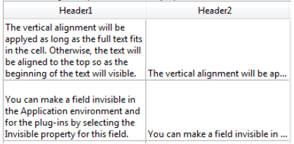

---

## Formato Alfa

Los formatos alfabéticos controlan la forma en que aparecen los campos alfanuméricos y las variables cuando se visualizan o imprimen. Aquí hay una lista de formatos suministrados para los campos alfanuméricos:

Puede elegir un formato de esta lista o utilizar cualquier formato personalizado. La lista por defecto contiene formatos para algunos de los campos alfa más comunes que requieren formatos: Números de teléfono de EE. UU. (locales y de larga distancia), números de la Seguridad Social y códigos postales. También puede introducir un nombre de formato personalizado definido en el editor Filtros y formatos de la caja de herramientas. En este caso, el formato no se puede modificar en las propiedades del objeto.
Los formatos o filtros personalizados que haya creado estarán disponibles automáticamente, precedidos de una barra vertical (|).

El signo número (#) es el marcador de posición para un formato de visualización alfanumérico. Puede incluir los guiones, rayas, espacios y cualquier otro signo de puntuación que desee mostrar. Utilice los signos de puntuación que desee y el signo número para cada caracter que desee mostrar.

Por ejemplo, considere un número de parte con un formato como "RB-1762-1".

El formato alfa sería:

\##-####-#

Cuando el usuario introduce "RB17621," el campo muestra:

RB-1762-1

El campo contiene realmente "RB17621".

Si el usuario introduce más caracteres de los que permite el formato, 4D muestra los últimos caracteres. Por ejemplo, si el formato es:

(#######)

y el usuario introduce "proporción", el campo muestra:

(portion)

El campo contiene realmente "proportion". 4D acepta y almacena la entrada completa sin importar el formato de visualización. No se pierde ninguna información.

#### Gramática JSON

| Nombre     | Tipos de datos | Valores posibles                                                                                                 |
| ---------- | -------------- | ---------------------------------------------------------------------------------------------------------------- |
| textFormat | string         | "### ####", "(###) ### ####", "### ### ####", "### ## ####", "00000", formatos personalizados |

#### Objetos soportados

[Lista desplegable](dropdownList_Overview.md) - [Combo Box](comboBox_overview.md) - [Columna List Box](listbox_overview.md#list-box-columns) - [Pie List Box](listbox_overview.md#list-box-footers)

---

## Formato Fecha

Los formatos de fecha controlan la forma en que aparecen las fechas cuando se muestran o imprimen. Para la entrada de datos, las fechas se introducen en el formato MM/DD/AAAA, independientemente del formato de visualización que haya elegido.

Se pueden definir formatos de visualización para las fechas:

- utilizando un formato integrado en 4D,
- utilizando un modelo personalizado.

### Formatos integrados

La siguiente tabla muestra las opciones disponibles:

| Nombre del formato                               | Cadena JSON                                  | Ejemplo (sistema USA)                      |
| ------------------------------------------------ | -------------------------------------------- | ------------------------------------------------------------- |
| System date short                                | systemShort (por defecto) | 03/25/20                                                      |
| System date abbreviated *(1)* | systemMedium                                 | Wed, Mar 25, 2020                                             |
| System date long                                 | systemLong                                   | Wednesday, March 25, 2020                                     |
| RFC 822                                          | rfc822                                       | Tue, 25 Mar 2020 22:00:00 GMT |
| Short Century                                    | shortCentury                                 | 03/25/20 pero 04/25/2032 *(2)*             |
| Internal date long                               | largo                                        | March 25, 2020                                                |
| Fecha interna abreviada *(1)* | abbreviated                                  | Mar 25, 2020                                                  |
| Internal date short                              | short                                        | 03/25/2020                                                    |
| ISO Date Time *(3)*           | iso8601                                      | 2020-03-25T00:00:00           |

*(1)* Para evitar ambigüedades y de acuerdo con la práctica actual, los formatos de fecha abreviados muestran "jun" para junio y "jul" para julio. Esta particularidad sólo se aplica a las versiones francesas de 4D.

*(2)* El año se muestra con dos dígitos cuando pertenece al intervalo (1930;2029), de lo contrario se mostrará con cuatro dígitos. Esto es por defecto, pero puede modificarse utilizando el comando [SET DEFAULT CENTURY](https://doc.4d.com/4dv20/help/command/en/page392.html).

*(3)* El formato `ISO Date Time` corresponde a la norma XML de representación de fecha y hora (ISO8601). Está pensado principalmente para ser utilizado al importar/exportar datos en formato XML y en Servicios Web.

> Independientemente del formato de visualización, si el año se introduce con dos dígitos, 4D asume que el siglo es el 21 si el año pertenece al intervalo (00;29) y el 20 si pertenece al intervalo (30;99). Esta es la configuración por defecto, pero puede modificarse utilizando el comando [SET DEFAULT CENTURY](https://doc.4d.com/4dv20/help/command/en/page392.html).

### Formatos personalizados

Se pueden crear formatos de fecha personalizados utilizando varios patrones descritos en la página [**Formatos de fecha y hora**](../Project/date-time-formats.md). Por ejemplo:

| Modelo               | Ejemplo (sistema USA) |
| -------------------- | ---------------------------------------- |
| "eeee, dd"           | Wednesday, 29                            |
| "'Día' #D 'del año'" | Día 333 del año                          |

#### Gramática JSON

| Nombre     | Tipos de datos | Valores posibles                                                                                                                                                                                                                                                                                        |
| ---------- | -------------- | ------------------------------------------------------------------------------------------------------------------------------------------------------------------------------------------------------------------------------------------------------------------------------------------------------- |
| dateFormat | string         | <li>Formatos integrados: "systemShort", "systemMedium", "systemLong", "iso8601", "rfc822", "short", "shortCentury", "abbreviated", "long" + " blankIfNull"</li><li>Formatos personalizados: todo formato creado utilizando un [patrón soportado](../Project/date-time-formats.md) + " blankIfNull"</li> |

:::note blankIfNull

Por defecto, una fecha null se muestra con ceros, por ejemplo 00/00/00. Con la opción "blankIfNull", una fecha null se muestra como un área vacía. La cadena "blankIfNull" (distingue mayúsculas de minúsculas) debe combinarse con el valor de formato seleccionado. Ej: "systemShort blankIfNull" o "ee dd LL blankIfNull".

:::

#### Objetos soportados

[Combo Box](comboBox_overview.md) - [Drop-down List](dropdownList_Overview.md) - [Input](input_overview.md) - [List Box Column](listbox_overview.md#list-box-columns) - [List Box Footer](listbox_overview.md#list-box-footers)

---

## Formato de número

> Los campos numéricos incluyen los tipos Integer, Long integer, Integer 64 bits, Real y Float.

Los formatos numéricos controlan la forma en que aparecen los números cuando se muestran o imprimen. Para la entrada de datos, sólo se introducen los números (incluido el punto decimal o el signo menos si es necesario), independientemente del formato de visualización que se haya elegido.

4D ofrece varios formatos de números por defecto.

### Marcadores

En cada uno de los formatos de visualización de números, el signo número (#), el cero (0), el signo de intercalación (^) y el asterisco (\*) se utilizan como marcadores de posición. Puede crear sus propios formatos numéricos utilizando un marcador de posición para cada dígito que desee mostrar.

| Marcador | Efecto para cero inicial o posterior      |
| -------- | ----------------------------------------- |
| #        | No muestra nada                           |
| 0        | Muestra 0                                 |
| ^        | Muestra un espacio (1) |
| -        | Muestra un asterisco                      |

(1) El signo de intercalación (^) genera un caracter de espacio que ocupa el mismo ancho que un dígito en la mayoría de los tipos de fuente.

Por ejemplo, si desea mostrar números de tres digitos, puede utilizar el formato ###. Si el usuario introduce más dígitos de los que permite el formato, 4D muestra <<< en el campo para indicar que se han introducido más dígitos de los especificados en el formato de visualización.

Si el usuario introduce un número negativo, el caracter situado más a la izquierda se muestra como un signo menos (a menos que se haya especificado un formato de visualización negativo). Si ##0 es el formato, menos 26 se muestra como -26 y menos 260 se muestra como <<< porque el signo menos ocupa un marcador de posición y sólo hay tres marcadores de posición.

> Sea cual sea el formato de visualización, 4D acepta y almacena el número introducido en el campo. No se pierde ninguna información.

Cada caracter de marcador de posición tiene un efecto diferente en la visualización de ceros a la izquierda o a la derecha. Un cero inicial es un cero que comienza un número antes del punto decimal; un cero final es un cero que termina un número después del punto decimal.

Supongamos que usa el formato ##0 para mostrar tres dígitos. Si el usuario no introduce nada en el campo, el campo muestra 0. Si el usuario introduce 26, el campo muestra 26.

### Caracteres separadores

Los formatos numéricos de visualización (excepto las notaciones científicas) se basan automáticamente en los parámetros regionales del sistema. 4D sustituye los caracteres "." y "," por, respectivamente, el separador decimal y el separador de miles definidos en el sistema operativo. Así, el punto y la coma se consideran caracteres comodín, siguiendo el ejemplo de 0 o #.

> En Windows, cuando se utiliza la tecla separadora decimal del teclado numérico, 4D hace una distinción según el tipo de campo donde se encuentre el cursor:
>
> - en un campo de tipo Real, al utilizar esta tecla se insertará el separador decimal definido en el sistema,
> - in any other type of field, this key inserts the character associated with the key, usually a period (.) o coma (,).

### Puntos decimales y otros caracteres de visualización

Puede utilizar un punto decimal en un formato de visualización de números. Si desea que el decimal se muestre independientemente de si el usuario lo teclea o no, debe colocarlo entre ceros.

Puede utilizar cualquier otro caracter en el formato. Cuando se utilizan solos, o se colocan antes o después de marcadores de posición, los caracteres siempre aparecen. Por ejemplo, si utiliza el siguiente formato:

$##0

siempre aparece un signo de dólar porque se coloca antes de los marcadores de posición.

Si se colocan caracteres entre los marcadores de posición, sólo aparecerán si se muestran dígitos a ambos lados. Por ejemplo, si define el formato:

\###.##0

el punto aparece sólo si el usuario introduce al menos cuatro dígitos.

Los espacios se tratan como caracteres en los formatos de visualización de números.

### Formatos para positivo, negativo y cero

Un formato de visualización de números puede tener hasta tres partes, lo que permite especificar formatos de visualización para valores positivos, negativos y cero. Especifique las tres partes separándolas con punto y coma, como se muestra a continuación:

Positivo;Negativo;Cero

No es necesario especificar las tres partes del formato. Si utiliza sólo una parte, 4D la utiliza para todos los números, colocando un signo menos delante de los números negativos.

Si utiliza dos partes, 4D utiliza la primera parte para los números positivos y el cero y la segunda parte para los números negativos. Si utiliza tres partes, la primera es para los números positivos, la segunda para los negativos y la tercera para el cero.

> La tercera parte (cero) no se interpreta y no acepta caracteres de sustitución. Si introduce `###;###;#`, el valor cero se mostrará "#". En otras palabras, lo que realmente introduzca es lo que se mostrará para el valor cero.

A continuación se muestra un ejemplo de formato de visualización de números que muestra signos de dólar y comas, coloca los valores negativos entre paréntesis y no muestra ceros:

￥###,##0.00;(￥###,##0.00);

Observe que la presencia del segundo punto y coma indica a 4D que utilice nada para mostrar el cero. El siguiente formato es similar excepto que la ausencia del segundo punto y coma indica a 4D que utilice el formato de número positivo para el cero:

￥###,##0.00;(￥###,##0.00)

En este caso, la visualización del cero sería $0.00.

### Notación científica

Si desea mostrar números en notación científica, utilice el **ampersand** (&) seguido de un número para especificar el número de dígitos que desea mostrar. Por ejemplo, el formato:

&3

mostrará 759.62 como:

7.60e+2

El formato de notación científica es el único que redondea automáticamente el número mostrado. Observe en el ejemplo anterior que el número se redondea a 7,60e+2 en lugar de truncarse en 7,59e+2.

### Formatos hexadecimales

Puede visualizar un número en hexadecimal utilizando los siguientes formatos de visualización:

- `&x`: este formato muestra números hexadecimales utilizando el formato “0xFFFF”.
- `&$`: este formato muestra números hexadecimales utilizando el formato "$FFFF".

### Notación XML

El formato `&xml` hará que un número cumpla las normas estándar XML. En particular, el caracter separador decimal será un punto "." en todos los casos, independientemente de la configuración del sistema.

### Mostrar un número como una hora

Puede visualizar un número como una hora (con un formato de hora) utilizando `&/` seguido de un dígito. La hora se determina calculando el número de segundos desde medianoche que representa el valor. El dígito en el formato corresponde al orden en que aparece el formato de hora en el menú desplegable Formato.

Por ejemplo, el formato:

&/5

corresponde al 5º formato horario del menú desplegable, concretamente a la hora AM/PM. Un campo numérico con este formato mostraría 25000 como:

6:56 AM

### Ejemplos

La siguiente tabla muestra cómo afectan los distintos formatos a la visualización de los números. Las tres columnas, Positiva, Negativa y Cero, muestran cada una cómo se mostrarían 1.234,50, -1.234,50 y 0.

| Formato introducido                                                                   | Positivo                   | Negativo                                       | Cero                           |
| ------------------------------------------------------------------------------------- | -------------------------- | ---------------------------------------------- | ------------------------------ |
| ###                                                                                   | <<<                        | <<<                                            |                                |
| ####                                                                                  | 1234                       | <<<<                                           |                                |
| #######                                                                               | 1234                       | -1234                                          |                                |
| #####.##                                                              | 1234.5     | -1234.5                        |                                |
| ####0.00                                                              | 1234.50    | -1234.50                       | 0.00           |
| #####0                                                                                | 1234                       | -1234                                          | 0                              |
| +#####0;–#####0;0                                                                     | +1234                      | -1234                                          | 0                              |
| #####0DB;#####0CR;0                                                                   | 1234DB                     | 1234CR                                         | 0                              |
| #####0;(#####0)                                                    | 1234                       | (1234)                      | 0                              |
| ###,##0                                                                               | 1,234                      | -1,234                                         | 0                              |
| ##,##0.00                                                             | 1,234.50   | -1,234.50                      | 0.00           |
| \^\^\^\^\^\^\^                                                                 | 1234                       | -1234                                          |                                |
| \^\^\^\^\^\^0                                                                   | 1234                       | -1234                                          | 0                              |
| \^\^\^,\^\^0                                                                     | 1,234                      | -1,234                                         | 0                              |
| \^\^,\^\^0.00                                                     | 1,234.50   | -1,234.50                      | 0.00           |
| \*\*\*\*\*\*\*                                                                        | \*\*\*1234                 | \*\*-1234                                      | \*\*\*\*\*\*\*                 |
| \*\*\*\*\*\*0                                                                         | \*\*\*1234                 | \*\*-1234                                      | \*\*\*\*\*\*0                  |
| \*\*\*,\*\*0                                                                          | \*\*1,234                  | \*-1,234                                       | \*\*\*\*\*\*0                  |
| \*\*,\*\*0.00                                                         | \*1,234.50 | -1,234.50                      | \*\*\*\*\*0.00 |
| $\*,\*\*0.00;–$\*,\*\*0.00                            | $1,234.50  | -$1,234.50                     | $\*\*\*\*0.00  |
| $\^\^\^\^0                                                                        | $ 1234                     | $–1234                                         | $    0                         |
| $\^\^\^0;–$\^\^\^0                                                              | $1234                      | –$1234                                         | $   0                          |
| $\^\^\^0 ;($\^\^\^0)                                         | $1234                      | ($1234)                     | $   0                          |
| $\^,\^\^0.00 ;($\^,\^\^0.00) | $1,234.50  | ($1,234.50) | $    0.00      |
| &2                                                                | 1.2e+3     | -1.2e+3                        | 0.0e+0         |
| &5                                                                | 1.23450e+3 | -1.23450e+3                    | 0.00000        |
| &xml                                                              | 1234.5     | -1234.5                        | 0                              |

#### Gramática JSON

| Nombre       | Tipos de datos | Valores posibles                                                                          |
| ------------ | -------------- | ----------------------------------------------------------------------------------------- |
| numberFormat | string         | Números (incluyendo un punto decimal o un signo menos si es necesario) |

#### Objetos soportados

[Combo Box](comboBox_overview.md) - [Lista desplegable](dropdownList_Overview.md) - [Entrada](input_overview.md) - [Columna List Box](listbox_overview.md#list-box-columns) - [Pie de List Box](listbox_overview.md#list-box-footers) - [Indicadores de progreso](progressIndicator.md)

---

## Formato imagen

Los formatos Imagen controlan la apariencia de las imágenes cuando se muestran o se imprimen. Para la entrada de datos, el usuario siempre introduce las imágenes pegándolas desde el Portapapeles o arrastrándolas y soltándolas, independientemente del formato de visualización.

Las opciones de truncamiento y escalado no afectan a la imagen en sí. El contenido de un campo Imagen siempre se guarda. El formato de visualización de la imagen sólo afecta a la visualización en el formulario en cuestión.

### A escala para ajustarse

`Gramática JSON: "scaled"`

El formato **A escala para ajustarse** hace que 4D redimensione la imagen para ajustarla a las dimensiones del área.

### Truncado (centrado y no centrado)

`Gramática JSON: "truncatedCenter" / "truncatedTopLeft"`

El formato **Truncado (centrado)** hace que 4D centre la imagen en el área y recorte cualquier parte que no quepa dentro del área. 4D recorta por igual desde cada borde y desde la parte superior e inferior.

El formato **Truncado (no centrado)** hace que 4D coloque la esquina superior izquierda de la imagen en la esquina superior izquierda del área y recorte cualquier parte que no quepa dentro del área. 4D corta desde la derecha y desde abajo.

> Cuando el formato de la imagen es **Truncado (no centrado)**, es posible añadir barras de desplazamiento al área de entrada.

### Escala de ajuste (proporcional) y Escala de ajuste centrada (proporcional)

`Gramática JSON: "proportionalTopLeft" / "proportionalCenter"`

Si utiliza **Escala de ajuste (proporcional)**, la imagen se reduce proporcionalmente en todos sus lados para ajustarse al área creada para la imagen. La opción **Escalado para ajustar centrado (proporcional)** hace lo mismo, pero centra la imagen en el área imagen.

Si la imagen es más pequeña que el área definida en el formulario, no se modificará. Si la imagen es mayor que el área definida en el formulario, se reduce proporcionalmente. Como se reduce proporcionalmente, la imagen no aparecerá distorsionada.

Si ha aplicado el formato **Escalado para ajustar centrado (proporcional)**, la imagen también se centra en el área:

### Replicado

`Gramática JSON: "tiled"`

Cuando se amplía el área que contiene una imagen con el formato **Replicada**, la imagen no se deforma sino que se replica tantas veces como sea necesario para llenar el área por completo.

Si el campo se reduce a un tamaño menor que el de la imagen original, la imagen queda truncada (no centrada).

#### Gramática JSON

| Nombre        | Tipos de datos | Valores posibles                                                                                      |
| ------------- | -------------- | ----------------------------------------------------------------------------------------------------- |
| pictureFormat | string         | "truncatedTopLeft", "scaled", "truncatedCenter", "tiled", "proportionalTopLeft", "proportionalCenter" |

#### Objetos soportados

[Entrada](input_overview.md) - [Columna List Box](listbox_overview.md#list-box-columns) - [Pie List Box](listbox_overview.md#list-box-footers)

---

## Formato Hora

Los formatos de hora controlan la forma en que aparecen las horas cuando se muestran o imprimen. For data entry, you enter times in the 24-hour HH: MM:SS format or the 12-hour HH: MM:SS AM/PM format, regardless of the display format you have chosen.

Se pueden definir los formatos de visualización de las horas:

- utilizando un formato integrado en 4D,
- utilizando un modelo personalizado.

### Formatos integrados

La siguiente tabla muestra los formatos de visualización de los campos de hora y da ejemplos:

| Nombre del formato                       | Cadena JSON                                        | Comentarios                                                                                                                                                                                          | Ejemplo para 04:30:25     |
| ---------------------------------------- | -------------------------------------------------- | ---------------------------------------------------------------------------------------------------------------------------------------------------------------------------------------------------- | --------------------------------------------------------- |
| HH:MM:SS | hh_mm_ss |                                                                                                                                                                                                      | 04:30:25                  |
| HH:MM                    | hh_mm                         |                                                                                                                                                                                                      | 04:30                                     |
| Hour Min Sec                             | HH_MM_SS |                                                                                                                                                                                                      | 4 horas 30 minutos 25 segundos                            |
| Hour Min                                 | HH_MM                         |                                                                                                                                                                                                      | 4 horas 30 minutos                                        |
| HH:MM AM/PM              | hh_mm_am |                                                                                                                                                                                                      | 4:30 a.m. |
| MM SS                                    | mm_ss                         | Hora expresada como duración a partir de las 00:00:00                                                                                                                | 270:25                                    |
| Min Sec                                  | MM_SS                         | Hora expresada como duración a partir de las 00:00:00                                                                                                                | 270 Minutos 25 Segundos                                   |
| ISO Date Time                            | iso8601                                            | Corresponde al estándar XML para representar datos relacionados con la hora. Está pensado principalmente para ser utilizado cuando se importan/exportan datos en formato XML         | 0000-00-00T04:30:25       |
| System time short                        | - (por defecto)                 | Formato de hora estándar definido en el sistema                                                                                                                                                      | 04:30:25                  |
| System time long abbreviated             | systemMedium                                       | sólo macOS: formato de tiempo abreviado definido en el sistema.  Windows: este formato es el mismo que el formato corto de la hora del sistema   | 4•30•25 AM                                                |
| System time long                         | systemLong                                         | macOS únicamente: formato de tiempo largo definido en el sistema.  Windows: este formato es el mismo que el formato corto de la hora del sistema | 4:30:25 AM HNEC           |

### Formatos personalizados

Se pueden crear formatos de hora personalizados utilizando varios patrones descritos en la página [**Formatos de fecha y hora**](../Project/date-time-formats.md). Por ejemplo:

| Modelo                                  | Ejemplo (sistema USA) |
| --------------------------------------- | ---------------------------------------- |
| "HH 'horas' mm 'minutos' ss 'segundos'" | 13 horas 25 minutos 12 segundos          |
| "hh:mm aa"              | 01:25 PM                 |

#### Gramática JSON

| Nombre     | Tipos de datos | Valores posibles                                                                                                                                                                                                                                                                                                       |
| ---------- | -------------- | ---------------------------------------------------------------------------------------------------------------------------------------------------------------------------------------------------------------------------------------------------------------------------------------------------------------------- |
| timeFormat | string         | <li>Formatos integrados: "systemShort", "systemMedium", "systemLong", "iso8601", "hh_mm_ss", "hh_mm", "hh_mm_am", "mm_ss", "HH_MM_SS", "HH_MMM", "MM_SS" + " blankIfNull"</li><li>Formatos personalizados: todo formato creado utilizando [un patrón compatible](../Project/date-time-formats.md) + "blankIfNull"</li> |

:::note blankIfNull

Por defecto, una hora null se muestra con ceros, por ejemplo "00:00:00". Con la opción "blankIfNull", una hora null se muestra como un área vacía. La cadena "blankIfNull" (distingue mayúsculas de minúsculas) debe combinarse con el valor de formato seleccionado. Ej: "MM_SS blankIfNull" o "hh:mm aa blankIfNull"

#### Objetos soportados

[Combo Box](comboBox_overview.md) - [Drop-down List](dropdownList_Overview.md) - [Input](input_overview.md) - [List Box Column](listbox_overview.md#list-box-columns) - [List Box Footer](listbox_overview.md#list-box-footers)

---

## Texto cuando False/Texto cuando True

Cuando una [expresión booleana](properties_Object.md#expression-type) se muestra como:

- un texto en un [objeto de entrada](input_overview.md)
- un "popup"  en una [columna del list box](listbox_overview.md#list-box-columns),

... puede seleccionar el texto que se mostrará para cada valor:

- **Text cuando True** - el texto que se mostrará cuando el valor sea "true"
- **Text cuando False** - el texto que se mostrará cuando el valor sea "false"

#### Gramática JSON

| Nombre        | Tipos de datos | Valores posibles                                                                |
| ------------- | -------------- | ------------------------------------------------------------------------------- |
| booleanFormat | string         | "\<*textWhenTrue*\>;\<*textWhenFalse*\>", por ejemplo "Assigned;Unassigned" |

#### Objetos soportados

[Columna List Box](listbox_overview.md#list-box-columns) - [Entrada](input_overview.md)

---

## Tipo de visualización

Utilizado para asociar un formato de visualización con los datos de la columna. Los formatos suministrados dependen del tipo de variable (list box de tipo array) o del tipo dato/campo (list boxes de tipo selección y colección).

Las columnas booleanas y numéricas (números o enteros) pueden mostrarse como casillas de verificación. En este caso, se puede definir la propiedad [Título](#title).

Las columnas booleanas también pueden mostrarse como menús emergentes. En este caso, deben definirse las propiedades [Text cuando False y Text cuando True](#text-when-false-text-when-true).

#### Gramática JSON

| Nombre      | Tipos de datos | Valores posibles                                                                                                                           |
| ----------- | -------------- | ------------------------------------------------------------------------------------------------------------------------------------------ |
| controlType | string         | <li>**columnas numéricas**: "automatic" (por defecto) o "checkbox"</li><li>**columnas booleanas**: "checkbox" (por defecto) o "popup"</li> |

#### Objetos soportados

[List Box Column](listbox_overview.md#list-box-columns)

---

## No renderizado

Cuando esta propiedad está activada, el objeto no se dibuja en el formulario, sin embargo aún puede activarse.

En particular, esta propiedad permite implementar botones "invisibles".  Los botones no renderizados pueden colocarse sobre los objetos gráficos. Permanecen invisibles y no se resaltan al hacer clic sobre ellos, pero su acción se activa a al pulsarlos.

#### Gramática JSON

| Nombre  | Tipos de datos | Valores posibles |
| ------- | -------------- | ---------------- |
| display | boolean        | true, false      |

#### Objetos soportados

[Botón](button_overview.md) - [Lista desplegable](dropdownList_Overview.md)

---

## Tres estados

Permite que un objeto casilla de selección acepte un tercer estado. La variable asociada a la casilla de selección devuelve el valor 2 cuando la casilla está en el tercer estado.

#### Casillas de verificación de tres estados en columnas list box

Las columnas de list box con un [tipo de datos](properties_Object.md#expression-type) numérico pueden mostrarse como casillas de verificación de tres estados. Si se elige, se muestran los siguientes valores:

- 0 = casilla no seleccionada,
- 1 = casilla seleccionada,
- 2 (o cualquier valor >0) = caja semi-marcada (tercer estado). Para la entrada de datos, este estado devuelve el valor 2.
- -1 = casilla de verificación invisible,
- -2 = casilla desmarcada, no editable,
- -3 = casilla marcada, no editable,
- -4 = casilla semi-marcada, no editable

También en este caso, la propiedad [Título](#title) está disponible para que se pueda introducir el título de la casilla de verificación.

#### Gramática JSON

| Nombre     | Tipos de datos | Valores posibles |
| ---------- | -------------- | ---------------- |
| threeState | boolean        | true, false      |

#### Objetos soportados

[Casilla de selección](checkbox_overview.md) - [Columna List Box](listbox_overview.md#list-box-columns)

---

## Título

Esta propiedad está disponible para una columna de list box si:

- el [tipo de columna](properties_Object.md#expression-type) es **boolean** y su [tipo de visualización](properties_Display.md#display-type) es "Casilla de selección"
- el [tipo de columna](properties_Object.md#expression-type) es **número** (numérico o entero) y su [tipo de visualización](properties_Display.md#display-type) es "Casilla de verificación de tres estados".

En ese caso, el título de la casilla de verificación puede introducirse utilizando esta propiedad.

#### Gramática JSON

| Nombre       | Tipos de datos | Valores posibles                                         |
| ------------ | -------------- | -------------------------------------------------------- |
| controlTitle | string         | Toda etiqueta personalizada para la casilla de selección |

#### Objetos soportados

[List Box Column](listbox_overview.md#list-box-columns)

---

## Truncar con puntos suspensivos

Controla la visualización de los valores cuando las columnas del list box son demasiado estrechas para mostrar todo su contenido.

Esta opción está disponible para columnas con cualquier tipo de contenido, excepto imágenes y objetos.

- Cuando la propiedad está activada (por defecto), si el contenido de una celda del list box excede el ancho de la columna, se trunca y se muestra una elipsis:

> La posición de la elipsis depende del sistema operativo. En el ejemplo anterior (Windows), se añade a la derecha del texto. En macOS, la elipsis se añade en medio del texto.

- Cuando la propiedad está desactivada, si el contenido de una celda excede el ancho de la columna, simplemente se recorta sin añadir elipsis:

La opción Truncar con elipsis está activada por defecto y puede especificarse con list boxes de tipo Array, Selección o Colección.

> Cuando se aplica a columnas de tipo Texto, la opción Truncar con elipsis sólo está disponible si la opción [Ajustar texto](#wordwrap) no está seleccionada. Cuando se selecciona la propiedad Ajuste de palabras, el contenido adicional de las celdas se gestiona mediante las funciones de ajuste de palabras, por lo que la propiedad Truncar con elipsis no está disponible.

La propiedad Truncar con elipsis puede aplicarse a columnas de tipo booleano; sin embargo, el resultado difiere en función del [formato de celda](#display-type):

- En los formatos booleanos de tipo emergente, las etiquetas se truncan con una elipsis,
- Para los formatos booleanos de tipo casilla de verificación, las etiquetas siempre se recortan.

#### Gramática JSON

| Nombre       | Tipos de datos | Valores posibles       |
| ------------ | -------------- | ---------------------- |
| truncateMode | string         | "withEllipsis", "none" |

#### Objetos soportados

[List Box Column](listbox_overview.md#list-box-columns) - [List Box Footer](listbox_overview.md#list-box-footers)

---

## Visibilidad

Esta propiedad permite ocultar el objeto en el entorno Aplicación.

Puede manejar la propiedad Visibilidad para la mayoría de los objetos del formulario. Esta propiedad se utiliza principalmente para simplificar el desarrollo de interfaces dinámicas. En este contexto, a menudo es necesario ocultar objetos por programación durante el evento `On load` del formulario y luego mostrar determinados objetos. In this context, it is often necessary to hide objects programatically during the <code>On load</code> event of the form then to display certain objects afterwards. El desarrollador puede entonces programar su pantalla utilizando el comando [`OBJECT SET VISIBLE`](https://doc.4d.com/4dv19/help/command/en/page603.html) cuando lo necesite.

#### Visibilidad automática en los formularios lista

En el contexto de los [formularios "lista"](FormEditor/properties_FormProperties.md#form-type), la propiedad Visibilidad soporta dos valores específicos:

- **Si registro seleccionado** (nombre JSON: "selectedRows")
- **Si el registro no está seleccionado** (nombre JSON: "unselectedRows")

Esta propiedad sólo se utiliza cuando se dibujan objetos situados en el cuerpo de un formulario listado. Indica a 4D si debe o no dibujar el objeto dependiendo de si el registro que se está procesando está seleccionado/no seleccionado. Permite representar una selección de registros utilizando atributos visuales distintos de los colores de resaltado:

4D no tiene en cuenta esta propiedad si el objeto se ocultó utilizando el comando [`OBJECT SET VISIBLE`](https://doc.4d.com/4dv20/help/command/en/page603.html); en este caso, el objeto permanece invisible independientemente de si el registro está seleccionado o no.

#### Gramática JSON

| Nombre     | Tipos de datos | Valores posibles                                                                                                                                            |
| ---------- | -------------- | ----------------------------------------------------------------------------------------------------------------------------------------------------------- |
| visibility | string         | "visible", "hidden", "selectedRows" (formulario listado únicamente), "unselectedRows" (formulario listado únicamente) |

#### Objetos soportados

[Área 4D View Pro](viewProArea_overview.md) - [Área 4D Write Pro](writeProArea_overview.md) - [Botón](button_overview.md) - [Rejilla de botones](buttonGrid_overview.md) - [Casilla de verificación](checkbox_overview.md) - [Combo Box](comboBox_overview.md) - [Lista desplegable](dropdownList_Overview.md) - [Group Box](groupBox.md) - [Lista jerárquica](list_overview.md) - [List Box](listbox_overview.md) - [Columna List Box](listbox_overview.md#list-box-columns) - [Pie de List Box](listbox_overview.md#list-box-footers) - [Encabezado de List Box](listbox_overview.md#list-box-headers) - [Botón imagen](pictureButton_overview.md) - [Menú emergente con imagen](picturePopupMenu_overview.md) - [Área de Plug-in](pluginArea_overview.md) - [Indicador de progreso](progressIndicator.md) - [Botón de opción](radio_overview.md) - [Spinner](spinner.md) - [Separador](splitters.md) - [Imagen estática](staticPicture.md) - [Pasos](stepper.md) - [Subformulario](subform_overview.md) - [Control de pestañas](tabControl.md) - [Área de texto](text.md) - [Área web](webArea_overview.md)

---

## Ajuste de texto

> Para los objetos [entrada](input_overview.md), disponibles cuando la propiedad [Multilínea](properties_Entry.md#multiline) está definida como "yes".

Gestiona la visualización del contenido cuando supera el ancho del objeto.

#### Marcada para list box/Sí para entrada

`Gramática JSON: "normal"`

Cuando esta opción está seleccionada, el texto pasa automáticamente a la línea siguiente siempre que su ancho supere el de la columna/área, si la altura de la columna/área lo permite.

- En las columnas/áreas de una sola línea, sólo se muestra la última palabra que puede mostrarse entera. 4D inserta retornos de línea; es posible desplazarse por el contenido del área presionando la tecla de flecha abajo.

- En las columnas/áreas multilínea, 4D realiza retornos de línea automáticos.

#### Sin marcar para el list box/No para entrada

`Gramática JSON: "none"`

Cuando se selecciona esta opción, 4D no realiza ningún retorno de línea automático y la última palabra que se puede mostrar puede quedar truncada. En las áreas de tipo de texto, se soportan los retornos de carro:

En los list boxes, el texto demasiado largo se trunca y se muestra con una elipse (...). En el siguiente ejemplo, la opción Wordwrap está **marcada para la columna izquierda** y **desmarcada para la columna derecha**:

Tenga en cuenta que, independientemente del valor de la opción Ajuste de texto, la altura de la línea no se modifica. Si el texto con saltos de línea no puede visualizarse por completo en la columna, se trunca (sin elipse). En el caso de los list boxes que muestran una sola línea, sólo se muestra la primera línea de texto:

#### Automático para entrada (opción por defecto)

`Gramática JSON: "automatic"`

- En las áreas de una sola línea, las palabras situadas al final de las líneas se truncan y no hay retornos de línea.
- En áreas multilíneas, 4D realiza retornos de línea automáticos.

#### Gramática JSON

| Nombre   | Tipos de datos | Valores posibles                                                       |
| -------- | -------------- | ---------------------------------------------------------------------- |
| wordwrap | string         | "automatic" (excluyendo list box), "normal", "none" |

#### Objetos soportados

[Entrada](input_overview.md) - [Columna List Box](listbox_overview.md#list-box-columns) - [Pie List Box](listbox_overview.md#list-box-footers)
