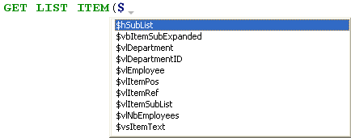

Esta página contiene parámetros que definen la interfaz del Editor de Código y su visualización por defecto, así como opciones relativas a su funcionamiento. Se divide en dos secciones a las que se accede mediante las pestañas Tema y Opciones.

## Temas

Esta página permite seleccionar, crear o configurar los temas del Editor de Código. Un tema define la fuente, el tamaño de la fuente, los colores y los estilos de los elementos mostrados del editor de código.

### Lista de temas

En esta lista, se selecciona el tema que se aplicará al editor de código. Se muestran todos los temas disponibles, incluidos los temas personalizados (si los hay). 4D ofrece dos temas por defecto:

- **Tema Light por defecto**
- **Tema oscuro por defecto**

> Los temas por defecto no pueden ser modificados ni eliminados.

Un tema **myTheme** se añade automáticamente si ya ha personalizado los estilos del Editor de Código en versiones anteriores de 4D.

### Creación de temas personalizados

Puede crear temas totalmente personalizables. Para crear un tema, seleccione un tema existente y haga clic en el **+** en la parte inferior de la lista de temas. También puede añadir temas personalizados copiando los archivos de temas en la carpeta `4D Editor Themes` (ver más abajo).

### Archivos de temas personalizados

Cada tema personalizado se almacena en un único archivo JSON llamado *themeName.json*. Los archivos JSON de los temas personalizados se almacenan en la carpeta `4D Editor Themes` situada en el mismo nivel que el [archivo de preferencias](overview.md#stora

Si los valores de las teclas no se definen en un tema personalizado, se ajustan por defecto a los valores del tema *Default Light Theme*. Si un archivo de tema JSON es inválido, se carga el tema *Default Light Theme* y se genera un error.

> Cuando un archivo de tema es modificado por un editor externo, 4D debe ser reiniciado para tener en cuenta las modificaciones.

## Definir el tema

Definir un tema significa:

- definir una fuente y un tamaño de fuente para todo el editor de código,
- asignar los estilos y los colores específicos a cada elemento del lenguaje 4D (campos, tablas, variables, parámetros, SQL, etc.), a cada elemento del lenguaje SQL (palabras clave, funciones, etc.) y a los fondos de color.

La combinación de colores y de estilos diferentes es especialmente útil para el mantenimiento del código.

### Fuentes y tamaños de fuente

Los menús **fuente** y **tamaño de fuente** le permiten seleccionar el nombre y el tamaño de la fuente utilizada en el área de entrada del Editor de código para todas las categorías.

### Lenguaje 4D y lenguaje SQL

Puede definir diferentes estilos de fuente y colores de fuente (color de fuente o color de fondo) para cada tipo de elemento del lenguaje. Puede seleccionar los elementos que desea personalizar en la lista de categorías.

### Otros estilos

Estas opciones configuran los distintos colores utilizados en las interfaces del Editor de código y del depurador.

|                                                        | Descripción                                                                                                                                                                                                  |
| ------------------------------------------------------ | ------------------------------------------------------------------------------------------------------------------------------------------------------------------------------------------------------------ |
| **Color de fondo**                                     | Color de fondo de la ventana del editor de código.                                                                                                                                           |
| **Borde de la línea en ejecución en el depurador**     | Color del borde que rodea la línea que se está ejecutando en el depurador cuando la opción "Resaltar la línea en ejecución" está activada en la página [Opciones](#options).                 |
| **Color de fondo de la línea del cursor**              | Color de fondo de la línea que contiene el cursor.                                                                                                                                           |
| **Color de fondo de la línea en ejecución**            | Color de fondo de la línea que se está ejecutando en el depurador.                                                                                                                           |
| **Resaltar las palabras encontradas**                  | Color de resaltado de las palabras encontradas en una búsqueda.                                                                                                                              |
| **Destacar los paréntesis**                            | Color de resaltado de los paréntesis correspondientes (se utiliza cuando los pares de paréntesis se señalan mediante resaltado, ver [Opciones](#options)).                |
| **Resaltado de los bloques**                           | Color de resaltado de los bloques lógicos seleccionados cuando la opción "Resaltar bloques lógicos" está activada en las [Opciones](#options).                                               |
| **Resaltar la misma variable o campo**                 | Color de resaltado para las otras ocurrencias de la misma variable o del mismo texto de campo cuando una de las opciones "Resaltar variables y texto" está activada en [Opciones](#options). |
| **Resaltado de la línea en ejecución en el depurador** | Color de resaltado de la línea que se está ejecutando en el depurador cuando la opción "Resaltar línea en ejecución" está activada en [Opciones](#options).                                  |
| **Color de fondo de la selección**                     | Color de fondo de la selección.                                                                                                                                                              |
| **Texto sugerido**                                     | Color del texto de autocompletar sugerido por el Editor de Código.                                                                                                                           |

## Opciones

Esta página configura las opciones de visualización del Editor de Código.

### Opciones

#### Lenguaje de programación 4D (Utilizar los parámetros regionales del sistema)

Permite desactivar/activar los parámetros del código "internacional" para la aplicación 4D local.

- **no seleccionado** (por defecto): los parámetros English-US y el lenguaje de programación inglés se utilizan en los métodos 4D.
- **seleccionado**: los parámetros regionales se utilizan en los métodos 4D.

> Si modifica esta opción, deberá reiniciar la aplicación 4D para que se tenga en cuenta el cambio.

#### Indentación

Cambia el valor de indentación del código 4D en el editor de código. El ancho debe especificarse en puntos (10 por defecto).

El código 4D es indentado automáticamente para revelar su estructura:

Modificar este valor por defecto puede ser útil si sus métodos contienen algoritmos complejos con muchos niveles de integración. Se puede utilizar una indentación más estrecha para limitar el desplazamiento horizontal.

#### Mostrar los números de línea

Le permite mostrar los números de línea por defecto en cada ventana del Editor de Código. También puede mostrar/ocultar los números de línea de la ventana actual directamente desde el Editor de código.

#### Mostrar las listas

Le permite elegir si mostrar o no las listas de objetos (Comandos, Tablas y campos, etc.) por defecto cuando se abre la ventana del Editor de código. También puede mostrar u ocultar cada lista directamente desde el Editor de código.

#### Mostrar los portapapeles

Le permite elegir si mostrar o no los múltiples portapapeles en el editor de código.

Los correspondientes [atajos al portapapeles](https://doc.4d.com/4Dv19R3/4D/19-R3/Writing-a-method.300-5612559.en.html#3977166) siguen activos cuando estos portapapeles están ocultos.

#### Resaltado de los bloques lógicos

Cuando está seleccionada, todo el código perteneciente a un bloque lógico (If/End if por ejemplo) se resalta cuando el ratón se sitúa sobre el nodo expandido:

El color de resaltado se puede definir en la página [Tema](#theme-definition).

#### Mostrar siempre las líneas de bloques

Permite ocultar permanentemente las líneas verticales de bloques. Las líneas de bloque están diseñadas para conectar visualmente los nodos. Por defecto, siempre se muestran (excepto cuando los iconos contraer/desplegar están ocultos, ver más abajo).

#### Ocultar los iconos contraer/expandir

Permite ocultar todos los iconos expandir/desplegar por defecto al mostrar el código. Cuando la opción está seleccionada, los iconos de nodo (así como las líneas de bloque locales, ver arriba), se muestran temporalmente cuando el ratón se sitúa sobre un nodo:

#### Insertar () y añadir } ) ] " cierres

Activa la inserción automática de () y de llaves de cierre mientras se escribe el código. Esta opción controla dos funcionalidades automáticas:

- **par de paréntesis ()<**: se añade después de un comando 4D, una palabra clave o un método proyecto insertado desde una lista de sugerencias o de finalización, si el elemento insertado requiere uno o más argumentos obligatorios. Por ejemplo, si escribe "C_OB" y presionaa Tab, 4D escribe "C_OBJECT()" y fija el punto de inserción dentro del ().

- **cierre }, ), ], o "**: caracter que se añade al escribir respectivamente una apertura {, (, ], o ". Esta función permite insertar pares de símbolos coincidentes en el punto de inserción o alrededor de un texto seleccionado. Por ejemplo, si resalta una cadena de caracteres y escribe un simple caracter ", toda la cadena seleccionada quedará encerrada en "":

\

#### Correspondencia \[]\(){}

Define la señalización gráfica de las llaves correspondientes en el código. Esta señalización aparece siempre que se selecciona un corchete, un paréntesis o una llave.
Las siguientes opciones están disponibles:

- **Ninguno**: sin señales
- **Rectángulo** (por defecto): llaves rodeadas por una línea negra\
  
- **Color de fondo**: corchetes resaltados (el color se define en la página [Tema](#Teme-definition)).
- **Negrita**: las llaves aparecen en negrita.

#### Resaltado de las variables y campos

Permite resaltar todas las ocurrencias de la misma variable o campo en una ventana de método abierta.

- **No**(por defecto): no resaltado
- **Con cursor**: todas las ocurrencias se destacan cuando se hace clic en el texto
- **Al seleccionar**: se resaltan todas las ocurrencias cuando se selecciona el texto

El color de resaltado se puede definir en la página [Tema](#theme-definition).

#### Depurar (Resaltar la línea en ejecución)

Resalta la línea que se está ejecutando actualmente en el depurador, además del indicador de flecha amarilla.

Si deselecciona esta opción, sólo se mostrará la flecha amarilla.

### Sugerencias

Esta área le permite configurar los mecanismos de autocompletar en el Editor de código para adaptarlo a sus propios hábitos de trabajo.

|                                   | Descripción                                                                                                                                                                                                                                                                                                                                                                                                                                                                                                                                                                                                                                                                                                                                                                                                                                                                                                                                                                                                                                                                                                                                                                            |
| --------------------------------- | -------------------------------------------------------------------------------------------------------------------------------------------------------------------------------------------------------------------------------------------------------------------------------------------------------------------------------------------------------------------------------------------------------------------------------------------------------------------------------------------------------------------------------------------------------------------------------------------------------------------------------------------------------------------------------------------------------------------------------------------------------------------------------------------------------------------------------------------------------------------------------------------------------------------------------------------------------------------------------------------------------------------------------------------------------------------------------------------------------------------------------------------------------------------------------------- |
| Apertura automática de la ventana | Triggers the automatic display of the suggestion window for:<ul><li>Constants</li><li>Variables (local and interprocess) and object attributes</li><li>Tables</li><li>Prototypes (*i.e.*, class functions)</li></ul>
For example, when the "Variables (local or interprocess) and object attributes" option is checked, a list of suggestions appears when you type the $ character:

 You can disable this functioning for certain elements of the language by deselecting their corresponding option.                                                                                                                                                                                                                                                                                                                                                                                                                                                                       |
| Validación de una sugerencia      | Establece el contexto de entrada que permite al Editor de Código validar automáticamente la sugerencia actual mostrada en la ventana de autocompletado.<ul><li>**Tabuladores y delimitadores** Cuando esta opción está seleccionada, puede validar la selección actual con la tecla Tab o cualquier delimitador relevante para el contexto. Por ejemplo, si introduce "ALE" y luego "(", 4D escribe automáticamente "ALERT(" en el editor. Esta es la lista de delimitadores que se tienen en cuenta:  ( ; : = < [ {</li><li>**Sólo tabulador** Cuando se selecciona esta opción, sólo se puede utilizar el tabulador para insertar la sugerencia actual. Esto puede utilizarse más concretamente para facilitar la introducción de caracteres delimitadores en los nombres de elementos, como ${1}.**Note**: También puede hacer doble clic en la ventana o presionar la tecla Retorno de carro para validar una sugerencia.</li></ul> |
