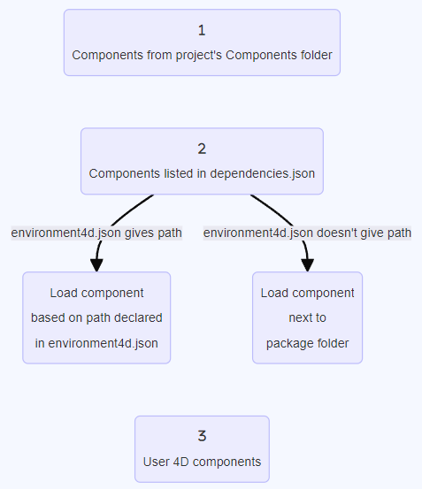
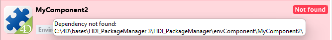

A 4D component is a set of 4D code and/or 4D forms representing one or more functionalities that you can add and use in your projects. For example, the [4D SVG](https://github.com/4d/4D-SVG) component adds advanced commands and an integrated rendering engine that can be used to display SVG files.

You can [develop](../Extensions/develop-components.md) and [build](../Desktop/building.md) your own 4D components, or download public components shared by the 4D community that [can be found on GitHub](https://github.com/search?q=4d-component\&type=Repositories).

When developing in 4D, the component files can be transparently stored in your computer or on a Github repository.

## Componentes interpretados y compilados

Los componentes pueden ser interpretados o [compilados](../Desktop/building.md). La carpeta del paquete de un componente puede contener:

- ya sea una carpeta Proyecto (componente interpretado)
- o un archivo .4DZ (componente compilado)

A 4D project running in interpreted mode can use either interpreted or compiled components. Un proyecto 4D que se ejecuta en modo compilado no puede utilizar componentes interpretados. En este caso, sólo se pueden utilizar componentes compilados.

## Cargando componentes

:::note

Esta página describe cómo trabajar con componentes en los entornos **4D** y **4D Server**. En otros entornos, los componentes se gestionan de manera diferente:

- in [4D in remote mode](../Desktop/clientServer.md), components are loaded by the server and sent to the remote application.
- in merged applications, components are [included at the build step](../Desktop/building.md#plugins--components-page).

:::

### Generalidades

Para cargar un componente en su proyecto 4D, usted puede:

- copy the component files in the [**Components** folder of your project](architecture.md#components),
- o, declarar el componente en el archivo **dependencies.json**.

Los componentes declarados en el archivo **dependencies.json** pueden almacenarse en diferentes ubicaciones:

- al mismo nivel que la carpeta de paquetes de su proyecto 4D: esta es la ubicación predeterminada,
- en cualquier lugar de su máquina: la ruta del componente debe declararse en el archivo **environment4d.json**
- on a GitHub repository: the component path can be declared in the **dependencies.json** file or in the **environment4d.json** file, or in both files.

If the same component is installed at different locations, a [priority order](#priority) is applied.

### dependencies.json vs environment4d.json

#### dependencies.json

El archivo **dependencies.json** hace referencia a todos los componentes requeridos en su proyecto 4D. Este archivo debe encontrarse en la carpeta **Sources** de la carpeta del proyecto 4D, por ejemplo.:

```
	/MyProjectRoot/Project/Sources/dependencies.json
```

Puede contener:

- names of components [stored locally](#declaring-local-components) (default path or path defined in an **environment4d.json** file),
- names of components [stored on GitHub repositories](#declaring-components-stored-on-github) (their path can be defined in this file or in an **environment4d.json** file).

#### environment4d.json

El archivo **environment4d.json** es opcional. Permite definir **rutas personalizadas** para algunos o todos los componentes declarados en el archivo **dependencies.json**. This file can be stored in your project package folder or in one of its parent folders, at any level (up to the root).

Los principales beneficios de esta arquitectura son los siguientes:

- you can store the **environment4d.json** file in a parent folder of your projects and decide not to commit it, allowing you to have your local component organization.
- if you want to use the same GitHub repository for several of your projects, you can reference it in the **environment4d.json** file and declare it in the **dependencies.json** file.

### Prioridad

Since components can be installed in different ways, a priority order is applied when the same component is referenced at several locations:

**Máxima prioridad**

1. Componentes almacenados en la carpeta [**Components** del proyecto](architecture.md#components).
2. Componentes declarados en el archivo **dependencies.json**.
3. Componentes 4D internos del usuario (por ejemplo, 4D NetKit, 4D SVG...)

**Prioridad más baja**



When a component cannot be loaded because of another instance of the same component located at a higher priority level, it is given the *Overloaded* [status](#dependency-status). El componente cargado tiene el [estado](#dependency-status) *Overloading*.

(la ruta declarada en **environment4d.json** sobrescribe la ruta en **dependencies.json** para configurar un entorno local).

### Declarando componentes locales

Declara un componente local en el archivo [**dependencies.json**](#dependencyjson) de la siguiente manera:

```json
{
    "dependencies": {
        "myComponent1" : {},
        "myComponent2" : {}
    }
}
```

... donde "myComponent1" y "myComponent2" son el nombre de los componentes a cargar.

By default, if "myComponent1" and "myComponent2" are not declared in an [environment4d.json file](#environment4djson), 4D will look for the component's package folder (*i.e.* the project root folder of the component) at the same level as your 4D project's package folder, e.g.:

```
	/MyProjectRoot/
	/MyProjectComponentRoot/
```

Thanks to this architecture, you can simply copy all your components at the same level as your projects and reference them in your **dependencies.json** files.

:::note

If you do not want to benefit from the **dependencies.json** architecture, you can install local components by copying their files in the [**Components** folder of your project](architecture.md#components).

:::

#### Customizing component paths

If you want to customize the location of local components, you declare the paths for the dependencies that are not stored at the same level as the project folder in the [**environment4d.json**](#environment4djson) file.

You can use absolute or relative paths, expressed in POSIX syntax as described in [this paragraph](../Concepts/paths#posix-syntax). Las rutas relativas son relativas al archivo environment4d.json.

Ejemplos:

```json
{
	"dependencies": {
		"myComponent1" : "MyComponent1",
		"myComponent2" : "../MyComponent2",
        "myComponent3" : "file:///Users/jean/MyComponent3"
    }
}
```

:::note

If a component path declared in the **environment4d.json** file is not found when the project is started, the component is not loaded and gets the *Not found* [status](dependency-status), even if a version of the component exists next to the project's package folder.

:::

### Declarar componentes almacenados en GitHub

Los componentes 4D disponibles en GitHub pueden ser referenciados y cargados automáticamente en sus proyectos 4D.

:::note

Regarding components stored on GitHub, both [**dependencies.json**](#dependenciesjson) and [**environment4d.json**](#environment4djson) files support the same contents.

:::

#### Configuración del repositorio GitHub

Para poder referenciar y utilizar directamente un componente 4D almacenado en GitHub, es necesario configurar el repositorio del componente GitHub:

- Comprima los archivos componentes en formato ZIP.
- Nombre este archivo con el mismo nombre que el repositorio GitHub.
- Integre el archivo en una [versión GitHub](https://docs.github.com/en/repositories/releasing-projects-on-github/managing-releases-in-a-repository) del repositorio.

Estos pasos pueden automatizarse fácilmente, con código 4D o utilizando GitHub Actions, por ejemplo.

#### Declaring paths

Declare un componente almacenado en GitHub en el archivo [**dependencies.json**](#dependencyjson) de la siguiente manera:

```json
{
	"dependencies": {
		"myGitHubComponent1": {
			"github" : "JohnSmith/myGitHubComponent1"
		},
		"myGitHubComponent2": {}
	}
}
```

... where "myGitHubComponent1" is referenced and declared for the project, although "myGitHubComponent2" is only referenced. Necesita declararlo en el archivo [**environment4d.json**](#environment4djson):

```json
{
	"dependencies": {
		"myGitHubComponent2": {
			"github" : "JohnSmith/myGitHubComponent2"
		}
	}
}
```

"myGitHubComponent2" puede ser utilizado por varios proyectos.

#### Tags and versions

Cuando crea una versión en GitHub, especifica una **etiqueta** y una **versión**.

- **Etiquetas** son textos que hacen referencia única a una versión. In the [**dependencies.json** file](#dependencyjson) and [**environment4d.json**](#environment4djson) files, you can indicate the release tag you want to use in your project. Por ejemplo:

```json
{
	"dependencies": {
		"myFirstGitHubComponent": {
			"github": "JohnSmith/myFirstGitHubComponent",
			"tag": "beta2"
		}
	}
}
```

- Una versión también se identifica por una **versión**. The versioning system used is based on the *Semantic Versioning* concept, which is the most commonly used. Cada número de versión se identifica de la siguiente manera: `majorNumber.minorNumber.pathNumber`. Del mismo modo que para las etiquetas, puede indicar la versión del componente que desea utilizar en su proyecto, como en este ejemplo:

```json
{
	"dependencies": {
		"myFirstGitHubComponent": {
			"github": "JohnSmith/myFirstGitHubComponent",
			"version": "2.1.3"
		}
	}
}
```

La versión se utiliza para definir qué versiones se pueden utilizar. Se utiliza una [versión semántica estándar](https://regex101.com/r/Ly7O1x/3/). A range is defined by two semantic versions, a min and a max, with operators '\< | > | >= | <= | ='. El `*` se puede utilizar como un marcador de posición para todas las versiones. Los prefijos ~ y ^ definen versiones a partir de un número, y hasta respectivamente la siguiente versión mayor y menor.

Estos son algunos ejemplos:

- "latest": la versión que tiene el distintivo "latest" en las versiones de GitHub.
- "\*": la última versión lanzada.
- "1.\*": todas las versiones de la versión principal 1.
- "1.2.\*": todos los parches de la versión menor 1.2.
- "^1.2.3" or ">=1.2.3": the latest version 1, starting with the 1.2.3 version.
- "~1.2.3" or ">1.2.3": the latest major version 1, starting with the version just after the 1.2.3.
- "<=1.2.3": la última versión hasta la 1.2.3.
- "1.0.0 – 1.2.3" o ">=1.0.0 <=1.2.3": versión entre 1.0.0 y 1.2.3.
- "`<1.2.3 || >=2`": versión que no está entre 1.2.3 y 2.0.0.

If you do not specify a tag or a version, 4D automatically retrieves the "latest" version.

#### Private repositories

If you want to integrate a component located in a private repository, you need to tell 4D to use a connection token to access it.

Para ello, en su cuenta GitHub, cree un token **classic** con derechos de acceso a **repo**.

:::note

For more information, please refer to the [GitHub token interface](https://github.com/settings/tokens).

:::

Luego inserta la llave "github" en su archivo [**environment4d.json**](#environment4djson):

```json
{
	"github": {
		"token": "ghpXXXXXXXXXXXXUvW8x9yZ"
	},
	"dependencies": {

		"mySecondGitHubComponent": {
			"github": "JohnSmith/mySecondGitHubComponent"
		}
	}
}
```

#### Caché local para dependencias

Referenced GitHub components are downloaded in a local cache folder then loaded in your environment. La carpeta de caché local se guarda en la siguiente ubicación:

- en macOs: `$HOME/Library/Caches/<app name>/Dependencies`
- en Windows: `C:\Users\<username>\AppData\Local\<app name>\Dependencies`

...donde `<app name>` puede ser "4D", "4D Server" o "tool4D".

#### dependency-lock.json

A `dependency-lock.json` file is created in the [`userPreferences` folder](architecture.md#userpreferencesusername) of your project.

This file logs information such as the state of dependencies, paths, urls, loading errors, as well as other information. Podría ser útil para la gestión de la carga de componentes o la resolución de problemas.

## Monitoreo de dependencias del proyecto

En un proyecto abierto, puede obtener información sobre las dependencias y su estado de carga actual en el panel **Dependencias**.

Para mostrar el panel Dependencias:

- con 4D, seleccione el ítem de menú **Diseño/Dependencias del Proyecto** (entorno de desarrollo),<br/>
  

- con 4D Server, seleccione el ítem de menú **Ventana/Dependencias del Proyecto**.<br/>
  

A continuación se muestra el panel Dependencias. Las dependencias se ordenan por nombre en orden alfabético:


### Origen de dependencia

The Dependencies panel lists all project dependencies, whatever their origin, i.e. wherever they come from. El origen de la dependencia lo suministra la etiqueta bajo su nombre:


Las siguientes opciones de origen son posibles:

| Etiqueta de origen                | Descripción                                                                     |
| --------------------------------- | ------------------------------------------------------------------------------- |
| Componente 4D                     | Built-in 4D component, stored in the `Components` folder of the 4D application  |
| dependencies.json | Componente declarado en el archivo [`dependencies.json`](#dependenciesjson)     |
| Entorno                           | Componente declarado en el archivo [`environnement4d.json`](#environment4djson) |
| Componente del proyecto           | Componente ubicado en la carpeta [`Components`](architecture.md#components)     |

**Clic derecho** en una línea de dependencia y selecciona **Mostrar en el disco** para revelar la ubicación de una dependencia:


:::note

This item is not displayed if the dependency is inactive because its files are not found.

:::

El icono del componente y el logotipo de ubicación ofrecen información adicional:

- The component logo indicates if it is provided by 4D or a third-party developer.
- Los componentes locales se pueden diferenciar de los componentes GitHub por un pequeño icono.


### Filtering Dependencies

By default, all dependencies identified by the Dependency manager are listed, whatever their [status](#dependency-status). You can filter the displayed dependencies according to their status by selecting the appropriate tab at the top of the Dependencies panel:


- **Activo**: dependencias que están cargadas y pueden ser utilizadas en el proyecto. Incluye dependencias *overloading*, las cuales son realmente cargadas. Las dependencias *Overloaded* se enumeran en el panel **Conflicts** junto con todas las dependencias en conflicto.
- **Inactivo**: dependencias que no están cargadas en el proyecto y no están disponibles. There are many possible reasons for this status: missing files, version incompatibility...
- **Conflict**: Dependencies that are loaded but that overloads at least one other dependency at lower [priority level](#priority). Overloaded dependencies are also displayed so that you can check the origin of the conflict and take appropriate actions.

### Estado de dependencia

Dependencies requiring the developer's attention are indicated by a **status label** at the right side of the line and a specific background color:


Las siguientes etiquetas de estado están disponibles:

- **Overloaded**: The dependency is not loaded because it is overloaded by another dependency with the same name at a higher [priority level](#priority).
- **Overloading**: The dependency is loaded and is overloading one or more other dependencies with the same name at a lower [priority level](#priority).
- **Not found**: la dependencia está declarada en el archivo dependencies.json pero no se encuentra.
- **Inactive**: The dependency is not loaded because it is not compatible with the project (e.g. the component is not compiled for the current platform).
- **Duplicated**: The dependency is not loaded because another dependency with the same name exists at the same location (and is loaded).

A tooltip is displayed when you hover over the dependency line, provding additional information about the status:


