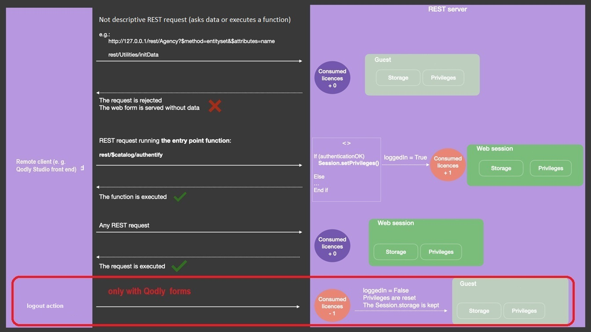

## Sesiones

Cuando las [sesiones escalables están activadas](WebServer/sessions.md#enabling-sessions) (recomendadas), las peticiones REST pueden crear y usar [sesiones usuario web](WebServer/sessions.md), ofreciendo funcionalidades adicionales como la gestión de múltiples peticiones, el intercambio de datos entre procesos web clientes y el control de los privilegios usuario.

Cuando se abre una sesión de usuario web, puede manejarla a través del objeto `Session` y la [Session API](API/SessionClass.md). Las siguientes peticiones REST reutilizan la misma cookie de sesión.

Una sesión se abre después de que el usuario haya iniciado sesión correctamente (ver más abajo).

> - En 4D Server, para abrir una sesión REST es necesario disponer de una licencia gratuita cliente 4D.<br/>
> - En 4D monopuesto, puede abrir hasta tres sesiones REST para realizar pruebas.

## Forzar el modo de inicio de sesión

:::note Compatibilidad

El modo de inicio de sesión heredado basado en el método base `On REST Authentication` está **obsoleto** a partir de 4D 20 R6. Ahora se recomienda [utilizar el **modo Force login**](../ORDA/privileges.md#rolesjson-file) (activado automáticamente en nuevos proyectos) e implementar la función [`ds.authentify()`](#dsauthentify). En proyectos convertidos, [un botón en la caja de diálogo de Parámetros](../settings/web.md#activate-rest-authentication-through-dsauthentify-function) le ayudará a actualizar su configuración. En Qodly Studio for 4D, el modo se puede definir utilizando la opción [**Forzar inicio de sesión**](../WebServer/qodly-studio.md#force-login) en el panel de Privilegios.

:::

La secuencia de inicio de sesión del usuario es la siguiente:

1. En la primera llamada REST (para una llamada a página Qodly, por ejemplo), se crea una sesión usuario web "invitado". No tiene privilegios, no tiene derechos para ejecutar solicitudes que no sean [peticiones REST descriptivas](#descriptive-rest-requests), no tiene consumo de licencia.\
   Las solicitudes REST descriptivas siempre son procesadas por el servidor, aunque no se abra ninguna sesión de usuario web que utilice una licencia.\
   Las solicitudes REST descriptivas siempre son procesadas por el servidor, aunque no se abra ninguna sesión de usuario web que utilice una licencia.\
   Las solicitudes REST descriptivas siempre son procesadas por el servidor, aunque no se abra ninguna sesión de usuario web que utilice una licencia. En este caso, son procesados a través de sesiones "invitado".

2. Usted llama a su [función `authentify()`](#authentify) (creada previamente), en la que revisa las credenciales de usuario y llama a [`Session.setPrivileges()`](../API/SessionClass.md#setprivileges) con los privilegios apropiados. `authentify()` debe ser una [función datastore class](../ORDA/ordaClasses.md#datastore-class).

3. La petición `/rest/$catalog/authentify` se envía al servidor junto con las credenciales del usuario. Este paso sólo requiere un formulario de inicio de sesión básico que no tenga acceso a datos; puede ser una [página Qodly](. /WebServer/qodly-studio.md) (llamada a través de la solicitud `/rest/$getWebForm`).

4. Si el usuario se autentica correctamente, se consume una licencia 4D en el servidor y se aceptan todas las peticiones REST.



En la fase de inicio de sesión del usuario, el uso de la licencia está desconectado de las sesiones de usuario web. Sólo se requiere una licencia cuando se ejecuta el comando [`Session.setPrivileges()`](../API/SessionClass.md#setprivileges), lo que permite controlar el número de licencias utilizadas.

Todas las demás peticiones REST (manejando datos o ejecutando una función) sólo serán procesadas si son ejecutadas dentro de una sesión web con privilegios apropiados, de lo contrario devuelven un error. Sintaxis Sintaxis Sintaxis Sintaxis Sintaxis Ejecutar esta función activa el consumo de la licencia 4D.

### Peticiones REST descriptivas

Las peticiones REST descriptivas pueden procesarse en sesiones de usuario web que no requieren licencias (sesiones "invitado"). Estas peticiones son:

- peticiones [`/rest/$catalog`]($catalog.md) (por ejemplo, `/rest/$catalog/$all`) - acceso a las dataclasse disponibles
- `/rest/$catalog/authentify` - la función del almacén de datos utilizada para iniciar sesión del usuario
- `/rest/$getWebForm` - la renderización de una página Qodly


## `Function authentify`

### Sintaxis

```4d
exposed Function authentify({params : type}) {-> result : type}
	// código
```

La función `authentify()` debe estar implementada en la [clase DataStore](../ORDA/ordaClasses.md#datastore-class) del proyecto y debe ser llamada a través de una petición REST.

Esta función es el único punto de entrada disponible desde las sesiones guest REST cuando el modo "force login" está activado: cualquier otra llamada de función o de acceso a datos es rechazada hasta que la sesión adquiera los privilegios adecuados.

:::note

La función `authentify()` siempre puede ser ejecutada por una sesión de invitado de REST, independientemente de la configuración del archivo [`roles.json`](../ORDA/privileges.md#rolesjson-file).

:::

La función puede recibir cualquier información de autenticación o contextual como [parámetro(s)](ClassFunctions.md#parameters) y puede devolver cualquier valor. Dado que esta función sólo puede ser llamada desde una petición REST, los parámetros deben ser pasados a través del cuerpo de la petición POST.

Esta función debe contener dos partes:

- algún código para identificar y autenticar al remitente de la petición REST,
- si la autenticación tiene éxito, una llamada a [`Session.setPrivileges()`](../API/SessionClass.md#setprivileges) que asigna los privilegios apropiados a la sesión.

Si la función no llama a [`Session.setPrivileges()`](../API/SessionClass.md#setprivileges), no se asignan privilegios, no se consume ninguna licencia y las solicitudes REST no descriptivas posteriores son rechazadas.

### Ejemplo

Sólo quiere conocer a los usuarios para abrir una sesión web en el servidor. Ha creado la siguiente función `authentify()` en la clase datastore:

```4d
exposed Function authentify($credentials : Object) : Text

var $users : cs.UsersSelection
var $user : cs.UsersEntity

$users:=ds.Users.query("name = :1"; $credentials.name)
$user:=$users.first()

If ($user#Null) //el usuario es conocido
	If (Verify password hash($credentials.password; $user.password))
		Session.setPrivileges("vip")
	Else

		return "Wrong password"
	End if
Else
        return "Wrong user"
End if
```

Para llamar a la función `authentify()`:

**POST** `127.0.0.1:8111/rest/$catalog/authentify`

Cuerpo de la petición:

```json
[{"name":"Henry",
"password":"123"}]
```
