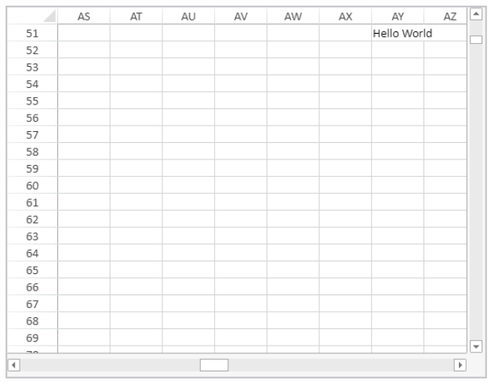

<!-- REF #_method_.VP SHOW CELL.Syntax -->

**VP SHOW CELL** ( *rangeObj* : Object { ; *vPos* : Integer; *hPos* : Integer } ) <!-- END REF -->

<!-- REF #_method_.VP SHOW CELL.Params -->

| Parámetros | Tipo    |    | Descripción                                               |                  |
| ---------- | ------- | -- | --------------------------------------------------------- | ---------------- |
| rangeObj   | Object  | -> | Objeto rango                                              |                  |
| vPos       | Integer | -> | Posición vertical de la vista de la celda o de la línea   |                  |
| hPos       | Integer | -> | Posición horizontal de la vista de la celda o de la línea | <!-- END REF --> |

#### Descripción

El comando `VP SHOW CELL` <!-- REF #_method_.VP SHOW CELL.Summary -->reposiciona vertical y horizontalmente la vista del *rangeObj*<!-- END REF -->.

En *rangeObj*, pase un rango de celdas como objeto para designar las celdas a visualizar. La vista del *rangeObj* se posicionará vertical u horizontalmente (es decir, donde aparezca *rangeObj*) en función de los parámetros *vPos* y *hPos*. El parámetro *vPos* define la posición vertical deseada para mostrar el r*rangeObj* y el parámetro *hPos* define la posición horizontal deseada para mostrar el *rangeObj*.

Los siguientes selectores están disponibles:

| Selector              | Descripción                                                                                                                                                                                                                                                                                                                                                                                                                                 | Disponible con *vPos* | Disponible con *hPos* |
| --------------------- | ------------------------------------------------------------------------------------------------------------------------------------------------------------------------------------------------------------------------------------------------------------------------------------------------------------------------------------------------------------------------------------------------------------------------------------------- | --------------------- | --------------------- |
| `vk position bottom`  | Alineación vertical a la parte inferior de la celda o de la línea.                                                                                                                                                                                                                                                                                                                                                          | X                     |                       |
| `vk position center`  | Alineación al centro. El alineamiento será a la celda, fila, o límite de columna según la posición indicada en la vista:<li>Posición de la vista vertical - celda o fila</li><li>Posición horizontal de la vista - celda o columna</li>                                                                                                                                                                     | X                     | X                     |
| `vk position left`    | Alineación horizontal a la izquierda de la celda o columna                                                                                                                                                                                                                                                                                                                                                                                  |                       | X                     |
| `vk position nearest` | Alineación al límite más cercano (arriba, abajo, izquierda, derecha, centro). La alineación será a la celda, fila o límite de columna según la posición indicada en la vista:<li>Posición de la vista vertical (arriba, centro, abajo) - celda o fila </li><li>Posición de la vista horizontal (izquierda, centro, derecha) - celda o columna</li> | X                     | X                     |
| `vk position right`   | Alineación horizontal a la derecha de la celda o de la columna                                                                                                                                                                                                                                                                                                                                                                              |                       | X                     |
| `vk position top`     | Alineación vertical a la parte superior de la celda o de la línea                                                                                                                                                                                                                                                                                                                                                                           | X                     |                       |

> Este comando sólo es eficaz si es posible reposicionar la vista. Por ejemplo, si el *rangeObj* está en la celda A1 (la primera columna y la primera línea) de la hoja actual, reposicionar la vista no supondrá ninguna diferencia porque ya se han alcanzado los límites vertical y horizontal (es decir, no es posible desplazarse más arriba o más a la izquierda). Lo mismo ocurre si *rangeObj* está en la celda C3 y la vista se reposiciona al centro o abajo a la derecha. La vista permanece inalterada.

#### Ejemplo

Quiere ver la celda en la columna AY, línea 51 en el centro del área 4D View Pro:

```4d
$displayCell:=VP Cell("myVPArea";50;50)
 // Mover la vista para mostrar la celda
VP SHOW CELL($displayCell;vk position center;vk position center)
```

Resultado:


El mismo código con los selectores vertical y horizontal cambiados para mostrar la misma celda posicionada en la parte superior derecha del área 4D View Pro:

```4d
$displayCell:=VP Cell("myVPArea";50;50)
  // Mover la vista para mostrar la celda
VP SHOW CELL($displayCell;vk position top;vk position right)
```

Resultado:



#### Ver también

[VP Cell](vp-cell.md)<br/>
[VP Get active cell](vp-get-active-cell.md)<br/>
[VP Get selection](vp-get-selection.md)<br/>
[VP RESET SELECTION](vp-reset-selection.md)<br/>
[VP SET ACTIVE CELL](vp-set-active-cell.md)<br/>
[VP SET SELECTION](vp-set-selection.md)
