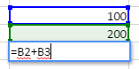
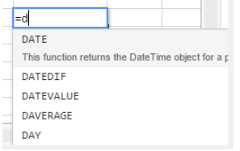
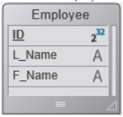

## Utilización de las fórmulas

Una fórmula de hoja de cálculo es una expresión que calcula el valor de una celda.

### Entrada de las fórmulas

Para introducir una fórmula en un área 4D View Pro:

1. Seleccione la celda en la que introducirá la fórmula o función.
2. Introduzca = (el signo igual).
3. Escriba la fórmula y presione la tecla **Intro**.

Al escribir una fórmula, puede utilizar diferentes atajos:

- haga clic en una celda para introducir su referencia en la fórmula:



- escriba la primera letra de una función a ingresar. Aparece un menú contextual en el que se listan las funciones y referencias disponibles, permitiéndole seleccionar los elementos deseados:


También puede crear fórmulas con nombre que pueden ser llamadas a través de su nombre. Para hacerlo, ingresa estas fórmulas utilizando el comando [VP ADD FORMULA NAME](commands/vp-add-formula-name.md).

### Operadores y operandos

Todas las fórmulas tienen operandos y operadores:

- **Operadores**: ver [Valores y operadores](#valores-y-operadores) abajo.
- Los **Operandos** incluyen varias categorías:
  - [valores](#valores-y-operadores) (se soportan 5 tipos de datos)
  - [referencias a otras celdas](#cell-references) (relativas, absolutas, mixtas o por nombre)
  - [funciones estándar de hoja de cálculo](#usando-funciones)
  - [Funciones 4D](#4d-functions) basadas en fórmulas 4D y que ofrecen acceso a variables, campos, métodos, comandos o expresiones 4D.

## Valores y operadores

4D View Pro soporta cinco tipos de datos. Para cada tipo de datos, se soportan valores literales y de operadores específicos.

| Tipos de datos                    | Valores                                                                                             | Operadores                                                                                                                                                                                                                                                                                                                                 |
| --------------------------------- | --------------------------------------------------------------------------------------------------- | ------------------------------------------------------------------------------------------------------------------------------------------------------------------------------------------------------------------------------------------------------------------------------------------------------------------------------------------ |
| [Number](Concepts/dt_number.md)   | 1.2<br/>1.2 E3<br/>1.2E-3<br/>10.3x | - (suma)<br/>- (resta)<br/>\* (multiplicación)<br/>/ (división)<br/>^ (exponente, el número de veces que hay que multiplicar un número por sí mismo)<br/>% (porcentaje -- dividir el número antes del operador por cien) |
| [Fecha](Concepts/dt_date.md)      | 10/24/2017                                                                                          | * (fecha + número de días -> fecha)<br/>+ (fecha + hora -> fecha + hora del día)<br/>- (fecha - número de días -> fecha)<br/>- (fecha - fecha -> número de días entre ambas)                                                                                   |
| [Hora](Concepts/dt_time.md)       | 10:12:10                                                            | Operadores de duración:<br/>+ (suma)<br/>- (resta)<br/>\* (duración \* número -> duración)<br/>/ (duración / número -> duración)                                                                                                               |
| [String](Concepts/dt_string.md)   | 'Sophie' o "Sophie"                                                                                 | & (concatenación)                                                                                                                                                                                                                                                                                   |
| [Boolean](Concepts/dt_boolean.md) | TRUE o FALSE                                                                                        | -                                                                                                                                                                                                                                                                                                                                          |

### Operadores de comparación

Los siguientes operadores pueden utilizarse con dos operandos del mismo tipo:

| Operador | Comparación       |
| -------- | ----------------- |
| =        | igual a           |
| `<>`     | es diferente de   |
| >        | mayor que         |
| <        | menor que         |
| > =      | mayor o igual que |
| <=       | menor o igual que |

### Presedencia de los operadores

Lista de los operadores de la mas a menos importante:

| Operador                    | Descripción                                  |
| --------------------------- | -------------------------------------------- |
| ()       | Paréntesis (para agrupar) |
| -                           | Negativo                                     |
| *                           | Más                                          |
| %                           | Porcentaje                                   |
| ^                           | Exponente                                    |
| - y /                       | Multiplicar y dividar                        |
| * y -                       | Añadir y restar                              |
| &       | Concatenar                                   |
| `=`  `>` `<` `>=` `<=` `<>` | Comparar                                     |

## Referencias de celdas

Las fórmulas a menudo se refieren a otras celdas por medio de direcciones de celdas. Puede copiar estas fórmulas a otras celdas. Por ejemplo, la siguiente fórmula, introducida en la celda C8, suma los valores de las dos celdas superiores y muestra el resultado.

```
= C6 + C7
```

Esta fórmula se refiere a las celdas C6 y C7. Es decir, 4D View Pro tiene instrucciones de referirse a estas otras celdas para los valores a utilizar en la fórmula.

Cuando copie o mueva estas fórmulas a nuevas ubicaciones, cada dirección de celda en esa fórmula cambiará o permanecerá igual, dependiendo de cómo se escriba.

- Una referencia que cambia se denomina **referencia relativa**, y se refiere a una celda según lo lejos que esté a la izquierda/derecha y arriba/abajo de la celda con la fórmula.
- Una referencia que siempre apunta a una celda particular se denomina **referencia absoluta**.
- También puede crear una referencia mixta que apunte siempre a una línea o columna fija.

### Notación de las referencias

Si sólo utiliza coordenadas de celda, por ejemplo, `C5`, 4D View Pro interpreta la referencia como relativa. Puede hacer que la referencia sea absoluta poniendo un signo de dólar delante de la letra y el número, como en `$C$5`.

Puede combinar las referencias absolutas y relativas insertando un signo de dólar delante de la letra o el número solo, por ejemplo, `$C5` o `C$5`. Una referencia mixta permite especificar la fila o la columna como absolutas, permitiendo al mismo tiempo que la otra parte de la dirección se refiera a ella de forma relativa.

Una forma cómoda, rápida y precisa de especificar una referencia absoluta es nombrar la celda y utilizar ese nombre en lugar de la dirección de la celda. Una referencia a una celda nombrada es siempre absoluta. Puede crear o modificar celdas con nombre o rangos de celdas con nombre utilizando el comando [`VP ADD RANGE NAME`](commands/vp-add-range-name.md).

La siguiente tabla muestra el efecto de las diferentes notaciones:

| Ejemplo            | Tipo de referencia | Descripción                                                                                                                                                                          |
| ------------------ | ------------------ | ------------------------------------------------------------------------------------------------------------------------------------------------------------------------------------ |
| C5                 | Relativo           | La referencia es a la ubicación relativa de la celda C5, dependiendo de la ubicación de la celda en la que se utiliza la referencia por primera vez                                  |
| $C$5               | Absoluto           | La referencia es absoluta. Siempre se referirá a la celda C5 sin importar dónde se utilice.                                                          |
| $C5                | Mixed              | La referencia es siempre a la columna C, pero la referencia de línea es relativa a la ubicación de la celda en la que se utiliza la referencia por primera vez.      |
| C$5                | Mixed              | La referencia es siempre la línea 5, pero la referencia de la columna es relativa a la ubicación de la celda en la que se utiliza la referencia por primera vez                      |
| Nombre de la celda | Absoluto           | La referencia es absoluta. Siempre se referirá a la [celda o rango nombrado](commands/vp-add-range-name.md) sin importar donde se use la referencia. |

## Funciones integradas

Las funciones de hoja de cálculo son fórmulas predefinidas utilizadas para calcular los valores de las celdas. Al teclear la primera letra de la función a introducir, aparece un menú emergente con las funciones y referencias disponibles, que permite seleccionar los elementos deseados:



Ver [**Lista extendida de funciones SpreadJS**](https://developer.mescius.com/spreadjs/docs/formulareference/FormulaFunctions) para más detalles y ejemplos.

## Funciones 4D

4D View Pro le permite definir y llamar **funciones personalizadas 4D**, que ejecutan [fórmulas 4D](API/FunctionClass.md). El uso de las funciones personalizadas 4D extiende las posibilidades de sus documentos 4D View Pro y permite interacciones avanzadas con la base de datos 4D.

Las funciones personalizadas 4D permiten acceder, desde sus fórmulas 4D View Pro, a:

- variables proceso 4D,
- campos,
- métodos proyecto,
- comandos del lenguaje 4D,
- o cualquier expresión válida de 4D.

Las funciones personalizadas de 4D pueden recibir [parámetros](#parámetros) del área 4D View Pro y devolver valores.

Todas las funciones se declaran con el comando [`VP SET CUSTOM FUNCTIONS`](commands/vp-set-custom-functions). Ejemplos:

```4d
$o:=New object

//Name of the function in 4D View Pro: "DRIVERS_LICENCE"
$o.DRIVERS_LICENCE:=New object

//process variable
$o.DRIVERS_LICENCE.formula:=Formula(DriverLicence)

//table field
$o.DRIVERS_LICENCE.formula:=Formula([Users]DriverLicence)

//project method
$o.DRIVERS_LICENCE.formula:=Formula(DriverLicenceState)

//4D command
$o.DRIVERS_LICENCE:=Formula(Choose(DriverLicence; "Obtained"; "Failed"))

//4D expression and parameter
$o.DRIVERS_LICENCE.formula:=Formula(ds.Users.get($1).DriverLicence)
$o.DRIVERS_LICENCE.parameters:=New collection
$o.DRIVERS_LICENCE.parameters.push(New object("name"; "ID"; "type"; Is longint))
```

> **Ver también** [4D View Pro: Utilice fórmulas 4D en su hoja de cálculo (entrada de blog)](https://blog.4d.com/4d-view-pro-use-4d-formulas-in-your-spreadsheet/)

### Ejemplo con Hello World

Queremos imprimir "Hola Mundo" en una celda del área 4D View Pro utilizando un método proyecto 4D:

1. Cree un método proyecto "myMethod" con el siguiente código:

```4d
 #DECLARE->$hw :Text
 $hw:="Hello World"

```

2. Ejecute el siguiente código antes de abrir cualquier formulario que contenga un área 4D View Pro:

```4d
  Case of
    :(Form event code=On Load)
       var $o : Object
       $o:=New object
  // Definir la función "vpHello" a partir del método "myMethod"
       $o.vpHello:=New object
       $o.vpHello.formula:=Formula(myMethod)
       VP SET CUSTOM FUNCTIONS("ViewProArea";$o)
 End case
```

3. Edite el contenido de una celda en un área 4D View Pro y escriba:

   

   "myMethod" es entonces llamado por 4D y la la celda se muestra:

   

### Parámetros

Los parámetros se pueden pasar a las funciones 4D que llaman a los métodos proyecto utilizando la siguiente sintaxis:

```
=METHODNAME(param1,param2,...,paramN)
```

Estos parámetros se reciben en *methodName* en $1, $2...$N.

Tenga en cuenta que los ( ) son obligatorios, incluso si no se pasan parámetros:

```
=METHODWITHOUTNAME()
```

Puede declarar el nombre, tipo y número de parámetros a través de la colección *parameters* de la función que declaró utilizando el comando [VP SET CUSTOM FUNCTIONS](commands/vp-set-custom-functions.md). Opcionalmente, puede controlar el número de parámetros pasados por el usuario a través de las propiedades *minParams* y *maxParams*.

Para más información sobre los tipos de parámetros entrantes soportados, por favor consulte la descripción del comando [VP SET CUSTOM FUNCTIONS](commands/vp-set-custom-functions).

Si no se declaran parámetros, los valores se pueden pasar secuencialmente a los métodos (se recibirán en $1, $2...) y su tipo se convertirá automáticamente.

Los parámetros Fecha y Objeto se tratan de la siguiente manera:

- Las fechas en *jstype* se pasarán como [objeto](Concepts/dt_object.md) en código 4D con dos propiedades:

| Propiedad | Tipo  | Descripción      |
| --------- | ----- | ---------------- |
| value     | Fecha | Valor fecha      |
| time      | Real  | Hora en segundos |

- Los objetos se pasarán como [object](Concepts/dt_object.md) con una propiedad `.value` que contiene el parámetro:

| Propiedad | Tipo   | Descripción      |
| --------- | ------ | ---------------- |
| value     | Object | Parámetro Objeto |

### Valores devueltos

Los métodos proyecto 4D también pueden devolver valores en la fórmula de la celda 4D View Pro a través de $0. Los siguientes tipos de datos son soportados para los parámetros devueltos:

- [texto](Concepts/dt_string.md) (convertido a cadena en 4D View Pro)
- [real](Concepts/dt_number.md)/[entero largo](Concepts/dt_number.md) (convertido a número en 4D View Pro)
- [fecha](Concepts/dt_date.md) (convertido a tipo JS Date en 4D View Pro - hora, minuto, seg = 0)
- [hora](Concepts/dt_time.md) (convertido a tipo JS Date en 4D View Pro - fecha en fecha base, es decir, 30/12/1899)
- [booleano](Concepts/dt_boolean.md) (convertido a booleano en 4D View Pro)
- [imagen](Concepts/dt_picture.md) (jpg,png,gif,bmp,svg otros tipos convertidos a png) crea un URI (data:image/png;base64,xxxx) y luego se usa como fondo en 4D View Pro en la celda donde se ejecuta la fórmula
- [objeto](Concepts/dt_object.md) con las dos propiedades siguientes (que permiten pasar una fecha y una hora):

  | Propiedad | Tipo  | Descripción      |
  | --------- | ----- | ---------------- |
  | value     | Fecha | Valor fecha      |
  | time      | Real  | Hora en segundos |

Si el método 4D no devuelve nada, se devuelve automáticamente una cadena vacía.

Se devuelve un error en la celda 4D View Pro si:

- el método 4D devuelve otro tipo distinto de los mencionados anteriormente,
- se ha producido un error durante la ejecución del método 4D (cuando el usuario presiona el botón "abortar").

#### Ejemplo

```4d
var $o : Object

$o.BIRTH_INFORMATION:=New object
$o.BIRTH_INFORMATION.formula:=Formula(BirthInformation)
$o.BIRTH_INFORMATION.parameters:=New collection
$o.BIRTH_INFORMATION.parameters.push(New object("name";"First name";"type";Is text))
$o.BIRTH_INFORMATION.parameters.push(New object("name";"Birthday";"type";Is date))
$o.BIRTH_INFORMATION.parameters.push(New object("name";"Time of birth";"type";Is time))
$o.BIRTH_INFORMATION.summary:="Returns a formatted string from given information"

VP SET CUSTOM FUNCTIONS("ViewProArea"; $o)
```


## Compatibilidad

Existen soluciones alternativas para declarar campos o métodos como funciones en sus áreas 4D View Pro. Estas soluciones se mantienen por razones de compatibilidad y pueden utilizarse en casos concretos. Sin embargo, se recomienda utilizar el comando [`VP SET CUSTOM FUNCTIONS`](commands/vp-set-custom-functions.md).

### Referenciación de campos mediante la estructura virtual

4D View Pro permite referenciar campos 4D utilizando la estructura virtual de la base de datos, es decir, declarada a través de los comandos [`SET TABLE TITLES`](https://doc.4d.com/4dv19/help/command/en/page601.html) y/o [`SET FIELD TITLES`](https://doc.4d.com/4dv19/help/command/en/page602.html) con el parámetro \*. Esta solución alternativa podría ser útil si su aplicación ya depende de una estructura virtual (de lo contrario, se recomienda [utilizar `VP SET CUSTOM FUNCTIONS`](#4d-functions)).

> **ATENCIÓN:** no puede utilizar la estructura virtual y `VP SET CUSTOM FUNCTIONS` simultáneamente. En cuanto se llama a `VP SET CUSTOM FUNCTIONS`, las funciones basadas en los comandos `SET TABLE TITLES` y `SET FIELD TITLES` son ignoradas en el área 4D View Pro.

#### Requisitos

- El campo debe pertenecer a la estructura virtual de la base de datos, es decir, debe declararse a través de los comandos [`SET TABLE TITLES`](https://doc.4d.com/4dv19/help/command/en/page601.html) y/o [`SET FIELD TITLES`](https://doc.4d.com/4dv19/help/command/en/page602.html) con el parámetro \* (ver el ejemplo),
- Los nombres de las tablas y los campos deben cumplir la norma ECMA (ver [ECMA Script standard](https://www.ecma-international.org/ecma-262/5.1/#sec-7.6)),
- El tipo de campo debe ser soportado por 4D View Pro (ver arriba).

Se devuelve un error en la celda 4D View Pro si la fórmula llama a un campo que no es compatible.

#### Llamar a un campo virtual en una fórmula

Para insertar una referencia a un campo virtual en una fórmula, introduzca el campo con la siguiente sintaxis:

```
TABLENAME_FIELDNAME()
```

Por ejemplo, si declaró el campo "Name" de la tabla "People" en la estructura virtual, puede llamar las siguientes funciones:

```
=PEOPLE_NAME()
=LEN(PEOPLE_NAME())
```

> Si un campo tiene el mismo nombre que un [método 4D](../Concepts/methods.md), tiene prioridad sobre el método.

#### Ejemplo

Queremos imprimir el nombre de una persona en una celda del área 4D View Pro utilizando un campo virtual 4D:

1. Crear una tabla "Employee" con un campo "L_Name":



2. Ejecuta el siguiente código para inicializar una estructura virtual:

   ```4d
   ARRAY TEXT($tableTitles;1)
   ARRAY LONGINT($tableNum;1)
   $tableTitles{1}:="Emp"
   $tableNum{1}:=2
   SET TABLE TITLES($tableTitles;$tableNum;*)
    
   ARRAY TEXT($fieldTitles;1)
   ARRAY LONGINT($fieldNum;1)
   $fieldTitles{1}:="Name"
   $fieldNum{1}:=2 //apellido
   SET FIELD TITLES([Employee];$fieldTitles;$fieldNum;*)
   ```

3. Edite el contenido de una celda en el área 4D View Pro e introduzca "=e":


4. Seleccione EMP_NAME (utilice la tecla Tab) e introduzca el cierre).


5. Valide el campo para mostrar el nombre del empleado actual:


> La tabla \[Employee] debe tener un registro actual.

### Declarar los métodos autorizados

Puede llamar directamente a los métodos del proyecto 4D desde sus fórmulas 4D View Pro. Por razones de seguridad, debe declarar explícitamente los métodos que pueden ser llamados por el usuario con el método [VP SET ALLOWED METHODS](commands/vp-set-allowed-methods.md).

#### Requisitos

Para ser llamado en una fórmula 4D View Pro, un método proyecto debe ser:

- **Permitido**: se declaró explícitamente mediante el comando [VP SET ALLOWED METHODS](commands/vp-set-allowed-methods.md).
- **Ejecutable**: pertenece al proyecto local o a un componente cargado con la opción "Compartido por los componentes y el proyecto local" activada (ver [Compartir los métodos proyecto](../Concepts/components.md#sharing-of-project-methods)).
- **No está en conflicto** con una función de hoja de cálculo 4D View Pro existente: si llama a un método proyecto con el mismo nombre que una función integrada 4D View Pro, se llama a la función.

> Si ni el método [VP SET CUSTOM FUNCTIONS](comandos/vp-set-custom-functions.md) ni el comando [VP SET ALLOWED METHODS](comandos/vp-set-allowed-methods.md) han sido ejecutados durante la sesión, las funciones personalizadas de 4D View Pro se basan en los métodos permitidos definidos por el comando genérico de 4D `SET ALLOWED METHODS`. En este caso, los nombres de los métodos proyecto deben cumplir la gramática de identificadores de JavaScript (ver [ECMA Script standard](https://www.ecma-international.org/ecma-262/5.1/#sec-7.6)). La opción de filtrado global de la caja de diálogo Parámetros (ver *Acceso a los datos*) se ignora en todos los casos.
