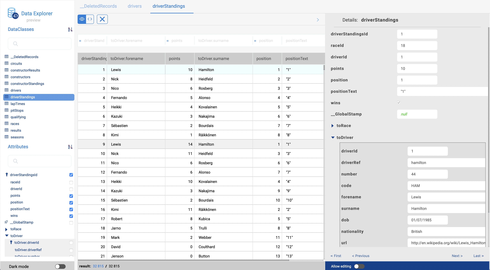
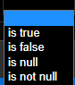
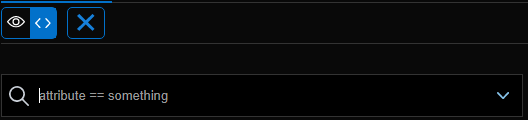

El Explorador de datos ofrece una interfaz web para ver, consultar y editar los datos del almacén de datos de su proyecto. Utilizando esta herramienta, puede navegar fácilmente entre todas sus entidades y buscar, ordenar o filtrar los valores de los atributos. Le ayuda a identificar rápidamente los problemas en cualquier paso del proceso de desarrollo, así como a controlar y editar los datos.


## Configuración

El Explorador de datos se basa en el componente servidor web [`WebAdmin`](webAdmin.md) para la configuración y los parámetros de autenticación.

- **configuración**: la configuración del Explorador de datos reutiliza los parámetros del servidor web [`WebAdmin`](webAdmin.md#webadmin-settings),
- **autenticación**: el acceso al Explorador de datos se concede cuando el [usuario de la sesión está autenticado](webAdmin.md#autenticación-y-sesión) y tiene el privilegio "WebAdmin". Cuando se accede al Explorador de datos a través del elemento de menú **Explorador de datos** (ver más adelante), se proporciona una autenticación automática.

> El acceso al Explorador de Datos puede desactivarse mediante la función [`.setAdminProtection()`](API/DataStoreClass.md#setadminprotection).

## Apertura del Explorador de datos

[El servidor web `WebAdmin`](webAdmin.md#starting-the-webadmin-web-server) se inicia automáticamente si es necesario al hacer clic en el Explorador de datos.

Para conectarse a la página web del Explorador de datos:

- De una aplicación 4D (con interfaz):
  - Para abrir una nueva ventana 4D con la página Explorador de datos mostrada en un área web, seleccione **Explorador de datos** en el menú **Registros** o haga clic en el botón **Datos** en la barra de herramientas principal.
  - Para abrir el Explorador de datos en una pestaña externa del navegador, seleccione **Explorador de datos en el navegador** en el menú **Registros** o presione la tecla **Alt** (Windows)/**Opción** (macOS) y haga clic en el botón **Datos** en la barra de herramientas principal.

- Desde 4D Server, seleccione **Explorador de datos en el navegador** en el menú **Ventana** (el Explorador de Datos sólo puede abrirse en un navegador externo).

- Tanto si utiliza una aplicación 4D sin interfaz como si no, puede abrir su navegador web e introducir la siguiente dirección:

`IPaddress:HTTPPort/dataexplorer`
o
`IPaddress:HTTPSPort/dataexplorer`

En este contexto, se le pedirá que introduzca la [llave de acceso](webAdmin.md#access-key) para abrir una sesión de `WebAdmin` en el servidor:


> Los valores de [HTTPPort](webAdmin.md#http-port) y [HTTPSPort](webAdmin.md#https-port) se configuran en la configuración de `WebAdmin`.

## Requisitos

El Explorador de datos es compatible con los siguientes navegadores web:

- Chrome
- Safari
- Edge
- FireFox

La resolución mínima para utilizar el Explorador de Datos es de 1280x720. La resolución recomendada es de 1920x1080.

## Navegando datos

Además de una vista completa y personalizable de sus datos, el Explorador de datos le permite consultar y ordenar sus datos.

### Básicos

El Explorador de Datos ofrece un acceso general al modelo de datos ORDA con respecto a las [reglas de mapeo de ORDA](ORDA/dsMapping.md#general-rules).

:::info

Cuando el modelo ORDA o los datos se modifican del lado de la base de datos (se añade una tabla, se edita o se elimina un registro, etc.), basta con actualizar la página del Explorador de datos en el navegador (utilizando la tecla F5, por ejemplo).

:::

Puede pasar al tema de visualización **modo oscuro** utilizando el selector en la parte inferior de la página:


La página contiene varias áreas:

- En el lado izquierdo se encuentran el área de las **Clases de datos** y el área de los **atributos**, lo que permite seleccionar las clases de datos y los atributos a mostrar. Los atributos se ordenan según el orden de creación de la estructura subyacente. Las llaves primarias y los atributos indexados tienen un icono específico. Puede filtrar la lista de nombres de clases de datos y de atributos propuestos utilizando las áreas de búsqueda respectivas.
  

- La parte central contiene el **área de búsqueda** y la **rejilla de datos** (lista de entidades de la clase de datos seleccionada). Cada columna de la cuadrícula representa un atributo del almacén de datos.
  - Por defecto, se muestran todas las entidades. Puede filtrar las entidades mostradas utilizando el área de búsqueda. Hay dos modos de consulta disponibles: [Consulta sobre atributos](#query-on-attributes) (seleccionada por defecto), y la [Consulta avanzada con expresión](#advanced-query-with-expression). Usted selecciona el modo de consulta haciendo clic en el botón correspondiente (el botón **X** le permite restablecer el área de consulta y así dejar de filtrar):
    
  - El nombre de la clase de datos seleccionada se añade como una pestaña encima de la cuadrícula de datos. Utilizando estas pestañas, puede cambiar entre las clases de datos que ya han sido seleccionadas. Puede eliminar una clase de datos referenciada haciendo clic en el icono "eliminar" situado a la derecha del nombre de la clase de datos.
  - Puede reducir el número de columnas desmarcando los atributos en la parte izquierda. También puede cambiar las columnas de la cuadrícula de datos utilizando arrastrar y soltar. Puede hacer clic en el encabezado de una columna para [ordenar entidades](#ordering-entities) de acuerdo a sus valores (cuando sea posible).
  - Si una operación requiere mucho tiempo, se muestra una barra de progreso. Puedes detener la operación en curso en cualquier momento haciendo clic en el botón rojo:<br/>
    

- En el lado derecho está el **área de Detalles**: muestra los valores de los atributos de la entidad seleccionada actualmente, así como **datos relacionados**, si los hay. Puede navegar entre las entidades de la clase de datos haciendo clic en los enlaces **First** / **Previous** / **Next** / **Last** en la parte inferior del área.
  - Se muestran todos los tipos de atributos, incluyendo imágenes, objetos (expresados en json), así como atributos [calculados](../ORDA/ordaClasses.md#computed-attributes-1) y atributos [alias](../ORDA/ordaClasses.md#alias-attributes-1).
  - Los datos relacionados (relaciones uno a uno y uno a muchos) pueden mostrarse a través de áreas expandibles/colapsables:<br/>
    
  - **Ctrl+Clic** (Windows) o **Comando+Clic** (macOS) en un nombre de atributo relacionado en el área de la derecha muestra los valores del atributo en un área flotante independiente:<br/>
    

### Ordenar las entidades

Puede reordenar la lista de entidades mostrada según los valores de los atributos. Todos los tipos de atributos pueden utilizarse para una ordenación, excepto la imagen y el objeto.

- Haga clic en el encabezado de una columna para ordenar entidades de acuerdo a los valores de atributo correspondientes. Por defecto, la ordenación es ascendente. Haga clic dos veces para una ordenación descendente. Una columna utilizada para ordenar las entidades se muestra con un pequeño icono y su nombre está en *itálica*.


- Puede ordenar los atributos en varios niveles. Por ejemplo, puede ordenar a los empleados por ciudad y luego por salario. Para ello, manténga presionada la tecla **Shift** y haga clic sucesivamente en el encabezado de cada columna a incluir en el orden de clasificación.

### Consultas basadas en atributos

En este modo, puede filtrar las entidades introduciendo los valores que desea encontrar (o excluir) en las áreas situadas arriba de la lista de atributos. Puede filtrar por uno o varios atributos. La lista de entidades se actualiza automáticamente cuando se digita.


Si introduce varios atributos, se aplica automáticamente un AND. Por ejemplo, el siguiente filtro muestra las entidades con el atributo *firstname* que empieza por "flo" AND el valor del atributo *salary* > 50000:


El botón **X** le permite eliminar los atributos ingresados y así detener el filtrado.

Existen diferentes operadores y opciones de consulta, según el tipo de datos del atributo.

> No se puede filtrar por atributos de imagen o de objeto.

#### Operadores numéricos

Con los atributos numéricos, de fecha y de hora, el operador "=" está seleccionado por defecto. Sin embargo, puede seleccionar otro operador de la lista de operadores (haga clic en el icono "=" para mostrar la lista):


#### Fechas

Con los atributos de fecha, puede introducir la fecha a utilizar a través de un widget de selección de fecha (haga clic en el área de la fecha para mostrar el calendario):


#### Booleanos

Cuando hace clic en un área de atributo booleano, puede filtrar por valores **true**/**false** pero también por valores **null**/**not null**:



- **null** indica que el valor del atributo no fue definido
- **not null** indica que el valor del atributo está definido (por tanto, true o false).

#### Text

Los filtros texto no son diacríticos (a = A).

El filtro es del tipo "empieza por". Por ejemplo, al introducir "Jim" se mostrarán los valores "Jim" y "Jimmy".

También puede utilizar el carácter comodín (@) para sustituir uno o varios caracteres iniciales. Por ejemplo:

| Un filtro con       | Resultados                                                |
| ------------------- | --------------------------------------------------------- |
| Bel                 | Todos los valores que empiezan por "Bel"                  |
| @do    | Todos los valores que contienen "do"                      |
| Bel@do | Todos los valores que empiezan por "Bel" y contienen "do" |

Si desea crear consultas más específicas, como "es exactamente", es posible que tenga que utilizar la función de consultas avanzadas.

### Consultas avanzadas con expresión

Cuando se selecciona esta opción, aparece un área de consulta sobre la lista de entidades, que permite introducir cualquier expresión para filtrar el contenido:



Puede introducir consultas avanzadas que no están disponibles como consultas de atributos. Por ejemplo, si quiere encontrar entidades con el atributo *firstname* que contenga "Jim" pero no "Jimmy", puede escribir:

```
firstname=="Jim"
```

Puede utilizar toda expresión de consulta ORDA como [se documenta con la función `query()`](API/DataClassClass.md#query), con las siguientes limitaciones o diferencias:

- Por seguridad, no se pueden ejecutar fórmulas utilizando `eval()`.
- No se pueden utilizar marcadores de posición; hay que escribir un *queryString* con valores.
- Los valores de las cadenas que contienen caracteres de espacio deben ir entre comillas dobles ("").

Por ejemplo, con la clase de datos Employee, puede escribir:

```
firstname = "Marie Sophie" AND manager.lastname = "@th"
```

Puede hacer clic en el icono `v` para mostrar tanto [`queryPlan`](API/DataClass.md#queryplan) como [`queryPath`](API/DataClass.md#querypath). En el área, puede pasar sobre los bloques de subconsultas para tener información detallada por subconsulta:


Haga clic derecho en el área de consulta para mostrar las anteriores consultas válidas:


## Edición de Datos

El Explorador de datos permite modificar los valores de los atributos y añadir o eliminar entidades. Esta función está destinada a los administradores, por ejemplo para probar implementaciones o solucionar problemas con datos inválidos.

### Permitir edición

Por motivos de seguridad, para poder editar datos a través del Explorador de datos, primero debe habilitar el modo de edición mediante el selector **Allow editing**. Cuando está activado, los botones de acción de edición se muestran a la derecha:


Este selector está habilitado **por clase de datos** y **por sesión del navegador**.

:::info

El selector está pensado para evitar modificaciones accidentales, ya que no se muestran diálogos de confirmación cuando se editan datos a través del Explorador de datos.

:::

### Ingresar valores

Cuando el selector **Allow editing** está habilitado para una base de datos, puede ingresar valores para una entidad nueva o seleccionada a través de widgets de entrada dedicados en el área de **Detalles** para la base de datos seleccionada.

Se pueden editar los siguientes valores de atributos escalares:

- text
- boolean
- numeric
- date
- time
- imagen (puede cargar o arrastrar y soltar una imagen)
- objeto (cadena JSON)

Los atributos de los blobs no pueden modificarse.

Los valores nuevos o modificados se almacenan en la caché local, es necesario [guardarlos explícitamente](#saving-modifications) para almacenarlos en los datos.

### Creación de entidades

Puede crear una nueva entidad vacía en la tabla seleccionada haciendo clic en el botón de creación . A continuación, puede [introducir valores](#entering-values) para esta entidad.

La nueva entidad se mantiene en la caché local, es necesario [guardarla explícitamente](#saving-modifications) para almacenarla en los datos.

:::info

Los valores de los atributos que necesitan ser calculados por 4D (IDs, atributos calculados) serán devueltos sólo después de haber guardado la entidad.

:::

### Valores de recarga

¡El botón **recargar** recarga los valores de atributo de entidad desde el archivo de datos. Este botón es útil, por ejemplo, cuando desea asegurarse de que los valores mostrados son los valores guardados más recientes.

### Guardar modificaciones

Excepto en el caso de [eliminación](#deleting-entities) (ver más adelante), las modificaciones de las entidades se realizan localmente y deben guardarse para que queden almacenadas en el archivo de datos.

Para guardar las modificaciones o guardar una entidad que haya creado en el Explorador de datos, haga clic en el botón **Guardar** .

:::info

Las modificaciones en una entidad existente se guardan automáticamente cuando se selecciona otra entidad de la misma clase de datos.

:::

En caso de conflicto (por ejemplo, si otro usuario ha modificado el mismo valor de atributo en la misma entidad), aparecerá un mensaje de error en la parte inferior del Explorador de datos. Puede hacer clic en el [**botón Recargar**](#reloading-values) para obtener el nuevo valor de los datos y, a continuación, aplicar y guardar sus modificaciones.

### Eliminación de entidades

Puede eliminar entidades haciendo clic en el botón **eliminar** .

Para eliminar un conjunto de entidades, selecciona dos o más entidades en el área de la lista usando **Mayús+clic** (selección continua) o **Ctrl/Comando+clic** (selección discontinua) y haz clic en el botón **eliminar**.

:::note

Si algunas entidades no se han podido eliminar debido a un conflicto (por ejemplo, entidades bloqueadas en el servidor), aparecen resaltadas en la lista.

:::

:::caution

Al eliminar entidades no aparece ningún cuadro de diálogo de confirmación. Las entidades seleccionadas se eliminan inmediatamente de los datos.

:::
