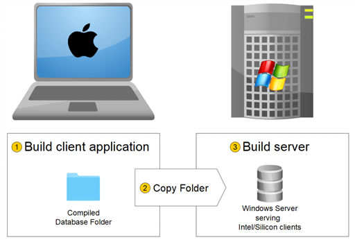
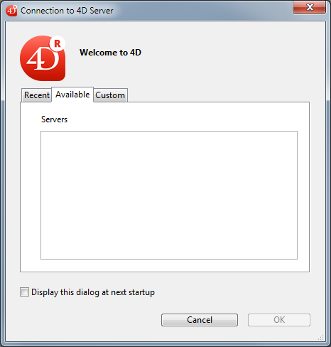

4D incluye un generador de aplicaciones para crear un paquete de proyecto (versión final). Este generador simplifica el proceso de finalización y despliegue de las aplicaciones compiladas en 4D. Maneja automáticamente las funcionalidades específicas de los distintos sistemas operativos y facilita el despliegue de aplicaciones cliente-servidor.

El generador de aplicaciones le permite:

- Crear una estructura o componente compilado, sin código interpretado,
- Generar una aplicación autónoma ejecutable, *es decir*, fusionada con 4D Volume Desktop, el motor de base de datos 4D,
- Generar diferentes aplicaciones a partir de la misma estructura compilada mediante un proyecto XML,
- Generar aplicaciones cliente-servidor homogéneas,
- Generar aplicaciones cliente-servidor con actualización automática de los componentes del cliente y del servidor.
- Guardar sus parámetros de generación para su uso futuro (botón *Guardar los parámetros*).

> Las aplicaciones compiladas se basan en archivos [.4dz](#build-compiled-structure) que son **de sólo lectura**. Tenga en cuenta que el uso de comandos o funciones que modifican los archivos fuente (como `CREATE INDEX` o `CREATE TABLE` (SQL)) no es posible por defecto en las aplicaciones compiladas. Sin embargo, puede crear aplicaciones específicas que soporten modificaciones locales utilizando la llave XML `PackProject` (ver [doc.4d.com](https://doc.4d.com)).

## Generalidades

Generar un paquete de proyecto puede realizarse utilizando:

- either the [`BUILD APPLICATION`](../commands-legacy/build-application.md) command,
- o con el [diálogo Generar aplicación](#dialogo-generar-aplicacion).

:::tip

También puede descargar y utilizar [`Build4D`](https://github.com/4d-depot/Build4D), un componente que ofrece clases para compilar, crear y firmar proyectos 4D, incluso desde una aplicación sin interfaz.

:::

### Diálogo crear aplicación

Para mostrar la caja de diálogo Generar la aplicación, seleccione **Diseño** > **Generar aplicación...** en la barra de menús.


La caja de diálogo del generador de aplicaciones incluye varias páginas a las que se puede acceder mediante pestañas:


La generación sólo puede efectuarse una vez compilado el proyecto. Si selecciona este comando sin haber compilado previamente el proyecto, o si el código compilado no se corresponde con el código interpretado, aparece una caja de diálogo de advertencia que indica que el proyecto debe ser (re)compilado.

### buildApp.4DSettings

Cada parámetro de generación de la aplicación se almacena como una llave XML en el archivo de proyecto de la aplicación llamado `buildApp.4DSettings`, ubicado en la carpeta [`Settings` del proyecto](../Project/architecture.md#settings-1).

Los parámetros por defecto se utilizan la primera vez que se utiliza la caja de diálogo del Generador de aplicaciones. El contenido del archivo proyecto se actualiza, si es necesario, al hacer clic en **Construir** o **Guardar los parámetros**. You can define several other XML settings file for the same project and employ them using the [`BUILD APPLICATION`](../commands-legacy/build-application.md) command.

Las llaves XML ofrecen opciones adicionales a las que se muestran en la caja de diálogo del Generador de aplicaciones. The description of these keys are detailed in the [4D XML Keys BuildApplication](https://doc.4d.com/4Dv20/4D/20/4D-XML-Keys-BuildApplication.100-6335734.en.html) manual.

### Archivo de historial

Cuando se crea una aplicación, 4D genera un archivo de registro llamado *BuildApp.log.xml* en la carpeta **Logs** del proyecto. El archivo de historial almacena la siguiente información para cada generación:

- El inicio y el fin de la generación de objetivos,
- El nombre y la ruta de acceso completa de los archivos generados,
- La fecha y la hora de la generación,
- Todos los errores que se han producido,
- Todo problema de firma (por ejemplo, un plug-in no firmado).

Checking this file may help you saving time during the subsequent deployment steps, for example if you intend to [notarize](#about-notarization) your application on macOS.

> Use the `Get 4D file(Build application log file)` statement to get the log file location.

## Nombre de la aplicación y carpeta de destino


Introduzca el nombre de la aplicación en **Nombre de la aplicación**.

Especifique la carpeta para la aplicación generada en la **Carpeta de destino**. Si la carpeta especificada no existe todavía, 4D creará una carpeta *Build*.

## Página de estructura compilada

Esta pestaña le permite generar un archivo de estructura compilado estándar y/o un componente compilado:


### Generar una estructura compilada

Genera una aplicación que sólo contiene código compilado.

Esta funcionalidad crea un archivo *.4dz* en una carpeta `Compiled Database/<project name>`. Por ejemplo, si ha llamado a su aplicación "MyProject", 4D creará:

`<destination>/Compiled Database/MyProject/MyProject.4dz`

Un archivo .4dz es esencialmente una versión comprimida (empaquetada) de la carpeta del proyecto. .4dz files can be used by 4D Server, 4D Volume Desktop (merged applications), and 4D. El tamaño compacto y optimizado de los archivos .4dz hace que los paquetes de proyectos sean fáciles de desplegar.

> Al generar archivos .4dz, 4D utiliza por defecto un formato zip **estándar**. La ventaja de este formato es que es fácilmente legible por cualquier herramienta unzip. If you do not want to use this standard format, add the `UseStandardZipFormat` XML key with value `False` in your [`buildApp.4DSettings`](#build-application-settings) file (for more information, see the [4D XML Keys BuildApplication](https://doc.4d.com/4Dv20/4D/20/4D-XML-Keys-BuildApplication.100-6335734.en.html) manual).

#### Incluir las carpetas asociadas

Cuando se marca esta opción, todas las carpetas relacionadas con el proyecto se copian en la carpeta Build como carpetas *Components* y *Resources*. Para más información sobre estas carpetas, consulte la [descripción de la arquitectura del proyecto](Project/architecture.md).

### Generar un componente

Genera un componente compilado a partir de la estructura.

Un [componente](../Extensions/develop-components.md) es un proyecto estándar 4D en el que se han desarrollado funcionalidades específicas. Una vez configurado e [instalado en otro proyecto 4D](../Project/components.md#basics) (el proyecto de la aplicación local), sus funcionalidades son accesibles desde el proyecto local.

Si ha llamado a su aplicación, *MiComponente*, 4D creará una carpeta *Components* que contiene la carpeta *MiComponente.4dbase*:

`<destination>/Components/MyComponent.4dbase/MyComponent.4DZ`.

La carpeta *MyComponent.4dbase* contiene:

- archivo *MyComponent.4DZ*
- Una carpeta *Resources*: todos los resources asociados se copian automáticamente en esta carpeta. Los otros componentes y/o carpetas de plugins no se copian (un componente no puede utilizar plugins u otros componentes).

La carpeta *MyComponent.4dbase* es la [carpeta del paquete del componente compilado](../Project/components.md).

## Página Application

Esta pestaña le permite crear una versión autónoma y monopuesto de su aplicación:


### Crear una aplicación autónoma

Checking the **Build stand-alone Application** option and clicking **Build** will create a stand-alone (double-clickable) application directly from your application project. En Windows, esta función crea un archivo ejecutable (.exe). En macOS, se encarga de la creación de paquetes de software.

The principle consists of merging a compiled structure file with **4D Volume Desktop** (the 4D database engine). Las funcionalidades ofrecidas por el archivo 4D Volume Desktop están relacionadas con la oferta de productos a la que se ha suscrito. Las funcionalidades ofrecidas por el archivo 4D Volume Desktop están relacionadas con la oferta de productos a la que se ha suscrito.

- Puede definir un archivo de datos predeterminado o permitir a los usuarios [crear y utilizar su propio archivo de datos](#management-of-data-files).
- You can either embed a deployment license or let the final user enter their license at the first application launch (see the [**About licenses**](#about-licenses) paragraph).

:::note

Es posible [automatizar la actualización de aplicaciones fusionadas de un solo usuario](#automatic-updating-of-server-or-single-user-applications) mediante una secuencia de comandos de lenguaje.

:::

#### Ubicación de 4D Volume Desktop

Para crear una aplicación autónoma, primero debe designar la carpeta que contiene el archivo 4D Volume Desktop:

- *Windows* - la carpeta contiene los archivos 4D Volume Desktop.4DE, 4D Volume Desktop. RSR, así como varios archivos y carpetas necesarios para su funcionamiento. Estos elementos deben colocarse al mismo nivel que la carpeta seleccionada.
- *macOS* - 4D Volume Desktop se entrega en forma de un paquete de software estructurado que contiene varios archivos y carpetas genéricos.

Para seleccionar la carpeta 4D Volume Desktop, haga clic en el botón **[...]**. Aparece una caja de diálogo que le permite designar la carpeta de 4D Volume Desktop (Windows) o el paquete (macOS).

Una vez seleccionada la carpeta, se muestra su ruta completa y, si realmente contiene 4D Volume Desktop, se activa la opción de generación de una aplicación ejecutable.

> El número de versión de 4D Volume Desktop debe coincidir con el número de versión de 4D Developer Edition. For example, if you use 4D 20, you must select a 4D Volume Desktop 20.

#### Modo de enlace de datos

Esta opción permite elegir el modo de enlace entre la aplicación fusionada y el archivo de datos local. Hay dos modos de enlazar disponibles:

- **Por nombre de la aplicación** (por defecto) - La aplicación 4D abre automáticamente el archivo de datos abierto más recientemente correspondiente al archivo de estructura. Esto le permite mover el paquete de aplicaciones libremente en el disco. Esta opción debería usarse generalmente para aplicaciones fusionadas, a menos que necesite específicamente duplicar su aplicación.

- **Por ruta de la aplicación** - La aplicación 4D fusionada analizará el archivo *lastDataPath.xml* de la aplicación e intentará abrir el archivo de datos con un atributo "executablePath" que coincida con la ruta completa de la aplicación. Si se encuentra una entrada de este tipo, se abre su correspondiente archivo de datos (definido a través de su atributo "dataFilePath"). Si se encuentra una entrada de este tipo, se abre su correspondiente archivo de datos (definido a través de su atributo "dataFilePath").

Para más información sobre el modo de vinculación de datos, consulte la sección [Último archivo de datos abierto](#last-data-file-opened).

#### Archivos generados

Al hacer clic en el botón **Generar**, 4D crea automáticamente una carpeta **Final Application** en la **carpeta de destino** definida. Dentro de la carpeta Final Application hay una subcarpeta con el nombre de la aplicación especificada.

Si ha especificado "MyProject" como nombre de la aplicación, encontrará los siguientes archivos en esta subcarpeta (MyProject):

- *Windows*
  - MyProject.exe - Su ejecutable y un MyProject.rsr (los recursos de la aplicación)
  - Las carpetas 4D Extensions y Resources, varias librerías (DLL), la carpeta Native Components y SASL Plugins - Archivos necesarios para el funcionamiento de la aplicación
  - Database folder - Includes a Resources folder and  MyProject.4DZ file. Constituyen la estructura compilada del proyecto, así como también la carpeta Resources.
    **Nota**: esta carpeta también contiene la carpeta *Default Data*, si se ha definido (ver [Gestión de archivos de datos en las aplicaciones finales](#data-file-management-in-final-applicatons).
  - (Opcional) Carpeta de componentes y/o carpeta Plugins - Contiene todos los componentes y/o archivos de plugins incluidos en el proyecto. Para más información sobre este punto, consulte la sección [Plugins y componentes](#plugins-and-components).
  - (Optional) Licenses folder - An XML file of license numbers integrated into the application, if any. Para obtener más información sobre este punto, consulte la sección [Licencias y certificados](#licenses-and-certificate).
  - Elementos adicionales añadidos a la carpeta 4D Volume Desktop, si los hay (ver [Personalizar la carpeta 4D Volume Desktop](#customizing-4d-volume-desktop-folder)).

Todos estos elementos deben estar en la misma carpeta para que el ejecutable funcione.

- *macOS*
  - Un paquete de software llamado MyProject.app que contiene su aplicación y todos los elementos necesarios para su funcionamiento, incluyendo los plug-ins, componentes y licencias. Para más información sobre la integración de plug-ins y componentes, consulte la sección [Plugins y componentes](#plugins-and-components). Para obtener más información sobre la integración de licencias, consulte la sección [Licencias y certificados](#licenses-and-certificate). **Note**: In macOS, the [Application file](../commands-legacy/application-file.md) command of the 4D language returns the pathname of the ApplicationName file (located in the Contents:macOS folder of the software package) and not that of the .comp file (Contents:Resources folder of the software package).

#### Personalizar la carpeta 4D Volume Desktop

Cuando se construye una aplicación independiente, 4D copia el contenido de la carpeta 4D Volume Desktop en la carpeta Destination > *Final Application*. A continuación, podrá personalizar el contenido de la carpeta 4D Volume Desktop original según sus necesidades. Puede, por ejemplo:

- Instalar una versión de 4D Volume Desktop correspondiente a un lenguaje específico;
- Add a custom *Plugins* folder;
- Personalizar el contenido de la carpeta *Resources*.

> The macOS packages built contain the same items as the Windows subfolders. You can display their contents (**Control+click** on the icon) in order to be able to modify them.

#### Ubicación de los archivos web

Si su aplicación ejecutable se utiliza como servidor web, los archivos y los archivos y carpetas requeridos por el servidor deben instalarse en ubicaciones específicas. Estos elementos son los siguientes:

- archivos *cert.pem* y *key.pem* (opcional): etos archivos se utilizan para las conexiones TLS y por los comandos de encriptación de datos,
- carpeta raíz web por defecto.

Los elementos deben ser instalados:

- **En Windows**: en la subcarpeta *Final Application\MyProject\Database*.
- **En macOS**: junto al paquete de software *MyProject.app*.

#### About licenses

A stand-alone application requires a deployment license. It can be embedded at build step by the developer or entered at first launch by the end-user, as described in the following table:

| Deployment license     | Descripción                                                        | Where to enter it                                                                          |
| ---------------------- | ------------------------------------------------------------------ | ------------------------------------------------------------------------------------------ |
| *4D OEM Desktop*       | Embedded custom license, contact 4D Sales for information          | [Licenses page](#licenses) of the Build application dialog                                 |
| *4D Unlimited Desktop* | **Discontinued** - Embedded custom license                         | [Licenses page](#licenses) of the Build application dialog                                 |
| *4D Desktop*           | Per-user license, allowing them to use stand-alone 4D applications | [First activation](../Admin/licenses.md#first-activation) dialog box on the user's machine |

## Página Cliente/Servidor

En esta pestaña, usted puede construir aplicaciones cliente y servidor personalizadas que son homogénicas, multiplataforma y con una opción de actualización automática.


### ¿Qué es una aplicación cliente/servidor?

Una aplicación cliente/servidor proviene de la combinación de tres elementos:

- Un proyecto 4D compilado,
- La aplicación 4D Server,
- La aplicación 4D Volumen Desktop (macOS y/o Windows).

Una vez generada, una aplicación cliente/servidor se compone de dos partes personalizadas: la parte Servidor (única) y la parte Cliente (a instalar en cada máquina cliente).

> Si desea desplegar una aplicación cliente/servidor en un entorno heterogéneo (aplicaciones cliente ejecutándose en máquinas Intel/AMD y Apple Silicon), se recomienda [compilar el proyecto para todos los procesadores](Project/compiler.md#compilation-target) en una máquina macOS, para que todas las aplicaciones clientes funcionen de forma nativa.

Además, se personaliza la aplicación cliente/servidor y se simplifica su manejo:

- Para lanzar la parte del servidor, el usuario simplemente hace doble clic en la aplicación servidor. No es necesario seleccionar el archivo proyecto.
- Para lanzar la parte cliente, el usuario simplemente hace doble clic en la aplicación cliente, que se conecta directamente a la aplicación servidor. No es necesario elegir un servidor en una caja de diálogo de conexión. Si desea que la aplicación cliente se conecte al servidor utilizando una dirección específica (distinta del nombre del servidor publicado en la subred), debe utilizar la llave XML `IPAddress` en el archivo buildapp.4DSettings. Si la conexión falla, [se pueden implementar mecanismos alternativos específicos](#management-of-client-connections). Puede "forzar" la visualización de la caja de diálogo de conexión estándar presionando la tecla **Opción** (macOS) o **Alt** (Windows) mientras inicia la aplicación cliente.
  Sólo la parte cliente puede conectarse a la parte del servidor correspondiente. Si un usuario intenta conectarse a la parte servidor utilizando una aplicación estándar 4D, se devuelve un mensaje de error y la conexión es imposible.
- Una aplicación cliente/servidor puede configurarse para que la parte cliente [se actualice automáticamente a través de la red](#copy-of-client-applications-in-the-server-application). Sólo es necesario crear y distribuir una versión inicial de la aplicación cliente, las actualizaciones posteriores se gestionan mediante el mecanismo de actualización automática.
- It is also possible to automate the update of the server part through the use of a sequence of language commands ([SET UPDATE FOLDER](../commands-legacy/set-update-folder.md) and [RESTART 4D](../commands-legacy/restart-4d.md).

### Construir aplicación servidor

Marque esta opción para generar la parte del servidor de su aplicación durante la fase de construcción. Debe designar la ubicación en su disco de la aplicación 4D Server que va a utilizar. Debe designar la ubicación en su disco de la aplicación 4D Server que va a utilizar.

#### Ubicación de 4D Server

Haga clic en el botón **[...]** y utilice la caja de diálogo *Navegar carpeta* para localizar la aplicación 4D Server. En macOS, debe seleccionar directamente el paquete 4D Server.

#### Versión actual

Se utiliza para indicar el número de versión actual de la aplicación generada. A continuación, podrá aceptar o rechazar las conexiones de las aplicaciones cliente en función de su número de versión. El intervalo de compatibilidad para las aplicaciones cliente y servidor se define mediante el uso de [llaves XML](#buildapp4dsettings) específicas).

#### Integrar el proyecto Usuarios y Grupos en la aplicación servidor creada

**Nota preliminar:** en esta sección se utilizan los siguientes términos:

| Nombre                                 | Definición                                                                                                                                                                                    |
| -------------------------------------- | --------------------------------------------------------------------------------------------------------------------------------------------------------------------------------------------- |
| Archivo de directorio del proyecto     | archivo [directory.json](../Users/handling_users_groups.md#directoryjson-file) ubicado en la [carpeta Settings](../Project/architecture.md#settings-1) del proyecto           |
| Archivo de directorio de la aplicación | archivo [directory.json](../Users/handling_users_groups.md#directoryjson-file) ubicado en la [carpeta Settings](../Project/architecture.md#settings-1) del servidor 4D creado |
| Archivo de directorio de datos         | archivo [directory.json](../Users/handling_users_groups.md#directoryjson-file) en la carpeta [Data > Settings](../Project/architecture.md#settings)                           |

Cuando se marca esta opción, el archivo del directorio del proyecto se copia en el archivo del directorio de la aplicación en el momento de la generación.

Cuando ejecute una aplicación 4D Server generada:

- Si el servidor tiene un archivo de directorio de datos, se carga.
- Si el servidor no tiene un archivo de directorio de datos, se carga el archivo de directorio de la aplicación.

El archivo de directorio de la aplicación es de sólo lectura. Las modificaciones realizadas a los usuarios, grupos y permisos durante la ejecución del servidor se almacenan en el archivo del directorio de datos. Si ya no existe ningún archivo de directorio de datos, se creará automáticamente. Si el archivo del directorio de la aplicación estaba integrado, se duplica como archivo del directorio de datos.

La incorporación del archivo del directorio del proyecto le permite desplegar una aplicación cliente/servidor con una configuración básica de la seguridad de los usuarios y de los grupos. Las modificaciones posteriores se añaden al archivo del directorio de datos.

#### Autorizar la conexión de los clientes Silicon Mac

Cuando se cree un servidor en Windows, marque esta opción para permitir que los clientes Apple Silicon se conecten a su aplicación servidor. A continuación, puede especificar una ruta de acceso a la estructura compilada para Apple Silicon/Intel.

Para permitir a los clientes Apple Silicon conectarse a una aplicación servidor creada en Windows, primero debe crear una aplicación cliente en macOS, con un proyecto compilado para Apple Silicon e Intel. Esto crea automáticamente una estructura compilada, idéntica a la creada con la opción **[Build compiled structure](#build-compiled-structure)** (sin las carpetas asociadas).

A continuación, puede copiar esa estructura en su máquina Windows y utilizarla para construir la aplicación servidor:



#### Ubicación de la estructura compilada

Ruta de acceso a la estructura compilada de la aplicación cliente Apple Silicon/Intel utilizada para crear un servidor Windows (ver [Permitir la conexión de clientes Silicon Mac](#allow-connection-of-silicon-mac-clients).

#### Modo de enlace de datos

Esta opción permite elegir el modo de enlace entre la aplicación fusionada y el archivo de datos local. Hay dos modos de enlazar disponibles:

- **Por nombre de la aplicación** (por defecto) - La aplicación 4D abre automáticamente el archivo de datos abierto más recientemente correspondiente al archivo de estructura. Esto le permite mover el paquete de aplicaciones libremente en el disco. Esta opción debería usarse generalmente para aplicaciones fusionadas, a menos que necesite específicamente duplicar su aplicación.

- **Por ruta de la aplicación** - La aplicación 4D fusionada analizará el archivo *lastDataPath.xml* de la aplicación e intentará abrir el archivo de datos con un atributo "executablePath" que coincida con la ruta completa de la aplicación. Si se encuentra una entrada de este tipo, se abre su correspondiente archivo de datos (definido a través de su atributo "dataFilePath"). Si se encuentra una entrada de este tipo, se abre su correspondiente archivo de datos (definido a través de su atributo "dataFilePath").

Para más información sobre el modo de vinculación de datos, consulte la sección [Último archivo de datos abierto](#last-data-file-opened).

### Construir la aplicación cliente

Marque esta opción para generar la parte cliente de su aplicación durante la fase de construcción.

Puede marcar esta opción:

- junto con la opción [**Crear aplicación servidor**](#build-server-application) para crear las partes servidor y cliente correspondientes para la plataforma actual y (opcionalmente) incluir los archivos de actualización automática,
- sin seleccionar la opción de [**Crear aplicación servidor**](#build-server-application), generalmente para construir el archivo de actualización que se seleccionará de la plataforma "concurrente" al crear la parte del servidor.

#### Ubicación de 4D Volume Desktop

Designa la ubicación en su disco de la aplicación 4D Volume Desktop que se utilizará para construir la parte cliente de su aplicación.

> El número de versión de 4D Volume Desktop debe coincidir con el número de versión de 4D Developer Edition. For example, if you use 4D 20, you must select a 4D Volume Desktop 20.

El 4D Volume Desktop debe corresponder a la plataforma actual (que será también la plataforma de la aplicación cliente). Si desea generar una aplicación cliente para la plataforma "concurrente", debe realizar una operación adicional utilizando una aplicación 4D que se ejecute en dicha plataforma.

Si desea que la aplicación cliente se conecte al servidor utilizando una dirección específica (distinta del nombre del servidor publicado en la subred), debe utilizar la llave XML `IPAddress` en el archivo buildapp.4DSettings. For more information about this file, refer to the description of the [`BUILD APPLICATION`](../commands-legacy/build-application.md) command. También puede implementar mecanismos específicos en caso de fallo de la conexión. También puede implementar mecanismos específicos en caso de fallo de la conexión.

#### Copia de las aplicaciones clientes en la aplicación servidor

Las opciones de esta área configuran el mecanismo para actualizar la(s) parte(s) cliente de sus aplicaciones cliente/servidor utilizando la red cada vez que se genera una nueva versión de la aplicación. Estas opciones sólo se activan cuando la opción **Crear aplicación cliente** está marcada.

- **Permitir la actualización automática de la aplicación cliente Windows** - Marque esta opción para construir un archivo `.4darchive` que puede ser enviado a sus aplicaciones cliente en la plataforma Windows en caso de actualización.
- **Permitir la actualización automática de la aplicación cliente Macintosh** - Marque esta opción para construir un archivo `.4darchive` que puede ser enviado a sus aplicaciones cliente en la plataforma Macintosh en caso de actualización.

El archivo `.4darchive` se copia en la siguiente ubicación:

```
<ApplicationName>_Build/Client Server executable/Upgrade4DClient/
```

#### Seleccionar el archivo cliente para la plataforma concurrente

Puede marcar la opción **Permitir la actualización automática...** para las aplicaciones clientes ejecutadas en la plataforma concurrente. Esta opción sólo se activa si:

- la opción **Crear aplicación servidor** está marcada,
- la opción **Permitir la actualización automática...** para las aplicaciones clientes ejecutadas en la plataforma actual está marcada.

Esta funcionalidad requiere que haga clic en el botón **[...]** y designe la ubicación en su disco del archivo que se utilizará para la actualización. El archivo a seleccionar depende de la plataforma actual del servidor:

| Plataforma del servidor actual | Archivo requerido                                           | Detalles                                                                                                                                                                                                                                                                                                                  |
| ------------------------------ | ----------------------------------------------------------- | ------------------------------------------------------------------------------------------------------------------------------------------------------------------------------------------------------------------------------------------------------------------------------------------------------------------------- |
| macOS                          | Windows 4D Volume Desktop *o* Windows client update archive | Por defecto, se selecciona la aplicación `4D Volume Desktop` para Windows. Para seleccionar un archivo `.4darchive` previamente construido en Windows, presione **Shift** mientras hace clic en [...] |
| Windows                        | macOS client update archive                                 | Seleccione un archivo `.4darchive` firmado previamente creado en macOS                                                                                                                                                                                                                                                    |

Puede crear un archivo `.4darchive` específico en la plataforma concurrente seleccionando únicamente la opción [**Crear aplicación cliente**](#build-client-application) y la opción apropiada [**Permitir actualización automática...**](#copy-of-client-applications-inside-the-server-application).

#### Visualización de la notificación de actualización

La notificación de actualización de la aplicación cliente se realiza automáticamente tras la actualización de la aplicación servidor.

Funciona de la siguiente manera: cuando se genera una nueva versión de la aplicación cliente/servidor utilizando el generador de aplicaciones, la nueva parte cliente se copia como un archivo comprimido en la subcarpeta **Upgrade4DClient** de la carpeta **ApplicationName** Server (en macOS, estas carpetas se incluyen en el paquete servidor). Si ha seguido el proceso de generación de una aplicación cliente multiplataforma, un archivo de actualización .*4darchive* está disponible para cada plataforma:

Para activar las notificaciones de actualización de la aplicación cliente, basta con sustituir la versión antigua de la aplicación servidor por la nueva y ejecutarla. El resto del proceso es automático.

Del lado del cliente, cuando la aplicación cliente "antigua" intenta conectarse a la aplicación servidor actualizada, se muestra una caja de diálogo en la máquina cliente, indicando que hay nueva versión disponible. El usuario puede actualizar su versión o cancelar la caja de diálogo.

- Si el usuario hace clic en **OK**, la nueva versión se descarga en el equipo cliente a través de la red. Una vez finalizada la descarga, se cierra la aplicación cliente antigua y se lanza la nueva versión, que se conecta al servidor. Una vez finalizada la descarga, se cierra la aplicación cliente antigua y se lanza la nueva versión, que se conecta al servidor.
- Si el usuario hace clic en **Cancelar**, la actualización se cancela; si la versión antigua de la aplicación cliente no está en el rango de versiones aceptadas por el servidor (consulte el siguiente párrafo), la aplicación se cierra y la conexión es impos En caso contrario (por defecto), se establece la conexión.

#### Forzar las actualizaciones automáticas

En algunos casos, es posible que desee evitar que las aplicaciones cliente puedan cancelar la descarga de la actualización. Por ejemplo, si ha utilizado una nueva versión de la aplicación fuente de 4D Server, la nueva versión de la aplicación cliente debe estar instalada en cada máquina cliente.

Para forzar la actualización, basta con excluir el número de versión actual de las aplicaciones cliente (X-1 y anteriores) en el rango de número de versión compatible con la aplicación servidor. En este caso, el mecanismo de actualización no permitirá que las aplicaciones cliente no actualizadas se conecten. En este caso, el mecanismo de actualización no permitirá que las aplicaciones cliente no actualizadas se conecten.

El [número de versión actual](#current_version) se define en la página Cliente/Servidor del generador de la aplicación. Los intervalos de los números autorizados se definen en el proyecto de la aplicación vía las [llaves XML](#buildapp4dsettings) específicas.

#### En caso de error

Si 4D no puede llevar a cabo la actualización de la aplicación cliente, la máquina cliente muestra el siguiente mensaje de error: "La actualización de la aplicación cliente falló. La aplicación va a cerrar ahora."

Hay muchas causas posibles para este error. Cuando reciba este mensaje, es aconsejable que compruebe primero los siguientes parámetros:

- **Nombres de ruta**: compruebe la validez de los nombres de ruta definidos en el proyecto de la aplicación a través del diálogo del Generador de aplicaciones o mediante las llaves XML (por ejemplo, *ClientMacFolderToWin*). Más concretamente, compruebe los nombres de ruta de las versiones de 4D Volume Desktop.
- **Privilegios lectura/escritura**: en la máquina cliente, compruebe que el usuario actual tiene derechos de acceso de escritura para la actualización de la aplicación cliente.

### Archivos generados

Una vez creada la aplicación cliente/servidor, encontrará una nueva carpeta en la carpeta de destino llamada **Client Server executable**. Esta carpeta contiene dos subcarpetas, `<ApplicationName>Client` y `<ApplicationName>Server`.

> Estas carpetas no se generan si ocurre un error. En este caso, abra el [archivo de historial](#log-file) para conocer la causa del error.

La carpeta `<ApplicationName>Client` contiene la parte cliente de la aplicación correspondiente a la plataforma de ejecución del generador de aplicaciones. Esta carpeta debe instalarse en cada máquina cliente. La carpeta `<ApplicationName>Server` contiene la parte del servidor de la aplicación.

El contenido de estas carpetas varía en función de la plataforma actual:

- *Windows* - Cada carpeta contiene el archivo ejecutable de la aplicación, denominado `<ApplicationName>Client.exe` para la parte cliente y `<ApplicationName>Server.exe` para la parte servidor, así como los archivos .rsr correspondientes. Las carpetas también contienen varios archivos y carpetas necesarios para que las aplicaciones funcionen y elementos personalizados que pueden estar en las carpetas originales de 4D Volume Desktop y 4D Server.
- *macOS* - Cada carpeta contiene únicamente el paquete de la aplicación, denominado `<ApplicationName>Client` para la parte cliente y `<ApplicationName>Server` para la parte servidor. Cada paquete contiene todos los elementos necesarios para que la aplicación funcione. En macOS, un paquete se lanza haciendo doble clic en él.

> Los paquetes macOS generados contienen los mismos elementos que las subcarpetas Windows. Puede visualizar su contenido (**Control+clic** en el icono) para poder modificarlo.

Si ha marcado la opción "Permitir la actualización automática de la aplicación cliente", se añade una subcarpeta adicional llamada *Upgrade4DClient* en la carpeta/paquete `<ApplicationName>Server`. Esta subcarpeta contiene la aplicación cliente en formato macOS y/o Windows como archivo comprimido. Esta subcarpeta contiene la aplicación cliente en formato macOS y/o Windows como archivo comprimido.

#### Ubicación de los archivos web

Si la parte servidor y/o la del cliente de su aplicación ejecutable se utiliza como servidor web, los archivos y carpetas requeridos por el servidor deben instalarse en ubicaciones específicas. Estos elementos son los siguientes:

- archivos *cert.pem* y *key.pem* (opcional): etos archivos se utilizan para las conexiones TLS y por los comandos de encriptación de datos,
- Carpeta raíz web por defecto (WebFolder).

Los elementos deben ser instalados:

- **en Windows**
  - **Aplicación del servidor** - en la subcarpeta `Client Server executable/<ApplicationName>Server/Server Database`.
  - **Aplicación cliente** - en la subcarpeta `Client Server executable/<ApplicationName>Client`.

- **en macOS**
  - **Aplicación del servidor** - junto al paquete de software `<ApplicationName>Server`.
  - **Aplicación cliente** - junto al paquete de software `<ApplicationName>Cliente`.

### Integrar una aplicación cliente monopuesto

4D permite integrar una estructura compilada en la aplicación Cliente. Esta funcionalidad puede utilizarse, por ejemplo, para ofrecer a los usuarios una aplicación "portal", que da acceso a diferentes aplicaciones del servidor gracias al comando `OPEN DATABASE` que ejecuta un archivo `.4dlink`.

Para activar esta funcionalidad, añada las llaves `DatabaseToEmbedInClientWinFolder` y/o `DatabaseToEmbedInClientMacFolder` en el archivo de configuración *buildApp*. Cuando una de estas llaves está presente, el proceso de generación de la aplicación cliente genera una aplicación monopuesto: la estructura compilada, en lugar del archivo *EnginedServer.4Dlink*, se coloca en la carpeta "Database".

- Si existe una carpeta de datos por defecto en la aplicación monopuesto, se integra una licencia.
- Si no existe una carpeta de datos por defecto en la aplicación monopuesto, ésta se ejecutará sin archivo de datos y sin licencia.

El escenario básico es:

1. En la caja de diálogo del Generador de aplicaciones, seleccione la opción "Generar una estructura compilada" para producir un .4DZ o un .4DC para utilizar la aplicación en modo monopuesto.
2. En el archivo *buildApp.4DSettings* de la aplicación cliente-servidor, utilice la(s) siguiente(s) llave(s) xml para indicar la ruta de la carpeta que contiene la aplicación compilada monopuesto:

- `DatabaseToEmbedInClientWinFolder`
- `DatabaseToEmbedInClientMacFolder`

3. Genere la aplicación cliente-servidor. Esto tendrá los siguientes efectos:

- la carpeta de la aplicación monopuesto se copia completa dentro de la carpeta "Database" del cliente fusionado
- el archivo *EnginedServer.4Dlink* de la carpeta "Database" no se genera
- los archivos .4DC, .4DZ, .4DIndy de la copia de la aplicación monopuesto se renombran utilizando el nombre del cliente fusionado
- la llave `PublishName` no se copia en el *info.plist* del cliente fusionado
- si la aplicación monopuesto no tiene una carpeta "Data" por defecto, el cliente fusionado se ejecutará sin datos.

Automatic update 4D Server features ([Current version](#current-version) number, [`SET UPDATE FOLDER`](../commands-legacy/set-update-folder.md) command...) trabaja con una aplicación de un solo usuario como con una aplicación remota estándar. Al conectarse, la aplicación monopuesto compara su llave `CurrentVers` con el rango de versión 4D Server. Si está fuera del rango, la aplicación cliente actualizada se descarga del servidor y el Updater lanza el proceso de actualización local.

### Personalizar nombres de carpeta de caché cliente y/o servidor

Las carpetas de caché cliente y servidor se utilizan para almacenar elementos compartidos, como recursos o componentes. Son necesarios para gestionar los intercambios entre el servidor y los clientes remotos. Las aplicaciones cliente/servidor utilizan las rutas de acceso por defecto para las carpetas de caché sistema del cliente y servidor.

En algunos casos específicos, puede ser necesario personalizar los nombres de estas carpetas para implementar arquitecturas específicas (ver abajo). 4D le ofrece las llaves `ClientServerSystemFolderName` y `ServerStructureFolderName` a definir en el archivo de parámetros *buildApp*.

#### Carpeta de caché cliente

La personalización del nombre de la carpeta de caché del lado del cliente puede ser útil cuando su aplicación cliente se utiliza para conectarse a varios servidores fusionados que son similares pero utilizan diferentes conjuntos de datos. En este caso, para ahorrar múltiples descargas innecesarias de recursos locales idénticos, puede utilizar la misma carpeta de caché local personalizada.

- Configuración por defecto (*para cada conexión a un servidor, una carpeta caché específica se descarga/actualiza*):


- Utilizando la llave `ClientServerSystemFolderName` (*se utiliza una única carpeta de caché para todos los servidores*):


#### Carpeta de caché del servidor

La personalización del nombre de la carpeta de caché del lado del servidor es útil cuando se ejecutan varias aplicaciones servidor idénticas creadas con diferentes versiones de 4D en el mismo ordenador. Si quiere que cada servidor utilice su propio conjunto de recursos, debe personalizar la carpeta de caché del servidor.

- Configuración por defecto (*las mismas aplicaciones servidor comparten la misma carpeta de caché*):


- Utilizando la llave `ServerStructureFolderName` (*se utiliza una carpeta de caché dedicada para cada aplicación servidor*):


## Página Plugins y componentes

En esta pestaña, configurara cada [**plug-in**](Concepts/plug-ins.md), [**componente**](../Project/components.md) y [**módulo**](#deseleccionar-modulos) que utilizará en su aplicación independiente o cliente/servidor.

La página lista los elementos cargados por la aplicación 4D actual:


- La columna **Activa** indica los elementos que se integrarán en la aplicación generada. Todos los elementos están marcados por defecto. Para excluir un plug-in, un componente o un módulo, desmarque la casilla de selección situada junto a él.

- columna **Plugins y componentes** - Muestra el nombre del plug-in/componente/módulo.

- Columna **ID** - Muestra el número de identificación del elemento (si lo hay).

- Columna **Tipo** - Indica el tipo de elemento: Plug-in, Componente o Módulo.

### Añadiendo plug-ins o componentes

If you want to integrate other plug-ins or components into the executable application, you just need to place them in a **Plugins** or **Components** folder next to the 4D Volume Desktop application or next to the 4D Server application. El mecanismo para copiar el contenido de la carpeta de la aplicación fuente (ver [Personalizar la carpeta 4D Volume Desktop](#customizing-4d-volume-desktop-folder)) puede utilizarse para integrar todo tipo de archivo en la aplicación ejecutable.

Si hay un conflicto entre dos versiones diferentes del mismo plug-in (una cargada por 4D y la otra ubicada en la carpeta de la aplicación fuente), la prioridad la tiene el plug-in instalado en la carpeta de 4D Volume Desktop/4D Server. Sin embargo, si hay dos instancias de un mismo componente, la aplicación no se abrirá.

> El uso de plug-ins y/o componentes en una versión de despliegue puede requerir números de licencia.

### Desmarcar módulos

Un módulo es una librería de código integrada que 4D utiliza para controlar funcionalidades específicas. Si sabe que su aplicación generada no utiliza ninguna de las funcionalidades cubiertas por un módulo, puede desmarcarlo en la lista para reducir el tamaño de los archivos de su aplicación.

> **Atención:** deseleccionar un módulo podría impedir que su aplicación generada funcione como se espera. Si no está 100% seguro de que un módulo nunca será llamado por su aplicación, se recomienda mantenerlo seleccionado.

Los siguientes módulos opcionales pueden ser deseleccionados:

- **CEF**: Librería integrada Chromium. Es necesario ejecutar [áreas Web](../FormObjects/webArea_overview.md) que utilizan el motor de renderizado integrado y [áreas 4D View Pro](../FormObjects/viewProArea_overview.md). La llamada a estas áreas cuando el CEF está deseleccionado mostrará áreas en blanco y/o generará errores.
- **MeCab**: librería utilizada para la indexación de textos en lengua japonesa (ver este [párrafo de propiedades](../settings/database.md#support-of-mecab-japanese-version)). Si se deselecciona este módulo, los índices de texto se reconstruirán en japonés.

> Si deselecciona MeCab para una aplicación en lenguaje japonés utilizada en plataformas heterogéneas, asegúrese de deseleccionarlo tanto en la compilación cliente/servidor como en la [compilación de la aplicación cliente](#build-client-application) (para la plataforma concurrente), de lo contrario se producirán fallos importantes en la aplicación.

- **SpellChecker**: se utiliza para las funciones integradas de [corrección ortográfica](../FormObjects/properties_Entry.md#auto-spellcheck) y los comandos disponibles para las áreas de entrada y las áreas 4D Write Pro.
- **4D Updater**: controla la [actualización automática](#what-is-a-clientserver-application) de las partes del cliente y es utilizado por el comando `SET UPDATE FOLDER` para [actualizaciones automáticas del servidor](#automatic-updating-of-server-or-single

## Página licencias y certificados

La página de Licencias y certificados puede utilizarse para:

- designate the license number(s) that you want to integrate into your single-user [stand-alone application](#application-page),
- firmar la aplicación mediante un certificado en macOS.


### Licencias

This tab displays the list of available [deployment licenses that you can embed](#about-licenses) into your application. Por defecto, la lista está vacía.

:::info

If you keep the list empty, you build a stand-alone application without embedded deployment license. In this case, the end-user will have to purchase and enter a per-user *4D Desktop* license. If you integrate a deployment license, the user will not have to enter or use their own license number at application startup. For more information, see the [**About licenses**](#about-licenses) paragraph.

:::

Your current *4D Developer Professional* license is automatically associated with each deployment license to be used in the application built. You can add another 4D Developer Professional number and its associated licenses.

Para eliminar o añadir una licencia, utilice los botones **[+]** y **[-]** de la parte inferior de la ventana.

Al hacer clic en el botón \N-[+], aparece una caja de diálogo para abrir archivos que muestra por defecto el contenido de la carpeta *Licencias* de su máquina. For more information about the location of this folder, refer to the [Get 4D folder](../commands-legacy/get-4d-folder.md) command.

Debe designar los archivos que contienen su licencia Developer, así como los que contienen sus licencias de despliegue. These files were generated or updated when the *4D Developer Professional* license and the deployment licenses were purchased.

Una vez seleccionado un archivo, la lista indicará las características de la licencia que contiene.

- **Licencia #** - número de licencia del producto
- **Licencia** - Nombre del producto
- **Fecha de vencimiento**: fecha de vencimiento de la licencia (si la hay)
- **Ruta de acceso** - Ubicación en el disco

Si una licencia no es válida, un mensaje le avisará.

Puede designar tantos archivos válidos como desee. Al generar una aplicación ejecutable, 4D utilizará la licencia más apropiada disponible.

> Se necesitan licencias "R" dedicadas para generar aplicaciones basadas en las versiones "R-release" (los números de licencia de los productos "R" empiezan por "R-4DDP").

After a licensed application is built, a new deployment license file is automatically included in the Licenses folder next to the executable application (Windows) or in the package (macOS).

### macOS signing certificate

El generador de aplicaciones puede firmar aplicaciones 4D fusionadas bajo macOS (aplicaciones monopuesto, componentes, 4D Server y partes cliente bajo macOS). La firma de una aplicación autoriza su ejecución por la funcionalidad Gatekeeper de macOS cuando se selecciona la opción "Mac App Store y desarrolladores identificados" (ver "Acerca de Gatekeeper" más adelante).

- Check the **Sign application** option to include certification in the application builder procedure for macOS. 4D will check the availability of elements required for certification when the build occurs:


Esta opción aparece tanto en Windows como en macOS, pero sólo se tiene en cuenta en las versiones de macOS.

- **Nombre del certificado**: introduzca en esta área el nombre de su certificado desarrollador validado por Apple. El nombre del certificado suele ser el nombre del certificado en el utilitario Keychain Access (la parte en rojo en el siguiente ejemplo):


Para obtener un certificado de desarrollador de Apple, Inc., puede utilizar los comandos del menú de acceso al llavero o ir aquí: [http://developer.apple.com/library/mac/#documentation/Security/Conceptual/CodeSigningGuide/Procedures/Procedures.html](http://developer.apple.com/library/mac/#documentation/Security/Conceptual/CodeSigningGuide/Procedures/Procedures.html).

> Este certificado requiere la presencia del utilitario codesign de Apple, que se ofrece por defecto y suele estar ubicado en la carpeta "/usr/bin/". Si se produce un error, asegúrese de que este utilitario esté presente en su disco.

- **Generar un certificado autofirmado** - ejecuta el "Asistente de Certificados" que permite generar un certificado autofirmado. Si no tiene un certificado de desarrollador Apple, debe suministrar un certificado autofirmado. Con este certificado, no se muestra ningún mensaje de alerta si la aplicación se despliega internamente. Si la aplicación se despliega externamente (es decir, a través de http o correo electrónico), al iniciarse macOS muestra un mensaje de alerta que indica que el desarrollador de la aplicación no está identificado. El usuario puede "forzar" la apertura de la aplicación. En el "Asistente de Certificados", asegúrese de seleccionar las opciones apropiadas:
  
  

> 4D recomienda suscribirse al Programa Apple Developer Program para tener acceso a los Certificados de Desarrollador que son necesarios para notarizar las aplicaciones (ver más abajo).

#### Sobre Gatekeeper

Gatekeeper is a security feature of macOS that controls the execution of applications downloaded from the Internet. Si una aplicación descargada no procede del Apple Store o no está firmada, se rechaza y no se puede ser lanzada.

> En las máquinas Apple Silicon, los [componentes](#components)4D deben ser firmados. Un componente sin firmar generará un error al iniciar la aplicación ("lib4d-arm64.dylib no se puede abrir...").

La opción **Firmar la aplicación** del Generador de aplicaciones de 4D le permite generar aplicaciones y componentes compatibles con esta opción por defecto.

#### Sobre la notarización

La notarización de las aplicaciones es muy recomendada por Apple a partir de macOS 10.14.5 (Mojave) y 10.15 (Catalina), ya que las aplicaciones no notarizadas que se despliegan a través de internet se bloquean por defecto.

The 4D [built-in signing features](#macos-signing-certificate) have been adapted to meet all of Apple's requirements to allow using the Apple notary service. La notarización en sí debe ser realizada por el desarrollador y es independiente de 4D (tenga en cuenta también que requiere la instalación de Xcode). La notarización en sí debe ser realizada por el desarrollador y es independiente de 4D (tenga en cuenta también que requiere la instalación de Xcode).

Para más información sobre el concepto de notarización, consulte [esta página en el sitio web para desarrolladores de Apple](https://developer.apple.com/documentation/xcode/notarizing_your_app_before_distribution/customizing_the_notarization_workflow).

## Personalizar los iconos de una aplicación

4D asocia un icono por defecto a las aplicaciones ejecutables (monopuestos y cliente-servidor). Sin embargo puede personalizar el icono para cada aplicación.

- **macOs** - cuando se crea una aplicación con doble clic, 4D se encarga de la personalización del icono. Para ello, debe crear un archivo de iconos (tipo icns), antes de crear el archivo de la aplicación, y colocarlo junto a la carpeta del proyecto.

> Apple, Inc. ofrece una herramienta específica para crear archivos de iconos *icns* (para obtener más información, consulte la [documentación de Apple](https://developer.apple.com/library/archive/documentation/GraphicsAnimation/Conceptual/HighResolutionOSX/Optimizing/Optimizing.html#//apple_ref/doc/uid/TP40012302-CH7-SW2)).

Su archivo de iconos debe tener el mismo nombre que el archivo del proyecto e incluir la extensión *.icns*. 4D tiene en cuenta automáticamente este archivo cuando genera la aplicación de doble clic (el archivo *.icns* es renombrado *NomApplication.icns* y copiado en la carpeta Resources; la entrada *CFBundleFileIcon* del archivo *info.plist* es actualizada).

- **Windows** - Cuando se crea una aplicación con doble clic, 4D se encarga de la personalización de su icono. Para ello, debe crear un archivo de iconos (extensión *.ico*), antes de crear el archivo de la aplicación, y colocarlo junto a la carpeta del proyecto.

Su archivo de iconos debe tener el mismo nombre que el archivo del proyecto e incluir la extensión *.ico*. 4D tiene en cuenta automáticamente este archivo cuando genera la aplicación de doble clic.

You can also set specific [XML keys](https://doc.4d.com/4Dv20/4D/20/4D-XML-Keys-BuildApplication.100-6335734.en.html) in the buildApp.4DSettings file to designate each icon to use. Están disponibles las siguientes llaves:

- RuntimeVLIconWinPath
- RuntimeVLIconMacPath
- ServerIconWinPath
- ServerIconMacPath
- ClientMacIconForMacPath
- ClientWinIconForMacPath
- ClientMacIconForWinPath
- ClientWinIconForWinPath

## Gestión de archivos de datos

### Apertura del archivo de datos

Cuando un usuario lanza una aplicación fusionada o una actualización (aplicaciones monopuesto o cliente/servidor), 4D intenta seleccionar un archivo de datos válido. Varias ubicaciones son examinadas sucesivamente por la aplicación.

La secuencia de lanzamiento de una aplicación fusionada es:

1. 4D intenta abrir el último archivo de datos abierto, [como se describe a continuación](#last-data-file-opened) (no aplicable durante el lanzamiento inicial).
2. Si no se encuentra, 4D intenta abrir el archivo de datos en una carpeta de datos por defecto junto al archivo .4DZ en modo de sólo lectura.
3. Si no se encuentra, 4D intenta abrir el archivo de datos estándar por defecto (mismo nombre y misma ubicación que el archivo .4DZ).
4. Si no se encuentra, 4D muestra una caja de diálogo estándar "Abrir archivo de datos".

### Último archivo de datos abierto

#### Ruta del último archivo de datos

Toda aplicación autónoma o servidor generada con 4D almacena la ruta de acceso del último archivo de datos abierto en la carpeta de preferencias del usuario de la aplicación.

La ubicación de la carpeta de preferencias del usuario de la aplicación corresponde a la ruta devuelta por la instrucción siguiente:

```4d
userPrefs:=Get 4D folder(Carpeta 4D activa)
```

La ruta del archivo de datos se almacena en un archivo dedicado, llamado *lastDataPath.xml*.

Gracias a esta arquitectura, cuando usted ofrece una actualización de su aplicación, el archivo de datos del usuario local (último archivo de datos utilizado) se abre automáticamente en el primer lanzamiento.

Este mecanismo suele ser adecuado para los despliegues estándar. Sin embargo, para necesidades específicas, por ejemplo, si duplica sus aplicaciones fusionadas, es posible que desee cambiar la forma en que el archivo de datos está vinculado a la aplicación (se describe a continuación).

#### Configurar el modo de enlace de los datos

Con sus aplicaciones compiladas, 4D utiliza automáticamente el último archivo de datos abierto. Por defecto, la ruta del archivo de datos se almacena en la carpeta de preferencias del usuario de la aplicación y está vinculada al **nombre de la aplicación**.

Esto puede ser inadecuado si se quiere duplicar una aplicación fusionada destinada a utilizar diferentes archivos de datos. Las aplicaciones duplicadas en realidad comparten la carpeta de preferencias del usuario de la aplicación y, por lo tanto, siempre utilizan el mismo archivo de datos - incluso si el archivo de datos se cambia de nombre, porque se abre el último archivo utilizado para la aplicación.

Por lo tanto, 4D le permite vincular la ruta del archivo de datos a la ruta de la aplicación. En este caso, el archivo de datos se relacionará con una ruta específica y no será simplemente el último archivo abierto. En este caso, el archivo de datos se relacionará con una ruta específica y no será simplemente el último archivo abierto.

Este modo le permite duplicar sus aplicaciones fusionadas sin romper el vínculo con el archivo de datos. Sin embargo, con esta opción, si el paquete de la aplicación se mueve en el disco, se pedirá al usuario un archivo de datos, ya que la ruta de la aplicación ya no coincidirá con el atributo "executablePath" (después de que el usuario haya seleccionado un archivo de datos, el archivo *lastDataPath.xml* se actualiza en consecuencia).

*Duplicación cuando los datos están vinculados por nombre de la aplicación:*


*Duplicación cuando los datos están vinculados por ruta de la aplicación:*


Puede seleccionar el modo de vinculación de datos durante el proceso de generación de la aplicación. Puede:

- Utilice la [Página Aplicación](#application) o la [Página Cliente/Servidor](#client-server) de la caja de diálogo del Generador de aplicaciones.
- Utilice la llave XML **LastDataPathLookup** (aplicación monopuesto o aplicación servidor).

### Definir una carpeta de datos por defecto

4D le permite definir un archivo de datos por defecto en la fase de construcción de la aplicación. Cuando la aplicación se lanza por primera vez, si no se encuentra ningún archivo de datos local (ver \[secuencia de lanzamiento descrita anteriormente\](#opening-the-data-file)), el archivo de datos por defecto se abre automáticamente y de forma silencios Cuando la aplicación se lanza por primera vez, si no se encuentra ningún archivo de datos local (ver \[secuencia de lanzamiento descrita anteriormente\](#opening-the-data-file)), el archivo de datos por defecto se abre automáticamente y de forma silenciosa en modo de sólo lectura por 4D.

Más específicamente, se cubren los siguientes casos:

- Evitar la visualización de la caja de diálogo "Abrir archivo de datos" de 4D al lanzar una nueva aplicación fusionada o actualizada. Puede detectar, por ejemplo al inicio, que se ha abierto el archivo de datos por defecto y así ejecutar su propio código y/o diálogos para crear o seleccionar un archivo de datos local.
- Permitir la distribución de aplicaciones fusionadas con datos de sólo lectura (para aplicaciones de demostración, por ejemplo).

Para definir y utilizar un archivo de datos por defecto:

- Debe suministrar un archivo de datos por defecto (llamado "Default.4DD") y almacenarlo en una carpeta específica por defecto (llamada "Default Data") dentro de la carpeta del proyecto de la aplicación. Este archivo debe suministrarse junto con todos los demás archivos necesarios, dependiendo de la configuración del proyecto: índice (.4DIndx), blobs externos, journal, etc. Es su responsabilidad proveer un archivo de datos válido por defecto. Es su responsabilidad proveer un archivo de datos válido por defecto.
- Cuando se genera la aplicación, la carpeta de datos por defecto se integra en la aplicación fusionada. Todos los archivos dentro de esta carpeta por defecto también están anidados.

El siguiente gráfico ilustra esta funcionalidad:


Cuando se detecta el archivo de datos por defecto en el primer lanzamiento, se abre silenciosamente en modo de sólo lectura, lo que le permite ejecutar toda operación personalizada que no modifique el archivo de datos en sí.

## Gestión de la conexión(es) de las aplicaciones clientes

La gestión de las conexiones de las aplicaciones clientes abarca los mecanismos por los que una aplicación cliente fusionada se conecta al servidor objetivo, una vez que está en su entorno de producción.

### Escenario de conexión

El procedimiento de conexión para las aplicaciones cliente fusionadas admite los casos en los que el servidor dedicado no está disponible. El escenario de inicio de una aplicación cliente 4D es el siguiente:

1. Si la información de conexión válida se encuentra almacenada en el archivo "EnginedServer.4DLink" dentro de la aplicación cliente, la aplicación cliente se conecta a la dirección del servidor especificada.\
   O\
   La aplicación cliente intenta conectarse al servidor utilizando el servicio de descubrimiento (basado en el nombre del servidor, transmitido en la misma subred).

2. Si esto falla, la aplicación cliente intenta conectarse al servidor utilizando la información almacenada en la carpeta de preferencias del usuario de la aplicación (archivo "lastServer.xml", ver último paso).

3. Si esto falla, la aplicación cliente muestra una caja de diálogo de error de conexión.

- Si el usuario hace clic en el botón **Seleccionar...** (cuando lo permite el desarrollador 4D al momento de la generación, ver más abajo), se muestra la caja de diálogo estándar "Conexión al servidor".
- Si el usuario hace clic en el botón **Salir**, la aplicación cliente se cierra.

4. Si la conexión tiene éxito, la aplicación cliente guarda esta información de conexión en la carpeta de preferencias usuario de la aplicación para su uso futuro.

Todo el procedimiento se describe en el siguiente diagrama:


### Almacenando la última ruta del servidor

La última ruta servidor utilizada y validada se guarda automáticamente en un archivo llamado "lastServer.xml" en la carpeta de preferencias usuario de la aplicación. Esta carpeta se guarda en la siguiente ubicación:

```4d
userPrefs:=Get 4D folder(Carpeta 4D activa)
```

Este mecanismo aborda el caso en el que el servidor objetivo primario esté disponible temporalmente por alguna razón (modo mantenimiento, por ejemplo). Cuando se produce este caso por primera vez, se muestra la caja de diálogo de selección de servidor (si está permitido, ver más adelante) y el usuario puede seleccionar manualmente un servidor alternativo, cuya ruta se guarda si la conexión tiene éxito. Toda indisponibilidad posterior se gestionaría automáticamente a través de la información de la ruta "lastServer.xml".

> - When client applications cannot permanently benefit from the discovery service, for example because of the network configuration, it is recommended that the developer provide a host name at build time using the [IPAddress](https://doc.4d.com/4Dv20/4D/20/IPAddress.300-6335763.en.html) key in the "BuildApp.4DSettings" file. El mecanismo aborda los casos de indisponibilidad temporal.
> - Presionar la tecla **Alt/Opción** al inicio para mostrar la caja de diálogo de selección del servidor sigue siendo soportado en todos los casos.

### Disponibilidad de la caja de diálogo de selección del servidor en caso de error

Puede elegir si mostrar o no la caja de diálogo estándar de selección de servidor en las aplicaciones cliente fusionadas cuando no se puede acceder al servidor. The configuration depends on the value of the [ServerSelectionAllowed](https://doc.4d.com/4Dv20/4D/20/ServerSelectionAllowed.300-6335767.en.html) XML key on the machine where the application was built:

- **Visualización de un mensaje de error sin poder acceder a la caja de diálogo de selección del servidor**. Funcionamiento por defecto. La aplicación solo puede cerrarse.\
  `ServerSelectionAllowed`: **False** o llave omitida
  

- **Visualización de un mensaje de error con acceso posible a la caja de diálogo de selección del servidor**. El usuario puede acceder a la ventana de selección del servidor haciendo clic en el botón **Seleccionar...**.
  `ServerSelectionAllowed`: **True**
  
  

## Actualización automática de aplicaciones servidor o monopuesto

En principio, la actualización de las aplicaciones servidor o de las aplicaciones monopuesto fusionadas requiere la intervención del usuario (o la programación de rutinas de sistema personalizadas): cada vez que esté disponible una nueva versión de la aplicación fusionada, hay que salir de la aplicación en producción y sustituir manualmente los archivos antiguos por los nuevos; a continuación, reiniciar la aplicación y seleccionar el archivo de datos actual.

You can automate this procedure to a large extent using the following language commands: [`SET UPDATE FOLDER`](../commands-legacy/set-update-folder.md), [`RESTART 4D`](../commands-legacy/restart-4d.md), and also [`Get last update log path`](../commands-legacy/get-last-update-log-path.md) for monitoring operations. La idea es implementar una función en su aplicación 4D que active la secuencia de actualización automática descrita a continuación. Puede ser un comando de menú o un proceso que se ejecuta en segundo plano y comprueba a intervalos regulares la presencia de un archivo en un servidor.

> You also have XML keys to elevate installation privileges so that you can use protected files under Windows (see the [4D XML Keys BuildApplication](https://doc.4d.com/4Dv20/4D/20/4D-XML-Keys-BuildApplication.100-6335734.en.html) manual).

Este es el escenario para actualizar un servidor o una aplicación unipersonal fusionada:

1. Se transfiere, por ejemplo utilizando un servidor HTTP, la nueva versión de la aplicación servidor o la aplicación monopuesto fusionada a la máquina en producción.
2. En la aplicación en producción, se llama al comando `SET UPDATE FOLDER`: este comando designa la ubicación de la carpeta donde se encuentra la actualización "pendiente" de la aplicación actual. Opcionalmente, puede copiar en esta carpeta los elementos personalizados de la versión en producción (archivos usuario).
3. En la aplicación en producción, llame al comando `RESTART 4D`: este comando desencadena automáticamente la ejecución de un programa utilitario llamado "updater" que sale de la aplicación actual, la reemplaza utilizando la actualización "pendiente" si se especifica una y reinicia la aplicación con el archivo de datos actual. La versión anterior ha sido renombrada.

> Esta secuencia es compatible con las aplicaciones servidor de Windows que se ejecutan como servicio.

### Historial de actualización

El procedimiento de instalación genera un archivo de registro en el que se detallan las operaciones de actualización de las aplicaciones fusionadas (cliente, servidor o monopuesto) en los equipos de destino. Este archivo es útil para analizar cualquier error que se produzca durante el proceso de instalación.

El historial de actualización se denomina `YYYY-MM-DD_HH-MM-SS_log_X.txt`, por ejemplo, `2021-08-25_14-23-00_log_1.txt` para un archivo creado el 25 de agosto de 2021 a las 14:23.

Este archivo se crea en la carpeta de la aplicación "Updater", dentro de la carpeta de usuario del sistema. You can find out the location of this file at any time using the [`Get last update log path`](../commands-legacy/get-last-update-log-path.md) command.
