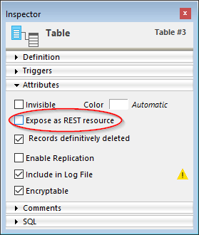

Utilizando peticiones HTTP estándar, el servidor 4D REST permite a las aplicaciones externas acceder directamente a los datos de su aplicación, *es decir*, para recuperar información sobre las clases de datos de su proyecto, manipular datos, entrar en su aplicación web, y mucho más.

Para comenzar a utilizar las funcionalidades REST, es necesario iniciar y configurar el servidor 4D REST.

## Iniciar el servidor REST

Por razones de seguridad, por defecto, 4D no responde a las peticiones REST. Si desea iniciar el servidor REST, debe marcar la opción **Exponer como servidor REST** en la página **Web** > **Web Features** de la configuración de la estructura para que se procesen las peticiones REST.


> Los servicios REST utilizan el servidor HTTP 4D, por lo que debe asegurarse de que el servidor web 4D está iniciado.

El mensaje de advertencia "Atención, verifique los privilegios de acceso" aparece cuando se marca esta opción para llamar la atención sobre el hecho de que cuando se activan los servicios REST, por defecto el acceso a los objetos de la base de datos es gratuito mientras no se hayan configurado los accesos REST.

> Debe reiniciar la aplicación 4D para que los cambios surtan efecto.

## Controlando el acceso REST

Por defecto, los accesos REST están abiertos a todos los usuarios, lo que obviamente no es recomendable por razones de seguridad, y también para controlar el uso de las licencias de los clientes.

A partir de 4D 20 R6, los accesos REST se configuran activando el modo [**force login**](authUsers.md#force-login-mode) y creando una función de clase datastore [`authentify()`](authUsers.md#authentify) para autenticar usuarios y asignar privilegios a su sesión web.

:::note Compatibilidad

The **Access** area in the Settings dialog box is only available in converted projects for compatibility. Consulte [Acceso](../settings/web.md#access) para obtener más información.

:::

## Exponer tablas y campos

Una vez activados los servicios REST en la aplicación 4D, por defecto una sesión REST puede acceder a todas las tablas y campos de la base de datos 4D a través de la [interfaz del datastore](ORDA/dsMapping.md#datastore). Así, puede utilizar sus datos. Por ejemplo, si su base de datos contiene una tabla [Employee], es posible escribir:

```
http://127.0.0.1:8044/rest/Employee/?$filter="salary>10000"

```

Esta petición devolverá todos los empleados cuyo campo de salario sea superior a 10000.

> Las tablas y/o campos 4D que tienen el atributo "Invisible" también se exponen en REST por defecto.

Si desea personalizar los objetos del datastore accesibles a través de REST, debe desactivar la exposición de cada tabla y/o campo que desee ocultar. Cuando una petición REST intenta acceder a un recurso no autorizado, 4D devuelve un error.

### Exponer las tablas

Por defecto, todas las tablas se exponen en REST.

Por razones de seguridad, es posible que desee exponer sólo ciertas tablas de su almacén de datos a las llamadas REST. Por ejemplo, si ha creado una tabla [Users] que almacena los nombres de usuario y las contraseñas, sería mejor no exponerla.

Para eliminar la exposición REST de una tabla:

1. Visualice el inspector de tablas en el editor de estructuras y seleccione la tabla que desea modificar.

2. Desmarque la opción **Exponer como recurso REST**:
   
   Haga esto para cada tabla cuya exposición deba modificarse.

### Exponer los campos

Por defecto, todos los campos de una base 4D se exponen en REST.

Es posible que no quiera exponer ciertos campos de sus tablas a REST. Por ejemplo, es posible que no quiera exponer el campo [Employees]Salary.

Para eliminar la exposición REST de un campo:

1. Visualice el inspector de campo en el editor de estructuras y seleccione el campo a modificar.

2. Desmarque la opción **Exponer como recurso REST** para el campo.
   
   Repeat this for each field whose exposure needs to be modified.

> Para que un campo sea accesible a través de REST, la tabla padre también debe serlo. Si la tabla padre no está expuesta, ninguno de sus campos lo estará, independientemente de su estado.

## Modo apropiativo

En 4D Server, las peticiones REST se gestionan automáticamente a través de procesos apropiativos, **incluso en modo interpretado**. Debe asegurarse de que su código es [compatible con una ejecución apropiativa](../WebServer/preemptiveWeb.md#writing-thread-safe-web-server-code).

> Para depurar el código web interpretado en la máquina del servidor, asegúrese de que el depurador está [adjuntado al servidor](../Debugging/debugging-remote.md) o [a una máquina remota](../Debugging/debugging-remote.md#attaching-the-debugger-to-a-remote-4 Los procesos web pasan entonces al modo cooperativo y se puede depurar el código del servidor web.

Con 4D monopuesto, el código interpretado siempre se ejecuta en modo cooperativo.
