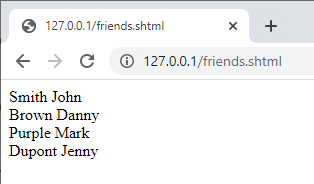
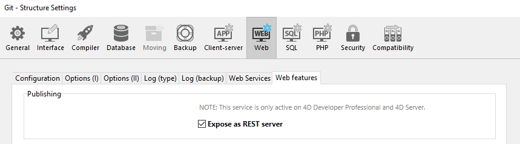
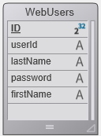
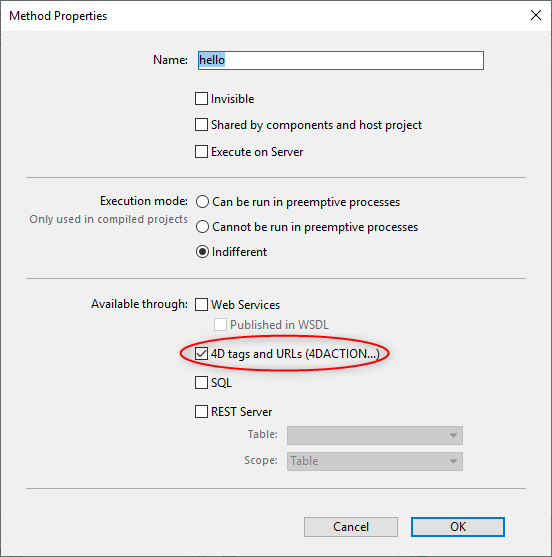
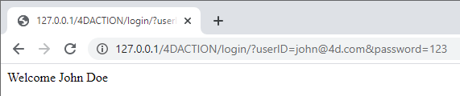

Esta sección de "Primeros pasos" está orientada a los usuarios principiantes que desean una visión general sobre cómo pasar de cero a un sitio web 4D que maneja datos de la base. ¡Empecemos!

## Ejemplo Hello World

Empecemos por hacer que el servidor web envíe "Hello World" al navegador. La forma más sencilla de hacerlo es crear un proyecto, iniciar el servidor web y escribir un pequeño código que devuelva un texto en el método base `On Web Connection`.

### Inicio del servidor web

Para iniciar el servidor Web 4D:

1. Inicie su aplicación 4D y cree un nuevo proyecto 4D vacío.
2. En el menú **Ejecutar**, seleccione **Arrancar el servidor web**.

¡Eso es todo! El servidor web se inicia (verá que el elemento del menú cambia a **Detener el servidor web**). Ahora está listo para atender las peticiones. Para comprobarlo, mostraremos la página de inicio por defecto.

### Mostrar la página de inicio por defecto

El servidor web 4D crea automáticamente una página `index.html` por defecto en la carpeta raíz por defecto `WebFolder`, creada al mismo nivel que la carpeta Project.

1. Inicie un navegador web y conéctese a la dirección IP del servidor web (el puerto http por defecto del servidor web de 4D es el 80). Si el servidor web y el navegador están en la misma máquina, puede seleccionar **Probar servidor web** en el menú **Ejecutar**.

Se muestra la página de inicio por defecto:


### Mostrar Hello World

1. Abra el Explorador, muestre la lista de Métodos base y haga doble clic en `On Web Connection`.

2. Introduzca el siguiente código:

```4d
Case of 
	: ($1="/hello")
		WEB SEND TEXT("Hello World!")
	Else 
		// Error 404 por ejemplo
End case 
```

El método base [`On Web Connection`](httpRequests.md#on-web-connection) se ejecuta para las solicitudes entrantes y recibe la URL de destino en el parámetro `$1`. Este código tan sencillo sólo envía el texto al navegador.

3. En su navegador, introduzca la siguiente URL:

```
http://localhost/hello
```

El servidor web gestiona la solicitud y la devuelve:


## Obtener datos de la base de datos

Ahora veremos lo sencillo que es obtener datos de la base. En primer lugar, crearemos una tabla y la llenaremos con algunos datos.

Cree una base de datos básica con, por ejemplo, una sola tabla que contenga algunos registros:


### Mostrar datos en una página

La solución más sencilla para mostrar los datos es llamar a una [página de plantillas](templates.md) que contenga etiquetas.

1. Utilizando cualquier editor de texto, cree un archivo que contenga las siguientes líneas:

```html
<html>
<body>
<!--#4DCODE ALL RECORDS([Friends])-->
<!--#4DLOOP [Friends]-->
<!--#4DTEXT [Friends]lastName--> <!--#4DTEXT [Friends]firstName--><br/>
<!--#4DENDLOOP-->
</body>
</html>
```

2. Nombre el archivo "friends.shtml" y guárdelo en la **WebFolder** de su proyecto.
3. En su navegador, introduzca la siguiente URL:

```
http://localhost/friends.shtml
```

Las páginas `.shtml` son procesadas automáticamente por el servidor web. Se devuelve la página llena de datos:



### Petición REST

Si no sólo queremos _visualizar_ datos, sino _utilizarlos_, podemos utilizar ORDA y el servidor REST. Gracias al [concepto ORDA](ORDA/overview.md), la tabla `Friends` se asigna automáticamente a una clase de datos y está disponible a través de [REST](REST/gettingStarted.md).

1. Utilizaremos el servidor REST para acceder a los datos: vaya a la caja de diálogo **Parámetros**, seleccione **Web** > **Funcionalidades Web** y marque la opción **Exponer como servidor REST**.



2. En su navegador, introduzca la siguiente URL:

```
http://localhost/rest/$catalog
```

El servidor web devuelve los resultados en JSON:

```json
{
	"__UNIQID": "3F1B6ACFFE12B64493629AD76011922D",
	"dataClasses": [
		{
			"name": "Friends",
			"uri": "/rest/$catalog/Friends",
			"dataURI": "/rest/Friends"
		}
	]
}
```

Se obtiene el catálogo, es decir, la lista de clases de datos y atributos expuestos en el almacén de datos.

También puede obtener cualquier dato.

3. Introduzca el siguiente URL:

```
http://localhost/rest/Friends
```

El servidor devuelve las entidades, es decir, los datos, de la clase de datos Friends:

```json
{
	"__DATACLASS": "Friends",
	"__entityModel": "Friends",
	"__GlobalStamp": 0,
	"__COUNT": 4,
	"__FIRST": 0,
	"__ENTITIES": [
		{
			"__KEY": "1",
			"__TIMESTAMP": "2020-10-27T14:29:01.914Z",
			"__STAMP": 1,
			"ID": 1,
			"lastName": "Smith",
			"firstName": "John"
		},
		{
			"__KEY": "2",
			"__TIMESTAMP": "2020-10-27T14:29:16.035Z",
			"__STAMP": 1,
			"ID": 2,
			"lastName": "Brown",
			"firstName": "Danny"
		},
		{
			"__KEY": "3",
			"__TIMESTAMP": "2020-10-27T14:29:43.945Z",
			"__STAMP": 1,
			"ID": 3,
			"lastName": "Purple",
			"firstName": "Mark"
		},
		{
			"__KEY": "4",
			"__TIMESTAMP": "2020-10-27T14:34:58.457Z",
			"__STAMP": 1,
			"ID": 4,
			"lastName": "Dupont",
			"firstName": "Jenny"
		}
	],
	"__SENT": 4
}
```

Este ejemplo muy sencillo muestra cómo el servidor web interactúa de forma transparente con el servidor [REST](REST/gettingStarted.md) para devolver cualquier dato solicitado, siempre que esté expuesto. En sus interfaces web, puede vincular fácilmente el código javascript o html con los datos devueltos. Vea el [Explorador de datos web](Admin/dataExplorer.md) integrado para tener un ejemplo de interfaz web sofisticada vinculada a las clases de datos.

## Inicio de sesión y sesión

En las secciones anteriores, obtenemos acceso libre a la aplicación desde las peticiones web. Sin embargo, en el mundo de las aplicaciones web, la seguridad del acceso a los datos es la principal prioridad. Al conectarse al servidor web de 4D, los usuarios deben ser autentificados y su navegación controlada.

### Crear una tabla de usuarios

La forma más sencilla y segura de registrar un usuario en el servidor web de 4D se basa en el siguiente escenario:

- Los usuarios se almacenan en una tabla dedicada y no expuesta (llamada _WebUsers_ por ejemplo)
- La tabla _WebUsers_ podría estar [encriptada](MSC/encrypt.md) y almacena el login del usuario y un hash de su contraseña.

1. Cree una tabla con algunos campos, por ejemplo:



2. Escriba y ejecute el siguiente código para crear un usuario:

```4d
var $webUser : cs.WebUsersEntity

$webUser:=ds.WebUsers.new()
$webUser.firstName:="John"
$webUser.lastName:="Doe"
// la contraseña sería introducida por el usuario
$webUser.password:=Generate password hash("123")
$webUser.userId:="john@4d.com"
$webUser.save()
```

### Autenticación de los usuarios

> Para que sea segura de extremo a extremo, es necesario que toda la conexión se establezca mediante [https](webServerConfig.md#enable-https).

1. Abra el Explorador y cree un método de proyecto llamado "login".

2. Escriba el siguiente código:

```4d
var $indexUserId; $indexPassword : Integer
var $userId; $password : Text
var $user; $info : Object
ARRAY TEXT($anames; 0)
ARRAY TEXT($avalues; 0)

// obtener los valores enviados en el encabezado de la petición
WEB GET VARIABLES($anames; $avalues)

// busca los campos de inicio de sesión del encabezado
$indexUserId:=Find in array($anames; "userId")
$userId:=$avalues{$indexUserId}
$indexPassword:=Find in array($anames; "password")
$password:=$avalues{$indexPassword}

//buscar un usuario con el nombre introducido en la tabla de usuarios
$user:=ds.WebUsers.query("userId = :1"; $userId).first()

If ($user#Null) //se encontró un usuario
		//comprobar la contraseña
    If (Verify password hash($password; $user.password))
    		//password ok, llenar la sesión
        $info:=New object()
        $info.userName:=$user.firstName+" "+$user.lastName
        Session.setPrivileges($info)
        	//Puede utilizar la sesión de usuario para almacenar cualquier información
        WEB SEND TEXT("Welcome "+Session.userName)
    Else 
        WEB SEND TEXT("Wrong user name or password.")
    End if 
Else 
    WEB SEND TEXT("Wrong user name or password.")
End if 
```

3. Despliegue las propiedades del método haciendo clic en el botón **[i]** del editor de código, marque la opción `etiquetas 4D y URLs (4DACTION...)` y haga clic en **Aceptar**.



4. En su navegador, introduzca la siguiente URL:

```
http://localhost/4DACTION/login/?userID=john@4d.com&password=123
```

> No se recomienda el uso de este tipo de URLs, sólo se presenta aquí para mantener el ejemplo simple. Una solicitud de inicio de sesión más realista debe ser manejada a través de un formulario web y una petición POST. Consulte [esta página](sessions.md#example) para ver un ejemplo de formulario POST.

Entonces se registrará para la sesión:



Las credenciales incorrectas serían rechazadas:


Una vez que un usuario se registra, puede manejar la sesión asociada utilizando el método `WEB Get Current Session ID`. Ver la página [Sesiones de usuario](sessions.md).
