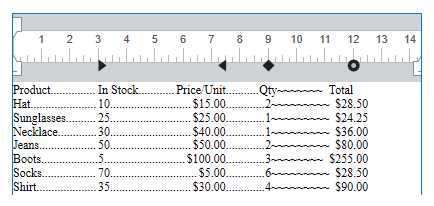

<!--REF #_command_.WP SET ATTRIBUTES.Syntax-->**WP SET ATTRIBUTES** ( *rangoObj* ; *nomAtrib* ; *valorAtrib* {; *nomAtrib2* ; *valorAtrib2* ; ... ; *nomAtribN* ; *valorAtribN*} )<!-- END REF-->
<!--REF #_command_.WP SET ATTRIBUTES.Params-->
| Parámetro | Tipo |  | Descripción |
| --- | --- | --- | --- |
| rangoObj | Object | &#8594;  | Rango o elemento o documento 4D Write Pro |
| nomAtrib | Text | &#8594;  | Nombre del atributo a definir |
| valorAtrib | Text, Number, Object, Collection, Picture, Date | &#8594;  | Nuevo valor atributo |

<!-- END REF-->

## Descripción 

<!--REF #_command_.WP SET ATTRIBUTES.Summary-->El comando **WP SET ATTRIBUTES** permite definir el valor de todo atributo en un rango, elemento o documento.<!-- END REF--> Este comando le permite acceder a cualquier tipo de atributo interno 4D Write Pro: carácter, párrafo, documento o imagen.

En el primer parámetro, puede pasar:

* un rango, o
* un elemento (encabezado/cuerpo/pie/tabla/fila/párrafo/imagen en línea o anclada / sección / subsección / hoja de estilo), o,
* un documento 4D Write Pro.

En *nomAtrib*, pase el nombre del atributo a definir para el objetivo y en *valorAtrib*, pase el nuevo valor a definir. Para obtener una lista completa de los atributos a pasar en *nomAtrib*, así como también sus respectivos valores, por favor consulte la sección *Atributos 4D Write Pro*.

Puede pasar tantos pares de *nomAtrib*/ *valorAtrib* como desee.

**Nota:** si necesita definir varios atributos para el mismo objetivo, está optimizado para utilizar una sola llamada a **WP SET ATTRIBUTES** con todos los pares de atributos/valores, en lugar de llamar varias veces a **WP SET ATTRIBUTES**.

## Ejemplo 1 

En esta área 4D Write Pro, usted selecciona una palabra:


Si ejecuta el siguiente código:

```4d
 $range:=WP Get selection(*;"WParea") //obtener el rango seleccionado
 
  // definir el desplazamiento de la sombra en pt para el texto seleccionado
 WP SET ATTRIBUTES($range;wk text shadow offset;1)
  //definir el relleno del párrafo
 WP SET ATTRIBUTES($range;wk padding;1)
  //define un borde de 10 pt
 WP SET ATTRIBUTES($range;wk border style;wk solid;wk border width;10)
  //define los colores del borde
 WP SET ATTRIBUTES($range;wk border color;"blue";wk border color bottom;"#00FA9A";wk border color right;"#00FA9A")
```

Obtiene el siguiente resultado:


## Ejemplo 2 

Este ejemplo ilustra el uso de las constantes wk inside y wk outside:

```4d
 $wpRange:=WP Get selection(writeProdoc)
 WP SET ATTRIBUTES($wpRange;wk border style+wk inside;wk dotted)
 WP SET ATTRIBUTES($wpRange;wk border style+wk outside;wk solid)
 WP SET ATTRIBUTES($wpRange;wk border color+wk outside;"#00FA9A")
```

Suponiendo que todo el contenido fue seleccionado, el resultado es:


## Ejemplo 3 

Usted desea definir una imagen de fondo para el documento:

```4d
 var WParea : Object
 WParea:=WP New
 
 READ PICTURE FILE("C:\\Pictures\\boats.jpg";$picture)
 
 WP SET ATTRIBUTES(WParea;wk background image;$picture)
```

El resultado es:


Usted desea definir una imagen de fondo que cubre todo el área imprimible:

```4d
 var WParea : Object
 WParea:=WP New
 
 READ PICTURE FILE("C:\\Pictures\\boats.jpg";$picture)
 
 WP SET ATTRIBUTES(WParea;wk background image;$picture)
 WP SET ATTRIBUTES(WParea;wk background clip;wk paper box)
 WP SET ATTRIBUTES(WParea;wk background origin;wk paper box)
```

El resultado es:


**Nota**: el valor paper box sólo es aplicable a documentos y secciones.

## Ejemplo 4 

Usted desea definir pestañas en intervalos variables y designar diferentes caracteres como el carácter inicial:

```4d
 var WParea : Object
 
 ARRAY TEXT(_position;0)
 ARRAY LONGINT(_type;0)
 ARRAY TEXT(_leadings;0)
 
 APPEND TO ARRAY(_position;"3cm")
 APPEND TO ARRAY(_type;wk left)
 APPEND TO ARRAY(_leadings;".")
 
 APPEND TO ARRAY(_position;"7.5cm")
 APPEND TO ARRAY(_type;wk right)
 APPEND TO ARRAY(_leadings;".")
 
 APPEND TO ARRAY(_position;"9cm")
 APPEND TO ARRAY(_type;wk center)
 APPEND TO ARRAY(_leadings;".")
 
 APPEND TO ARRAY(_position;"12cm")
 APPEND TO ARRAY(_type;wk decimal)
 APPEND TO ARRAY(_leadings;"~")
 
 APPEND TO ARRAY(_position;"2cm")
 APPEND TO ARRAY(_type;wk left)
 APPEND TO ARRAY(_leadings;"")
 
 $range:=WP Get selection(WParea)
 WP SET ATTRIBUTES($range;wk tab stop offsets;_position)
 WP SET ATTRIBUTES($range;wk tab stop types;_type)
 WP SET ATTRIBUTES($range;wk tab stop leadings;_leadings)
```

El resultado es:



## Ver también 

*Atributos 4D Write Pro*  
[WP GET ATTRIBUTES](wp-get-attributes.md)  
[WP RESET ATTRIBUTES](../commands/wp-reset-attributes.md)  