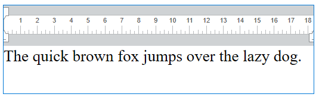

<!--REF #_command_.WP SET TEXT.Syntax-->**WP SET TEXT** ( *objRango* ; *nuevoTexto* ; *posicionTexto* {; *alcanceRango*} )<!-- END REF-->
<!--REF #_command_.WP SET TEXT.Params-->
| Parámetro | Tipo |  | Descripción |
| --- | --- | --- | --- |
| objRango | Object | &#8594;  | Objeto de rango |
| nuevoText | Text | &#8594;  | Texto a insertar |
| posicionTexto | Number | &#8594;  | Posición de inserción (reemplazar, antes, después) |
| alcanceRango | Number | &#8594;  | Incluye o excluye el contenido insertado dentro del rango |

<!-- END REF-->

#### Descripción 

<!--REF #_command_.WP SET TEXT.Summary-->El comando **WP SET TEXT** inserta el texto pasado en el parámetro *nuevoTexto* como texto sin formato en *objRango* en la posición específica designada por el parámetro *posicionTexto*.<!-- END REF-->

En el parámetro *objRango*, pase un objeto para designar la posición donde se insertará el texto. El rango puede ser una ubicación explícita en el documento 4D Write Pro o puede basarse en la selección de un usuario. Puede pasar:

* un rango, o
* un elemento (tabla / fila / párrafo / cuerpo / encabezado / pie de página / imagen en línea / sección / subsección), o
* un documento 4D Write Pro.

El parámetro *nuevoTexto* contiene el texto a insertar dentro de *objRango*. **WP SET TEXT** inserta solo texto sin formato, exactamente como está escrito, pero sin etiquetas de estilo.

En el parámetro *posicionTexto*, la ubicación del texto insertado se puede especificar pasando uno de los siguientes selectores:

| Constante  | Comentario                                 |
| ---------- | ------------------------------------------ |
| wk append  | Inserta contenidos al final del rango      |
| wk prepend | Insertar contenidos al principio del rango |
| wk replace | Remplazar el contenido de la página        |

* Si *objRango* es un rango, puede utilizar el parámetro opcional *alcanceRango* para pasar una de las siguientes constantes para especificar si los contenidos insertados se incluyen o no en el rango resultante::  
    
| Constante             | Comentario                                                            |  
| --------------------- | --------------------------------------------------------------------- |  
| wk exclude from range | Contenidos insertados no incluidos en el rango actualizado            |  
| wk include in range   | Contenido insertado incluido en el rango actualizado (predeterminado) |  
    
Si no pasa un parámetro *alcanceRango*, de forma predeterminada, los contenidos insertados se incluyen en el rango resultante.
* Si *objRango* no es un rango, se ignora *alcanceRango*.

#### Ejemplo 

Desea agregar texto a este documento:



*objRango* es un documento 4D Write Pro:

```4d
 WP SET TEXT(myDoc;"Hello world";wk append)
  //escribe "The quick brown fox jumps over the lazy dog. Hello world!"
```

*objRango* es un rango:

Antes del texto existente:  

```4d
 $range:=WP Create range(myDoc;wk start text;wk end text)
 WP SET TEXT($range;" Hello world!";wk prepend)
  //escribe " Hello world! The quick brown fox jumps over the lazy dog."
```

Después del texto existente:  

```4d
 $range:=WP Create range(myDoc;wk start text;wk end text)
 WP SET TEXT($range;" Hello world!";wk append)
  //escribe "The quick brown fox jumps over the lazy dog. Hello world!"
```

Reemplaza el texto existente:  

```4d
 $range:=WP Create range(myDoc;wk start text;wk end text)
 WP SET TEXT($range;" Hello world!";wk replace)
  //escribe " Hello world!"
```

#### Ver también 

[WP Get text](wp-get-text.md)  