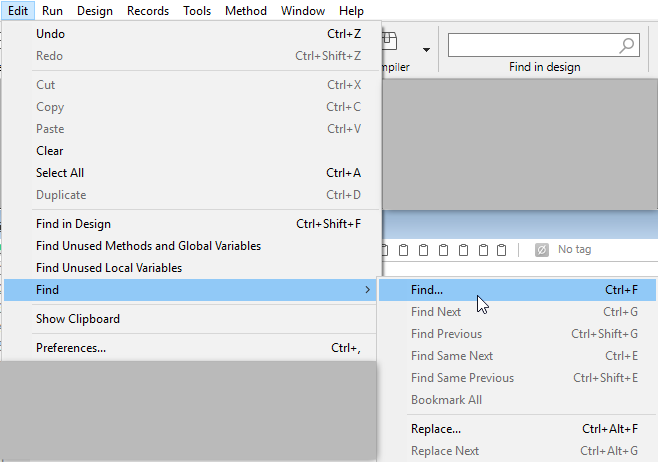

El Editor de Código tiene funciones específicas de búsqueda y reemplazo que se aplican a la ventana actual.

El área de búsqueda situada en la barra de herramientas de cada ventana de método puede utilizarse para realizar búsquedas sencillas.

Los comandos Buscar/Reemplazar para métodos, clases o funciones se encuentran en **Editar** menú de 4D:

> The find commands located above the **Find** submenu are not specific to the Code Editor but may be used to search for a value among all the methods, classes or functions, using the **Find in design** feature in the toolbar or in the **Edit** menu.

## Buscar

Al seleccionar el comando **Buscar...** aparece el siguiente diálogo:

La búsqueda definida en este diálogo se realizará en el método situado en el primer plano.

- El área **Buscar qué:** permite introducir la cadena de caracteres que se desea buscar. Esta área es un combo box que almacena las últimas 15 cadenas de caracteres que se han buscado o reemplazado durante la sesión. Si resalta el texto antes de elegir el comando **Buscar...**, aparecerá en esta área. Entonces puede utilizar este texto o reemplazarlo por otro.
- La opción **Toda la palabra** se utiliza para limitar la búsqueda a las ocurrencias exactas de la palabra buscada. Cuando esta opción está marcada, por ejemplo, una búsqueda de "cliente" no encontrará ni "clientes" ni "micliente" By default, this option is not checked; therefore, a search for "var" will find "Myvar," "variation," etc. Be careful, unlike the **Whole Object Name** option of the Find in Design dialog box, the **Whole Word** option does not take object names into account. Por ejemplo, con esta opción, la búsqueda de la cadena "Mi" en un método encontrará la variable "Mi variable". This is not the case for an overall search using the **Whole Object Name** option, where the same result will not be found in the context of the above example since the whole object name (of the variable found previously) is "My Variable" and therefore does not correspond exactly to the string entered ("My").
- La opción **Sensible a mayúsculas y minúsculas** se utiliza para tener en cuenta las mayúsculas y minúsculas de los caracteres introducidos en el área "Buscar qué:". Por ejemplo, una búsqueda de "MiVar" no encontrará "miVar"
- Los botones de opción **Anterior/Siguiente** permiten establecer la dirección de la búsqueda: hacia el principio o hacia el final del método actual, partiendo de la posición inicial del cursor.

When you click on **OK**, 4D begins searching from the current text insertion point and continues to the end of the method. The first item corresponding to the set criteria is thus selected in the Code Editor window. It is then possible to continue the search using the **Find Next** and **Find Previous** commands of the **Edit** menu.

### Buscar lo mismo

El comando **Buscar el mismo** se utiliza para buscar cadenas de caracteres idénticas a la seleccionada. This command is only active if you have selected at least one character in the Code Editor.

The search carried out is of the "Find Next" type in the current code editor window.

### Find Same Next/Previous

The **Find Same Next** and **Find Same Previous** commands are used to find character strings *strictly* identical to the ones selected. For example, the case must match.

### Bookmark All

The **Bookmark All** command is enabled when a search has already been specified in the find or replace dialog box. When you select this command, 4D puts a bookmark at each line that contains an item corresponding to the "current" search criteria. Esto facilita la localización de todos los resultados de la búsqueda.

For more information about bookmarks, refer to [Using bookmarks](./write-class-method.md#using-bookmarks).

## Reemplazar

The **Replace** command displays the following dialog box:

- The **Find What:** area is used to define the character string or the expression to be searched for. As in the Find dialog box, this area is a combo-box that stores the last 15 character strings searched for. If you highlight text before choosing the **Replace** command, it will appear in this area.
- The **Replace with:** area is used to define the character string that will replace the one defined above. Esta área también es un combo-box que almacena las últimas 15 cadenas de caracteres que se han buscado o sustituido.
- The **Whole Word** option is used to find/replace only character strings that correspond exactly to the string entered. In this case, for instance, a search for "client" will not find the strings "clients" or "myclient," etc.
- The **Case Sensitive** option is used to find/replace only character strings having the same case as that of the entered string. Por ejemplo, una búsqueda de "MiVar" no encontrará "miVar"
- As in the Find dialog box, the **Previous** and **Next** buttons are used to set the direction of the search: towards the beginning or end of the current method, starting from the initial location of the cursor.

The first item corresponding to the set criteria is thus selected in the Code Editor window. 4D begins searching from the current text insertion point and continues to the end of the method. It is then possible to continue finding/replacing using the **Replace Next** and **Replace Previous** commands of the **Edit** menu.

The **Everywhere** button is used to replace all the occurrences corresponding to the search criteria directly in the open method.

