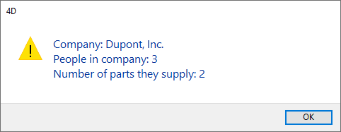

<!--REF #_command_.ALERT.Syntax-->**ALERT** ( *mensaje* {; *titulobotonOK*} )<!-- END REF-->
<!--REF #_command_.ALERT.Params-->
| Parámetro | Tipo |  | Descripción |
| --- | --- | --- | --- |
| mensaje | Text | &#8594;  | Mensaje a mostrar en la caja de diálogo de alerta |
| titulobotonOK | Text | &#8594;  | Título del botón OK |

<!-- END REF-->

#### Descripción 

<!--REF #_command_.ALERT.Summary-->El comando **ALERT** muestra una caja de diálogo de alerta compuesta de un icono, de un mensaje y de un botón OK.<!-- END REF-->

Pase el mensaje a mostrar en el parámetro *mensaje*.

Por defecto, el título del botón OK es “Aceptar.” Para cambiar el título del botón OK, pase el nuevo título en el parámetro opcional *titulobotonOK*. Si es necesario, el ancho del botón OK se redimensiona hacia la izquierda, de acuerdo al ancho del título personalizado que usted pase.

**Consejo:** no llame al comando **ALERT** desde la sección de un formulario o método objeto que maneja los eventos de formulario On Activate o On Deactivate; esto provocará un bucle sin fin.

#### Ejemplo 1 

Este ejemplo muestra una caja de diálogo de alerta que muestra información sobre una empresa. Note que el mensaje contiene retornos de carro, que hacen que el texto pase a la línea siguiente:

```4d
 ALERT("Company: "+[Companies]Name+Char(13)+"Personas en la empresa: "+\
 String(Records in selection([People]))+Char(13)+"Número de partes que suministran: "+\
 String(Records in selection([Parts])))
```

Esta línea de código muestra la siguiente caja de diálogo de alerta (en Windows):



#### Ejemplo 2 

La línea :

```4d
 ALERT("Lo siento David, no puedo hacer eso.";"¡Alas!")
```

muestra la caja de diálogo de alerta (en Windows):


#### Ejemplo 3 

La línea:

```4d
 ALERT("Ya no tiene los privilegios de acceso para eliminar estos registros. ";" Bueno, le juro que no sabía eso")
```

Muestra la siguiente caja de diálogo de alerta (en Windows):


#### Ver también 

[CONFIRM](confirm.md)  
[DISPLAY NOTIFICATION](display-notification.md)  
[Request](request.md)  

#### Propiedades
|  |  |
| --- | --- |
| Número de comando | 41 |
| Hilo seguro | &check; |
| Prohibido en el servidor ||


