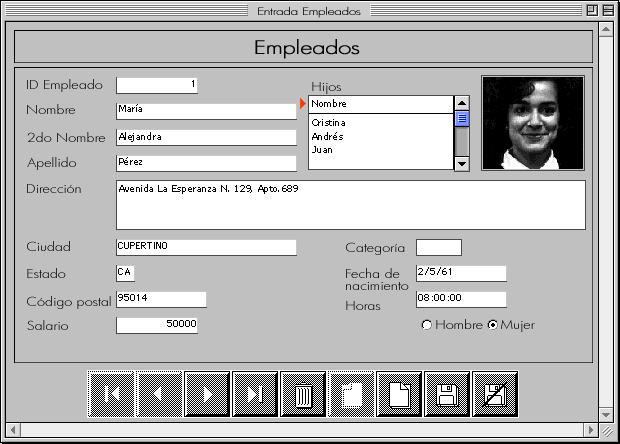

<!--REF #_command_.APPEND DATA TO PASTEBOARD.Syntax-->**APPEND DATA TO PASTEBOARD** ( *tipoDatos* ; *datos* )<!-- END REF-->
<!--REF #_command_.APPEND DATA TO PASTEBOARD.Params-->
| Parámetro | Tipo |  | Descripción |
| --- | --- | --- | --- |
| tipoDatos | Text | &#8594;  | Tipo de datos (4 caracteres) |
| datos | Blob | &#8594;  | Datos a añadir al portapapeles |

<!-- END REF-->

*Este comando no es hilo seguro, no puede ser utilizado en código apropiativo.*


#### Descripción 

<!--REF #_command_.APPEND DATA TO PASTEBOARD.Summary-->El comando APPEND DATA TO PASTEBOARD añade en el portapapeles los datos del tipo especificado en *tipoDatos* en el BLOB *datos*.<!-- END REF-->

**Nota:** en el caso de operaciones copiar/pegar, el contenedor de datos corresponde al Portapapeles. 

Pase en *tipoDatos* un valor definiendo el tipo de datos a añadir. Puede pasar una firma 4D, un tipo UTI (Mac OS), un nombre/número de formato (Windows), o un tipo de 4 caracteres (compatibilidad). Para mayor información sobre estos tipos, consulte la sección . 

**Nota para los usuarios Windows**: cuando el comando se utiliza con datos de tipo texto (*tipoDatos* *dataType* rs "TEXT", com.4d.private.text.native o com.4d.private.text.utf16), la cadena contenida en el parámetro BLOB *datos* debe terminar con el carácter NULL en Windows.

Si los datos del BLOB se añaden correctamente al portapapeles, la variable OK toma el valor 1\. De lo contrario la variable OK toma el valor 0 y se puede generar un error.

Generalmente, se utiliza el comando APPEND DATA TO PASTEBOARD para agregar múltiples instancias de los mismos datos al portapapeles o para añadir datos que no son de tipo TEXT o PICT. Para añadir nuevos datos al portapapeles, primero debe limpiar el portapapeles utilizando el comando CLEAR PASTEBOARD.

Si quiere limpiar y añadir:

* texto al portapapeles, utilice el comando [SET TEXT TO PASTEBOARD](set-text-to-pasteboard.md "SET TEXT TO PASTEBOARD"),
* una imagen al portapapeles, utilice el comando [SET PICTURE TO PASTEBOARD](set-picture-to-pasteboard.md "SET PICTURE TO PASTEBOARD").

Sin embargo, note que si un BLOB contiene texto o una imagen, usted puede utilizar el comando APPEND DATA TO PASTEBOARD para añadir un texto o una imagen al portapapeles.

#### Ejemplo 

Utilizando los comandos del tema portapapeles y de los BLOBs, puede construir esquemas sofisticados de Cortar/Copiar/Pegar para administrar datos estructurados en lugar de una sola pieza de información. En el siguiente ejemplo, los dos métodos de proyecto SET RECORD TO CLIPBOARD y GET RECORD FROM CLIPBOARD le permiten tratar un registro de una información a copiar en o desde el portapapeles.

```4d
  // Método de proyecto ENVIAR REGISTRO AL PORTAPAPELES
  // ENVIAR REGISTRO AL PORTAPAPELES ( Numérico )
  // ENVIAR REGISTRO AL PORTAPAPELES ( Número de tabla )
 
 var $1;$vlCampo;$vlTipoCampo : Integer
 var $vpTabla;$vpCampo : Pointer
 C_STRING(255;$vsDocNombre)
 var $vtRegistroDatos;$vtCampoDatos : Text
 var $vxRegistroDatos : Blob
 
  // Limpiar el portapapeles (estará vacío si no hay un registro actual)
 CLEAR PASTEBOARD
  // Obtener un puntero a la tabla cuyo número se pasa como parámetro
 $vpTabla:=Table($1)
  // Si hay un registro actual para esa tabla
 If((Record number($vpTabla->)>=0)|(Is new record($vpTabla->)))
  // Inicializar la variable texto que contendrá la imagen de texto del registro
    $vtRegistroDatos:=""
  // Para cada campo del registro:
    For($vlCampo;1;Count fields($1))
  // Obtener el tipo de campo
       GET FIELD PROPERTIES($1;$vlCamp;$vlCampoTipo)
  // Obtener un puntero hacia el campo
       $vpCampo:=Field($1;$vlCampo)
  // Dependiendo del tipo de campo, copiar (o no) sus datos de manera apropiada
       Case of
          :(($vlCampoTipo=Is alpha field)|($vlCampoTipo=Is text))
             $vtCampoDatos:=$vpCampo->
          :(($vlCampoTipo=Is real)|($vlCampoTipo=Is integer)|($vlCampoTipo=Is longint)|($vlCampoTipo=Is date)|($vlCampoTipo=Is time))
             $vtCampoDatos:=String($vpCampo->)
          :($vlCampoTipo=Is Boolean)
             $vtCampoDatos:=String(Num($vpCampo->);"Sí;;No")
          Else
  // Pasar e ignorar los otros tipos de campos
             $vtCampoDatos:=""
       End case
  // Acumular los datos del campo en una variable de texto que almacena la imagen de texto del registro
       $vtRegistroDatos:=$vtRegistroDatos+Field name($1;$vlCampo)+":"+Char(9)+$vtCampoDatos+CR
  // Nota: El método CR devuelve Char(13) en Macintosh y Char(13)+Char(10) en Windows
    End for
  // Colocar la imagen de texto del registro en el portapapeles
    SET TEXT TO PASTEBOARD($vtRegistroDatos)
  // Nombre del archivo scrap en la carpeta Temporales
    $vsDocNombre:=Temporary folder+"Scrap"+String(1+(Random%99))
  // Borrar el archivo scrap si existe (Se debe hacer una prueba de error aquí)
    DELETE DOCUMENT($vsDocNombre)
  // Crear archivo scrap
    SET CHANNEL(10;$vsDocNombre)
  //Enviar el registro completo al archivo scrap
    SEND RECORD($vpTabla->)
  // Cerrar el archivo scrap
    SET CHANNEL(11)
  // Cargar el archivo scrap en un BLOB
    DOCUMENT TO BLOB($vsDocNombre;$vxRegistroDatos)
  // No necesitamos más el archivo scrap
    DELETE DOCUMENT($vsDocNombre)
  // Añadir la imagen completa del registro al portapapeles
  // Nota: utilizamos arbitrariamente el tipo de datos "4Drc"
    APPEND DATA TO PASTEBOARD("4Drc";$vxRegistroDatos)
  // En este punto, el portapapeles contiene:
  // (1) Una imagen de texto del registro (como se muestra en las copias de pantalla a continuación)
  // (2) Una imagen completa del registro (incluyendo imágenes, subarchivos y los campos de tipo BLOB)
 End if
```

Al introducir el siguiente registro:



Si aplica el métodoENVIAR REGISTRO AL portapapeles a la tabla \[Empleados\], el portapapeles contendrá el texto del registro y la imagen completa del registro.  


Puede pegar esta imagen del registro en otro registro, utilizando el método GET RECORD FROM CLIPBOARD, como se muestra a continuación:

```4d
  // Método OBTENER REGISTRO DESDE PORTAPAPELES
  // OBTENER REGISTRO DESDE PORTAPAPELES ( Número )
  // OBTENER REGISTRO DESDE PORTAPAPELES ( Número de tabla )
 var $1;$vlCampo;$vlCampoTipo;$vlPosCR;$vlPosColon : Integer
 var $vpTabla;$vpCampo : Pointer
 C_STRING(255;$vsDocNombre)
 var $vxPortapapelesDatos : Blob
 var $vtPortapapelesDatos;$vtCampoDatos : Text
 
  // Obtener un puntero hacia la tabla cuyo número se pasa como parámetro
 $vpTabla:=Table($1)
  // Si hay un registro actual
 If((Record number($vpTabla->)>=0)|(Is new record($vpTabla->)))
    Case of
  // ¿El portapapeles contiene una imagen completa del registro?
       :(Pasteboard data size("4Drc")>0)
  // Si es así, extraiga el contenido del portapapeles
          GET PASTEBOARD DATA("4Drc";$vxPortapapelesDatos)
  // Nombre para el archivo scrap en la carpeta temporales
          $vsDocNombre:=Temporary folder+"Scrap"+String(1+(Random%99))
  // Borrar el archivo scrap si existe (Se debe hacer una prueba de error aquí)
          DELETE DOCUMENT($vsDocNombre)
  // Guardar el BLOB en el archivo scrap
          BLOB TO DOCUMENT($vsDocNombre;$vxPortapapelesDatos)
  // Abrir el archivo scrap
          SET CHANNEL(10;$vsDocNombre)
  // Recibir el registro completo del archivo scrap
          RECEIVE RECORD($vpTable->)
  // Cerrar el archivo scrap
          SET CHANNEL(11)
  // No necesitamos más el archivo scrap
          DELETE DOCUMENT($vsDocNombre)
  // ¿El portapapeles contiene TEXT?
       :(Pasteboard data size("TEXT")>0)
  // Extraer el texto del portapapeles
          $vtPortapapelesDatos:=Get text from pasteboard
  // Inicializar el número de campos a incrementar
          $vlCampo:=0
          Repeat
  // Buscar la línea de campo siguiente en el texto
             $vlPosCR:=Position(CR;$vtPortapapelesDatos)
             If($vlPosCR>0)
  // Extraer la línea de campo
                $vtCampoDatos:=Substring($vtPortapapelesDatos;1;$vlPosCR-1)
  // Si hay dos puntos ":"
                $vlPosColon:=Position(":";$vtCampoDatos)
                If($vlPosColon>0)
  // Tomar sólo los datos de campo (eliminar el nombre de campo)
                   $vtCampoDatos:=Substring($vtCampoDatos;$vlPosColon+2)
                End if
  // Incrementar el número de campo
                $vlCampo:=$vlCampo+1
  // El portapapeles puede contener más información de la que necesitamos...
                If($vlCampo<=Count fields($vpTabla))
  // Obtener el tipo de campo
                   GET FIELD PROPERTIES($1;$vlCampo;$vlCampoTipo)
  // Obtener un puntero al campo
                   $vpCampo:=Field($1;$vlCampo)
  // Dependiendo del tipo de campo, copiar (o no) el texo de una manera apropiada
                   Case of
                      :(($vlCampoTipo=Is alpha field)|($vlCampoTipo=Is text))
                         $vpCampo->:=$vtCampoDatos
                      :(($vlCampoTipo=Is real)|($vlCampoTipo=Is integer)|($vlCampoTipo=Is longint))
                         $vpCampo->:=Num($vtCampoDatos)
                      :($vlCampoTipo=Is date)
                         $vpCampo->:=Date($vtCampoDatos)
                      :($vlCampoTipo=Is time)
                         $vpCampo->:=Time($vtCampoDatos)
                      :($vlCampoTipo=Is Boolean)
                         $vpCampo->:=($vtCampoDatos="Sí")
                      Else
  // Pasar e ignorar los otros tipos de datos de campos
                   End case
                Else
  // Todos los campos han sido asignados, salir del bucle
                   $vtPortapapelesDatos:=""
                End if
  // Eliminar el texto que acaba de ser extraído
                $vtPortapapelesDatos:=Substring($vtPortapapelesDatos;$vlPosCR+Length(CR))
             Else
  // No se encontró un delimitador, salir del bucle
                $vtPortapapelesDatos:=""
             End if
  // Repetir mientras tengamos datos
          Until(Length($vtPortapapelesDatos)=0)
       Else
          ALERT("El portapapeles no contiene datos que puedan pegarse como un registro.")
    End case
 End if
```

#### Variables y conjuntos del sistema 

Si los datos en el BLOB se añaden correctamente al portapapeles, la variable sistema OK toma el valor 1; de lo contrario OK toma el valor 0 y se podría generar un error.

#### Ver también 

[CLEAR PASTEBOARD](clear-pasteboard.md)  
[SET PICTURE TO PASTEBOARD](set-picture-to-pasteboard.md)  
[SET TEXT TO PASTEBOARD](set-text-to-pasteboard.md)  