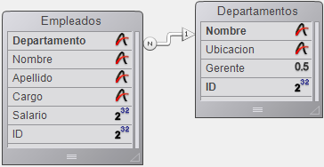
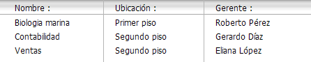
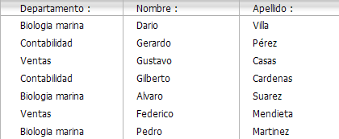
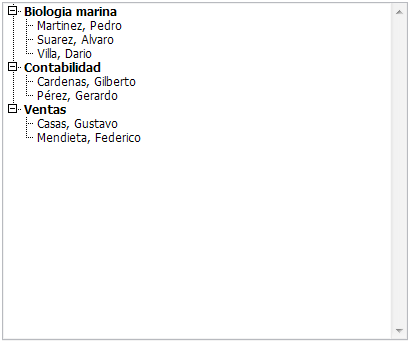

<!--REF #_command_.APPEND TO LIST.Syntax-->**APPEND TO LIST** ( *lista* ; *textoElem* ; *refElem* {; *sublista* ; *desplegada*} )<!-- END REF-->
<!--REF #_command_.APPEND TO LIST.Params-->
| Parámetro | Tipo |  | Descripción |
| --- | --- | --- | --- |
| lista | Integer | &#8594;  | Número de referencia de lista |
| textoElem | Text | &#8594;  | Texto del nuevo elemento de lista (max. 255 caracteres) |
| refElem | Integer | &#8594;  | Número de referencia único del nuevo elemento |
| sublista | Integer | &#8594;  | Sublista opcional para añadir al nuevo elemento |
| desplegada | Boolean | &#8594;  | Indica si las sublistas opcionales serán desplegadas o contraídas |

<!-- END REF-->

#### Descripción 

<!--REF #_command_.APPEND TO LIST.Summary-->El comando APPEND TO LIST añade un nuevo elemento a la lista jerárquica cuyo número de referencia se pasa en *lista*.<!-- END REF-->

El texto del elemento se pasa en *textoElem*. Puede pasar una expresión de tipo Alfa o Texto de máximo 2 000 000 caracteres. A partir de 4D v16 R4, si el elemento está asociado con una acción estándar, puede pasar la constante ak standard action title en *textoElem* para usar automáticamente el nombre de la acción localizado. Para más información, consulte la sección *Acciones estándar*.

El número de referencia único del elemento (del tipo Entero largo) se pasa en *refElem*. Aunque clasificamos este número de referencia como único, en realidad puede pasar el valor que quiera. Consulte la sección *Gestión de listas jerárquicas* para mayor información sobre el parámetro *refElem.*

Igualmente si quiere que un elemento tenga elementos hijos, pase un número de referencia de lista válido en el parámetro *sublista*. En este caso, también debe pasar el parámetro *expandido*. Pase **True** o **False** en este parámetro de manera que la sublista se muestre desplegada o contraída respectivamente.

La referencia de la lista que pasa en *sublista* debe hacer referencia a una lista existente. La lista existente podría tener un solo nivel o tener sublistas. Si no quiere añadir una lista hija al nuevo elemento, omita el parámetro o pase 0\. Aunque ambos son opcionales, los parámetros *sublista* y *desplegada* deben pasarse de forma conjunta.

**Consejos:**

* Para insertar un nuevo elemento en una lista, utilice [INSERT IN LIST](insert-in-list.md). Para cambiar el texto de un elemento existente o modificar su lista hija al igual que su estado desplegado, utilice [SET LIST ITEM](set-list-item.md).
* Para cambiar la apariencia del nuevo elemento añadido utilice [SET LIST ITEM PROPERTIES](set-list-item-properties.md).

#### Ejemplo 

Esta es una vista parcial de la estructura de una base:



Las tablas \[Departamentos\] y \[Empleados\] contienen los siguientes registros:





Usted quiere mostrar una lista jerárquica, llamada *hlList*, que muestre los departamentos y para cada departamento, un lista hija que muestre los empleados que trabajan en ese departamento. El método de objeto de *hlList* es:

```4d
  // Método de objeto de lista jerárquica hlList
 
 Case of
 
    :(FORM Event=On Load)
       var hlList;$hSubList;$vlDepartament;$vlEmpleado;$v1DepartmentID : Integer
  // Crear una nueva lista jerárquica vacía
       hlList:=New list
  // Seleccionar todos los registros de la tabla [Departamentos]
       ALL RECORDS([Departamentos])
  // Para cada departamento
       For($vlDepartament;1;Records in selection([Departamentos]))
  // Seleccionar los empleados de ese departamento
          RELATE MANY([Departamentos]Nombre)
  // ¿Cuántos hay?
          $vlNbEmpleados:=Records in selection([Empleados])
  // ¿Hay por lo menos un empleado en este departamento?
          If($vlNbEmpleados>0)
  // Crear una lista hija para el elemento Departamento
             $hSubList:=New list
  // Para cada Empleado
             For($vlEmpleado;1;Records in selection([Empleados]))
  // Añadir el elemento Empleado a la sublista
  // Note que el campo ID del registro [Empleados]
  // se pasa como número de referencia del elemento
                APPEND TO LIST($hSubList;[Empleados]Apellido+", "+[Empleados]Nombre;[Empleados]ID))
  // Ir al siguiente registro [Empleados]
                NEXT RECORD([Empleados])
             End for
          Else
  // No Empleados, no lista hija para el elemento Departamento
             $hSubList:=0
          End if
  // Añadir el elemento Departamento a la lista principal
  // Note que el número del registro [Departamentos]
  // se pasa como número de referencia del elemento. El bit #31
  // del número de referencia del elemento es forzado a uno de manera que podamos
  // distinguir entre los elementos Departamentos y Empleados. Ver nota sobre por qué
  // podemos utilizar este bit como información suplementaria sobre el elemento.
          APPEND TO LIST(hlList;[Departamentos]Nombre;[Departamentos]ID?+31;$hSublist;$hSubList #0)
  // Asignar el elemento Departamento en negrita para enfatizar la jerarquía de la lista
          SET LIST ITEM PROPERTIES(hlList;0;False;Bold;0)
  // Ir al siguiente Departamento
          NEXT RECORD([Departamentos])
       End for
  // Ordenar toda la lista en orden ascendente
       SORT LIST(hlList;>) // Mostrar la lista utilizando el estilo Windows
  // y forzar la altura de línea mínima a 14 Pts
       SET LIST PROPERTIES(hlList;Ala Windows;Windows node;14)
 
    :(FORM Event=On Unload)
  // La lista ya no es necesaria; ¡No olvide borrarla!
       CLEAR LIST(hlList;*)
 
    :(FORM Event=On Double Clicked)
  // Hay un doble clic
  // Obtener la posición del elemento seleccionado
       $vlItemPos:=Selected list items(hlList)
  // Verificar la posición
       If($vlItemPos #0)
  // Obtener la información del elemento de la lista
          GET LIST ITEM(hlList;$vlItemPos;$vlItemRef;$vsItemText;$vlItemSubList;$vbItemSubExpanded)
  // ¿Este elemento es elemento de un Departamento?
          If($vlItemRef ?? 31)
  // Si es así, es un doble clic en un elemento Departamento
             ALERT("Usted hizo doble clic en el elemento Departamento "+Char(34)+$vsItemText+Char(34)+".")
          Else
  // Si no, es un doble clic en un elemento Empleado
  // Utilizando el número de referencia del elemento padre encontrar el registro [Departamentos]
             $v1DepartmentID:=List item parent(hlList;$vlItemRef)?-31)
             QUERY([Departamentos];[Departmentos]ID=$vlDepartmentID)
  // Informar donde trabaja el Empleado y a quién le reporta
             ALERT("Usted hizo doble clic en el elemento Empleado "+Char(34)+$vsItemText+Char(34)+" que trabaja en el Departamento "+Char(34)+
             [Departamentos]Nombre+Char(34)+" cuyo gerente es "+Char(34)+[Departamentos]Gerente+Char(34)+".")
          End if
       End if
 
 End case
 
  // Nota: 4D puede almacenar hasta 1 000 millones de registros por tabla.
  // En nuestro ejemplo, utilizamos el bit #31 del byte superior no utilizado para
  // diferenciar los elementos de Empleados y Departamentos.
```

En este ejemplo, sólo hay una razón para establecer una diferencia entre los elementos \[Departamentos\] y \[Empleados\]: 

1) Almacenamos números de registros en los números de referencia de los elementos; por lo tanto, probablemente terminaremos con elementos \[Departamentos\] cuyo número de referencia de elemento son los mismos que los de los elementos \[Empleados\].

2) Utilizamos el comando List parent item para recuperar el padre del elemento seleccionado. Si hacemos clic en un elemento \[Empleados\] cuyo número de registro asociado es 10, y si existe también un elemento \[Departamentos\] que tiene el número 10, el elemento \[Departamentos\] será encontrado primero por List parent item cuando esta función analice la lista para ubicar el elemento con el número de referencia del elemento que pasamos. El comando devolverá el padre del elemento \[Departamentos\] y no el padre del elemento \[Empleados\].

Por lo tanto, hemos hecho que los números de referencia de los elementos sean únicos, no porque queramos número únicos, si no por que necesitamos diferenciar los elementos de \[Departamentos\] y \[Empleados\]. 

Cuando el formulario se ejecuta, la lista se verá de esta forma:



**Nota:** este ejemplo es útil para propósitos de interfaz de usuario si trabaja con un número limitado de registros. Recuerde que las listas se conservan en memoria, no construya interfaces de usuario con listas jerárquicas que contengan millones de elementos. 

#### Ver también 

[INSERT IN LIST](insert-in-list.md)  
[SET LIST ITEM](set-list-item.md)  
[SET LIST ITEM PARAMETER](set-list-item-parameter.md)  
[SET LIST ITEM PROPERTIES](set-list-item-properties.md)  

#### Propiedades
|  |  |
| --- | --- |
| Número de comando | 376 |
| Hilo seguro | &check; |
| Prohibido en el servidor ||


