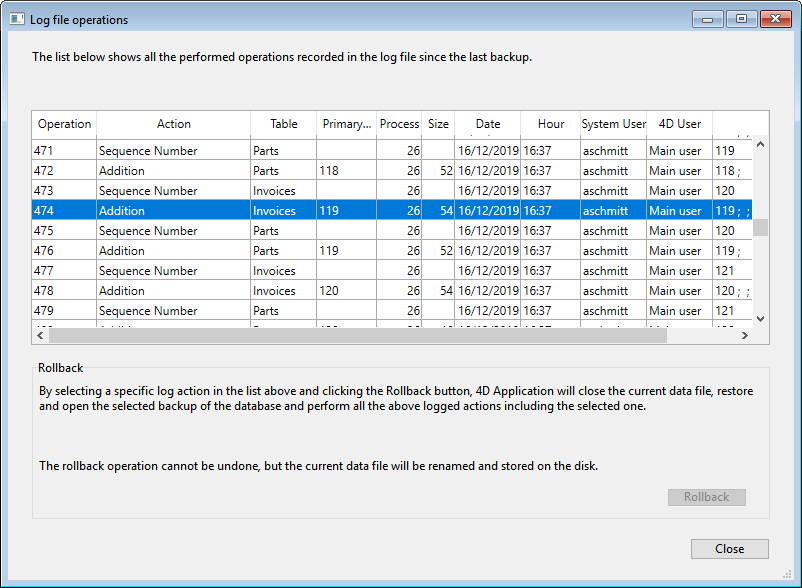

<!--REF #_command_.CHECK LOG FILE.Syntax-->**CHECK LOG FILE**<!-- END REF-->
<!--REF #_command_.CHECK LOG FILE.Params-->
| Este comando no requiere parámetros |  |
| --- | --- |

<!-- END REF-->

#### Descripción 

<!--REF #_command_.CHECK LOG FILE.Summary-->El comando **CHECK LOG FILE** muestra la caja de diálogo de visulización del archivo de historial actual de la base (accesible también vía la ventana del Centro de seguridad y mantenimiento):

Esta caja de diálogo incluye el botón **Volver atrás** que permite cancelar las operaciones efectuadas a los datos de la base.<!-- END REF--> Para mayor información sobre esta caja de diálogo, por favor consulte el Manual de Diseño de 4D.

**Nota:** como la función Volver atrás es relativamente poderosa, es recomendable restringir el acceso al comando CHECK LOG FILE de los administradores de la base..

Este comando sólo puede utilizarse en el contexto de aplicaciones monousuario. Más particularmente, permite acceder a la función volver atrás desde las aplicaciones 4D Volume Desktop (aplicaciones sin modo diseño). Si se llama en una aplicación cliente/servidor, el comando no tiene efecto y devuelve el error 1421.

#### Manejo de errores 

* Si este comando se ejecuta en una base de datos que funciona sin archivo de historial, el comando no hace nada y devuelve el error 1403\.
* Si este comando se ejecuta en una base cliente/servidor, el comando no hace nada y devuelve el error 1421\.  
Puede interceptar estos errores utilizando un método de manejo de errores instalado por el comando [ON ERR CALL](on-err-call.md "ON ERR CALL").

#### Ver también 

*Errores de gestión de backup*  
[RESTORE](restore.md)  

#### Propiedades
|  |  |
| --- | --- |
| Número de comando | 799 |
| Hilo seguro | &check; |
| Modifica variables | error |
| Prohibido en el servidor ||

