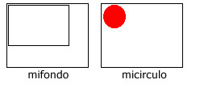
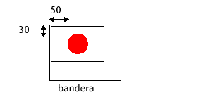

<!--REF #_command_.COMBINE PICTURES.Syntax-->**COMBINE PICTURES** ( *imagenResult* ; *imag1* ; *operador* ; *imag2* {; *despHor* ; *despVert*} )<!-- END REF-->
<!--REF #_command_.COMBINE PICTURES.Params-->
| Parámetro | Tipo |  | Descripción |
| --- | --- | --- | --- |
| imagenResult | Picture | &#8592; | Imagen resultante de la combinación |
| imag1 | Picture | &#8594;  | Primera imagen a combinar |
| operador | Integer | &#8594;  | Tipo de combinación a realizar |
| imag2 | Picture | &#8594;  | Segunda imagen a combinar |
| despHor | Integer | &#8594;  | Desplazamiento horizontal para la superposición |
| despVert | Integer | &#8594;  | Desplazamiento vertical para la superposición |

<!-- END REF-->

#### Descripción 

<!--REF #_command_.COMBINE PICTURES.Summary-->El comando COMBINE PICTURES permite combinar las imágenes *imag1* e *imag2* en modo *operador* para producir una tercera, *imagenResult*.<!-- END REF--> La imagen resultante es de tipo compuesto y conserva todas las características de las imágenes fuente. 

**Nota:** este comando extiende las funcionalidades ofrecidas por los operadores clásicos de transformación de imágenes (+/, etc., ver la sección *Operadores de imágenes*). Estos operadores permanecen totalmente utilizables en 4D v11.

En *operador*, pase el tipo de combinación a aplicar. Se proponen tres tipos de combinaciones, accesibles a través de las constantes del tema “*Picture Transformation*”:

* Horizontal concatenation (1): *imag2* está asociada a *imag1*, la esquina superior izquierda de *imag2* coincide con la esquina superior derecha de *imag1*.
* Vertical concatenation (2): *imag2* está asociada a *imag1*, la esquina superior izquierda de *imag2* coincide con la izquina inferior izquierda de *imag1*.
* Superimposition (3): *imag2* está ubicada sobre *pict1*, la esquina superior izquierda de *imag2* coincide con la esquina superior izquierda de *imag1*.

Si se utilizan los parámetros opcionales *despHor* y *despVert*, una traducción se aplica a *imag2* antes de la superposición. Los valores pasados en *despHor y* *despVert* deben estar en píxeles. Pase valores positivos para un desplazamiento a la derecha o hacia abajo y un valor negativo para un desplazamiento a la izquierda o hacia arriba.

**Nota:** la superposición efectuada por el comando COMBINE PICTURES difiere de la superposición propuesta por los operadores clásicos & y |(superposición exclusiva y superposición inclusiva). Mientras que el comando COMBINE PICTURES conserva las características de cada imagen fuente en la imagen resultantes, los operadores & y | procesan cada píxel y generan una imagen bitmap en todos los casos. Estos operadores, concebidos originalmente para las imágenes monocromáticas, ahora son obsoletos.

#### Ejemplo 

Dadas las siguientes imágenes: 



```4d
 COMBINE PICTURES(bandera;mifondo;Superimposition;micirculo;50;30)
```

Resultado:



#### Ver también 

[TRANSFORM PICTURE](transform-picture.md)  