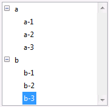
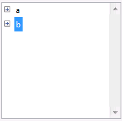
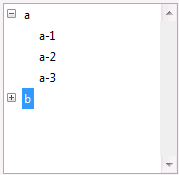

<!--REF #_command_.Count list items.Syntax-->**Count list items** ( {* ;} *lista* {; *} ) : Integer<!-- END REF-->
<!--REF #_command_.Count list items.Params-->
| Parámetro | Tipo |  | Descripción |
| --- | --- | --- | --- |
| * | Operador | &#8594;  | Si se especifica, lista es un nombre de objeto (cadena) Si se omite, lista es un número de referencia de lista |
| lista | Integer, Text | &#8594;  | Número de referencia de lista (si se omite *) o Nombre del objeto de tipo lista (si se pasa *) |
| * | Operador | &#8594;  | Si se omite (por defecto): Devuelve los elementos visibles (desplegados) de la lista Si se especifica: Devuelve todos los elementos de la lista |
| Resultado | Integer | &#8592; | Número de elementos visibles de la lista (desplegados) (si se omite el segundo *) o número total de elementos de la lista (si se presenta el segundo *) |

<!-- END REF-->

*Este comando no es hilo seguro, no puede ser utilizado en código apropiativo.*


#### Descripción 

<!--REF #_command_.Count list items.Summary-->El comando Count list items devuelve el número actual de elementos visibles o el número total de elementos en la lista cuyo número de referencia o nombre de objeto se pasa en *lista*.<!-- END REF-->

Si pasa el primer parámetro opcional \*, indica que el parámetro *lista* es un nombre de objeto (cadena) correspondiente a una representación de lista en el formulario. Si no pasa este parámetro, usted indica que el parámetro *lista* es una referencia de lista jerárquica (*refLista*). Si utiliza una sola representación de lista o trabaja con todos los elementos (pasa el segundo \*), puede utilizar cualquiera de las dos sintaxis. Por el contrario, si usted utiliza varias representaciones de la misma lista y trabaja con los elementos visibles (el segundo \* se omite), la sintaxis basada en el nombre del objeto es necesaria ya que cada representación puede tener su propia configuración desplegada/contraída. 

**Nota:** si utiliza el carácter @ en el nombre del objeto de la lista y el formulario contiene varias listas que coinciden con este nombre, el comando Count list items se aplicará al primer objeto cuyo nombre corresponda. 

Utilice el segundo parámetro \* para determinar que tipo de información se devolverá. Cuando se pasa este parámetro, el comando devuelve el número total de elementos presentes en la lista, sin importar si la lista está desplegada o contraída. 

Cuando se omite este parámetro, el comando devuelve el número de elementos visibles, dependiendo del estado expandido/contraído de la lista y sus sublistas.

Aplique este comando a una lista mostrada en un formulario.

#### Ejemplos 

Acá tenemos una lista llamada *hList* mostrada en el entorno Aplicación:

  


```4d
 $vlNbItems:=Count list items(hList) // en este punto $vlNbItems vale 8
 $vlNbTItems:=Count list items(hList;*) //$vlNbTItems también vale 8
```



```4d
 $vlNbItems:=Count list items(hList) // en este punto $vlNbItems vale 2
 $vlNbTItems:=Count list items(hList;*) //$vlNbTItems continúa valiendo 8
```



```4d
 $vlNbItems:=Count list items(hList) // en este punto $vlNbItems vale 5
 $vlNbTItems:=Count list items(hList;*) //$vlNbTItems continúa valiendo 8
```

#### Ver también 

[List item position](list-item-position.md)  
[Selected list items](selected-list-items.md)  