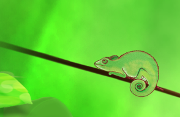
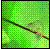
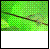
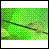

<!--REF #_command_.CREATE THUMBNAIL.Syntax-->**CREATE THUMBNAIL** ( *fuente* ; *dest* {; *ancho* {; *altura* {; *modo* {; *profundidad*}}}} )<!-- END REF-->
<!--REF #_command_.CREATE THUMBNAIL.Params-->
| Parámetro | Tipo |  | Descripción |
| --- | --- | --- | --- |
| fuente | Picture | &#8594;  | Campo o variable imagen 4D a convertir en miniatura |
| dest | Picture | &#8592; | Miniatura resultante |
| ancho | Integer | &#8594;  | Largo de la miniatura en píxeles, Valor por defecto = 48 |
| altura | Integer | &#8594;  | Alto de la miniatura en píxeles, Valor por defecto = 48 |
| modo | Integer | &#8594;  | Modo de creación de la miniatura Valor por defecto = Proporcional centrado (6) |
| profundidad | Integer | &#8594;  | Colores de la miniatura en bits/píxeles Valor por defecto = Profundidad de pantalla actual (0) |

<!-- END REF-->

#### Descripción 

<!--REF #_command_.CREATE THUMBNAIL.Summary-->El comando CREATE THUMBNAILdevuelve una miniatura a partir de una imagen fuente.<!-- END REF--> Las miniaturas se utilizan generalmente para la previsualización de imágenes en software multimedia o sitios web.

Pase en el parámetro *fuente* la variable o el campo imagen 4D que contiene la imagen a reducir en forma de miniatura y en el parámetro *dest* el campo o variable imagen 4D que debe recibir la miniatura resultante.  
  
Los parámetros opcionales *largo* y *alto* definen el tamaño en píxeles de la miniatura. si omite estos parámetros, el tamaño por defecto de la miniatura será de 48 x 48 píxeles.

El parámetro opcional *modo* define el modo de creación de la miniatura, es decir la manera en que será redimensionada. Hay tres modos disponibles. Las siguientes constantes predefinidas son suministradas por 4D en el tema *Formatos de salida de imágenes*:

| Constante                   | Tipo         | Valor |
| --------------------------- | ------------ | ----- |
| Scaled to fit               | Entero largo | 2     |
| Scaled to fit proportional  | Entero largo | 5     |
| Scaled to fit prop centered | Entero largo | 6     |

**Nota:** sólo estas tres constantes pueden ser utilizadas con CREATE THUMBNAIL. Las otras constantes en este tema no pueden aplicarse a este comando. 

Si no introduce ningún parámetro, el modo 6 “Scaled to fit prop centered” se aplica por defecto. A continuación se ilustran los diferentes modos:

Imagen fuente   

Miniaturas resultantes (48x48)

* Scaled to fit = 2  

* Scaled to fit proportional = 5  

* Scaled to fit prop centered = 6 (modo por defecto)  

**Nota:** con los modos “Scaled to fit proportional” y “Scaled to fit prop centered”, los espacios vacíos aparecerán en blanco. Cuando estos modos se aplican a campos o imágenes en formularios 4D, el espacio libre es transparente.

El parámetro *profundidad* se ignora y por lo tanto debe omitirse. El comando siempre utiliza la profundidad de pantalla actual (número de colores). 

El parámetro opcional *profundidad* define el número de colores bajo Mac OS (es decir, la profundidad de pantalla) a conservar en la miniatura resultante. El parámetro es un entero igual al número de bits por píxel: 1, 2, 4, 8, 16 ó 32\. Introduzca 0 para utilizar la profundidad de pantalla actual (valor por defecto).

**Nota:** bajo Windows, se ignora el parámetro *profundidad*; el comando siempre utiliza la profundidad de pantalla actual.
