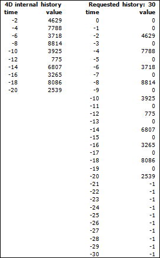

<!--REF #_command_.Database measures.Syntax-->**Database measures** {( *opciones* )} : Object<!-- END REF-->
<!--REF #_command_.Database measures.Params-->
| Parámetro | Tipo |  | Descripción |
| --- | --- | --- | --- |
| opciones | Object | &#8594;  | Opciones de retorno |
| Resultado | Object | &#8592; | Objeto que contiene las medidas de la base |

<!-- END REF-->

#### Descripción 

<!--REF #_command_.Database measures.Summary-->El comando **Database measures** le permite obtener información detallada acerca de los eventos del motor de base de datos 4D.<!-- END REF--> La información reenviada incluye los accesos lectura/escritura a los datos desde/hacia el disco o la memoria caché, así como también la utilización de los índices de la base, las búsquedas y las ordenaciones.   

**Database measures** devuelve un único objeto que contiene todas las medidas relevantes. El parámetro *opciones* le permite configurar las opciones para la información devuelta.

##### Presentación del objeto devuelto 

El objeto devuelto contiene una sola propiedad llamada "DB", que tiene la siguiente estructura básica:

```json
{    "DB": {        "diskReadBytes": {…},        "cacheReadBytes": {…},        "cacheMissBytes": {…},        "diskWriteBytes": {…},        "diskReadCount": {…},        "cacheReadCount": {…},        "cacheMissCount": {…},        "diskWriteCount": {…},        "dataSegment1": {…},        "indexSegment": {…},        "tables": {…},        "indexes": {…}    }}
```

Este objeto está compuesto de ocho propiedades que contienen las medidas básicas ("diskReadBytes", "cacheReadBytes", "cacheMissBytes", "diskWriteBytes", "diskReadCount", "cacheReadCount", "cacheMissCount", "diskWriteCount") y propiedades adicionales ("dataSegment1 "," indexSegment ", "tables", "index") que también pueden contener propiedades elementales, pero a un nivel diferente y con un alcance diferente (ver más adelante).   
  
**Nota**: una propiedad sólo está presente en el interior del objeto si éste recibe contenido. Cuando una propiedad no tiene ningún contenido, no está incluida en el objeto. Por ejemplo, si la base se ha abierto en modo de sólo lectura y los índices no se han utilizado, el objeto devuelto no contendrá "diskWriteBytes", "diskWriteCount", "indexSegment" e "indexes".

##### Propiedades elementales 

Las propiedades elementales se pueden encontrar en los diferentes niveles del objeto DB. La propiedades elementales devuelven la misma información pero con alcances diferentes. Esta es una descripción de las propiedades elementales:   
  
| **Nombre**     | **Información devuelta**               |
| -------------- | -------------------------------------- |
| diskReadBytes  | Bytes leídos desde el disco            |
| cacheReadBytes | Bytes leídos desde la caché            |
| cacheMissBytes | Bytes faltantes de la caché            |
| diskWriteBytes | Bytes escritos en el disco             |
| diskReadCount  | Acceso en lectura desde el disco       |
| cacheReadCount | Acceso en lectura desde la caché       |
| cacheMissCount | Acceso de lectura faltante en la caché |
| diskWriteCount | Acceso en escritura en el disco        |

Las ocho propiedades elementales tienen la misma estructura del objeto, por ejemplo:

```json
"diskReadBytes": {
    "value": 33486473620,
    "history": [        // optional
        {"value": 52564,"time": -1665},
        {"value": 54202,"time": -1649},
            …
    ]
}
```

* "**value**" (número): la propiedad "value" contiene un número que representa o bien una cantidad de bytes o un conteo de accesos. Básicamente, este valor es la suma de los valores del objeto "history" (aunque el objeto "history" no esté presente).
"**history**" (array de objetos): el array de objetos "history" es una compilación de valores de eventos agrupados por segundo. La propiedad "history" sólo está presente si se solicita a través del parámetro *opciones* (ver a continuación). El array history tendrá un máximo de 200 elementos. Cada elemento del array es en sí mismo un objeto que contiene dos propiedades: "value" y "time".  
* "value" (número): cantidad de bytes o accesos manipulados durante el período de tiempo designado en la propiedad "time" asociada.
"time" (número): número de segundos transcurridos desde que se ha llamado la función. En el ejemplo anterior ("time": -1649) significa 1649 segundos atrás (o más precisamente entre 1649 y 1650 segundos). Durante este período de un segundo, 54,202 bytes se han leído en el disco.   
El array history no contiene valores secuenciales (-1650, -1651, -1652, etc.) El valor anterior es -1665, lo que significa que nada se leyó en el disco en el período de 15 segundos entre 1650 y 1665\.   
**Nota:** Por defecto, el array contendrá solamente información útil.  
Dado que el tamaño máximo del array es 200, si la base de datos se utiliza intensivamente (algo se lee cada segundo en el disco), la longitud máxima de la h6istoria será de 200 segundos. Por otro lado, si casi no pasa nada, excepto, por ejemplo, una vez cada 3 minutos, la longitud de la historia será de 600 minutos (3\*200).   
Este ejemplo puede ser representado en el siguiente diagrama:  
 

##### dataSegment1 y indexSegment 

Las propiedades "dataSegment1" e "indexSegment" pueden contener hasta cuatro propiedades elementales (cuando están disponibles): 

```json
"dataSegment1": {    "diskReadBytes": {…},    "diskWriteBytes": {…},    "diskReadCount": {…},    "diskWriteCount": {…}    },"indexSegment": {    "diskReadBytes": {…},    "diskWriteBytes": {…},    "diskReadCount": {…},    "diskWriteCount": {…}    }
```

Estas propiedades devuelven la misma información que las propiedades elementales, pero detallada para cada archivo de la base: 

* "dataSegment1" representa el archivo de datos .4dd en el disco
* "indexSegment" representa el archivo de índice .4dx en el disco

  
Por ejemplo, se puede obtener el siguiente objeto:

```json
{
"DB": {
"diskReadBytes": {
    "value": 718260
    },
"diskReadCount": {
    "value": 229
    },

"dataSegment1": {
    "diskReadBytes": {
    "value": 679092
    },
    "diskReadCount": {
    "value": 212
    }
    },
"indexSegment": {
    "diskReadBytes": {
    "value": 39168
    },
    "diskReadCount": {
    "value": 17
    }
}
```

Los valores devueltos corresponden a las fórmulas siguientes:

*diskReadBytes.value = dataSegment1.diskReadBytes.value + indexSegment.diskReadBytes.value* 
*diskWriteBytes.value = dataSegment1.diskWriteBytes.value + indexSegment.diskWriteBytes.value* 
*diskReadCount.value = dataSegment1.diskReadCount.value + indexSegment.diskReadCount.value* 
*diskWriteCount.value = dataSegment1.diskWriteCount.value + indexSegment.diskWriteCount.value* 

##### tables 

La propiedad "tables" contiene tantas propiedades como tablas que hayan sido accedidas, ya sea en modo de lectura o escritura desde la apertura de la base. El nombre de cada propiedad es el nombre de la tabla en cuestión. Por ejemplo:  
  
```json
"tables": {
    "Employees": {…)
    "Companies": {…)
    }
```
  
  
Cada objeto "table" contiene hasta 12 propiedades:
* Las primeras ocho propiedades son las *propiedades elementales* (ver más arriba) con los valores relacionados a la tabla implicada.
* Las otras dos propiedades, "records" y "blobs", también tienen las mismas ocho propiedades elementales, pero limitadas a ciertos tipos de campos:
* * La propiedad "records" se refiere A todos los campos de la tabla (cadenas, fechas, números, etc.) a excepción de texto, imágenes y BLOBs.  
         * La propiedad "blobs" se refiere a los campos de tipo texto, imagen y BLOB de la tabla.
* Una o dos propiedades adicionales, "fields" y "queries", también pueden estar presentes en función de las búsquedas y las ordenaciones realizadas en la tabla concerniente:
* * La propiedad "fields" contiene el mayor número de atributos "nombre de campo" (que también son sub-objetos) como el número de campos que se utilizan para las búsquedas u ordenaciones.  
   Cada objeto nombre de campo contiene:  
         * un objeto "queryCount" (con o sin historia, dependiendo del parámetro *opciones*) si una búsqueda se ha realizado utilizando este campo  
         * y/o un objeto "sortCount" (con o sin historia, dependiendo del parámetro *opciones*) si una ordenación se ha realizado utilizando este campo.  
   Este atributo no se basa en el uso de índices; Todos los tipos de búsquedas y de ordenaciones se tienen en cuenta.  
   Ejemplo: desde el lanzamiento de la base, varias búsquedas y ordenaciones se han llevado a cabo utilizando los campos *CompID*, *Name* y *FirstName*. TEl objeto devuelto contiene el siguiente sub-objeto "fields" (*opciones* con ruta y sin historial):  
         
   ```json  
   {  
       "DB": {  
           "tables": {  
               "Employees": {  
                   "fields": {  
                       "CompID": {  
                           "queryCount": {  
                               "value": 3  
                           }  
                       },  
                       "Name": {  
                           "queryCount": {  
                               "value": 1  
                           },  
                           "sortCount": {  
                               "value": 3  
                           }  
                       },  
                       "FirstName": {  
                           "sortCount": {  
                               "value": 2  
                           }  
                       }  
   (...)  
   ```  
         
   **Nota**: el atributo "fields" se crea únicamente si una búsqueda o una ordenación se ha efectuado en la tabla; de lo contrario este atributo no estará presente.
* "queries" es un array de objetos que ofrece una descripción de cada búsqueda realizada en la tabla. Cada elemento del array contendrá tres atributos:  
   * "queryStatement" (cadena): cadena de búsqueda (que contienen los nombres de los campo, pero no los valores buscados). Por ejemplo: "(Companies.PK\_ID != ?)"  
   * "queryCount" (objeto):  
         * "value" (número): número de veces que la cadena de búsqueda se ha ejecutado, sin importar los valores buscados.  
         * "history" (array de objetos) (si se solicita en *opciones*): propiedades del historial estándar "value" y "time"  
   * "duration" (objeto) (si "value" es >0)  
         * "value" (número): número de milisegundos  
         * "history" (array de objetos) (si se solicita en *opciones*): propiedades del historial estándar "value" y "time"
Ejemplo: desde el momento en que se lanza la base, una sola búsqueda se ha realizado en la tabla Employees (*opciones* son con ruta y con historial):  

```json
{
            "DB": {
              "tables": {
                "Employees": {
                    "queries": [
                    {
                        "queryStatement": "(Employees.Name == ?)",
                        "queryCount": {<p>                            "value": 1,
                            "history": [
                                {
                                    "value": 1,
                                    "time": -2022
                                }
                            ]
                        },
                        "duration": {
                            "value": 2,
                            "history": [
                                {
                                    "value": 2,
                                    "time": -2022
                                }
                            ]
                        }
                    },
(...)
```

  
**Nota:** el atributo "queries" se crea cuando al menos una búsqueda se ha efectuado en la tabla.

##### indexes 

Este es el objeto más complejo. Todas las tablas a las cuales se ha tenido acceso utilizando uno o varios de sus índices se almacenan como propiedades y en el interior de las propiedades, también se incluyen los nombres de los índices utilizados como propiedades. Los índices de palabras claves aparecen por separado y sus nombres están seguidos por "*(Keyword)*". Por último, cada objeto nombre de índice contiene los ocho propiedades elementales relacionadas con este índice así como también un máximo de cuatro sub-objetos en función del uso del índice de la base desde su lanzamiento (cada sub-objeto sólo existe si al menos una operación correspondiente se ha realizado en algún momento desde el lanzamiento de la base).  
  
Ejemplo: desde el lanzamiento de la base, varios índices del campo \[Employees\] EmpLastName han sido solicitados. Además, 2 registros fueron creados y 16 se suprimieron en la tabla \[Companies\]. Esta tabla tiene un campo "name" que está indexado. La tabla también se ha consultado y ordenado utilizando este campo. El objeto resultante contendrá:

```json
"indexes": {
    "Employees": {
        "EmpLastName": {
                    "diskReadBytes": {…},
                    "cacheReadBytes": {…},
                    "cacheMissBytes": {…},
                    "diskWriteBytes": {…},

                    "diskReadCount": {…},
                    "cacheReadCount": {…},
                    "cacheMissCount": {…},
                    "diskWriteCount": {…}
            }
        "EmpLastName (Keyword)": {...},
        "index3Name": {…},
        "index4Name": {…},
        …
        }
        "Companies": {
            "Name": 
            (...)
                "queryCount": {
                    "value": 41
                },
                "sortCount": {
                    "value": 3
                },
                "insertKeyCount": {
                    "value": 2
                },
                "deleteKeyCount": {
                    "value": 16
                }
    table3Name: {…}
}
```

##### Parámetro options 

El parámetro *opciones* le permite personalizar la información real que devuelve el comando. En *opciones*, se pasa un objeto que puede contener hasta tres propiedades: "withHistory", "historyLength" y "path".

| **Propiedad**   | **Tipo**                 | **Descripción**                                                                                                                                                                                                                                                                                                                                                                                                                                                                                                                                             |
| --------------- | ------------------------ | ----------------------------------------------------------------------------------------------------------------------------------------------------------------------------------------------------------------------------------------------------------------------------------------------------------------------------------------------------------------------------------------------------------------------------------------------------------------------------------------------------------------------------------------------------------- |
| "withHistory"   | Booleano                 | "true" significa que el objeto "history" será devuelto por la función dentro del objeto devuelto; "false" significa que el objeto devuelto por la función no contendrá el objeto "history"                                                                                                                                                                                                                                                                                                                                                                  |
| "historyLength" | número                   | Define el tamaño del array history devuelto en segundos(\*).                                                                                                                                                                                                                                                                                                                                                                                                                                                                                                |
| "path"          | cadena\|array de cadenas | Ruta completa de la propiedad específica o array de rutas completas de las propiedades específicas que desea obtener. Si pasa una cadena, sólo el valor correspondiente se devuelve en el objeto "DB" (si la ruta es válida). Ejemplo "DB.tables.Employees.records.diskWriteBytes". Cuando se pasa un array de cadenas, todos los valores correspondientes son devueltos en el objeto "DB" (si las rutas son válidas). Ejemplo: \["DB.tables.Employee.records.diskWriteBytes", "DB.tables.Employee.records.diskReadCount","DB.dataSegment1.diskReadBytes"\] |

(\*) Como se describió anteriormente, la historia no se almacena como una secuencia de segundos, sino sólo con valores relevantes. Si no ocurre nada durante un par de segundos o más, nada se almacena y una brecha aparecerá en el array de historial interno. "time" puede contener, por ejemplo, -2, -4, -5, -10, -15, -30 con valores de 200, 300, 250, 400, 500,150\. Si la propiedad "historyLength" está definida en 600 (10 minutos), luego el array devuelto contendrá 0, -1, -2, -3 ... -599 para "time" y sólo los valores -2, -4, - 5, -10, -15, -30 se llenarán. Todos los demás valores se pondrán en 0 (cero) como valor. También como se describió anteriormente, el único límite del array interno es el tamaño (200), no el tiempo. Esto significa que si hay una baja actividad para una propiedad específica, el tiempo más antiguo puede ser muy grande (por ejemplo: -3600 para hace una hora). También puede contener menos de 200 valores si la base se acaba de iniciar. En estos casos, si el tiempo del historial interno es menor al solicitado o si todos los valores importantes que ya se han definido en el array devuelto, el valor devuelto será -1.  
Ejemplo: la base sólo se inició hace 20 segundos y la historia de la petición es de 60 segundos. Los valores devueltos entre 0 y -20 se definen con valores o ceros y los otros se establecerán con -1\. Cuando un valor "-1" se devuelve, esto significa que, o bien el tiempo de solicitud es demasiado antiguo o que el valor ya no está en el array de historia interna (es decir, se ha llegado al límite de los 200 elementos y se han eliminado los valores mayores).

##### Cliente/servidor y componentes 

Este comando devuelve la información sobre el uso de la base de datos. Esto significa que le devuelve un objeto válido con valores relevantes sólo cuando se le llama: 

* en modo local 4D (si se llama desde un componente, devuelve información acerca de la base de datos del host)
* en el servidor en modo cliente/servidor.

Si el comando se llama desde un 4D remoto, luego el objeto se deja vacío.   
En este contexto, si necesita obtener información acerca de la base de datos en el servidor, la forma más sencilla de realizar esta acción es crear un método con la opción "ejecutar en el servidor" activada.   
Este principio también funciona para un componente: si el componente se utiliza en un contexto local 4D, devolverá la información sobre la base local; en un contexto 4D remoto, devolverá la información sobre la base del servidor.

#### Ejemplo 1 

Usted desea obtener el objeto "history" en el objeto devuelto:

```4d
 var $param : Object
 var $measures : Object
 OB SET($param;"withHistory";True)
 $measures:=Database measures($param)
```

#### Ejemplo 2 

Sólo queremos saber el número total de bytes leídos en la memoria caché ("cacheReadBytes"):   
  
```4d
 var $oStats : Object
 var $oParams : Object
 OB SET($oParams;"path";"DB.cacheReadBytes")
 $oStats:=Database measures($oParams)
```

El objeto devuelto contiene, por ejemplo:

```json
{
    "DB": {
        "cacheReadBytes": {
            "value": 9516637
        }
    }
}
```

#### Ejemplo 3 

Queremos obtener las medidas de bytes de caché en los últimos dos minutos:

```4d
 var $oParams : Object
 var $measures : Object
 OB SET($oParams;"path";"DB.cacheReadBytes")
 OB SET($oParams;"withHistory";True)
 OB SET($oParams;"historyLength";2*60)
 $measures:=Database measures($oParams)
```


#### Propiedades

|  |  |
| --- | --- |
| Número de comando | 1314 |
| Hilo seguro | &check; |


