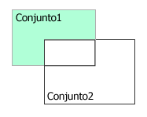

<!--REF #_command_.DIFFERENCE.Syntax-->**DIFFERENCE** ( *conjunto1* ; *conjunto2* ; *resultado* )<!-- END REF-->
<!--REF #_command_.DIFFERENCE.Params-->
| Parámetro | Tipo |  | Descripción |
| --- | --- | --- | --- |
| conjunto1 | Text | &#8594;  | Conjunto inicial |
| conjunto2 | Text | &#8594;  | Conjunto a restar |
| resultado | Text | &#8594;  | Conjunto resultante |

<!-- END REF-->

#### Descripción 

<!--REF #_command_.DIFFERENCE.Summary-->DIFFERENCE fusiona *conjunto1* y *conjunto2* y excluye del conjunto *resultado* todos los registros de *conjunto2*.<!-- END REF--> En otras palabras, un registro se incluye en el *resultado* sólo si está en *conjunto1*, pero no en *conjunto2*. La siguiente tabla muestra todos los resultados posibles de una operación de diferencia de conjuntos. 

| **Conjunto1** | **Conjunto2** | **Conjunto resultante** |
| ------------- | ------------- | ----------------------- |
| Sí            | No            | Sí                      |
| Sí            | Sí            | No                      |
| No            | Yes           | No                      |
| No            | No            | No                      |

El esquema a continuación representa gráficamente una operación de diferencia entre dos conjuntos. El área de color es el conjunto resultante.

  
El conjunto *resultado* se crea por DIFFERENCE. El conjunto *resultado* reemplaza todo conjunto que exista con el mismo nombre, incluyendo *conjunto1* y *conjunto2*. Los conjuntos *conjunto1* y *conjunto2* deben ser de la misma tabla. El conjunto *resultado* pertenece a la misma tabla que *conjunto1* y *conjunto2*.

**4D Server:** en modo cliente/Servidor, los conjuntos interprocesos y procesos se conservan en el equipo servidor, mientras que los conjuntos locales se mantiene en los equipos cliente. DIFFERENCE requiere que los tres conjuntos estén en el mismo equipo. Por lo tanto, todos los conjuntos deben ser locales o ninguno de ellos debe ser local. Para mayor información consulte *4D Server and Sets* en el manual de referencia de 4D Server.

#### Ejemplo 

Este ejemplo excluye los registros seleccionados por el usuario. Los registros se muestran en la pantalla con la siguiente instrucción:

```4d
 DISPLAY SELECTION([Clientes]) // Visualización de los clientes en una lista
```

Al final de la lista de registros hay un botón con un método de objeto. El método de objeto excluye los registros seleccionados por el usuario (el conjunto sistema llamado “UserSet”), y muestra una selección reducida:

```4d
 CREATE SET([Clientes];"$Actual") // Creación de un conjunto a partir de la selección actual
 DIFFERENCE("$Actual";"UserSet";"$Actual") // Exclusión de los registros seleccionados
 USE SET("$Actual") // Utilización del nuevo conjunto
 CLEAR SET("$Actual") // Borrar el conjunto
```

#### Ver también 

[INTERSECTION](intersection.md)  
[UNION](union.md)  

#### Propiedades
|  |  |
| --- | --- |
| Número de comando | 122 |
| Hilo seguro | &check; |


