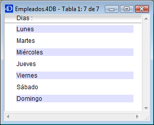

<!--REF #_command_.Displayed line number.Syntax-->**Displayed line number**  : Integer<!-- END REF-->
<!--REF #_command_.Displayed line number.Params-->
| Parámetro | Tipo |  | Descripción |
| --- | --- | --- | --- |
| Resultado | Integer | &#8592; | Número de línea mostrada |

<!-- END REF-->

#### Descripción 

<!--REF #_command_.Displayed line number.Summary-->El comando Displayed line number funciona únicamente en el contexto del evento de formulario On Display Detail.<!-- END REF-->  Devuelve el número de la línea que está siendo procesada mientras una lista de registros es mostrada en pantalla. Si Displayed line number se llama cuando no se muestra una lista, devuelve 0.

Si la línea mostrada no está vacía (cuando está asociada a un registro), el valor devuelto por Displayed line number es idéntico al valor devuelto por [Selected record number](selected-record-number.md "Selected record number").

Como [Selected record number](selected-record-number.md "Selected record number"), Displayed line number comienza en 1\. Este comando es útil cuando quiere aplicar un proceso a cada línea de un formulario listado o de un list-box mostrado en pantalla, incluyendo las líneas vacías. 

#### Ejemplo 

Este ejemplo le permite aplicar un color alterno en un formulario listado mostrado en pantalla, incluso para las líneas sin registros:

```4d
  //List form method
 If(Form event code=On Display Detail)
    If(Displayed line number% 2=0)
  //Negro sobre blanco para un texto de fila par
       OBJECT SET RGB COLORS([Table 1]Field1;-1;0x00FFFFFF)
    Else
  //Negro sobre azul claro para texto de fila impar
       OBJECT SET RGB COLORS([Table 1]Field1;-1;0x00E0E0FF)
    End if
 End if
```



#### Ver también 

[Form event code](form-event-code.md)  
[Selected record number](selected-record-number.md)  

#### Propiedades

|  |  |
| --- | --- |
| Número de comando | 897 |
| Hilo seguro | &cross; |


