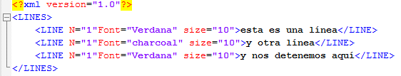

<!--REF #_command_.DOM Count XML attributes.Syntax-->**DOM Count XML attributes** ( *elementRef* ) : Integer<!-- END REF-->
<!--REF #_command_.DOM Count XML attributes.Params-->
| Parámetro | Tipo |  | Descripción |
| --- | --- | --- | --- |
| elementRef | Text | &#8594;  | Referencia del elemento XML |
| Resultado | Integer | &#8592; | Número de atributos |

<!-- END REF-->

#### Descripción 

<!--REF #_command_.DOM Count XML attributes.Summary-->El comando DOM Count XML attributes devuelve el número de los atributos XML presentes en el elemento XML designado por *refElement*.<!-- END REF--> Para mayor información sobre los atributos XML, consulte la sección *Presentación de los comandos XML DOM*.

#### Ejemplo 

Antes de recuperar los valores de los elementos en un array, usted quiere conocer el número de atributos en el siguiente elemento: 



```4d
 var myBlobVar : Blob
 var $xml_Parent_Ref;$xml_Child_Ref : Text
 var myResult : Text
 var $numAttributes : Integer
 
 $xml_Parent_Ref:=DOM Parse XML variable(myBlobVar)
 $xml_Child_Ref:=DOM Get first child XML element($xml_Parent_Ref)
 
 $numAttributes:=DOM Count XML attributes($xml_Child_Ref)
 ARRAY TEXT(tAttrib;$numAttributes)
 ARRAY TEXT(tValAttrib;$numAttributes)
 For($i;1;$numAttributes)
    DOM GET XML ATTRIBUTE BY INDEX($xml_Child_Ref;$i;tAttrib{$i};tValAttrib{$i})
 End for
```

En el ejemplo anterior, $numAttributes es igual a 3, tAttrib{1} contiene “Font”, tAttrib{2} contiene “N”, tAttrib{3} contiene “size” y tValAttrib contiene “Verdana”, “1” y “10”.

**Nota:** el número de índice no corresponde a la ubicación del atributo en el archivo XML mostrado en forma de texto. En XML, el índice de un atributo indica su posición entre los atributos clasificados por orden alfabético (en función de su nombre).

#### Variables y conjuntos del sistema 

Si el comando se ha ejecutado correctamente, la variable sistema OK toma el valor 1\. Si ocurre un error, toma el valor 0.

#### Ver también 

[DOM Count XML elements](dom-count-xml-elements.md)  