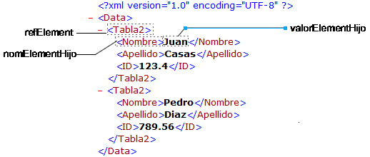

<!--REF #_command_.DOM Get first child XML element.Syntax-->**DOM Get first child XML element** ( *elementRef* {; *nomElementHijo* {; *valorElementHijo*}} ) : Text<!-- END REF-->
<!--REF #_command_.DOM Get first child XML element.Params-->
| Parámetro | Tipo |  | Descripción |
| --- | --- | --- | --- |
| elementRef | Text | &#8594;  | Referencia del elemento XML |
| nomElementHijo | Text | &#8592; | Nombre del elemento XML hijo |
| valorElementHijo | Text | &#8592; | Valor del elemento XML hijo |
| Resultado | Text | &#8592; | Referencia del elemento XML hijo |

<!-- END REF-->

#### Descripción 

<!--REF #_command_.DOM Get first child XML element.Summary-->El comando DOM Get first child XML element devuelve una referencia XML al primer “hijo” del elemento XML pasado en *refElement*.<!-- END REF--> Esta referencia puede utilizarse con otros comandos de análisis XML. 

Los parámetros *nomElementHijo* y *valorElemHijo*, si se pasan, reciben respectivamente el nombre y el valor del elemento hijo.  



#### Ejemplo 1 

Recuperación de la referencia del primer elemento XML del padre raíz. La estructura XML (C:\\\\import.xml) se carga previamente en un BLOB: 

```4d
 var miVarBlob : Blob
 var $xml_Padre_Ref;$xml_Hijo_Ref : Text
 
 DOCUMENT TO BLOB("c:\\importar.xml";miVarBlob)
 $xml_Padre_Ref:=DOM Parse XML variable(miVarBlob)
 $xml_Hijo_Ref:=DOM Get first child XML element($xml_Padre_Ref)
```

#### Ejemplo 2 

Recuperación de la referencia, del nombre y del valor del primer elemento XML del padre raíz. La estructura XML (C:\\\\importar.xml) se carga previamente en un BLOB: 

```4d
 var miVarBlob : Blob
 var $xml_Padre_Ref;$xml_Hijo_Ref : Text
 var $hijoNom;$hijoValor : Text
 
 DOCUMENT TO BLOB("c:\\importar.xml";miVarBlob)
 $xml_Padre_Ref:=DOM Parse XML variable(miVarBlob)
 $xml_Hijo_Ref:=DOM Get first child XML element($xml_Padre_Ref;$hijoNom;$hijoValor)
```

#### Variables y conjuntos del sistema 

Si el comando se ejecutó correctamente, la variable sistema OK toma el valor 1\. De lo contrario, toma el valor 0.

#### Ver también 

[DOM Get next sibling XML element](dom-get-next-sibling-xml-element.md)  

#### Propiedades
|  |  |
| --- | --- |
| Número de comando | 723 |
| Hilo seguro | &check; |
| Modifica variables | OK |
| Prohibido en el servidor ||


