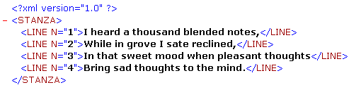

<!--REF #_command_.DOM GET XML ATTRIBUTE BY NAME.Syntax-->**DOM GET XML ATTRIBUTE BY NAME** ( *elementRef* ; *nomAtrib* ; *valorAtrib* )<!-- END REF-->
<!--REF #_command_.DOM GET XML ATTRIBUTE BY NAME.Params-->
| Parámetro | Tipo |  | Descripción |
| --- | --- | --- | --- |
| elementRef | Text | &#8594;  | Referencia del elemento XML |
| nomAtrib | Text | &#8594;  | Nombre del atributo |
| valorAtrib | Variable | &#8592; | Valor del atributo |

<!-- END REF-->

#### Descripción 

<!--REF #_command_.DOM GET XML ATTRIBUTE BY NAME.Summary-->El comando DOM GET XML ATTRIBUTE BY NAMEpermite conocer el valor de un atributo especificado por su nombre.<!-- END REF-->

Pase en *refElement* la referencia de un elemento XML y en *nomAtrib* el nombre del atributo del que quiere conocer su valor. El valor se devuelve en el parámetro *valorAtrib*. 4D intentará convertir el valor obtenido en el tipo de la variable pasada como parámetro. Si el tipo de variable no está definido, el valor se devuelve en tipo de texto de forma predeterminada.

Si no existe ningún atributo *nomAtrib* en el elemento XML, se devuelve un error. Si varios atributos del elemento XML tienen el mismo nombre, sólo se devuelve el valor del primer atributo.

#### Ejemplo 

Este método se utiliza para recuperar un valor de atributo XML utilizando su nombre:

```4d
 var miVarBlob : Blob
 var $ref_XML_Padre;$ref_XML_Hijo : Text
 var $NumLinea : Integer
 
 $ref_XML_Padre:=DOM Parse XML variable(miVarBlob)
 $ref_XML_Hijo:=DOM Get first child XML element($ref_XML_Padre)
 DOM GET XML ATTRIBUTE BY NAME($ref_XML_Hijo;"N";$NumLinea)
```

Si este método se aplica al ejemplo a continuación, $NumLinea contiene el valor 1:



#### Variables y conjuntos del sistema 

Si el comando ha sido ejecutado correctamente, la variable sistema OK toma el valor 1\. Si ocurre un error, toma el valor 0.

#### Ver también 

[DOM GET XML ATTRIBUTE BY INDEX](dom-get-xml-attribute-by-index.md)  
[DOM REMOVE XML ATTRIBUTE](dom-remove-xml-attribute.md)  

#### Propiedades

|  |  |
| --- | --- |
| Número de comando | 728 |
| Hilo seguro | &check; |
| Modifica variables | OK, error |


