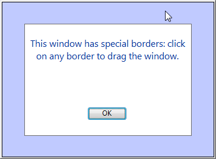

<!--REF #_command_.DRAG WINDOW.Syntax-->**DRAG WINDOW**<!-- END REF-->
<!--REF #_command_.DRAG WINDOW.Params-->
| Este comando no requiere parámetros |  |
| --- | --- |

<!-- END REF-->

*Este comando no es hilo seguro, no puede ser utilizado en código apropiativo.*


#### Descripción 

<!--REF #_command_.DRAG WINDOW.Summary-->El comando DRAG WINDOW permite arrastrar la ventana en la cual el usuario hace clic para desplazarla en función de los movimientos del ratón.<!-- END REF--> Generalmente este comando se llama desde un método de objeto de un objeto que pueda responder instantáneamente a los clics del ratón (por ejemplo un botón invisible).

#### Ejemplo 

El siguiente formulario, mostrado en el editor de formularios, contiene un fondo de color, sobre el cual hay cuatro botones invisibles para cada lado:


Cada botón está asociado al siguiente método:

```4d
 DRAG WINDOW //Comenzar a arrastrar la ventana al hacer clic
```

Después de la ejecución del siguiente método proyecto:

```4d
 $winRef:=Open form window("custom_drag";Modal form dialog box)
 DIALOG("custom_drag")
 CLOSE WINDOW
```

Obtiene una ventana similar a esta:



Luego puede arrastrar la ventana haciendo clic en cualquiera de los bordes.

#### Ver también 

[GET WINDOW RECT](get-window-rect.md)  
[SET WINDOW RECT](set-window-rect.md)  