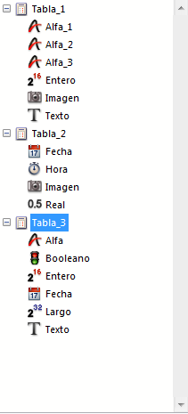

<!--REF #_command_.Find in list.Syntax-->**Find in list** ( {* ;} *lista* ; *valor* ; *alcance* {; *arrayElem* {; *}} ) : Integer<!-- END REF-->
<!--REF #_command_.Find in list.Params-->
| Parámetro | Tipo |  | Descripción |
| --- | --- | --- | --- |
| * | Operador | &#8594;  | Si se especifica, lista es un nombre de objeto (cadena) Si se omite, lista es un número de referencia de lista |
| lista | Integer, Text | &#8594;  | Número de referencia de la lista (si se omite *) o Nombre del objeto de tipo lista (si se pasa *) |
| valor | Text | &#8594;  | Valor a buscar |
| alcance | Integer | &#8594;  | 0=Lista principal, 1=Sublista |
| arrayElem | Integer array | &#8592; | - Si se omite el 2do *: array de posiciones de los elementos encontrados - Si se pasa el segundo *: array de números de referencia de  los elementos encontrados |
| * | Operador | &#8594;  | - Si se omite: utiliza la posición de los elementos - Si se pasa: utiliza el número de referencia de los elementos |
| Resultado | Integer | &#8592; | - Si se omite el 2do *: posición del elemento encontrado - Si se pasa 2do *: número de referencia del elemento encontrado |

<!-- END REF-->

*Este comando no es hilo seguro, no puede ser utilizado en código apropiativo.*


#### Descripción 

<!--REF #_command_.Find in list.Summary-->El comando Find in list devuelve la posición o referencia del primer elemento de la *lista* que es equivalente a la cadena pasada en *valor*.<!-- END REF--> Si se encuentran varios elementos, la función también puede llenar un array *arrayElem* con la posición o la referencia de cada elemento. 

Si pasa el parámetro opcional \*, indica que el parámetro *lista* es un nombre de objeto (cadena) correspondiente a una representación de la lista en el formulario. Si no pasa este parámetro, indica que el parámetro *lista* es una referencia de lista jerárquica (RefLista). Si utiliza una sola representación de lista o trabaja con números de referencia de elementos (se omite el segundo \*), puede utilizar indiferentemente una u otra sintaxis. En cambio, si utiliza varias representaciones de la misma lista y trabaja con posiciones de elementos (se pasa el segundo \*), la sintaxis basada en el nombre del objeto es necesaria ya que la posición de los elementos puede variar de una representación a otra.

**Nota:** si utiliza el carácter @ en el nombre del objeto de la lista y el formulario contiene varias listas que corresponden a este nombre, el comando Find in list se aplicará al primer objeto cuyo nombre corresponda.

El segundo parámetro \* permite indicar si quiere trabajar con las posiciones actuales de los elementos (en ese caso, este parámetro se omite) o con las referencias absolutas de los elementos (en ese caso, debe pasarse).

Pase en *valor* la cadena de caracteres a buscar. La búsqueda será del tipo “exacta”; en otras palabras, la búsqueda de “piedra” no encontrará “piedras”. Sin embargo, puede utilizar el carácter arroba (@) para definir las búsquedas de tipo “comienza por,” “termina en” o “contiene”.

El parámetro *alcance* se utiliza para definir si la búsqueda debe ser llevada a cabo únicamente en el primer nivel de la *list*a o si debe incluir todas las sublistas. Pase 0 para limitar la búsqueda al primer nivel de la lista y 1 para extenderla búsqueda a todas las sublistas.

Si quiere conocer la posición o el número de todos los elementos correspondientes a *valor*, pase un array entero largo en el parámetro opcional *arrayElem*. Si es necesario, el array será creado y redimensionado por el comando. El comando llenará el array con las posiciones (si se omite el segundo \*) o los números de referencia (si se pasa el segundo \*) de los elementos encontrados.

Las posiciones se expresan en relación al elemento superior de la lista principal, teniendo en cuenta el estado actual desplegado/contraído de la lista y de las sublistas.

Si ningún elemento corresponde al *valor* buscado, la función devuelve 0 y el array *arrayElem* se devuelve vacío.

#### Ejemplo 

Dada la siguiente lista jerárquica:



```4d
 $vlItemPos:=Find in list(hList;"I@";1;$arrPos)
  //$vlItemPos igual a 6
  //$arrPos{1} igual a 6 y $arrPos{2} igual a 11
 $vlItemRef:=Find in list(hList;"I@";1;$arrRefs;*)
  //$vlItemRef igual a 7
  //$arrRefs{1} igual a 7 y $arrRefs{2} igual a 18
 $vlItemPos:=Find in list(hList;"Fecha";1;$arrPos)
  //$vlItemPos igual a 9
  //$arrPos{1} igual a 9 y $arrPos{2} igual a 16
 $vlItemRefFind in list(hList;"Fecha";1;$arrRefs;*)
  //$vlItemRef igual a11
  //$arrRefs{1} igual a 11 and $arrRefs{2} igual a 23
 $vlItemPos:=Find in list(hList;"Fecha";0;*)
  //$vlItemPos igual a 0
```
