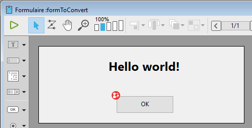

<!--REF #_command_.FORM Convert to dynamic.Syntax-->**FORM Convert to dynamic** ( {*tabla* ;} *nomFormulario* ) : Object<!-- END REF-->
<!--REF #_command_.FORM Convert to dynamic.Params-->
| Parámetro | Tipo |  | Descripción |
| --- | --- | --- | --- |
| tabla | Table | &#8594;  | Tabla de formulario |
| nomFormulario | Text | &#8594;  | Nombre de un proyecto "clásico" o formulario tabla |
| Resultado | Object | &#8592; | nomFormulario convertido a formulario dinámico |

<!-- END REF-->

#### Descripción 

<!--REF #_command_.FORM Convert to dynamic.Summary-->El comando **FORM Convert to dynamic** convierte el *nomFormulario* (formulario clásico) a un formulario dinámico y lo devuelve en un objeto.<!-- END REF-->

Los *formularios clásicos* son formularios 4D almacenados dentro del archivo de estructura en formato binario. Los *formularios dinámicos* son formularios cuyas estructuras se definen en un objeto 4D (o un archivo .json). Para más información, consulte la sección *Formularios dinámicos*.

Si desea convertir un formulario de tabla, pase la tabla de formulario en el parámetro *tabla* y luego pase su nombre como una cadena en *nomFormulario*. Para un formulario de proyecto, pase el nombre del formulario directamente en *nomFormulario*.

Para poder ejecutar el formulario directamente pasando el objeto resultante al comando [DIALOG](dialog.md), **FORM Convert to dynamic** aplica reglas específicas al convertir el formulario:

* Las referencias a listas se exportan por nombre en lugar de un puntero JSON que hace referencia al archivo lists.json.
* Las referencias a los filtros con nombre y a los formatos de visualización con nombre (utilizando el carácter prefijo '|') se exportan por valor en lugar de un puntero JSON que hace referencia al archivo filters.json.
* Dado que las imágenes de la librería de imágenes no son exportadas por el comando, los objetos que hacen referencia a una imagen de la librería de imágenes aún hacen referencia a la librería después de la conversión. En su propiedad "icon", utilizan una url "pictlib: xx" especial, donde *xx* es el ID en la librería.
* Las imágenes estáticas se convierten como propiedades objeto tipo imagen.
* Los objetos obsoletos se ignoran. Consulte el párrafo para ver la lista de objetos o propiedades que no son soportadas en formularios dinámicos.

**Nota:** las referencias al método de formulario y los métodos objeto de formulario se exportan con identificadores internos, que serán válidos solo en la base de datos actual mientras que los métodos *nomFormulario* no se modifiquen. Si desea utilizar el formulario exportado en otro contexto, debe asignar nombres de método de proyecto a la propiedad "método" del formulario u objeto de formulario (ver ejemplo).

#### Ejemplo 

Desea convertir un formulario clásico, modificarlo y mostrarlo.

El formulario original:



```4d
 var $dynForm : Object
 $dynForm:=FORM Convert to dynamic("FormToConvert")
 $dynForm.pages[1].objects.TitleArea.stroke:="red"
 $dynForm.pages[1].objects.bOK.method:="myMethod" //asocia un método proyecto
 DIALOG($dynForm)
```

Si ejecuta el código:  


#### Ver también 

[DIALOG](dialog.md)  
[Export structure file](export-structure-file.md)  

#### Propiedades

|  |  |
| --- | --- |
| Número de comando | 1570 |
| Hilo seguro | &cross; |


