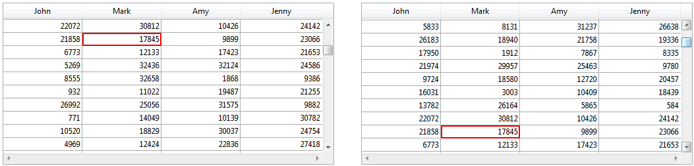

<!--REF #_command_.Form event code.Syntax-->**Form event code**  : Integer<!-- END REF-->
<!--REF #_command_.Form event code.Params-->
| Parámetro | Tipo |  | Descripción |
| --- | --- | --- | --- |
| Resultado | Integer | &#8592; | Número del evento de formulario |

<!-- END REF-->

#### Compatibilidad 

<!--REF #_command_.Form event code.Summary-->**Form event code** se llamaba **Form event** en versiones anteriores de 4D.<!-- END REF--> Se renombró para mayor claridad cuando se agregó el comando [FORM Event](form-event.md), que devuelve un objeto.

#### Descripción 

**Form event code** devuelve un valor numérico que identifica el tipo de evento de formulario que acaba de ocurrir. Generalmente, **Form event code** se utiliza en un método formulario o en un método objeto.

4D ofrece constantes predefinidas (ubicadas en el tema *Eventos formulario*) para comparar los valores devueltos por el comando **Form event code**.

Ciertos eventos son genéricos (generados por todo tipo de objeto) y otros son específicos a un tipo de objeto particular.

| Constante                | Tipo         | Valor | Comentario                                                                                                                                                                                                                                                                                                                                                                                                                                   |
| ------------------------ | ------------ | ----- | -------------------------------------------------------------------------------------------------------------------------------------------------------------------------------------------------------------------------------------------------------------------------------------------------------------------------------------------------------------------------------------------------------------------------------------------- |
| On Load                  | Entero largo | 1     | El formulario se muestra o se imprime                                                                                                                                                                                                                                                                                                                                                                                                        |
| On Mouse Up              | Entero largo | 2     | *(Sólo imágenes)* El usuario acaba de liberar el botón izquierdo del ratón en un objeto Imagen                                                                                                                                                                                                                                                                                                                                               |
| On Validate              | Entero largo | 3     | Se ha valido la entrada de datos en el registro                                                                                                                                                                                                                                                                                                                                                                                              |
| On Clicked               | Entero largo | 4     | Ocurre un clic sobre un objeto                                                                                                                                                                                                                                                                                                                                                                                                               |
| On Header                | Entero largo | 5     | El encabezado del formulario se va a imprimir o a mostrar                                                                                                                                                                                                                                                                                                                                                                                    |
| On Printing Break        | Entero largo | 6     | Se va a imprimir una de las áreas de ruptura del formulario                                                                                                                                                                                                                                                                                                                                                                                  |
| On Printing Footer       | Entero largo | 7     | Se va a imprimir el área de pie de página del formulario                                                                                                                                                                                                                                                                                                                                                                                     |
| On Display Detail        | Entero largo | 8     | Un registro se va a mostrar en una lista o una línea se va a mostrar en un list box.                                                                                                                                                                                                                                                                                                                                                         |
| On VP Ready              | Entero largo | 9     | (*Áreas 4D View Pro únicamente*) La carga del área 4D View Pro está completa                                                                                                                                                                                                                                                                                                                                                                 |
| On Outside Call          | Entero largo | 10    | El formulario recibe una llamada [POST OUTSIDE CALL](post-outside-call.md)                                                                                                                                                                                                                                                                                                                                                                   |
| On Activate              | Entero largo | 11    | La ventana del formulario se convierte en la ventana del primer plano                                                                                                                                                                                                                                                                                                                                                                        |
| On Deactivate            | Entero largo | 12    | La ventana del formulario deja de ser la ventana del primer plano                                                                                                                                                                                                                                                                                                                                                                            |
| On Double Clicked        | Entero largo | 13    | Un objeto ha recibido un doble clic                                                                                                                                                                                                                                                                                                                                                                                                          |
| On Losing Focus          | Entero largo | 14    | Un objeto de formulario está perdiendo el foco                                                                                                                                                                                                                                                                                                                                                                                               |
| On Getting Focus         | Entero largo | 15    | Un objeto de formulario toma el foco                                                                                                                                                                                                                                                                                                                                                                                                         |
| On Drop                  | Entero largo | 16    | Se han soltado datos en un objeto                                                                                                                                                                                                                                                                                                                                                                                                            |
| On Before Keystroke      | Entero largo | 17    | Un carácter está a punto de introducirse en el objeto que tiene el foco. [Get edited text](get-edited-text.md) devuelve el texto del objeto sin este carácter.                                                                                                                                                                                                                                                                               |
| On Menu Selected         | Entero largo | 18    | Se ha seleccionado un comando de menú                                                                                                                                                                                                                                                                                                                                                                                                        |
| On Plug in Area          | Entero largo | 19    | Un objeto externo solicitó que se ejecute su método de objeto                                                                                                                                                                                                                                                                                                                                                                                |
| On Data Change           | Entero largo | 20    | Se han modificado los datos de un objeto                                                                                                                                                                                                                                                                                                                                                                                                     |
| On Drag Over             | Entero largo | 21    | Los datos pueden soltarse en un objeto                                                                                                                                                                                                                                                                                                                                                                                                       |
| On Close Box             | Entero largo | 22    | Se ha hecho clic en la casilla de cerrar la ventana                                                                                                                                                                                                                                                                                                                                                                                          |
| On Printing Detail       | Entero largo | 23    | Se va a imprimir el área de detalle del formulario                                                                                                                                                                                                                                                                                                                                                                                           |
| On Unload                | Entero largo | 24    | El formulario se cierra y libera                                                                                                                                                                                                                                                                                                                                                                                                             |
| On Open Detail           | Entero largo | 25    | El formulario detallado asociado con el formulario de salida o con el listbox está apunto de ser abierto                                                                                                                                                                                                                                                                                                                                     |
| On Close Detail          | Entero largo | 26    | Se cierra el formulario de entrada y regresa al formulario de salida                                                                                                                                                                                                                                                                                                                                                                         |
| On Timer                 | Entero largo | 27    | El número de tics definido por el comando [SET TIMER](set-timer.md) se ha pasado                                                                                                                                                                                                                                                                                                                                                             |
| On After Keystroke       | Entero largo | 28    | Un carácter está apunto de introducirse en el objeto que tiene el foco. [Get edited text](get-edited-text.md) devuelve el contenido incluyendo este carácter                                                                                                                                                                                                                                                                                 |
| On Resize                | Entero largo | 29    | La ventana del formulario se redimensiona                                                                                                                                                                                                                                                                                                                                                                                                    |
| On After Sort            | Entero largo | 30    | (*List box únicamente*) Se acaba de efectuar una ordenación estándar en una columna del list box                                                                                                                                                                                                                                                                                                                                             |
| On Selection Change      | Entero largo | 31    | *List box*: se modifica la selección actual de líneas o columnas*Registros en lista:* se modifica el registro actual o la selección actual de líneas en un formulario listado o en un subformulario*Lista jerárquica*: la selección en la lista se modifica luego de un clic o de presionar una tecla*Variable o campo editable*: la selección de texto o la posición del cursor en el área se modifica al hacer clic o presionar una tecla. |
| On Column Moved          | Entero largo | 32    | (*List box únicamente*) El usuario mueve una columna de list box vía arrastrar y soltar                                                                                                                                                                                                                                                                                                                                                      |
| On Column Resize         | Entero largo | 33    | (*List box únicamente*) El ancho de una columna de list box es modificado por un usuario con el ratón                                                                                                                                                                                                                                                                                                                                        |
| On Row Moved             | Entero largo | 34    | (*List box únicamente*) El usuario mueve una fila de un list box vía arrastrar y soltar                                                                                                                                                                                                                                                                                                                                                      |
| On Mouse Enter           | Entero largo | 35    | El cursor del ratón entra al área gráfica de un objeto                                                                                                                                                                                                                                                                                                                                                                                       |
| On Mouse Leave           | Entero largo | 36    | El cursor del ratón sale del área gráfica de un objeto                                                                                                                                                                                                                                                                                                                                                                                       |
| On Mouse Move            | Entero largo | 37    | El cursor del ratón se mueve al menos un píxel O cuando se presiona una tecla de modificación (Ctrl, Alt, Bloq mayús). Si el evento está seleccionado para un objeto únicamente, se genera sólo cuando el cursor se encuentra dentro del área gráfica del objeto                                                                                                                                                                             |
| On Alternative Click     | Entero largo | 38    | *Botones 3D*: el área “flecha” de un botón 3D recibe un clic*List boxes*: en una columna de un array objeto, un botón de puntos suspensivos (atributo "alternateButton") recibe un clic<br/>**Nota**: los botones de elipses están disponibles sólo para versiones v15 o superiores.                                                                                                                                                 |
| On Long Click            | Entero largo | 39    | (*Botones 3D únicamente*) Se hace clic en un botón 3D y el botón del ratón permanece presionado por un cierto tiempo                                                                                                                                                                                                                                                                                                                         |
| On Load Record           | Entero largo | 40    | En modo entrada en lista, se carga un registro durante modificación (el usuario hace clic en una línea del registro y un campo pasa a modo edición)                                                                                                                                                                                                                                                                                          |
| On Before Data Entry     | Entero largo | 41    | (*List box únicamente*) Una celda de list box está a punto de pasar a modo edición                                                                                                                                                                                                                                                                                                                                                           |
| On Header Click          | Entero largo | 42    | (*List box únicamente*) Ocurre un clic en un encabezado de columna del list box                                                                                                                                                                                                                                                                                                                                                              |
| On Expand                | Entero largo | 43    | (Listas jerárquicas únicamente) Se ha expandido un elemento de la lista jerárquica utilizando un clic o una tecla                                                                                                                                                                                                                                                                                                                            |
| On Collapse              | Entero largo | 44    | (Listas jerárquicas únicamente) Un elemento de la lista jerárquica se ha contraído vía un clic o una tecla                                                                                                                                                                                                                                                                                                                                   |
| On After Edit            | Entero largo | 45    | El contenido del objeto editable que tiene el foco acaba de ser modificado                                                                                                                                                                                                                                                                                                                                                                   |
| On Begin Drag Over       | Entero largo | 46    | Se va a arrastrar un objeto                                                                                                                                                                                                                                                                                                                                                                                                                  |
| On Begin URL Loading     | Entero largo | 47    | (*Áreas web únicamente*) Un nuevo URL se carga en el área web                                                                                                                                                                                                                                                                                                                                                                                |
| On URL Resource Loading  | Entero largo | 48    | (*Áreas web únicamente*) Se carga un nuevo recurso en el área web                                                                                                                                                                                                                                                                                                                                                                            |
| On End URL Loading       | Entero largo | 49    | (*Áreas web únicamente*) Se han cargado todos los recursos del URL                                                                                                                                                                                                                                                                                                                                                                           |
| On URL Loading Error     | Entero largo | 50    | (*Áreas web únicamente*) Ocurrió un error cuando se cargaba el URL                                                                                                                                                                                                                                                                                                                                                                           |
| On URL Filtering         | Entero largo | 51    | (*Áreas web únicamente*) Un URL fue bloqueado por el área web                                                                                                                                                                                                                                                                                                                                                                                |
| On Open External Link    | Entero largo | 52    | (*Áreas web únicamente*) Se ha abierto un URL externo en el navegador                                                                                                                                                                                                                                                                                                                                                                        |
| On Window Opening Denied | Entero largo | 53    | (*Áreas web únicamente*) Se ha bloqueado una ventana pop-up                                                                                                                                                                                                                                                                                                                                                                                  |
| On bound variable change | Entero largo | 54    | Se modifica la variable relacionada a un subformulario.                                                                                                                                                                                                                                                                                                                                                                                      |
| On Page Change           | Entero largo | 56    | Al cambiar de página actual en el formulario                                                                                                                                                                                                                                                                                                                                                                                                 |
| On Footer Click          | Entero largo | 57    | (*List box únicamente)* Un clic en el pie de un list box o de una columna de list box                                                                                                                                                                                                                                                                                                                                                        |
| On Delete Action         | Entero largo | 58    | *(Listas jerárquicas y list box únicamente)*. El usuario solicita borrar un elemento.                                                                                                                                                                                                                                                                                                                                                        |
| On Scroll                | Entero largo | 59    | El usuario desplaza el contenido de un campo o de una variable imagen utilzando el ratón o una tecla.                                                                                                                                                                                                                                                                                                                                        |
| On Row Resize            | Entero largo | 60    | (*4D View Pro únicamente*) La altura de una línea es modificada por un usuario con el ratón                                                                                                                                                                                                                                                                                                                                                  |
| On VP Range Changed      | Entero largo | 61    | El rango de celdas 4D View Pro ha cambiado (por ejemplo, el cálculo de una fórmula, el valor eliminado de una celda, etc.)                                                                                                                                                                                                                                                                                                                   |

**Nota:** los eventos específicos de formularios de salida no pueden utilizarse en **formularios proyecto**. Estos son: On Display Detail, On Open Detail, On Close Detail, On Load Record, On Header, On Printing Detail, On Printing Break, On Printing Footer.

#### Eventos y métodos 

Cuando ocurre un evento de formulario, 4D efectúa las siguientes acciones:

* Primero, examina los objetos del formulario y llama al método de objeto para todos los objetos (involucrados en el evento) cuya propiedad de evento de objeto correspondiente ha sido seleccionada.
* Segundo, llama al método de formulario si la propiedad de evento de formulario correspondiente ha sido seleccionada.

No asuma que los métodos de objeto, si los hay, se llamarán en un orden particular. La regla es que los métodos de objeto siempre se llaman antes que los métodos de formulario. Si un objeto es un subformulario, se llama primero a los métodos de objeto del formulario de salida del subformulario, luego el método de formulario del formulario de salida. 4D luego continúa llamando a los métodos del formulario padre. En otras palabras, cuando un objeto está en un subformulario, 4D utiliza la misma regla que para los métodos de objeto y formulario en subformularios.

Excepto para los eventos On Load y On Unload, si la propiedad de evento de formulario no está seleccionada para un evento dado, esto no evita las llamadas a los métodos de objeto para los objetos cuya propiedad de evento está seleccionada. Es decir, la activación o desactivación de un evento a nivel del formulario no tiene efecto en las propiedades del evento de los objetos.

El número de objetos involucrados en un evento depende de la naturaleza del evento:

* Evento On Load, los métodos de objeto de todos los objetos del formulario (de todas las páginas) que tengan seleccionada la propiedad de evento On Load serán llamados. Luego, si la propiedad de evento de formulario On Load está seleccionada, el método de formulario será llamado.
* Eventos On Activate u On Resize, ningún método de objeto será llamado, porque este evento aplica al formulario como un todo y no como un objeto en particular. Por lo tanto, si el evento de formulario On Activate está seleccionado, sólo se llamará al método de formulario.
* Evento On Timer, este evento se genera únicamente si el método de formulario contiene una llamada previa al comando [SET TIMER](set-timer.md). Si la propiedad de evento de formulario On Timer está seleccionada, sólo el método de formulario recibirá el evento, no se llamará al método de formulario.
* Evento On Drag Over, sólo se llamará el método del objeto soltable involucrado en el evento (si la propiedad de evento "Soltable" está seleccionada para el objeto). No se llamará el método de formulario.
* Por el contrario, para el evento On Begin Drag over, se llamará el método del objeto o el método del formulario del objeto arrastrado (Si la propiedad de evento "Arrastrable" está seleccionada para el objeto).

**Advertencia:** a diferencia de otros eventos, durante un evento On Begin Drag over, el método llamado se ejecuta en el contexto del proceso de arrastrar y soltar del objeto fuente, no en el del proceso de arrastrar y soltar el objeto de destino. Para mayor información, consulte la sección *Arrastrar y soltar*.

* Si los eventos On Mouse Enter, On Mouse Move y On Mouse Leave han sido seleccionados para el formulario, se generan para cada objeto del formulario. Si están seleccionados para un objeto, son generados sólo para el objeto. En caso de superposición de objetos, el evento se genera por el primer objeto capaz de administrarlo que se encuentre del nivel superior al inferior. Los objetos que se hicieron invisibles utilizando el comando [OBJECT SET VISIBLE](object-set-visible.md) no generan estos eventos. Durante la entrada de datos, otros objetos pueden recibir este tipo de eventos dependiendo de la posición del ratón.  
Note que el evento On Mouse Move se genera cuando el cursor del ratón se mueve pero también cuando el usuario presiona una tecla de modificación como **Mayús**, **Bloq Mayús**, **Ctrl** u **Opción** (esto permite manejar las operaciones de arrastrar y soltar de tipo copia o desplazamiento).
* Registros en lista: la secuencia de llamadas a métodos y eventos de formularios en formularios listados visualizados a través de [DISPLAY SELECTION](display-selection.md) / [MODIFY SELECTION](modify-selection.md) y los subformularios es la siguiente:  

| Para cada objeto del área de encabezado:                                                                                                                                                                                               |  
| -------------------------------------------------------------------------------------------------------------------------------------------------------------------------------------------------------------------------------------- |  
| Método objeto con evento On Header Método formulario con evento On Header  Para cada registro: Para cada objeto en el área de detalle: Método de objeto con evento On Display Detail Método de formulario con evento On Display Detail |
* No se permite llamar un comando 4D que muestre una caja de diálogo desde los eventos On Display Detail y On Header y provoca un error de sintaxis.  
Más particularmente, los comandos relacionados son: [ALERT](alert.md), [DIALOG](dialog.md), [CONFIRM](confirm.md), [Request](request.md), [ADD RECORD](add-record.md), [MODIFY RECORD](modify-record.md), [DISPLAY SELECTION](display-selection.md) y [MODIFY SELECTION](modify-selection.md).
* On Page Change: este evento sólo está disponible a nivel de los formularios (se llama en el método formulario). Se genera cada vez que cambia la página actual del formulario (seguido de una llamada al comando [FORM GOTO PAGE](form-goto-page.md) o de una acción estándar de navegación). Note que el evento se genera luego de la carga completa de la página, es decir una vez todos los objetos que contiene se inicializan (incluyendo las áreas web). Este evento es útil para ejecutar código que necesite que todos los objetos se inicialicen de antemano. También puede utilizarlo para optimizar la aplicación al ejecutar código (por ejemplo una búsqueda) sólo después de la visualización de una página específica del formulario y no tan pronto como se carga la página 1\. Si el usuario no accede a esta página, el código no se ejecuta.

La siguiente tabla resume cómo se llaman los métodos de formulario y objetos para cada tipo de evento:

| **Evento**               | **Métodos de objeto**              | **Método de formulario** | **Qué objetos**               |
| ------------------------ | ---------------------------------- | ------------------------ | ----------------------------- |
| On Load                  | Sí                                 | Sí                       | Todos                         |
| On Unload                | Sí                                 | Sí                       | Todos                         |
| On Validate              | Sí                                 | Sí                       | Todos                         |
| On Clicked               | Sí (si cliqueable o editable) (\*) | Sí                       | Sólo el objeto implicado      |
| On Double Clicked        | Sí (si cliqueable o editable) (\*) | Sí                       | Sólo el objeto implicado      |
| On Before Keystroke      | Sí (si editable) (\*)              | Sí                       | Sólo el objeto implicado      |
| On After Keystroke       | Sí (si editable) (\*)              | Sí                       | Sólo el objeto implicado      |
| On After Edit            | Sí (si editable) (\*)              | Sí                       | Sólo el objeto implicado      |
| On Getting Focus         | Sí (si tabulable) (\*)             | Sí                       | Sólo el objeto implicado      |
| On Losing Focus          | Sí (si tabulable) (\*)             | Sí                       | Sólo el objeto implicado      |
| On Activate              | Nunca                              | Sí                       | Ninguno                       |
| On Deactivate            | Nunca                              | Sí                       | Ninguno                       |
| On Outside Call          | Nunca                              | Sí                       | Ninguno                       |
| On Begin drag over       | Sí (si arrastrable) (\*\*)         | Sí                       | Sólo el objeto implicado      |
| On Drop                  | Sí (si soltable) (\*\*)            | Sí                       | Sólo el objeto implicado      |
| On Drag Over             | Sí (si soltable) (\*\*)            | Nunca                    | Sólo el objeto implicado      |
| On Mouse Enter           | Sí                                 | Sí                       | Todos                         |
| On Mouse Move            | Sí                                 | Sí                       | Todos                         |
| On Mouse Leave           | Sí                                 | Sí                       | Todos                         |
| On Mouse Up              | Sí                                 | Nunca                    | Sólo el objeto implicado      |
| On Menu Selected         | Nunca                              | Sí                       | Ninguno                       |
| On bound variable change | Nunca                              | Sí                       | Ninguno                       |
| On Data Change           | Sí (si modificable) (\*)           | Sí                       | Sólo el objeto implicado      |
| On Plug in Area          | Sí                                 | Sí                       | Sólo el objeto implicado      |
| On Header                | Sí                                 | Sí                       | Todos                         |
| On Printing Detail       | Sí                                 | Sí                       | Todos                         |
| On Printing Break        | Sí                                 | Sí                       | Todos                         |
| On Printing Footer       | Sí                                 | Sí                       | Todos                         |
| On Close Box             | Nunca                              | Sí                       | Ninguno                       |
| On Display Detail        | Sí                                 | Sí                       | Todos                         |
| On Open Detail           | No, excepto para List boxes        | Sí                       | Ninguno excepto List box      |
| On Close Detail          | No, excepto para List boxes        | Sí                       | Ninguno excepto List box      |
| On Resize                | Nunca                              | Sí                       | Ninguno                       |
| On Selection Change      | Sí (\*\*\*)                        | Sí                       | Sólo el objeto implicado      |
| On Load Record           | Nunca                              | Sí                       | Ninguno                       |
| On Timer                 | Nunca                              | Sí                       | Ninguno                       |
| On Scroll                | Sí                                 | Nunca                    | Objeto involucrado únicamente |
| On Picture Scroll        | Sí                                 | Sí                       | Objeto involucrado únicamente |
| On Before Data Entry     | Sí (List box)                      | Nunca                    | Sólo el objeto implicado      |
| On Column Moved          | Sí (List box)                      | Nunca                    | Sólo el objeto implicado      |
| On Row Moved             | Sí (List box)                      | Nunca                    | Sólo el objeto implicado      |
| On Column Resize         | Sí (List box)                      | Nunca                    | Sólo el objeto implicado      |
| On Header Click          | Sí (List box)                      | Nunca                    | Sólo el objeto implicado      |
| On After Sort            | Sí (List box)                      | Nunca                    | Sólo el objeto implicado      |
| On Long Click            | Sí (Botón 3D)                      | Sí                       | Sólo el objeto implicado      |
| On Alternative Click     | Sí (Botón 3D y list box)           | Nunca                    | Sólo el objeto implicado      |
| On Expand                | Sí (Lista jerárq.)                 | Nunca                    | Sólo el objeto implicado      |
| On Collapse              | Sí (Lista jerárq.)                 | Nunca                    | Sólo el objeto implicado      |
| On Delete Action         | Sí (Lista jerárq. y list box)      | Nunca                    | Sólo el objeto implicado      |
| On URL Resource Loading  | Sí (Web Area)                      | Nunca                    | Sólo el objeto implicado      |
| On Begin URL Loading     | Sí (Web Area)                      | Nunca                    | Sólo el objeto implicado      |
| On URL Loading Error     | Sí (Web Area)                      | Nunca                    | Sólo el objeto implicado      |
| On URL Filtering         | Sí (Web Area)                      | Nunca                    | Sólo el objeto implicado      |
| On End URL Loading       | Sí (Web Area)                      | Nunca                    | Sólo el objeto implicado      |
| On Open External Link    | Sí (Web Area)                      | Nunca                    | Sólo el objeto implicado      |
| On Window Opening Denied | Sí (Web Area)                      | Nunca                    | Sólo el objeto implicado      |
| On VP Ready              | Sí (Área 4D View Pro)              | Sí                       | Sólo el objeto implicado      |

(\*) Para mayor información, ver la sección "Eventos, objetos y propiedades" a continuación.  
(\*\*) Consulte la sección "*Arrastrar y soltar*" para mayor información.  
(\*\*\*) Sólo los objetos de tipo list box, lista jerárquica y subformulario soportan este evento.

**IMPORTANTE:** siempre tenga en cuenta que, para cualquier evento, el método de un formulario o de un objeto se llama si el evento correspondiente es seleccionado para el formulario u objeto. El beneficio de desactivar eventos en el entorno Diseño (utilizando la Lista de propiedades del editor de formularios) es que usted puede reducir de manera importante el número de llamadas a métodos y por lo tanto optimizar de manera significativa la velocidad de ejecución de sus formularios.

**Advertencia:** los eventos On Load y On Unload son generados por objetos si están activados para el objeto y el formulario al cual pertenece el objeto. Si los eventos están activados para el objeto únicamente, no ocurrirán; estos dos eventos también deben activarse a nivel del formulario.

#### Eventos, objetos y propiedades 

Un método de objeto es llamado si el evento puede realmente ocurrir para el objeto, dependiendo de su naturaleza y propiedades. La siguiente sección detalla los eventos que usted utilizará generalmente para manejar los diferentes tipos de objetos.

Recuerde que la Lista de propiedades del editor de formularios sólo muestra los eventos compatibles con el objeto seleccionado o el formulario.

##### Objetos cliqueables 

Los objetos cliqueables son administrables principalmente con el ratón. Son los siguientes:

* Variables o campos editables de tipo Booleano
* Botones, botones por defecto, botones de opción, casillas de selección, rejillas de botones
* Botones 3D, Botones de opción 3D, Casillas de selección 3D
* Menús desplegables, menús jerárquicos desplegables, menús imagen
* Listas desplegables, menús
* Áreas de desplazamiento, listas jerárquicas, list boxes y columnas de list box
* Botones invisibles, botones inversos, botones opción imagen
* Termómetros, reglas, dials (también conocidos como objetos deslizables)
* Pestañas
* Separadores.

Cuando el evento On Clicked u On Double Clicked se selecciona para uno de estos objetos, puede detectar y administrar los clics en el objeto, utilizando el comando Form event code que devuelve On Clicked u On Double Clicked, dependiendo del caso.  
Si ambos eventos están seleccionados para un objeto, los eventos On Clicked y On Double Clicked serán generados cuando el usuario haga doble clic en el objeto.

**Nota:** a partir de 4D v14, los campos y variables editables que contienen texto (tipo texto, fecha, hora o número) también generan los eventos On Clicked y On Double Clicked. 

Para todos estos objetos, el evento On Clicked ocurre una vez se libera el botón del ratón. Sin embargo, hay varias excepciones:

* Botones invisibles - El evento On Clicked ocurre tan pronto como se hace clic y no espera a que se libere el botón del mouse.
* Objetos deslizables (termómetros, reglas, y dials) - Si el formato de salida indica que el método de objeto debe llamarse mientras usted desliza el control, el evento On Clicked ocurre tan pronto como se hace clic.

En el contexto del evento On Clicked, puede probar el número de clics efectuados por el usuario con la ayuda del comando [Clickcount](clickcount.md).

**Nota:** algunos de estos objetos pueden activarse con el teclado. Por ejemplo, una vez que una casilla de selección obtiene el foco, puede seleccionarse utilizando la barra espaciadora. En tal caso, se genera un evento On Clicked.

**Advertencia:** los combo boxes no se consideran objetos cliqueables. Un combo box debe tratarse como un área de texto editable cuya lista desplegable asociada ofrece valores por defecto. Por lo tanto, usted puede manejar entrada de datos en un combo box con la ayuda de los eventos On Before Keystroke, On After Keystroke y On Data Change.

**Nota**: a partir de 4D v13, los objetos de tipo pop up/lista desplegable y menú desplegable jerárquico pueden generar el evento On Data Change. Esto le permite detectar la activación del objeto cuando se selecciona un valor diferente del valor actual.

##### Objetos editables por teclado 

Los objetos editables por teclado son objetos en los cuales usted introduce datos utilizando el teclado y para los cuales puede filtrar los datos de entrada al menor nivel detectando los eventos On After Edit, On Before Keystroke, On After Keystroke y On Selection Change. 

Los objetos y tipos de datos editables son los siguientes:

* Todos los campos editables de tipo alfa, texto, fecha, hora, numérico u (On After Edit únicamente) imagen
* Todas las variables editables de tipo alfa, texto, fecha, hora, numérico u (On After Edit únicamente) imagen
* Combo boxes (excepto On Selection Change)
* List boxes.

**Nota**: a partir de 4D v14, los campos y variables editables que contienen texto (tipo texto, fecha, hora o número) también generan los eventos On Clicked y On Double Clicked.

**Nota:** aunque son objetos “editables”, las listas jerárquicas no manejan los eventos formulario On After Edit, On Before Keystroke y On After Keystroke (Ver también el párrafo “Listas jerárquicas” a continuación). 

* On Before Keystroke y On After Keystroke

**Nota:** a partir de la versión 2004.2 de 4D, el evento On After Keystroke puede generalmente ser reemplazado por el evento On After Edit (ver a continuación).   
  
Una vez los eventos On Before Keystroke y On After Keystroke hayan sido seleccionados para un objeto, puede detectar y administrar las pulsaciones de teclas en el objeto, utilizando el comando **Form event code** que devolverá On Before Keystroke y luego On After Keystroke (para mayor información, consulte la descripción del comando [Get edited text](get-edited-text.md)). Estos eventos también son activados por comandos de lenguaje que simulan la acción del usuario, tales como [POST KEY](post-key.md). 

Recuerde que las modificaciones del usuario que no se llevan a cabo utilizando el teclado (pegar, arrastrar-soltar, etc.) no se tienen en cuenta. Para procesar estos eventos, debe utilizar On After Edit.

**Nota:** los eventos On Before Keystroke y On After Keystroke no se generan durante la utilización de un método de entrada. Un método de entrada (o IME, Input Method Editor) es un programa o un componente sistema que puede utilizarse para introducir caracteres complejos o símbolos (por ejemplo, japoneses o chinos) utilizando un teclado occidental.

* On After Edit  
Cuando se utiliza, este evento se genera después de cada cambio realizado al contenido de un objeto editable, sin importar la acción que originó el cambio, es decir:  
\- Las acciones de edición estándar que modifican el contenido tales como pegar, cortar, borrar o cancelar;  
\- Soltar un valor (acción similar a pegar);  
\- Toda entrada de teclado realizada por el usuario; en este caso, el evento On After Edit se genera después de los eventos On Before Keystroke y On After Keystroke, si se utilizan.  
\- Toda modificación realizada utilizando un comando de lenguaje que estimula una acción de usuario (por ejemplo [POST KEY](post-key.md)).  
Atención, las siguientes acciones NO activan este evento:  
\- Las acciones de edición que no modifican el contenido del área, como copiar o seleccionar todo, o arrastrar un valor (acción similar a copiar); sin embargo, estas acciones modifican la ubicación del cursor y desencadenan el evento On Selection Change.  
\- Las modificaciones a los contenidos por programación, excepto para los comandos que simulan una acción de usuario.  
Este evento puede utilizarse para controlar acciones de usuario con el fin de prevenir que peguen un texto muy largo, bloquear ciertos caracteres o evitar que se corte un campo de contraseña.
* On Selection Change: cuando se aplica a un campo o variable de texto dinámico (editable o no), este evento se dispara cada vez que la posición del cursor cambia. Esto sucede, por ejemplo, tan pronto como el usuario selecciona el texto utilizando el ratón o las teclas de flecha, o cuando el usuario introduce texto. Esto le permite llamar, por ejemplo, comandos como [GET HIGHLIGHT](get-highlight.md).

##### Objetos modificables 

Los objetos modificables tienen una fuente de datos cuyos valores pueden modificarse utilizando el ratón o el teclado; no son considerados verdaderamente como controles de interfaz de usuario manejados a través del evento On Clicked. Estos objetos son los siguientes:

* Todos los campos editables (excepto BLOBs)
* Todas las variables editables (excepto BLOBs, punteros, y arrays)
* Combo boxes
* Objetos externos (para los cuales la entrada de datos es validada por el plug-in)
* Listas jerárquicas
* List boxes y columnas de list box.

Estos objetos reciben eventos On Data Change. Cuando el evento On Data Change está seleccionado para uno de estos objetos, usted puede detectar y administrar el cambio de los valores de la fuente de datos, utilizando el comando **Form event code** que devolverá On Data Change. El evento es generado tan pronto como la variable asociada con el objeto sea actualizada internamente por 4D (por lo general, cuando el área de entrada del objeto pierde el foco).

##### Objetos tabulables 

Los objetos tabulables obtienen el foco cuando utiliza la tecla Tab para alcanzarlos y/o cuando hace clic en ellos. El objeto que tiene el foco recibe los caracteres (digitados en el teclado) que no son modificadores de un comando de menú o de un objeto tal como un botón.

Todos los objetos son tabulables, EXCEPTO los siguientes:

* Variables o campos no editables
* Rejillas de botones
* Botones 3D, botones opción 3D, casillas de selección 3D
* Menús desplegables, menús jerárquicos desplegables
* Menús/listas desplegables
* Menús imagen
* Áreas de desplazamiento
* Botones invisibles, botones inversos, botones opción imágenes
* Gráficos
* Objetos externos (para los cuales la entrada de datos es aceptada por el plug-in 4D)
* Pestañas
* Separadores.

Cuando los eventos On Getting Focus y/o On losing Focus son seleccionados para un objeto tabulable, usted puede detectar y administrar el cambio de foco, utilizando el comando [Form event](form-event.md "Form event") que devolverá On Getting Focus u On losing Focus, dependiendo del caso.

##### Botones 3D 

Los botones 3D le permiten establecer interfaces gráficas avanzadas (para una descripción de los botones 3D, consulte el Manual de Diseño). Además de los eventos genéricos, dos eventos específicos pueden utilizarse para administrar estos botones:

* On Long Click: este evento se genera cuando un botón 3D recibe un clic y el botón del ratón se mantiene presionado por un cierto periodo de tiempo. En teoría, el periodo de tiempo para el cual este evento se genera es igual a la longitud máxima de tiempo que separa un doble clic, como está definido en las preferencias del sistema.  
Este evento puede ser generado para todos los estilos de botones 3D, botones de opción 3D y casillas de selección 3D, con excepción de los botones 3D de “antigua generación” (estilo offset de fondo) y las áreas de flechas de botones 3D con menús desplegables (ver abajo).

Este evento se utiliza generalmente para mostrar menús desplegables en caso de clics largos en los botones. El evento On Clicked, si está seleccionado, se genera si el usuario libera el botón del ratón antes del tiempo límite de “clic largo”. 

* On Alternative Click: algunos estilos de botones 3D pueden estar asociados a un menú desplegable y mostrar una flecha. Hacer clic en esta flecha hace que aparezca una caja de selección que ofrece un conjunto de acciones alternativas en relación con la acción principal del botón.  
4D le permite administrar este tipo de botón utilizando el evento On Alternative Click. Este evento se genera cuando el usuario hace clic en la “flecha” (tan pronto como el botón del ratón sea presionado):  
\- Si el menú desplegable es de tipo “separado,” el evento sólo se genera cuando un clic ocurre en la parte del botón con la flecha.  
\- Si el menú desplegable es de tipo “enlazado,” el evento se genera cuando ocurre un clic en cualquier parte del botón. Por favor tenga en cuenta que el evento On Long Click no puede generarse con este tipo de botón.


Los estilos de botones 3D, botones de opción 3D y casillas de selección 3D que aceptan la propiedad “Con menú desplegable” son: Ninguno, Botón de barra de herramientas, Bevel, Bevel redondeado y Office XP.

##### List box 

Varios eventos formulario pueden utilizarse para administrar las diferentes características específicas de los list box: 

* On Before Data Entry: este evento se genera justo antes de que una celda de list box sea editada (antes de que el cursor de entrada aparezca). Este evento permite al desarrollador, por ejemplo, mostrar un texto diferente dependiendo de que el usuario esté en modo visualización o en modo edición.
* On Selection Change: este evento se genera cada vez que la selección actual de filas o de columnas del list box se modifica. Este evento también se genera para las listas de registros y listas jerárquicas.
* On Column Moved: este evento se genera cuando una columna del list box es movida por el usuario utilizando arrastrar y soltar. No se genera si la columna se arrastra y suelta en su ubicación inicial. El comando [LISTBOX MOVED COLUMN NUMBER](listbox-moved-column-number.md) devuelve la nueva posición de la columna.
* On Row Moved: este evento se genera cuando una fila del list box es movida por el usuario utilizando arrastrar y soltar. No se genera si la fila es arrastrada y soltada en su ubicación inicial.
* On Column Resize: este evento se genera cuando el largo de una columna del list box es modificado por el usuario. A partir de 4D v16, el evento se activa "en vivo", es decir, se envía de forma continua durante el evento, durante el tiempo que el list box o la columna en cuestión estén siendo redimensionados. Este redimensionamiento se realiza manualmente por un usuario, o puede ocurrir como resultado del redimensionamiento del list box y su columna junto con la propia ventana del formulario (si el formulario se redimensiona manualmente o utilizando el comando [RESIZE FORM WINDOW](resize-form-window.md)).  
Nota: el evento On Column Resize no se dispara cuando se cambia el tamaño de una columna "falsa" (para más información sobre columnas falsas, consulte *Tema Opciones de redimensionamiento*).
* On Expand y On Collapse: estos eventos se generan cuando una línea de list box jerárquico se despliega o contrae.
* On Header Click: este evento se genera cuando ocurre un clic en el encabezado de una columna en el list box. En este caso, el comando [Self](self.md) le permite conocer el encabezado de la columna en la que se hizo clic. El evento On Clicked se genera cuando un clic derecho (Windows) o Ctrl+clic (Mac OS) ocurre en una columna o en un encabezado de columna. Puede probar el número de clics realizados por el usuario utilizando el comando [Clickcount](clickcount.md).  
Si la propiedad **Ordenable** fue seleccionada para el list box, usted puede decidir si permite o no una ordenación estándar de la columna pasando el valor 0 ó -1 en la variable $0:  
\- Si $0 es igual a 0, se efectúa la ordenación estándar.  
\- Si $0 es igual a -1, no se efectúa la ordenación estándar y el encabezado no muestra la flecha de ordenación. El desarrollador puede aún generar una ordenación de las columnas basada en criterios de ordenación personalizados utilizando los comandos de gestión de arrays de 4D.  
Si la propiedad **Ordenable** no está seleccionada para el list box, la variable $0 no se utiliza.
* On Footer Click: este evento está disponible para el objeto list box o columna de list box. Se genera cuando ocurre un clic en el pie de un list box o de una columna de list box. En este caso, el comando [OBJECT Get pointer](object-get-pointer.md) devuelve un puntero a la variable del pie donde se hizo clic. El evento se genera para clic izquierdo y derecho.  
 Puede probar el número de clics realizados por el usuario utilizando el comando [Clickcount](clickcount.md).
* On After Sort: este evento se genera justo después de que se efectúe una ordenación estándar (por ejemplo, no se genera si $0 devuelve -1 en el evento On Header Click). Este mecanismo es útil para conservar los sentidos de las últimas ordenaciones efectuadas por el usuario. En este evento, el comando [Self](self.md) devuelve un puntero a la variable del encabezado de la columna ordenada.
* On Delete Action: este evento se genera cada vez que el usuario intenta borrar los elementos seleccionados presionando la tecla suprimir (**Supr** o **Retroceder**) o seleccionando el comando **Eliminar** del menú **Edición**. Este evento sólo está disponible a nivel del objeto list box. Note que generar el evento es la única acción realizada por 4D: el programa no borra los elementos. El desarrollador debe manejar la eliminación y los mensajes de advertencia previos que se muestren.
* On Scroll (nuevo en v15): este evento se genera tan pronto como el usuario desplaza las filas o columnas de la lista. El evento sólo se genera cuando el desplazamiento es el resultado de una acción del usuario: utilizando barras y/o cursores de desplazamiento, la rueda del ratón o el teclado. No se genera cuando el desplazamiento es debido a la ejecución del comando [OBJECT SET SCROLL POSITION ](object-set-scroll-position.md).  
Este evento se dispara después de cualquier otro evento de usuario relacionado con la acción de desplazamiento (On Clicked, On After Keystroke, etc.). El evento sólo se genera en el método objeto (no en el método formulario). Consulte el ejemplo 15.
* On Alternative Click (nuevo en v15): este evento se genera en las columnas de list box de tipo array de objetos, cuando el usuario hace clic en un botón de puntos suspensivos de widget (atributo "alternateButton"). Para más información, consulte la sección *Utilizar arrays objetos en columnas*.

Dos eventos genéricos también pueden utilizarse en el contexto de un list box de tipo "selección":

* On Open Detail: este evento se genera cuando un registro está apunto de ser mostrado en el formulario detallado asociado al list box de tipo "selección" (y antes de que este formulario se abra).
* On Close Detail: este evento se genera cuando un registro mostrado en el formulario detallado asociado al list box está a punto de cerrarse (sin importarle si el registro fue modificado o no).

##### Listas jerárquicas 

Además de los eventos genéricos, varios eventos específicos pueden utilizarse para administrar las acciones que los usuarios en las listas jerárquicas:

* On Selection Change: este evento se genera cada vez que la selección en la lista jerárquica se modifica después de un clic o de que se presione una tecla.  
Este evento también es generado en los objetos list box y listas de registros.
* On Expand: este evento se genera cada vez que un elemento de la lista jerárquica se despliega con un clic o al presionar una tecla.
* On Collapse: este evento se genera cada vez que un elemento de la lista jerárquica se contrae con un clic o al presionar una tecla.
* On Delete Action: este evento se genera cada vez que el usuario intenta borrar los elementos seleccionados presionando una tecla de supresión (**Supr** o **Retroceso**) o seleccionando el comando **Eliminar** del menú **Edición**. Note que la generación del evento es la única acción efectuada por 4D: el programa no borra ningún elemento. El desarrollador debe encargarse de la eliminación y de todos los mensajes de alerta que aparezcan (ver el ejemplo).

Estos eventos no son mutuamente exclusivos. Pueden generarse uno después del otro para una lista jerárquica:

\- En respuesta a presionar una tecla (en orden):

| **Evento**            | **Contexto**                                                             |
| --------------------- | ------------------------------------------------------------------------ |
| On Data Change        | Un elemento estaba en edición                                            |
| On Expand/On Collapse | Apertura/cierre de una sublista utilizando las teclas de flechas -> o <- |
| On Selection Change   | Selección de un nuevo elemento                                           |
| On Clicked            | Activación de la lista utilizando el teclado                             |
  
  
\- En respuesta a un clic (en orden):  
  
| **Evento**                             | **Contexto**                                                                      |
| -------------------------------------- | --------------------------------------------------------------------------------- |
| On Data Change                         | Un elemento estaba en edición                                                     |
| On Expand/On Collapse                  | Apertura/cierre de una sublista utilizando los iconos de despliegue/contracción o |
| Doble-clic en una sublista no editable |                                                                                   |
| On Selection Change                    | Selección de un nuevo elemento                                                    |
| On Clicked / On Double Clicked         | Activación de la lista por un clic o un doble clic                                |

##### Variables y campos imagen 

* El evento formulario On Scroll se genera tan pronto como el usuario desplaza una imagen dentro del área (campo o variable) que lo contiene. Puede desplazar el contenido de una área imagen cuando el tamaño del área es menor a su contenido y el formato de visualización es **"Truncado (no centrado)"**. Para mayor información, consulte *Formatos imagen*.  
El evento se genera cuando el desplazamiento es el resultado de una acción del usuario: utilizando los cursores o las barras de desplazamiento, utilizando la rueda del ratón o las teclas de desplazamiento del teclado (para mayor información sobre el desplazamiento utilizando el teclado, consulte *Barras de desplazamiento*). Este evento no se genera cuando el objeto se desplaza por la ejecución del comando [OBJECT SET SCROLL POSITION ](object-set-scroll-position.md). Este evento se dispara luego de que un evento de usuario relacionado con la acción de desplazamiento (On Clicked, On After Keystroke, etc.). Se genera en el método objeto (no en el método formulario). Consulte el ejemplo 14.
* (Nuevo en v16) El evento On Mouse Up se genera cuando el usuario acaba de liberar el botón izquierdo del ratón mientras se arrastra en un área de imagen (campo o variable). Este evento es útil, por ejemplo, cuando se desea que el usuario pueda mover, redimensionar o dibujar objetos en un área SVG.  
Cuando se genera el evento On Mouse Up, puede obtener las coordenadas locales donde se soltó el botón del ratón. Estas coordenadas se devuelven en el **MouseX** y **MouseY** *Variables sistema*. Las coordenadas se expresan en píxeles con respecto a la esquina superior izquierda de la imagen (0,0).  
Al utilizar este evento, debe llamar al comando [Is waiting mouse up](is-waiting-mouse-up.md) para manejar los casos en que el gestor de estado del formulario podría estar desincronizado. Este es el caso, por ejemplo, cuando un cuadro de diálogo de alerta se muestra sobre el formulario, mientras que el botón del ratón no se ha liberado. Para más información y un ejemplo de uso del evento On Mouse Up, por favor consulte la descripción del comando [Is waiting mouse up](is-waiting-mouse-up.md).  
    
**Nota:** si la opción "Arrastrable" se marca para el objeto imagen, el evento On Mouse Up nunca se genera.

##### Subformularios 

Un objeto contenedor de subformulario (objeto incluido en el formulario padre, contiene una instancia de subformulario) soporta los siguientes eventos:

* On Load y On Unload: respectivamente apertura y cierre del subformulario (estos eventos también deben activarse a nivel de formulario padre para que sean tenidos en cuenta). Note que estos eventos se generan antes que los del formulario padre. Note también, que de acuerdo con los principios de funcionamiento de los eventos de formulario, si el subformulario se ubica en una página diferente a la página 0 ó 1, estos eventos sólo se generarán cuando la página se muestre/cierre (y no cuando el formulario se muestre/cierre).
* On Validate: validación de la entrada de datos en el subformulario.
* On Data Change: el valor de la variable del objeto contenedor del subformulario ha sido modificado.
* On Getting Focus y On Losing Focus: el contenedor del subformulario obtiene o pierde el foco. Estos eventos son generados en el método del objeto de subformulario cuando se seleccionan. Se envían al método de formulario del subformulario, lo que significa, por ejemplo, que puede administrar la visualización de los botones de navegación en el subformulario en función del foco.  
Note que los objetos de subformulario pueden ellos mismos tener el foco.
* On bound variable change: este evento específico se genera en el contexto del método de formulario del subformulario tan pronto como un valor se asigna a la variable asociada al subformulario en el formulario padre (incluso si el mismo valor es reasignado) y si el subformulario pertenece a la página del formulario actual o a la página 0\. Para mayor información sobre la gestión de subformularios, consulte el manual de *Diseño*.

**Nota:** es posible definir todo tipo de evento personalizado que puede ser generado en un subformulario vía el comando [CALL SUBFORM CONTAINER](call-subform-container.md). Este comando le permite llamar al método del objeto contenedor y pasarle un código de evento.

Los siguientes eventos también son recibidos en el método formulario del subformulario:

* On Clicked y On Double Clicked \- estos eventos generados en el subformulario son recibidos en primer lugar por el método formulario del subformulario y luego por el método formulario del formulario local.
* On Resize \- este evento se envía al método formulario del subformulario cuando el tamaño del objeto subformulario del formulario padre se ha modificado.

##### Areas web 

Hay siete eventos de formularios específicamente disponibles para las áreas web:

* On Begin URL Loading: este evento se genera al inicio de la carga de un nuevo URL en el área Web. La variable "URL" asociada con el área web permite conocer el URL que se está cargando.  
**Nota:** el URL que se está cargando es diferente del URL actual (consulte la descripción del comando [WA Get current URL](wa-get-current-url.md "WA Get current URL")).
* On URL Resource Loading: este evento se genera cada vez que se carga un nuevo recurso (imagen, marco, etc.) en la página web actual. La variable "Progression" asociada al área le permite buscar el estado actual de la carga.
* On End URL Loading: este evento se genera cuando se cargan todos los recursos del URL actual. Puede llamar el comando [WA Get current URL](wa-get-current-url.md "WA Get current URL") para conocer el URL cargado.
* On URL Loading Error: este evento se genera cuando se detecta un error durante la carga de un URL. Puede llamar el comando [WA GET LAST URL ERROR](wa-get-last-url-error.md "WA GET LAST URL ERROR") para obtener información sobre el error.
* On URL Filtering: este evento se genera cuando la carga de un URL es bloqueada por el área web debido a un filtro definido utilizando el comando [WA SET URL FILTERS](wa-set-url-filters.md "WA SET URL FILTERS"). Puede conocer el URL bloqueado utilizando el comando [WA Get last filtered URL](wa-get-last-filtered-url.md "WA Get last filtered URL").
* On Open External Link: este evento se genera cuando la carga de un URL es bloqueada por el área Web y el URL se abre con el navegador del sistema actual, debido a un filtro definido utilizando el comando [WA SET EXTERNAL LINKS FILTERS](wa-set-external-links-filters.md "WA SET EXTERNAL LINKS FILTERS"). Puede conocer el URL bloqueado utilizando el comando [WA Get last filtered URL](wa-get-last-filtered-url.md "WA Get last filtered URL").
* On Window Opening Denied: este evento se genera cuando al abrir una ventana pop-up ha sido bloqueada para el área Web. Las áreas web 4D no permiten la apertura de ventanas pop-up. Puede conocer el URL bloqueado utilizando el comando [WA Get last filtered URL](wa-get-last-filtered-url.md "WA Get last filtered URL").

##### Áreas 4D View Pro 

Los siguientes eventos están disponibles para las áreas 4D View Pro.

* On After Edit: este evento se genera después de que se haya realizado una edición en el área 4D View Pro.
* On Clicked: este evento se genera cuando se produce un clic en la ventana gráfica del área 4D View Pro (fuera de los encabezados, barras de desplazamiento o barra de herramientas)
* On Column Resize: este evento se genera cuando un usuario modifica el ancho de una columna.
* On Double Clicked: este evento se genera cuando se produce un doble clic en el área 4D View Pro.
* On Header Click:este evento se genera cuando se produce un clic en el encabezado de una columna o fila.
* On Row Resize: este evento se genera cuando un usuario modifica la altura de una fila.
* On Selection Change: este evento se genera cuando se modifica la selección actual de filas o columnas.
* On VP Readyeste evento se genera cuando se completa la carga del área 4D View Pro. Debe usar este evento para escribir el código de inicialización para el área.

Para más información sobre estos eventos, consulte la sección *Evento formulario On VP Ready*.

#### Ejemplo 1 

Este ejemplo muestra el evento On Validate utilizado para asignar automáticamente (a un campo) la fecha cuando el registro es modificado:

```4d
  //Método de un formulario
 Case of
  // ...
    :(Form event code=On Validate)
       [aTable]Last Modified On:=Current date
 End case
```

``

#### Ejemplo 2 

En este ejemplo, la gestión completa de un menú desplegable, (inicialización, clics del usuario y liberación de objeto) está encapsulada en el método del objeto:

```4d
  //Método de objeto del menú desplegable asBurgerSize
 Case of
    :(Form event code=On Load)
       ARRAY TEXT(asBurgerSize;3)
       asBurgerSize{1}:="Small"
       asBurgerSize{1}:="Medium"
       asBurgerSize{1}:="Large"
    :(Form event code=On Clicked)
       If(asBurgerSize#0)
          ALERT("You chose a "+asBurgerSize{asBurgerSize}+" burger.")
       End if
    :(Form event code=On Unload)
       CLEAR VARIABLE(asBurgerSize)
 End case
```

#### Ejemplo 3 

Este ejemplo muestra cómo aceptar y administrar una operación de arrastrar y soltar para un objeto de campo que sólo acepta valores de imágenes.

```4d
  //Método de objeto de campo Imagen editable [aTable]
 Case of
    :(Form event code=On Drag Over)
  //Ha comenzado una operación arrastrar y soltar y el ratón está sobre el campo
  //Obtener la información sobre el objeto fuente
       DRAG AND DROP PROPERTIES($vpSrcObject;$vlSrcElement;$lSrcProcess)
  //Note que no necesitamos probar el número de proceso fuente
  //para el método de objeto ejecutado ya que es el mismo proceso
       $vlDataType:=Type($vpSrcObject->)
  //¿Los datos fuente son una imagen (campo, variable o array)?
       If(($vlDataType=Is picture)|($vlDataType=Picture array))
  //Si es así, acepte el arrastrar.
          $0:=0
       Else
  //De lo contrario, rechace el arrastrar
          $0:=-1
       End if
    :(Form event code=On Drop)
  //Los datos fuente han sido soltados sobre el objeto, por lo tanto necesitamos copiarlos
  //en el objeto
  //Obtener la información sobre el objeto fuente
       DRAG AND DROP PROPERTIES($vpSrcObject;$vlSrcElement;$lSrcProcess)
       $vlDataType:=Type($vpSrcObject->)
       Case of
  //El objeto fuente es un campo o una variable tipo imagen
          :($vlDataType=Is picture)
  //¿El objeto fuente es del mismo proceso (de la misma ventana y formulario)?
             If($lSrcProcess=Current process)
  //Si es así, copiar el valor fuente
                [aTable]aPicture:=$vpSrcObject->
             Else
  //Si no, ¿el objeto fuente es una variable?
                If(Is a variable($vpSrcObject))
  //Si es así, obtener el valor del proceso fuente
                   GET PROCESS VARIABLE($lSrcProcess;$vpSrcObject->;$vgDraggedPict)
                   [aTable]aPicture:=$vgDraggedPict
                Else
  //Si no, utilice CALL PROCESS para obtener el valor del campo del proceso fuente
                End if
             End if
  //El objeto fuente es un array de imágenes
          :($vlDataType=Picture array)
  //¿Está el objeto fuente en el mismo proceso (en la misma ventana y formulario)?
             If($lSrcProcess=Current process)
  //Si es así, copiar el valor fuente
                [aTable]aPicture:=$vpSrcObject->{$vlSrcElement}
             Else
  //Si no, obtener el valor del proceso fuente
                GET PROCESS VARIABLE($lSrcProcess;$vpSrcObject->{$vlSrcElement};$vgDraggedPict)
                [aTable]aPicture:=$vgDraggedPict
             End if
       End case
 End case
```

**Nota:** para más ejemplos sobre gestión de los eventos On Drag Over y On Drop, consulte los ejemplos del comando *\_o\_DRAG AND DROP PROPERTIES*.

#### Ejemplo 4 

Este ejemplo es una plantilla para un método de formulario. Muestra cada uno de los posibles eventos que pueden ocurrir cuando un informe utiliza un formulario como formulario de salida:

```4d
  //Método de un formulario utilizado como formulario de salida de un informe
 $vpFormTable:=Current form table
 Case of
  //...
    :(Form event code=On Header)
  //Un área de encabezado está apunto de imprimirse
       Case of
          :(Before selection($vpFormTable->))
  //El código para la primera ruptura de encabezado debe estar aquí
          :(Level=1)
  //El código para la ruptura de encabezado de nivel 1 debe estar aquí
          :(Level=2)
  //El código para la ruptura de encabezado de nivel 2 debe estar aquí
  //...
       End case
    :(Form event code=On Printing Detail)
  //Se va a imprimir un registro
  //El código para cada registro debe ir aquí
    :(Form event code=On Printing Break)
  //Un área de ruptura está a punto de imprimirse
       Case of
          :(Level=0)
  //El código para la ruptura 0 debe estar aquí
          :(Level=1)
  //El código para la ruptura 1 debe estar aquí
  //...
       End case
    :(Form event code=On Printing Footer)
       If(End selection($vpFormTable->))
  //El código para el último pie de página va aquí
       Else
  //El código para el pie de página debe ir aquí
       End if
 End case
```

#### Ejemplo 5 

Este ejemplo muestra la plantilla de un método de formulario que administra los eventos que pueden ocurrir en un formulario mostrado utilizando los comandos [DISPLAY SELECTION](display-selection.md) o [MODIFY SELECTION](modify-selection.md). Por propósitos didácticos, muestra la naturaleza del evento en la barra de título de la ventana del formulario.

```4d
  //Un método de formulario
 Case of
    :(Form event code=On Load)
       $vsTheEvent:="El formulario va a ser visualizado"
    :(Form event code=On Unload)
       $vsTheEvent:="El formulario de salida ha sido cerrado y va a desaparecer de la pantalla"
    :(Form event code=On Display Detail)
       $vsTheEvent:=""Mostrando el registro#"+String(Selected record number([TheTable])
    :(Form event code=On Menu Selected)
       $vsTheEvent:="Un comando de menú ha sido seleccionado"
    :(Form event code=On Header")
       $vsTheEvent:="El área de encabezado está a punto de ser dibujada"
    :(Form event code=On Clicked")
       $vsTheEvent:="Se ha hecho clic en un registro"
    :(Form event code=On Double Clicked")
       $vsTheEvent:="Se ha hecho doble clic en un registro"
    :(Form event code=On Open Detail)
       $vsTheEvent:="Al registro #"+String(Selected record number([TheTable]))+" se le hizo doble clic"
    :(Form event code=On Close Detail)
       $vsTheEvent:="Regreso al formulario de salida"
    :(Form event code=On Activate)
       $vsTheEvent:="La ventana de formulario pasa al primer plano"
    :(Form event code=On Deactivate)
       $vsTheEvent:="La ventana del formulario ya no es más la ventana del primer plano"
    :(Form event code=On Menu Selected)
       $vsTheEvent:="Se ha seleccionado un elemento del menú"
    :(Form event code=On Outside Call)
       $vsTheEvent:="Se ha recibido otra llamada"
    Else
       $vsTheEvent:="¿Qué pasa? El evento #"+String(Form event)
 End case
 SET WINDOW TITLE($vsTheEvent)
```

#### Ejemplo 6 

Para los ejemplos sobre gestión de los eventos On Before Keystroke y On After Keystroke, ver los ejemplos de los comandos [Get edited text](get-edited-text.md), [Keystroke](keystroke.md) y [FILTER KEYSTROKE](filter-keystroke.md).

#### Ejemplo 7 

Este ejemplo muestra cómo tratar de la misma forma los clics y doble clic en un área de desplazamiento:

```4d
  //Método de objeto para el área de desplazamiento asChoices
 Case of
    :(Form event code=On Load)
       ARRAY TEXT(asChoices;...)
  //...
       asChoices:=0
    :((Form event code=On Clicked)|(Form event code=On Double Clicked))
       If(asChoices#0)
  //Se ha hecho clic en un elemento, hacer algo aquí
  //...
       End if
  //...
 End case
```

#### Ejemplo 8 

Este ejemplo muestra cómo tratar los clics y doble clics utilizando una respuesta diferente. Note el uso del elemento cero para conservar el valor del elemento seleccionado:

```4d
  //Método de objeto para el área de desplazamiento asChoices
 Case of
    :(Form event code=On Load)
       ARRAY TEXT(asChoices;...)
  // ...
       asChoices:=0
       asChoices{0}:="0"
    :(Form event code=On Clicked)
       If(asChoices#0)
          If(asChoices#Num(asChoices))
  //Se ha hecho clic en un nuevo elemento, hacer algo aquí
  //...
  //Guardar el nuevo elemento seleccionado para la próxima vez
             asChoices{0}:=String(asChoices)
          End if
       Else
          asChoices:=Num(asChoices{0})
       End if
    :(Form event code=On Double Clicked)
       If(asChoices#0)
  //Se ha hecho doble clic sobre un elemento, hacer algo diferente aquí
       End if
  // ...
 End case
```

#### Ejemplo 9 

Este ejemplo muestra cómo mantener un área de texto a partir de un método desde un método de formulario, utilizando los eventos On Getting Focus y On Losing Focus:

```4d
  // [Contacts];Método de formulario "Data Entry"
 Case of
    :(Form event code=On Load)
       var vtStatusArea : Text
       vtStatusArea:=""
    :(Form event code=On Getting Focus)
       RESOLVE POINTER(Focus object;$vsVarName;$vlTableNum;$vlFieldNum)
       If(($vlTableNum#0)&($vlFieldNum#0))
          Case of
             :($vlFieldNum=1) //Campo nombre
                vtStatusArea:="Introduzca el nombre del contacto; se pasará automáticamente a mayúsculas"
  //...
             :($vlFieldNum=10) //Zip Code field
                vtStatusArea:="Introduzca un código postal; será verificado y validado automáticamente"
  //...
          End case
       End if
    :(Form event code=On Losing Focus)
       vtStatusArea:=""
  //...
 End case
```
  
  
#### Ejemplo 10 

Este ejemplo muestra cómo responder al evento de cierre de una ventana con un formulario utilizado para la entrada de datos:

```4d
  // Método para un formulario de entrada
 $vpFormTable:=Current form table
 Case of
  //...
    :(Form event code=On Close Box)
       If(Modified record($vpFormTable->))
          CONFIRM("Este registro ha sido modificado. ¿Quiere guardar los cambios?")
          If(OK=1)
             ACCEPT
          Else
             CANCEL
          End if
       Else
          CANCEL
       End if
  //...
 End case
```

#### Ejemplo 11 

Este ejemplo muestra cómo pasar a mayúsculas un campo de tipo texto o alfanumérico cada vez que el valor se modifique:

```4d
  //Método de objeto [Contacts]First Name
 Case of
  //...
    :(Form event code=On Data Change)
       [Contacts]First Name:=Uppercase(Substring([Contacts]First Name;1;1))+Lowercase(Substring([Contacts]First Name;2))
  //...
 End case
```

#### Ejemplo 12 

Este ejemplo muestra cómo pasar a mayúsculas un campo de tipo texto o alfanumérico cada vez que el valor se modifique:

```4d
  //Método de objeto [Contacts]First Name
 Case of
  //...
    :(Form event code=On Data Change)
       [Contacts]First Name:=Uppercase(Substring([Contacts]First Name;1;1))+Lowercase(Substring([Contacts]First Name;2))
  //...
 End case
```

#### Ejemplo 13 

El siguiente ejemplo ilustra cómo manejar una acción de eliminación en una lista jerárquica:

```4d
 ... //método de la lista jerárquica
:(Form event code=On Delete Action)
 ARRAY LONGINT($itemsArray;0)
 $Ref:=Selected list items(<>HL;$itemsArray;*)
 $n:=Size of array($itemsArray)
 
 Case of
    :($n=0)
       ALERT("Ningún elemento seleccionado")
       OK:=0
    :($n=1)
       CONFIRM("¿Quiere eliminar este elemento?")
    :($n>1)
       CONFIRM("¿Quiere eliminar estos elementos?")
 End case
 
 If(OK=1)
    For($i;1;$n)
       DELETE FROM LIST(<>HL;$itemsArray{$i};*)
    End for
 End if
```

#### Ejemplo 14 

En este ejemplo, el evento formulario On Scroll permite sincronizar la visualización de dos imágenes en un formulario. El siguiente código se añade en el método del objeto "satélite" (campo imagen o variable image):

```4d
 Case of
    :(Form event code=On Scroll)
  // tomamos la posición de la imagen de la izquierda
       OBJECT GET SCROLL POSITION(*;"satellite";vPos;hPos)
  // y la aplicamos a la imagen de la derecha
       OBJECT SET SCROLL POSITION(*;"plan";vPos;hPos;*)
 End case
```

Resultado:

#### Ejemplo 15 

Usted desea dibujar un rectángulo rojo alrededor de la celda seleccionada de un list box y desea que el rectángulo se mueva junto con el list box si es desplazado verticalmente por el usuario. En el método objeto del list box, puede escribir:

```4d
 Case of
 
    :(Form event code=On Clicked)
       LISTBOX GET CELL POSITION(*;"LB1";$col;$raw)
       LISTBOX GET CELL COORDINATES(*;"LB1";$col;$raw;$x1;$y1;$x2;$y2)
       OBJECT SET VISIBLE(*;"RedRect";True) //inicializa un rectángulo rojo
       OBJECT SET COORDINATES(*;"RedRect";$x1;$y1;$x2;$y2)
 
    :(Form event code=On Scroll)
       LISTBOX GET CELL POSITION(*;"LB1";$col;$raw)
       LISTBOX GET CELL COORDINATES(*;"LB1";$col;$raw;$x1;$y1;$x2;$y2)
       OBJECT GET COORDINATES(*;"LB1";$xlb1;$ylb1;$xlb2;$ylb2)
       $toAdd:=LISTBOX Get headers height(*;"LB1") //tener en cuenta la altura del encabezado para que no lo sobrepase
       If($ylb1+$toAdd<$y1)&($ylb2>$y2) //si estamos dentro del list box
  //para simplificar, sólo manejamos encabezados
  //pero debemos manejar clipping horizontal
  //así como también las barras de desplazamiento
          OBJECT SET VISIBLE(*;"RedRect";True)
          OBJECT SET COORDINATES(*;"RedRect";$x1;$y1;$x2;$y2)
       Else
          OBJECT SET VISIBLE(*;"RedRect";False)
       End if
 
 End case
```

Como resultado, el rectángulo rojo sigue el desplazamiento del list box:



#### Ver también 

[CALL SUBFORM CONTAINER](call-subform-container.md)  
[Current form table](current-form-table.md)  
[FILTER KEYSTROKE](filter-keystroke.md)  
[FORM Event](form-event.md)  
[Get edited text](get-edited-text.md)  
[Keystroke](keystroke.md)  
[POST OUTSIDE CALL](post-outside-call.md)  
[SET TIMER](set-timer.md)  

#### Propiedades
|  |  |
| --- | --- |
| Número de comando | 388 |
| Hilo seguro | &check; |
| Prohibido en el servidor ||


