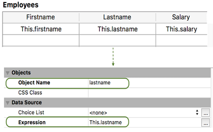
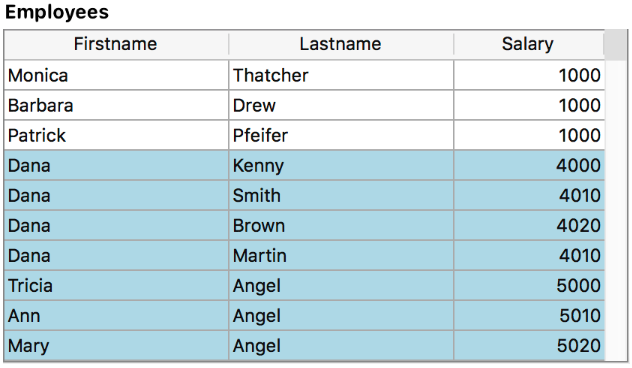

<!--REF #_command_.FORM Event.Syntax-->**FORM Event** : Object<!-- END REF-->
<!--REF #_command_.FORM Event.Params-->
| Parámetro | Tipo |  | Descripción |
| --- | --- | --- | --- |
| Resultado | Object | &#8592; | Objeto evento |

<!-- END REF-->

#### Descripción 

<!--REF #_command_.FORM Event.Summary-->**FORM Event** devuelve un objeto que contiene información sobre el evento de formulario que acaba de ocurrir.<!-- END REF--> Por lo general, usará **FORM Event** desde un formulario o método de objeto.

**Objeto devuelto** 

Cada objeto devuelto incluye las siguientes propiedades principales:

| **Propiedad** | **Tipo**     | **Descripción**                                                                                            |
| ------------- | ------------ | ---------------------------------------------------------------------------------------------------------- |
| objectName    | texto        | Nombre del objeto que desencadena el evento: no se incluye si el evento es desencadenado por el formulario |
| code          | entero largo | Valor numérico del evento de formulario. Ver [Form event code](../commands/form-event-code.md)"                         |
| description   | texto        | Nombre del evento del formulario (por ejemplo, "On After Edit").                                           |

Por ejemplo, en el caso de hacer clic en un botón, el objeto contiene las siguientes propiedades:

```json
{"code":4,"description":"On Clicked","objectName":"Button2"}
```

El objeto evento puede contener propiedades adicionales, dependiendo del objeto para el cual ocurre el evento. Por ejemplo, los objetos *eventObj* generados en:

* objetos list box o columnas, ver la *documentación de list box en developer.4d.com*.
* áreas 4D View Pro, ver *Evento formulario On VP Ready*.

**Nota:** si no hay un evento actual, **FORM Event** devuelve un objeto nulo.

#### Ejemplo 1 

Desea manejar el evento On Clicked en un botón:

```4d
 If(FORM Event.code=On Clicked)
    ...
 End if
```

#### Ejemplo 2 

Si establece el nombre del objeto columna con un nombre de atributo real de una clase de datos como esta:



Puede ordenar la columna utilizando el evento On Header Click:

```4d
 Form.event:=FORM Event
 Case of
    :(Form event code=On Header Click)
       if(Form.event.columnName="lastname")
          Form.employees:=Form.employees.orderBy(Form.event.columnName+", firstname")
       End if
 End case
```

#### Ejemplo 3 

Desea manejar On Display Details en un objeto list box con un método definido en la propiedad *Meta info expression*:


El método *setColor*:

```4d
 var $event;$0;$meta : Object
 $event:=[#current_title_incod]
 $meta:=New object
 
 Case of
    :($event.code=On Display Detail)
       If($event.isRowSelected)
          $meta.fill:="lightblue"
       End if
 End case
 $0:=$meta
```

El list box resultante cuando se seleccionan las líneas:



#### Ver también 

[Form event code](../commands/form-event-code.md)"  

#### Propiedades

|  |  |
| --- | --- |
| Número de comando | 1606 |
| Hilo seguro | &check; |


