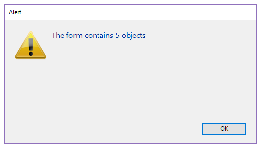

<!--REF #_command_.FORM LOAD.Syntax-->**FORM LOAD** ( {*aTabla* ;} *formulario* {; *dataForm*}{; *} )<!-- END REF-->
<!--REF #_command_.FORM LOAD.Params-->
| Parámetro | Tipo |  | Descripción |
| --- | --- | --- | --- |
| aTable | Table | &#8594;  | Tabla del formulario a cargar (si se omite, carga un formulario proyecto) |
| formulario | Text, Object | &#8594;  | Nombre del formulario proyecto a abrir para la impresión o Cadena vacía para cerrar el formulario proyecto actual |
| dataForm | Object | &#8594;  | Datos a asociar al formulario |
| * | Operador | &#8594;  | Si se pasa = el comando se aplica a la base local cuando se ejecuta desde un componente (parámetro ignorado fuera de este contexto) |

<!-- END REF-->

*Este comando no es hilo seguro, no puede ser utilizado en código apropiativo.*


#### Descripción 

<!--REF #_command_.FORM LOAD.Summary-->El comando **FORM LOAD** se utiliza para cargar el *formulario* en memoria en el proceso actual junto con *dataForm* (opcional) con el fin de imprimir sus datos o analizar sus contenidos.<!-- END REF--> Sólo puede haber un formulario actual por proceso.

En el parámetro *formulario*, puede pasar:

* el nombre de un formulario, o
* la ruta (en sintaxis POSIX) a un archivo .json válido que contiene una descripción del formulario a usar (ver *Ruta de archivo del formulario*), o
* un objeto que contiene una descripción del formulario.

Cuando el comando se ejecuta desde un componente, carga los formularios del componente por defecto. Si se pasa el parámetro *\**, el método carga los formularios de la base local.

##### dataForm 

Opcionalmente, puede pasar parámetros al *formulario* utilizando el objeto *dataForm*. Toda propiedad del objeto *dataForm* estará disponible desde el contexto del formulario a través del comando [Form](form.md). Por ejemplo, si pasa un objeto que contiene {"version", "12"} en *dataForm*, podrá obtener o definir el valor de la propiedad "version" en el formulario llamando:

```4d
 $v:=Form.version //"12"
 Form.version:=13
```

El objeto *dataForm* está disponible en el evento formulario On Load.

*dataForm* le permite pasar parámetros de forma segura a sus formularios, sea cual sea el contexto de llamada. En particular, si el mismo formulario es llamado desde diferentes lugares en el mismo proceso, siempre podrá acceder a sus valores específicos simplemente llamando a [Form](form.md).myProperty. 

**Nota:** si no pasa el parámetro *dataForm* o si pasa un objeto indefinido, **FORM LOAD** crea automáticamente un nuevo objeto vacío vinculado al *formulario*, disponible a través del comando [Form](form.md).

##### Impresión de datos 

Para que este comando pueda ejecutarse, una tarea de impresión debe haberse abierto de antemano usando el comando [OPEN PRINTING JOB](open-printing-job.md). El comando [OPEN PRINTING JOB](open-printing-job.md) hace un llamado implícito al comando [FORM UNLOAD](form-unload.md), por lo que en este contexto es necesario ejecutar [FORM LOAD](form-load.md). Una vez cargado, el *formulario* se convierte en el formulario de impresión actual. Todos los comandos de gestión de objetos, y en particular, el comando [Print object](print-object.md), trabajan con este formulario.  
  
Si un formulario de impresión ya se ha cargado previamente (a través de una llamada anterior al comando **FORM LOAD**), se cierra y se sustituye por *formulario*. Puede abrir y cerrar varios formularios proyecto en la misma sesión de impresión. Cambiar de formulario de impresión vía el comando **FORM LOAD** no genera saltos de página. Es responsabilidad del desarrollador gestionar los saltos de página.  
  
Sólo el evento formulario On Load se ejecuta durante la apertura del formulario, así como los métodos de los objetos del formulario. Se ignoran los otros eventos formulario. El evento de formulario On Unload se ejecuta al final de la impresión.  
  
Para mantener la coherencia gráfica de los formularios, se recomienda aplicar la propiedad de apariencia "Impresión ", independientemente de la plataforma.  
  
El formulario de impresión actual se cierra automáticamente cuando se llama el comando [CLOSE PRINTING JOB](close-printing-job.md).

##### Análisis del contenido del formulario 

Esta posibilidad consiste en cargar un formulario fuera de pantalla para análisis. Para efectuar esta acción, basta con llamar a **FORM LOAD** fuera del contexto de un trabajo de impresión. En este caso, los eventos de formulario no se ejecutan.  
  
**FORM LOAD**\] se puede utilizar con los comandos [FORM GET OBJECTS](form-get-objects.md) y [OBJECT Get type](object-get-type.md) para llevar a cabo cualquier tipo de procesamiento en el contenido del formulario. A continuación, es imperativo llamar al comando [FORM UNLOAD](form-unload.md) para descargar el formulario de la memoria.  
  
Tenga en cuenta que en todos los casos, el formulario en la pantalla permanece cargado (no se ve afectado por el comando **FORM LOAD** por lo que no es necesario volver a cargarlo después de llamar a [FORM UNLOAD](form-unload.md).  
  
**Recordatorio:** en el contexto fuera de pantalla, no olvide llamar [FORM UNLOAD](form-unload.md) para evitar todo riesgo de saturación de la memoria.

#### Ejemplo 1 

Llamar un formulario proyecto en un trabajo de impresión:

```4d
 OPEN PRINTING JOB
 FORM LOAD("print_form")
  // ejecución de eventos y métodos objeto
```

#### Ejemplo 2 

Llamar un formulario tabla en un trabajo de impresión:

```4d
 OPEN PRINTING JOB
 FORM LOAD([People];"print_form")
  // ejecución de eventos y métodos de objeto
```

#### Ejemplo 3 

Análisis del contenido de un formulario para efectuar un procesamiento en las áreas de entrada de texto:

```4d
 FORM LOAD([People];"my_form")
  // selección del formulario sin ejecución de los eventos ni de los métodos
 FORM GET OBJECTS(arrObjNames;arrObjPtrs;arrPages;*)
 For($i;1;Size of array(arrObjNames))
    If(OBJECT Get type(*;arrObjNames{$i})=Object type text input)
  //… procesamiento
    End if
 End for
 FORM UNLOAD //no olvidar descargar el formulario
```

#### Ejemplo 4 

El siguiente ejemplo devuelve el número de objetos de un formulario JSON:

```4d
 ARRAY TEXT(objectsArray;0) //ordena los elementos del formulario en arrays
 ARRAY POINTER(variablesArray;0)
 ARRAY INTEGER(pagesArray;0)
 
 FORM LOAD("/RESOURCES/OutputForm.json") //carga el formulario
 FORM GET OBJECTS(objectsArray;variablesArray;pagesArray;Form all pages+Form inherited)
 
 ALERT("The form contains "+String(size of array(objectsArray))+" objects") //devuelve el conteo de objetos
```

el resultado mostrado es:



#### Ejemplo 5 

Desea imprimir un formulario que contiene un list box. Durante el evento *on load*, desea modificar el contenido del list box a modificar.  
  
1\. En el método de impresión, escribe:

```4d
 var $formData : Object

var $over Boolean
 var $full : Boolean
 
 OPEN PRINTING JOB
 $formData:=New object
 $formData.LBcollection:=New collection()
 ... //llena la colección de datos
 
 FORM LOAD("GlobalForm";$formData) //guarda la colección en $formData
 $over:=False
 Repeat
    $full:=Print object(*;"LB") // la datasource de este listbox "LB" es Form.LBcollection
    LISTBOX GET PRINT INFORMATION(*;"LB";lk printing is over;$over)
    If(Not($over))
       PAGE BREAK
    End if
 Until($over)
 FORM UNLOAD
 CLOSE PRINTING JOB


```

2\. En el método formulario, puede escribir:

```4d
 var $o : Object
 Case of
    :(Form event code=On Load)
       For each($o;Form.LBcollection) //LBcollection está disponible
          $o.reference:=Uppercase($o.reference)
       End for each
 End case
```

#### Ver también 

[Current form name](current-form-name.md)  
[FORM UNLOAD](form-unload.md)  
[LISTBOX GET OBJECTS](listbox-get-objects.md)  
[OBJECT Get type](object-get-type.md)  
[Print object](print-object.md)  