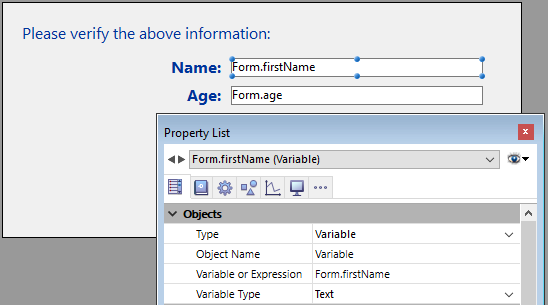

<!--REF #_command_.Form.Syntax-->**Form**  : Object<!-- END REF-->
<!--REF #_command_.Form.Params-->
| Parámetro | Tipo |  | Descripción |
| --- | --- | --- | --- |
| Resultado | Object | &#8592; | Datos del formulario asociados al formulario actual |

<!-- END REF-->

#### Descripción 

<!--REF #_command_.Form.Summary-->El comando **Form** devuelve el objeto asociado con el formulario actual, si lo hay.<!-- END REF--> 4D asocia automáticamente un objeto al formulario actual en los siguientes casos:

* el formulario actual ha sido mostrado por el comando [DIALOG](dialog.md),
* el formulario actual es un subformulario,
* actualmente se muestra un formulario tabla en la pantalla.

##### Formulario DIALOG 

Si el formulario actual se muestra mediante una llamada al comando [DIALOG](dialog.md), **Form** devuelve un objeto vacío, o el objeto *formData* pasado como parámetro a este comando, si existe.

##### Subformulario 

Si el formulario actual es un subformulario, el objeto devuelto depende de la variable del contenedor padre:

* Si la variable asociada al contenedor principal se ha escrito como un objeto ([C\_OBJECT](c-object.md)), **Form** devuelve el valor de esta variable.  
En este caso, el objeto devuelto por **Form** es el mismo que el devuelto por la siguiente expresión:  
```4d  
 (OBJECT Get pointer(Object subform container))->  
```
* Si la variable asociada al contenedor padre no se ha escrito como un objeto, **Form** devuelve un objeto vacío, mantenido por 4D en el contexto del subformulario.

Para más información, consulte la sección *Subformularios en página*.

##### Formulario Tabla 

**Form** devuelve el objeto asociado al formulario tabla que se muestra en la pantalla. En el contexto de un formulario de entrada que se muestra desde un formulario de salida (es decir, después de hacer doble clic en un registro), el objeto devuelto contiene la siguiente propiedad:

| **Propiedad** | **Tipo** | **Descripción**                                |
| ------------- | -------- | ---------------------------------------------- |
| parentForm    | objeto   | **Form** objeto del formulario de salida padre |

#### Ejemplo 

En un formulario, usted asignó algunas propiedades de objeto [Form](form.md) a variables:



Luego, puede ejecutarlas desde cualquier lugar de la aplicación:

```4d
 var $win : Integer
 $win:=Open form window("Edit_Address";Movable form dialog box;Horizontally centered;Vertically centered)
 DIALOG("Edit_Address";New object("firstName";"Mike";"age";12))
 CLOSE WINDOW($win)
```

El formulario muestra los valores que ha pasado:


**Nota:** este ejemplo requiere que la notación de objeto esté habilitada en la base de datos (ver *Página Compatibilidad*).

#### Ver también 

[DIALOG](dialog.md)  

#### Propiedades

|  |  |
| --- | --- |
| Número de comando | 1466 |
| Hilo seguro | &cross; |


