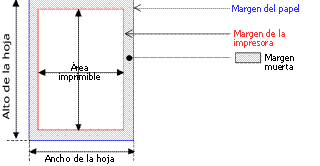

<!--REF #_command_.GET PRINTABLE MARGIN.Syntax-->**GET PRINTABLE MARGIN** ( *izquierda* ; *superior* ; *derecha* ; *inferior* )<!-- END REF-->
<!--REF #_command_.GET PRINTABLE MARGIN.Params-->
| Parámetro | Tipo |  | Descripción |
| --- | --- | --- | --- |
| izquierda | Integer | &#8592; | Margen izquierda |
| superior | Integer | &#8592; | Margen superior |
| derecha | Integer | &#8592; | Margen derecha |
| inferior | Integer | &#8592; | Margen inferior |

<!-- END REF-->

#### Descripción 

<!--REF #_command_.GET PRINTABLE MARGIN.Summary-->El comando GET PRINTABLE MARGIN devuelve los valores actuales de los diferentes márgenes definidos utilizando los comandos [Print form](print-form.md), [PRINT SELECTION](print-selection.md) y [PRINT RECORD](print-record.md).<!-- END REF--> 

Los valores son devueltos en píxeles con respecto al borde del papel. 

Es posible obtener el tamaño del papel como también calcular el área imprimible utilizando la función [GET PRINTABLE AREA](get-printable-area.md) .

##### Gestión de márgenes de impresión 

Por defecto, en 4D el cálculo de las impresiones se efectúa sobre la base de los “márgenes de la impresora”. La ventaja de este sistema es que los formularios se adaptan automáticamente a las nuevas impresoras (ya que están situados en el área imprimible). Por otra parte, en el caso de los formularios pre-impresos, no era posible posicionar los elementos a imprimir de manera precisa porque un cambio de impresora podía modificar los márgenes de la impresora.

Es posible basar la impresión de los formularios efectuados utilizando los comandos [Print form](print-form.md), [PRINT SELECTION](print-selection.md) y [PRINT RECORD](print-record.md) sobre un margen fijo el cual es idéntico en cada impresora: los márgenes del papel, es decir, los límites físicos de la hoja. Para hacer esto, simplemente utilice los comandos [GET PRINTABLE MARGIN](get-printable-margin.md), [SET PRINTABLE MARGIN](set-printable-margin.md) y [GET PRINTABLE AREA](get-printable-area.md).

#### Terminología de impresión 

* **Margen del papel**: el margen del papel corresponde a los límites físicos de la hoja.
* **Margen de impresión**: la margen de impresión es la margen más allá de la cual la impresora no puede imprimir (por razones físicas: rodillos de impresión, fin del recorrido del cabezal de impresión...). Varía de una impresora a otra y de un formato a otro.
* **Margen muerta:** esta es el área situada entre la margen del papel y el margen de la impresora.

#### Ver también 

[GET PRINTABLE AREA](get-printable-area.md)  
[Print form](print-form.md)  
[SET PRINTABLE MARGIN](set-printable-margin.md)  

#### Propiedades

|  |  |
| --- | --- |
| Número de comando | 711 |
| Hilo seguro | &cross; |

