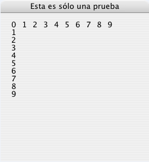

<!--REF #_command_.GOTO XY.Syntax-->**GOTO XY** ( *x* ; *y* )<!-- END REF-->
<!--REF #_command_.GOTO XY.Params-->
| Parámetro | Tipo |  | Descripción |
| --- | --- | --- | --- |
| x | Integer | &#8594;  | Posición x (horizontal) del cursor |
| y | Integer | &#8594;  | Posición y (vertical) del cursor |

<!-- END REF-->

*Este comando no es hilo seguro, no puede ser utilizado en código apropiativo.*


#### Descripción 

<!--REF #_command_.GOTO XY.Summary-->El comando GOTO XY se utiliza conjuntamente con el comando [MESSAGE](message.md "MESSAGE") cuando usted muestra mensajes en una ventana abierta por el comando [Open window](open-window.md "Open window").<!-- END REF-->  
  
GOTO XY determina la posición del cursor de inserción de caracteres (un cursor invisible) para definir la ubicación del siguiente mensaje en la ventana. 

La esquina superior izquierda representa las coordenadas 0,0\. El cursor se ubica automáticamente en 0,0 cuando una ventana se abre y luego se ejecuta [ERASE WINDOW](erase-window.md "ERASE WINDOW").

Después de que GOTO XY defina la posición del cursor, puede utilizar [MESSAGE](message.md "MESSAGE") para mostrar los caracteres en la ventana. 

#### Ejemplo 1 

Ver el ejemplo del comando [MESSAGE](message.md "MESSAGE").

#### Ejemplo 2 

Ver el ejemplo del comando [Milliseconds](milliseconds.md "Milliseconds").

#### Ejemplo 3 

El siguiente ejemplo:

```4d
 Open window(50;50;300;300;5;"Esta es sólo una prueba")
 For($vlFila;0;9)
    GOTO XY($vlFila;0)
    MESSAGE(String($vlFila))
 End for
 For($vlLinea;0;9)
    GOTO XY(0;$vlLinea)
    MESSAGE(String($vlLinea))
 End for
 $vhHoraInicio:=Current time
 Repeat
 Until((Current time-$vhHoraInicio)>†00:00:30†)
```

Muestra la siguiente ventana (en Macintosh) por 30 segundos:



#### Ver también 

[MESSAGE](message.md)  