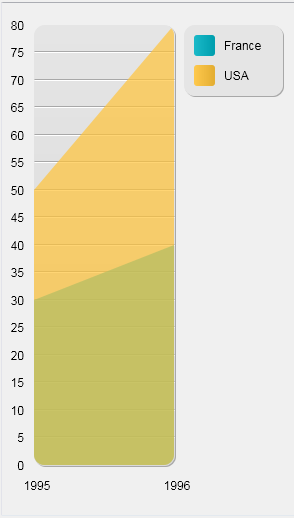
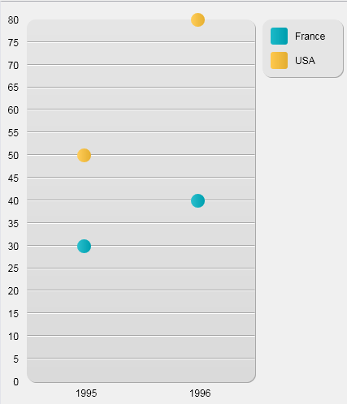

<!--REF #_command_.GRAPH.Syntax-->**GRAPH** ( *grafImagen* ; *grafNum* ; *xCategorias* {; *yValores*} {; *yValores2* ; ... ; *yValoresN*} )<!-- END REF-->
<!--REF #_command_.GRAPH.Params-->
| Parámetro | Tipo |  | Descripción |
| --- | --- | --- | --- |
| grafImagen | Picture | &#8594;  | Variable imagen |
| grafNum | Integer, Object | &#8594;  | Número de tipo de gráfico |
| xCategorias | Array | &#8594;  | Categorías para el eje x |
| yValores | Array | &#8594;  | Valores a representar gráficamente (hasta 8) |

<!-- END REF-->

#### Descripción 

<!--REF #_command_.GRAPH.Summary-->El comando **GRAPH** crea un gráfico en una variable imagen, a partir de los valores provenientes de los arrays.<!-- END REF--> El comando GRAPH debe ser ubicado en el método formulario o en un método objeto perteneciente al formulario, o en un método proyecto llamado por uno de estos dos métodos.

Los gráficos generados por este comando pueden ser dibujados vía el motor de renderización SVG. Se benefician de las funciones de interfaz asociadas a las variables imágenes: un menú contextual en modo Aplicación (para permitirle elegir, más particularmente, el formato de visualización), barras de desplazamiento, etc.

**Nota:** SVG (Scalable Vector Graphics) es un formato de archivo gráfico vectorial (extensión .svg). Basado en XML, este formato está ampliamente extendido y puede mostrarse particularmente en navegadores web. Para mayor información, consulte la siguiente dirección: [http://www.w3.org.Graphics/SVG](http://www.w3.org.graphics/SVG/)/. El comando [SVG EXPORT TO PICTURE](svg-export-to-picture.md) también puede ser utilizado para tomar ventaja del motor SVG integrado.

En el parámetro *grafImagen*, pase el nombre de la variable imagen que muestra el gráfico en el formulario.

El segundo parámetro define el tipo de gráfico a utilizar. Hay dos posibilidades:

* pasar un parámetro *grafNum* de tipo *Entero largo* (todas las versiones de 4D): en este caso, debe pasar un número entre 1 y 8\. Los diferentes tipos de gráficos se describen en el ejemplo abajo. Después de dibujar un gráfico, puede cambiar el tipo modificando el valor de *grafNum* y ejecutando nuevamente el comando **GRAPH**. Luego puede modificar ciertas características del gráfico llamando al comando [GRAPH SETTINGS](graph-settings.md). Ver el ejemplo 1.
* pasar un parámetro *grafParams* de tipo [Objeto](# "Datos estructurados como forma de objeto nativo 4D") (no soportado en 4D Server en Windows): en este caso, debe pasar un objeto que contenga las diversas propiedades del gráfico a definir. Para ello, puede utilizar las constantes que se encuentran en el tema "*Parámetros Gráficos*" (ver más adelante). Esta sintaxis permite definir el tipo de gráfico junto con sus parámetros específicos (leyenda, xmin, etc.) en una sola llamada. Esto permite a los usuarios guardar los gráficos generados como imágenes SVG regulares y hace que sea posible visualizarlos utilizando un navegador estándar como Firefox, Chrome, IE o Safari (los gráficos generados cumplen con la norma SVG implementada en los navegadores). Además, esta sintaxis le permite acceder a varios ajustes adicionales, que le permiten personalizar, por ejemplo, el espaciado entre las barras, los márgenes, colores de la barra, etc. Ver los ejemplos 2, 3 y 4\. **Advertencia**: si utiliza esta sintaxis, el comando [GRAPH SETTINGS](graph-settings.md) NO debe llamarse.

El parámetro *xCategorias* define las etiquetas que serán utilizadas por el eje x. (la parte inferior del gráfico). Este dato puede ser de tipo alfa, hora, fecha o numérico. Debe haber el mismo de elementos de array en *xCategorias* que en cada *yValores*.

Los datos especificados por *yValores* son los datos a graficar. Los datos deben ser de tipo numérico. Se puede graficar hasta ocho conjuntos de datos. Los gráficos por sectores sólo representan los primeros *yValores*.

##### IDs automáticos 

Los IDs específicos se asignan automáticamente a los elementos presentes en el gráfico SVG:

| **IDs**                                      | **Descripción**                                               |
| -------------------------------------------- | ------------------------------------------------------------- |
| ID\_graph\_1 to ID\_graph\_8                 | Columnas, líneas, áreas...                                    |
| ID\_graph\_shadow\_1 to ID\_graph\_shadow\_8 | Sombras de las columnas, líneas, áreas...                     |
| ID\_bullet\_1 to ID\_bullet\_8               | Puntos (*gráficos en líneas y puntos únicamente*)             |
| ID\_pie\_label\_1 to ID\_pie\_label\_8       | Etiquetas de los sectores (gráficos en sectores *únicamente*) |
| ID\_legend                                   | Legend                                                        |
| ID\_legend\_1 to ID\_legend\_8               | Títulos de las leyendas                                       |
| ID\_legend\_border                           | Bordes de las leyendas                                        |
| ID\_legend\_border\_shadow                   | Sombras de los bordes de las leyendas                         |
| ID\_x\_values                                | Valores eje X                                                 |
| ID\_y\_values                                | Valores del eje Y                                             |
| ID\_y0\_axis                                 | Valores del eje Z                                             |
| ID\_background                               | Fondo                                                         |
| ID\_background\_shadow                       | Fondo                                                         |
| ID\_x\_grid                                  | Rejilla en el eje X                                           |
| ID\_x\_grid\_shadow                          | Sombra de la rejilla en el eje X                              |
| ID\_y\_grid                                  | Rejilla en el eje Y                                           |
| ID\_y\_grid\_shadow                          | Sombra de la rejilla en el eje Y                              |

##### Atributos grafParams 

Cuando se utiliza el parámetro *grafParams*, se pasa un objeto que contiene las diferentes propiedades del gráfico a definir. Puede utilizar las siguientes constantes, que se encuentran en el tema de constantes "*Parámetros Gráficos*":

| Constante                         | Tipo   | Valor                      | Comentario                                                                                                                                                                                                                                                                                                                                                                                                                                                                                                                                                                                                                                                                                                                                                                                                                                                                                  |
| --------------------------------- | ------ | -------------------------- | ------------------------------------------------------------------------------------------------------------------------------------------------------------------------------------------------------------------------------------------------------------------------------------------------------------------------------------------------------------------------------------------------------------------------------------------------------------------------------------------------------------------------------------------------------------------------------------------------------------------------------------------------------------------------------------------------------------------------------------------------------------------------------------------------------------------------------------------------------------------------------------------- |
| Graph background color            | Cadena | graphBackgroundColor       | **Valores posibles**: expresión de color compatible con SVG (texto), por ejemplo "#7F8E00", "Pink", o "#0a1414"                                                                                                                                                                                                                                                                                                                                                                                                                                                                                                                                                                                                                                                                                                                                                                             |
| Graph background opacity          | Cadena | graphBackgroundOpacity     | **Valores posibles**:enteros, rango de 0-100<br/> **Valor por defecto**: 100                                                                                                                                                                                                                                                                                                                                                                                                                                                                                                                                                                                                                                                                                                                                                                                                        |
| Graph background shadow color     | Cadena | graphBackgroundShadowColor | **Valores posibles**: expresión de color compatible con SVG (texto), por ejemplo "#7F8E00", "Pink", o "#0a1414"                                                                                                                                                                                                                                                                                                                                                                                                                                                                                                                                                                                                                                                                                                                                                                             |
| Graph bottom margin               | Cadena | bottomMargin               | **Valores posibles**: números reales<br/>**Valor por defecto**: 12                                                                                                                                                                                                                                                                                                                                                                                                                                                                                                                                                                                                                                                                                                                                                                                                                  |
| Graph colors                      | Cadena | colors                     | **Valores posibles**: array texto. Los colores para cada serie de gráfico.<br/> **Valores por defecto**: Blue-green (#19BAC9), Yellow (#FFC338), Purple (#573E82), Green (#4FA839), Orange (#D95700), Blue (#1D9DF2), Yellow-green (#B5CF32), Red (#D43A26)                                                                                                                                                                                                                                                                                                                                                                                                                                                                                                                                                                                                                         |
| Graph column gap                  | Cadena | columnGap                  | **Valores posibles**:enteros<br/>**Valor por defecto**: 12<br/>Define el espacio entre las barras<br/>Tipos 1, 2, 3 únicamente                                                                                                                                                                                                                                                                                                                                                                                                                                                                                                                                                                                                                                                                                                                                      |
| Graph column width max            | Cadena | columnWidthMax             | **Valores posibles**: números reales<br/>**Valor por defecto**: 200<br/>Tipos 1, 2, 3 únicamente                                                                                                                                                                                                                                                                                                                                                                                                                                                                                                                                                                                                                                                                                                                                                                            |
| Graph column width min            | Cadena | columnWidthMin             | **Valores posibles**: números reales<br/>**Valor por defecto**: 10<br/>Tipos 1, 2, 3 únicamente                                                                                                                                                                                                                                                                                                                                                                                                                                                                                                                                                                                                                                                                                                                                                                             |
| Graph default height              | Cadena | defaultHeight              | **Valores posibles**: números reales<br/>**Valor por defecto**: 400\. Si graphType=7 (Pie), luego valor por defecto = 600                                                                                                                                                                                                                                                                                                                                                                                                                                                                                                                                                                                                                                                                                                                                                           |
| Graph default width               | Cadena | defaultWidth               | **Valores posibles**: números reales**<br/>Valor por defecto:** 600\. Si graphType=7 (Pie), luego valor por defecto = 800                                                                                                                                                                                                                                                                                                                                                                                                                                                                                                                                                                                                                                                                                                                                                           |
| Graph display legend              | Cadena | displayLegend              | **Valores posibles:** Booleano<br/>**Valor por defecto:**  True                                                                                                                                                                                                                                                                                                                                                                                                                                                                                                                                                                                                                                                                                                                                                                                                                     |
| Graph document background color   | Cadena | documentBackgroundColor    | **Valores posibles**: expresión color SVG (texto), por ejemplo "#7F8E00", "Pink", o "#0a1414". Cuando un gráfico guardado como imagen SVG se abre en otro lugar, el color de fondo del documento sólo se muestra si el motor de renderizado soporta la norma *SVG Tiny 1.2* (soportado por IE, Firefox, pero no en Chrome).                                                                                                                                                                                                                                                                                                                                                                                                                                                                                                                                                                 |
| Graph document background opacity | Cadena | documentBackgroundOpacity  | **Valores posibles**: entero, rango 0-100 (valor por defecto: 100). Cuando un gráfico guardado como imagen SVG se abre en otro lugar, el color de fondo del documento sólo se muestra si el motor de renderizado soporta la norma *SVG Tiny 1.2* (soportado por IE, Firefox, pero no en Chrome).<br/><br/>                                                                                                                                                                                                                                                                                                                                                                                                                                                                                                                                                                  |
| Graph font color                  | Cadena | fontColor                  | **Valores posibles:** expresión color SVG (texto), por ejemplo "#7F8E00", "Pink", o "#0a1414"                                                                                                                                                                                                                                                                                                                                                                                                                                                                                                                                                                                                                                                                                                                                                                                               |
| Graph font family                 | Cadena | fontFamily                 | **Valores posibles**: Nombre de la familia de fuentes<br/>**Valor por defecto**: "Arial"                                                                                                                                                                                                                                                                                                                                                                                                                                                                                                                                                                                                                                                                                                                                                                                            |
| Graph font size                   | Cadena | fontSize                   | **Valores posibles**: enteros largos<br/>**Valor por defecto**: 12\. Si graphType=7 (Pie), ver Graph pie font size                                                                                                                                                                                                                                                                                                                                                                                                                                                                                                                                                                                                                                                                                                                                                                  |
| Graph left margin                 | Cadena | leftMargin                 | **Valores posibles**: números reales<br/>**Valor por defecto**: 12                                                                                                                                                                                                                                                                                                                                                                                                                                                                                                                                                                                                                                                                                                                                                                                                                  |
| Graph legend font color           | Cadena | legendFontColor            | **Valores posibles**: expresión de color compatible con SVG (texto), por ejemplo "#7F8E00", "Pink", o "#0a1414"                                                                                                                                                                                                                                                                                                                                                                                                                                                                                                                                                                                                                                                                                                                                                                             |
| Graph legend icon gap             | Cadena | legendIconGap              | **Valores posibles**: números reales<br/>**Valor por defecto**: Graph legend icon height/2                                                                                                                                                                                                                                                                                                                                                                                                                                                                                                                                                                                                                                                                                                                                                                                          |
| Graph legend icon height          | Cadena | legendIconHeight           | **Valores posibles**: números reales<br/>**Valor por defecto**: 20                                                                                                                                                                                                                                                                                                                                                                                                                                                                                                                                                                                                                                                                                                                                                                                                                  |
| Graph legend icon width           | Cadena | legendIconWidth            | **Valores posibles**: números reales<br/>**Valor por defecto**: 20                                                                                                                                                                                                                                                                                                                                                                                                                                                                                                                                                                                                                                                                                                                                                                                                                  |
| Graph legend labels               | Cadena | legendLabels               | **Valores posibles:** array texto. Si falta, 4D muestra íconos sin texto.                                                                                                                                                                                                                                                                                                                                                                                                                                                                                                                                                                                                                                                                                                                                                                                                                   |
| Graph line width                  | Cadena | lineWidth                  | **Valores posibles**: números reales<br/>**Valor por defecto**: 2<br/>Tipo 4 únicamente                                                                                                                                                                                                                                                                                                                                                                                                                                                                                                                                                                                                                                                                                                                                                                                     |
| Graph number format               | Cadena | numberFormat               | **Valores posibles**: cadena de formato de número, por ejemplo: "###,###,##0"<br/>**Valor por defecto**: "" (sin formato).                                                                                                                                                                                                                                                                                                                                                                                                                                                                                                                                                                                                                                                                                                                                                          |
| Graph pie direction               | Cadena | pieDirection               | **Valores posibles**: 1 o -1<br/>**Valor por defecto**: 1<br/>1 indica la dirección de las agujas del reloj, -1 indica la dirección en sentido antihorario                                                                                                                                                                                                                                                                                                                                                                                                                                                                                                                                                                                                                                                                                                                  |
| Graph pie font size               | Cadena | pieFontSize                | **Valores posibles**: números reales<br/>**Valor por defecto**: 16<br/>Tipo 7 únicamente                                                                                                                                                                                                                                                                                                                                                                                                                                                                                                                                                                                                                                                                                                                                                                                    |
| Graph pie shift                   | Cadena | pieShift                   | **Valores posibles**: números reales<br/>**Valor por defecto**: 8<br/>Tipo 7 únicamente<br/>                                                                                                                                                                                                                                                                                                                                                                                                                                                                                                                                                                                                                                                                                                                                                                        |
| Graph pie start angle             | Cadena | pieStartAngle              | **Valores posibles**: números reales (positivos o negativos)<br/>**Valor por defecto**: 0, que representa un ángulo de inicio de 0° (posición hacia arriba)<br/>Un valor positivo representa un ángulo relativo a la dirección actual del pie. Un valor negativo representa un ángulo relativo a la dirección opuesta al pie                                                                                                                                                                                                                                                                                                                                                                                                                                                                                                                                                |
| Graph plot height                 | Cadena | plotHeight                 | **Valores posibles**: números reales<br/>**Valor por defecto**: 12<br/>Tipo 4 únicamente                                                                                                                                                                                                                                                                                                                                                                                                                                                                                                                                                                                                                                                                                                                                                                                    |
| Graph plot radius                 | Cadena | plotRadius                 | **Valores posibles**: números reales<br/>**Valor por defecto**: 12<br/>Tipo 6 únicamente                                                                                                                                                                                                                                                                                                                                                                                                                                                                                                                                                                                                                                                                                                                                                                                    |
| Graph plot width                  | Cadena | plotWidth                  | **Valores posibles**: números reales<br/>**Valor por defecto**: 12<br/>Tipo 4 únicamente                                                                                                                                                                                                                                                                                                                                                                                                                                                                                                                                                                                                                                                                                                                                                                                    |
| Graph right margin                | Cadena | rightMargin                | **Valores posibles**: números reales<br/>**Valor por defecto**: 2                                                                                                                                                                                                                                                                                                                                                                                                                                                                                                                                                                                                                                                                                                                                                                                                                   |
| Graph top margin                  | Cadena | topMargin                  | **Valores posibles**: números reales<br/>**Valor por defecto**: 2                                                                                                                                                                                                                                                                                                                                                                                                                                                                                                                                                                                                                                                                                                                                                                                                                   |
| Graph type                        | Cadena | graphType                  | <br/>**Valores posibles**: enteros largos \[1 a 8\], donde 1 = barras, 2 = proporcional, 3 = apilados, 4 = líneas, 5 = superficies, 6 = puntos, 7 = pie, 8 = imágenes.**<br/>** **Valor por defecto**: 1<br/>Si es nulo, el gráfico no se dibuja y no se muestra ningún mensaje de error. Si está fuera de rango, el gráfico no se dibuja y se muestra un mensaje de error.<br/>Si desea modificar gráficos de tipo imagen (valor=8), debe copiar la carpeta 4D/Resources/GraphTemplates/Graph\_8\_Pictures/ en la carpeta Resources de su base y realizar las modificaciones necesarias. Los archivos imagen locales se utilizarán en lugar de los archivos 4D. No hay un patrón de nombres de imágenes; 4D ordena los archivos contenidos en la carpeta y le asigna el primer archivo al primer gráfico. Estos archivos pueden ser del tipo SVG o imagen. |
| Graph xGrid                       | Cadena | xGrid                      | **Valores posibles**: Booleano<br/>**Valor por defecto**: True<br/>Todos los tipos excepto 7                                                                                                                                                                                                                                                                                                                                                                                                                                                                                                                                                                                                                                                                                                                                                                                |
| Graph xMax                        | Cadena | xMax                       | **Valores posibles**: número, fecha, hora (mismo tipo que el parámetro *xLabels*). <br/>Sólo los valores más altos que xMax se muestran en el gráfico. xMax se utiliza solamente para los tipos de gráficos 4, 5 o 6 si xProp = true y si el tipo *xLabels* es un número, fecha u hora. Si falta o si xMin>xMax, 4D calcula automáticamente el valor xMax.                                                                                                                                                                                                                                                                                                                                                                                                                                                                                                                          |
| Graph xMin                        | Cadena | xMin                       | **Valores posibles**: número, fecha, hora (mismo tipo que el parámetro *xLabels*). <br/>Sólo los valores más altos que xMin se muestran en el gráfico. xMin se utiliza solamente para los tipos de gráficos 4, 5 o 6 si xProp = true y si el tipo *xLabels* es un número, fecha u hora. Si falta o si xMin>xMax, 4D calcula automáticamente el valor xMin.                                                                                                                                                                                                                                                                                                                                                                                                                                                                                                                          |
| Graph xProp                       | Cadena | xProp                      | **Valores posibles**: Booleano<br/>**Valor por defecto:**True<br/>True para eje x proporcional; False para eje x normal. xProp se utiliza únicamente para los tipos de gráficos 4, 5 o 6                                                                                                                                                                                                                                                                                                                                                                                                                                                                                                                                                                                                                                                                                    |
| Graph yGrid                       | Cadena | yGrid                      | **Valores posibles**: Booleano<br/>**Valor por defecto**: True<br/>Todos los tipos excepto 7<br/>                                                                                                                                                                                                                                                                                                                                                                                                                                                                                                                                                                                                                                                                                                                                                                   |
| Graph yMax                        | Cadena | yMax                       | **Valores posibles**: números<br/> Si falta, 4D calcula automáticamente el valor yMax.<br/>Todos los tipos excepto 7<br/>                                                                                                                                                                                                                                                                                                                                                                                                                                                                                                                                                                                                                                                                                                                                           |
| Graph yMin                        | Cadena | yMin                       | **Valores posibles**: números<br/> Si falta, 4D calcula automáticamente el valor yMin.<br/>Todos los tipos excepto 7<br/>                                                                                                                                                                                                                                                                                                                                                                                                                                                                                                                                                                                                                                                                                                                                           |

#### Ejemplo 1 

Sintaxis con *grafNumber*: el siguiente ejemplo muestra los diferentes tipos de gráficos que puede obtener. El código debe ser insertado en un método formulario o método objeto del formulario que contiene la variable imagen. Los datos representados son constantes, generalmente este no es el caso:

```4d
 var vGraph : Picture //Variable del gráfico
 ARRAY TEXT(X;2) //Creación de un array para el eje X
 X{1}:="1995" //X Label #1
 X{2}:="1996" //X Label #2
 ARRAY REAL(A;2) //Creación de un array para el eje Y
 A{1}:=30 //Insertar algunos datos
 A{2}:=40
 ARRAY REAL(B;2) //Creación de un segundo array para el eje Y
 B{1}:=50 //Inserción de datos
 B{2}:=80
 vTipo:=1 //Inicializar tipo de gráfico
 GRAPH(vGraph;vTipo;X;A;B) //Dibujar el gráfico
 GRAPH SETTINGS(vGraph;0;0;0;0;False;False;True;"France";"USA") //Definición de las leyendas para el gráfico
```

Las siguientes imágenes muestran los gráficos resultantes:

* *vTipo* igual 1, usted obtiene un gráfico en **Columnas**  


* *vTipo* igual a 2, obtiene un gráfico en **Columnas proporcionales**  


* *vTipo* igual a 3, obtiene un gráfico en **Columnas apiladas**  


* *vTipo* igual a 4, obtiene un gráfico en **Líneas**  


* *vTipo* igual a 5, obtiene un gráfico en **Áreas**  


* *vTipo* igual a 6, obtiene un gráfico en **Puntos**  


* *vTipo* igual a 7, obtiene un gráfico en **Sectores**  

* *vTipo* igual a 8, obtiene un gráfico en **Imágenes**  


#### Ejemplo 2 

Sintaxis utilizando *grafParams*: en el siguiente ejemplo, se dibuja un gráfico de línea sencilla basado en los valores de tiempos:

```4d
 var vGraph : Picture //Variable gráfico
 ARRAY TIME(X;3) //Crear array para los ejes x
 X{1}:=?05:15:10? //Etiqueta X #1
 X{2}:=?07:15:10? //Etiqueta X #2
 X{3}:=?12:15:55? //Etiqueta X #3
 
 ARRAY REAL(A;3) //Crear array para eje y
 A{1}:=30 //Insertar algunos datos
 A{2}:=22
 A{3}:=50
 
 ARRAY REAL(B;3) //Crear otro array para eje y
 B{1}:=50 //Insertar algunos datos
 B{2}:=80
 B{3}:=10
 
 var vSettings : Object //Inicializar parámetros de gráficos
 
 OB SET(vSettings;Graph type;4) //Tipo de línea
 
 ARRAY TEXT(aLabels;2) //Definir leyendas para el gráfico
 aLabels{1}:="Mary"
 aLabels{2}:="John"
 OB SET ARRAY(vSettings;Graph legend labels;aLabels)
 
 GRAPH(vGraph;vSettings;X;A;B) //Draw graph
```


#### Ejemplo 3 

Con los mismos valores, puede agregar una configuración personalizada para obtener una vista diferente:

```4d
 var vGraph : Picture //Variable gráfico
 ARRAY TIME(X;3) //Crear un array para el eje x
 X{1}:=?05:15:10? //Etiqueta X #1
 X{2}:=?07:15:10? //Etiqueta X #2
 X{3}:=?12:15:55? //Etiqueta X #3
 
 ARRAY REAL(A;3) //Crea un array para el eje y
 A{1}:=30 //Inserta algunos datos
 A{2}:=22
 A{3}:=50
 
 ARRAY REAL(B;3) //Crea otro array para el eje y
 B{1}:=50 //Inserta algunos datos
 B{2}:=80
 B{3}:=10
 
 var vSettings : Object //inicialización de los parámetros del gráfico
 
 OB SET(vSettings;Graph type;4)/Tipo de líneas
 
 ARRAY TEXT(aLabels;2) //definir las leyendas del gráfico
 aLabels{1}:="Mary"
 aLabels{2}:="John"
 OB SET ARRAY(vSettings;Graph legend labels;aLabels)
 
  //opciones
 OB SET(vSettings;Graph xProp;True) //definir proporcional
 OB SET(vSettings;Graph xGrid;False) //eliminar la rejilla vertical
 OB SET(vSettings;Graph xMin;?03:00:00?) //definir límites
 OB SET(vSettings;Graph xMax;?20:00:00?)
 
 GRAPH(vGraph;vSettings;X;A;B) //Dibuja el gráfico
```


#### Ejemplo 4 

En este ejemplo, personalizamos algunos parámetros:

```4d
 var vGraph : Picture //Variable del gráfico
 ARRAY TEXT(X;5) //Creación de un array para el eje x
 X{1}:="Monday" //#1 Etiqueta X
 X{2}:="Tuesday" //#2 Etiqueta X
 X{3}:="Wednesday" //#3 Etiqueta X
 X{4}:="Thursday" //#4 Etiqueta X
 X{5}:="Friday" //#5 Etiqueta X
 
 ARRAY LONGINT(A;5) //Crear un array para el eje y
 A{1}:=30 //Insertar algunos datos
 A{2}:=22
 A{3}:=50
 A{4}:=45
 A{5}:=55
 
 ARRAY LONGINT(B;5) //Crear otro array para el eje y
 B{1}:=50 //Insertar algunos datos
 B{2}:=80
 B{3}:=10
 B{4}:=5
 B{5}:=72
 
 var vSettings : Object //inicialización de parámetros del gráfico
 
 OB SET(vSettings;Graph type;1) //tipo Barras
 
 ARRAY TEXT(aLabels;2) //Definir las leyendas para el gráfico
 aLabels{1}:="Mary"
 aLabels{2}:="John"
 OB SET ARRAY(vSettings;Graph legend labels;aLabels)
 
  //opciones
 OB SET(vSettings;Graph yGrid;False) //eliminar la rejilla vertical
 OB SET(vSettings;Graph background color;"#573E82") //definir un color de fondo
 OB SET(vSettings;Graph background opacity;40)
 ARRAY TEXT($aTcols;2) //definir los colores para el gráfico
 $aTcols{1}:="#B5CF32"
 $aTcols{2}:="#D43A26"
 OB SET ARRAY(vSettings;Graph colors;$aTcols)
 GRAPH(vGraph;vSettings;X;A;B) //Dibujar el gráfico
```


#### Ver también 

  
[GRAPH SETTINGS](graph-settings.md)  
*Parámetros Gráficos*  
[SVG EXPORT TO PICTURE](svg-export-to-picture.md)  