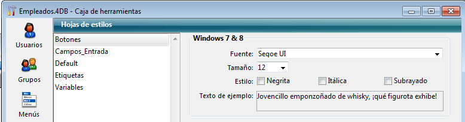

<!--REF #_command_.LIST OF STYLE SHEETS.Syntax-->**LIST OF STYLE SHEETS** ( *arrHojasEstilo* )<!-- END REF-->
<!--REF #_command_.LIST OF STYLE SHEETS.Params-->
| Parámetro | Tipo |  | Descripción |
| --- | --- | --- | --- |
| arrHojasEstilo | Text array | &#8592; | Nombres de las hojas de estilo definidas en la aplicación |

<!-- END REF-->

#### Descripción 

<!--REF #_command_.LIST OF STYLE SHEETS.Summary-->El comando **LIST OF STYLE SHEETS** devuelve la lista de hojas de estilo de la aplicación en el array *arrHojasEstilo*.<!-- END REF-->  
  
Si no hubiera sido previamente definido, el array *arrHojasEstilo* es creado por el comando. Se dimensiona automáticamente de acuerdo con el número de hojas de estilo definidas.  
  
Después de ejecutar el comando, cada elemento del array contiene el nombre de una hoja de estilos. Estos nombres se ordenan alfabéticamente, como en el editor de hojas de estilo. El primer elemento del array contiene siempre "\_\_automatic\_\_", que representa la hoja de estilo "Automática".

**Nota**: por razones de compatibilidad, las hojas de estilo automáticas "\_\_automatic\_main\_text\_\_" y "\_\_automatic\_additional\_text\_\_" no son devueltas por este comando. Sin embargo, todavía están disponibles en los formularios.

##### Nota de compatibilidad 

Este comando sólo puede utilizarse en **bases de datos binarias**. En la arquitectura de proyectos, el array no se llena. 

#### Ejemplo 

En su aplicación, se definen las siguientes hojas de estilo:



Si ejecuta el siguiente código:

```4d
 LIST OF STYLE SHEETS($arrStyles)
  // $arrStyles{1} contiene "__automatic__"
  // $arrStyles{2} contiene "Buttons"
  // $arrStyles{3} contiene "default"
  // $arrStyles{4} contiene "Input_fields"
  // $arrStyles{5} contiene "Labels"
  // $arrStyles{6} contiene "Variables"
```

#### Ver también 

[GET STYLE SHEET INFO](get-style-sheet-info.md)  
[OBJECT SET STYLE SHEET](object-set-style-sheet.md)  

#### Propiedades

|  |  |
| --- | --- |
| Número de comando | 1255 |
| Hilo seguro | &cross; |


