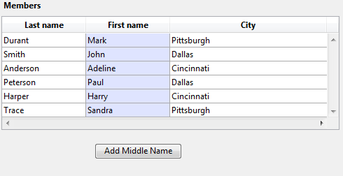

<!--REF #_command_.LISTBOX DUPLICATE COLUMN.Syntax-->**LISTBOX DUPLICATE COLUMN** ( {* ;} *objeto* ; *posCol* ; *nomCol* ; *varCol* ; *nomEncab* ; *varEncab* {; *nomPie* ; *varPie*} )<!-- END REF-->
<!--REF #_command_.LISTBOX DUPLICATE COLUMN.Params-->
| Parámetro | Tipo |  | Descripción |
| --- | --- | --- | --- |
| * | Operador | &#8594;  | Si se especifica, objeto es un nombre de objeto (cadena)<br/>Si se omite, objeto es un campo o una variable |
| objeto | any | &#8594;  | Nombre del objeto (si se especifica *) o<br/>Campo o variable (si se omite *) |
| posCol | Integer | &#8594;  | Ubicación de la nueva columna duplicada |
| nomCol | Text | &#8594;  | Nombre de la nueva columna |
| varCol | Array, Field, Variable, Pointer | &#8594;  | Nombre de la variable array de la columna o campo o variable |
| nomEncab | Text | &#8594;  | Nombre del objeto del encabezado de la columna |
| varEncab | Integer, Pointer | &#8594;  | Variable del encabezado de la columna |
| nomPie | Text | &#8594;  | Nombre del objeto del pie de la columna |
| varPie | Variable, Pointer | &#8594;  | Variable del pie de la columna |

<!-- END REF-->

*Este comando no es hilo seguro, no puede ser utilizado en código apropiativo.*


#### Descripción 

<!--REF #_command_.LISTBOX DUPLICATE COLUMN.Summary-->El comando **LISTBOX DUPLICATE COLUMN** duplica la columna definida por los parámetros *objeto* y *\** por programación en el contexto del formulario ejecutado (Modo Aplicación).<!-- END REF--> El formulario original, generado en modo Diseño no se modifica. 

**Nota:** esta funcionalidad ya se encuentra en 4D, en modo Diseño únicamente, con el comando **Duplicar Columna** del menú contextual del editor de formularios.  
  
De forma predeterminada, todas las opciones de estilo (tamaño, color, formatos, etc) definidos para la columna fuente por medio de la lista de propiedades o mediante los comandos de gestión de objetos (*\_o\_OBJECT SET COLOR*, etc.) se aplican a la copia. El método objeto y las configuración de los eventos formulario también se duplican.  
Sin embargo, la fuente de datos (array o selección, en función del tipo de fuente definido para el list box), así como los arrays de estilo y de colores no se duplican. Es su responsabilidad definirlos para cada nueva columna después de la duplicación.  
  
Los parámetros *objeto* y *\** designan la columna a duplicar. Si pasa el parámetro opcional *\** indica que el parámetro *objeto* es un nombre de columna (cadena). Si no pasa este parámetro, indica que el parámetro *objeto* es una variable de columna. En este caso, se pasa una referencia de variable en lugar de una cadena.

**Nota:** este comando no hace nada cuando se aplica a la primera columna de un list box que se muestra en el modo jerárquico.  
  
La nueva columna duplicada aparece justo antes de la columna designada por el parámetro *posicionCol*. Si el parámetro *posicionCol* es mayor que el número total de columnas, a continuación, la columna duplicada se coloca después de la última columna.  
  
En los parámetros *nomCol* y *varCol*, pase el nombre del objeto y de la variable de la nueva columna duplicada.  
* Para list box de tipo array, *varCol* corresponde al nombre del array cuyo contenido se mostrará en la columna. Puede pasar un puntero Nil (->\[\]) en un contexto dinámico (ver abajo).
* Para list box de tipo selección, puede pasar un campo o una variable en el parámetro *varCol*. Así que el contenido de la columna será el valor del campo o de la variable, evaluada para cada registro de la selección asociada al list box. Este tipo de contenido sólo se puede utilizar cuando la propiedad "Fuente de datos" del list box es Selección actual o Selección temporal.
* Para los list box de tipo colección o selección de entidades, pase un puntero Nil (->\[\]) en *varCol*; deberá llamar a [LISTBOX SET COLUMN FORMULA](listbox-set-column-formula.md) luego para especificar la expresión fuente de datos.
Recuerde que la fuente de datos de la columna original no se duplica: debe establecer una variable, array o campo fuente de la nueva columna duplicada.  
  
En los parámetros *nomEncab* y *variableEncab*, pase el nombre del objeto y la variable del encabezado de la nueva columna duplicada. También puede pasar el nombre del objeto y la variable del pie de la columna insertada en los parámetros *nomPie* y *variablePie*. Si omite el parámetro *variablePie*, 4D utiliza una variable dinámica.  
  
**Nota**: los nombres de objetos deben ser únicos en un formulario. Debe asegurarse de que los nombres pasados ​​en *nomCol*, *nomEncab* y *nomPie* nohayan sido utilizados. De lo contrario, la columna no se duplica y se genera un error.  
  
Este comando debe ser utilizado en el contexto de mostrar un formulario. Se le llama por lo general en el evento de formulario On Load o después de una acción usuario (evento On Clicked).

##### Duplicación dinámica 

Puede duplicar dinámicamente las columnas de list box y 4D se encarga automáticamente de la definición de las variables necesarias (columna, pie de página y encabezado).   
  
Para ello, **LISTBOX DUPLICATE COLUMN** acepta un puntero **Nil** (**\->\[\]**) como valor para los parámetros *varCol* (con list box de tipo selección de entidades/colección y array), *varEncab* y *varPie*. En este caso, cuando se ejecuta el comando, 4D crea las variables requeridas dinámicamente (para más información, consulte la sección ).   
  
Note que las variables de encabezado y de pie de página siempre se crean con un tipo específico (entero largo y texto, respectivamente). Por el contrario, las variables de columna no se pueden escribir durante la creación porque los list boxes aceptan diferentes tipos de arrays para estas variables (array texto, array entero, etc.). Esto significa que usted tiene que fijar el tipo de array manualmente (ver ejemplo 2). Es importante digitar antes de llamar a comandos como [LISTBOX INSERT ROWS](listbox-insert-rows.md) para insertar nuevos elementos en el array. O bien, puede utilizar [APPEND TO ARRAY](append-to-array.md) tanto para definir el tipo del array y la inserción de elementos.

#### Ejemplo 1 

En un list box de tipo array, queremos duplicar la columna "Nombre", lista para la entrada:

  
  
Aquí está el código del botón:  
  
```4d
 ARRAY TEXT(arrFirstNames2;Records in table([Members]))
 LISTBOX DUPLICATE COLUMN(*;"column2";3;"col2bis";arrFirstNames2;"FirstNameA";vHead2A)
 OBJECT SET TITLE(*;"FirstNameA";"Middle Name")
 EDIT ITEM(*;"col2A";0)
```
  
  
Al hacer clic en el botón, aparece el list box así:

#### Ejemplo 2 

A partir de 4D v14 R3, puede duplicar dinámicamente las columnas de list box y 4D se encarga automáticamente de la definición de las variables necesarias (columna, pie de página y encabezado).   
  
Para ello, **LISTBOX DUPLICATE COLUMN** acepta un puntero **Nil** (**\->\[\]**) como valor para los parámetros *varCol* (list box de tipo array únicamente), *varEncab* y *varPie*. En este caso, cuando se ejecuta el comando, 4D crea las variables requeridas dinámicamente (para más información, consulte la sección ).   
  
Note que las variables de encabezado y de pie de página siempre se crean con un tipo específico (entero largo y texto, respectivamente). Por el contrario, las variables de columna no se pueden escribir durante la creación porque los list boxes aceptan diferentes tipos de arrays para estas variables (array texto, array entero, etc.). Esto significa que usted tiene que fijar el tipo de array manualmente (ver ejemplo 2). Es importante digitar antes de llamar a comandos como [LISTBOX INSERT ROWS](listbox-insert-rows.md) para insertar nuevos elementos en el array. O bien, puede utilizar [APPEND TO ARRAY](append-to-array.md) tanto para definir el tipo del array y la inserción de elementos.

#### Ver también 

[LISTBOX MOVE COLUMN](listbox-move-column.md)  