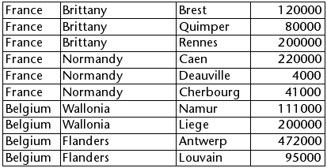
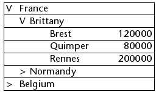

<!--REF #_command_.LISTBOX EXPAND.Syntax-->**LISTBOX EXPAND** ( {* ;} *objeto* {; *recursivo* {; *selector* {; *grueso* {; *columna*}}}} )<!-- END REF-->
<!--REF #_command_.LISTBOX EXPAND.Params-->
| Parámetro | Tipo |  | Descripción |
| --- | --- | --- | --- |
| * | Operador | &#8594;  | Si se especifica, objetos es un nombre de objeto (cadena). Si se omite, objeto es una variable |
| objeto | any | &#8594;  | Nombre del objeto (si se especifica *) o Variable (si se omite *) |
| recursivo | Boolean | &#8594;  | Verdadero = desplegar los subniveles, Falso = no desplegar los subniveles |
| selector | Integer | &#8594;  | Parte del list box a desplegar |
| grueso | Integer | &#8594;  | Número de línea de la ruptura a desplegar o Número de nivel del listbox a desplegar |
| columna | Integer | &#8594;  | Número de columna de la ruptura a desplegar |

<!-- END REF-->

#### Descripción 

<!--REF #_command_.LISTBOX EXPAND.Summary-->El comando LISTBOX EXPAND se utiliza para desplegar las líneas de ruptura del objeto list box designado por los parámetros objeto y \*.<!-- END REF-->  
  
Si pasa el parámetro opcional \*, indica que el parámetro *objeto* es un nombre de objeto (cadena). Si no pasa este parámetro, indica que el parámetro *objeto* es una variable. En este caso, se pasa una referencia de variable en lugar de una cadena.   
  
Si el list box no está configurado en modo jerárquico, el comando no hace nada. Para obtener más información sobre los list boxes jerárquicos, consulte la sección *List box jerárquicos*.  
  
El parámetro opcional *recursivo* se utiliza para configurar el despliegue de los subniveles jerárquicos del list box. Pase Verdadero u omita este parámetro para que el comando provoque el despliegue de todos los niveles y subniveles. Si pasa Falso, sólo el primer nivel especificado se desplegará.   
  
El parámetro opcional *selector* se utiliza para especificar el alcance del comando. Puede pasar en este parámetro una de las siguientes constantes del tema *Listbox*:  
  
| Constante    | Tipo         | Valor | Comentario                                                                                                                                                                                                                                                                                                                         |
| ------------ | ------------ | ----- | ---------------------------------------------------------------------------------------------------------------------------------------------------------------------------------------------------------------------------------------------------------------------------------------------------------------------------------- |
| lk all       | Entero largo | 0     | El comando afecta todos los subniveles (valor por defecto, utilizado si el parámetro se omite).                                                                                                                                                                                                                                    |
| lk selection | Entero largo | 1     | El comando afecta los subniveles seleccionados.                                                                                                                                                                                                                                                                                    |
| lk break row | Entero largo | 2     | El comando afecta el subnivel al que pertenece la "celda" designada por los parámetros *línea* y *columna*. Note que estos parámetros representan los números de línea y de columna en el listbox en modo estándar y no en su representación jerárquica. Si los parámetros *línea* y *columna* se omiten, el comando no hace nada. |
| lk level     | Entero largo | 3     | El comando afecta todas las líneas de ruptura correspondientes a la columna *nivel*. Este parámetro designa un número de columna en el list box en modo estándar y no en su representación jerárquica. Si se omite el parámetro *nivel*, el comando no hace nada.                                                                  |
  
  
El comando no selecciona líneas de ruptura.  
  
Si la selección o el list box no contienen una línea de ruptura o si todas las líneas de ruptura ya están expandidas, el comando no hace nada.

#### Ejemplo 

Este ejemplo ilustra diferentes modos de utilizar el comando. Dados los siguientes arrays representados en un list box:



```4d
  //Desplegar todas las líneas y sublíneas de ruptura del list box
 LISTBOX EXPAND(*;"MiListbox")
```


```4d
  //Desplegar el primer nivel de líneas de ruptura de la selección
 LISTBOX EXPAND(*;"MiListbox";False;lk selection)
  //Si la línea "Belgium" no fue seleccionada
```


```4d
  //Desplegar la línea de ruptura Brittany sin recursividad
 LISTBOX EXPAND(*;"MiListbox";False;lk break row;1;2)
```



```4d
  //Desplegar todas las primeras columnas (países) sin recursividad
 LISTBOX EXPAND(*;"MiListbox";False;lk level;1)
```


#### Ver también 

[LISTBOX COLLAPSE](listbox-collapse.md)  

#### Propiedades
|  |  |
| --- | --- |
| Número de comando | 1100 |
| Hilo seguro | &check; |
| Prohibido en el servidor ||


