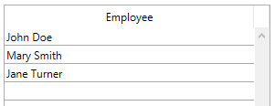
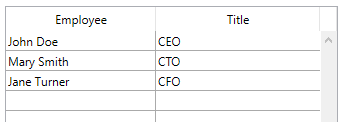

<!--REF #_command_.LISTBOX INSERT COLUMN FORMULA.Syntax-->**LISTBOX INSERT COLUMN FORMULA** ( {* ;} *objeto* ; *posicionCol* ; *nomCol* ; *formula* ; *tipoDatos* ; *nomEncabezado* ; *varEncabezado* {; *nomPie* ; *variablePie*} )<!-- END REF-->
<!--REF #_command_.LISTBOX INSERT COLUMN FORMULA.Params-->
| Parámetro | Tipo |  | Descripción |
| --- | --- | --- | --- |
| * | Operador | &#8594;  | Si se especifica, objeto es un nombre de objeto (cadena) Si se omite, objeto es una variable |
| objeto | any | &#8594;  | Nombre del objeto (si se especifica *) o Variable (si * se omite) |
| posicionCol | Integer | &#8594;  | Ubicación de la columna a insertar |
| nomCol | Text | &#8594;  | Nombre del objeto de la columna |
| formula | Text | &#8594;  | Fórmula 4D asociada a la columna |
| tipoDatos | Integer | &#8594;  | Tipo de resultado de la fórmula |
| nomEncabezado | Text | &#8594;  | Nombre del objeto del encabezado de la columna |
| varEncabezado | Integer, Pointer | &#8594;  | Variable del encabezado de la columna |
| nomPie | Text | &#8594;  | Nombre del objeto de pie de la columna |
| variablePie | Variable, Pointer | &#8594;  | Variable de pie de columna |

<!-- END REF-->

#### Descripción 

<!--REF #_command_.LISTBOX INSERT COLUMN FORMULA.Summary-->El comando **LISTBOX INSERT COLUMN FORMULA** inserta una columna en el listbox designado por los parámetros *objeto* y *\**.<!-- END REF-->  
El comando **LISTBOX INSERT COLUMN FORMULA** es similar al comando [LISTBOX INSERT COLUMN](listbox-insert-column.md) excepto que puede utilizarse para introducir una fórmula como contenido de una columna.

Este tipo de contenido solo puede utilizarse cuando la propiedad “Fuente de datos” del list box es **Selección actual**, **Selección temporal** o **Colección o Selección de entidades** (para mayor información, consulte la sección *Gestión programada de los objetos de tipo List box*).

**Nota**: este comando no hace nada si se aplica a la primera columna de un list box mostrado en modo jerárquico.

Si pasa el parámetro opcional *\*, i*ndica que el parámetro *objeto* es un nombre de objeto (cadena). Si no pasa este parámetro, indica que el parámetro *objeto* es una variable. En este caso, no pase una cadena sino una referencia de variable. Para mayor información sobre los nombres de objetos, consulte la sección *Propiedades de los objetos*.

La nueva columna se inserta justo antes de la columna designada por el parámetro *posicionCol*. Si el parámetro *posicionCol* es superior al número total de columnas, la columna se añadirá después de la última columna.

Pase en el parámetro *nomCol* el nombre del objeto de la columna insertada.

El parámetro *formula* puede contener cualquier expresión válida:

* Una instrucción,
* Una fórmula generada utilizando el editor de fórmulas,
* Una llamada a un comando 4D,
* Una llamada a un método proyecto.

En el momento de la llamada del comando, la *formula* se analiza y luego se ejecuta.

**Nota:** utilice el comando [Command name](command-name.md) para definir las fórmulas independientes del lenguaje de la aplicación (cuando llaman a comandos 4D).

El parámetro *tipoDatos* puede utilizarse para designar el tipo de datos resultantes de la ejecución de la *formula*. Debe pasar en este parámetro una de las siguientes constantes del tema *Tipos de campos y variables*:

| Constante  | Tipo         | Valor |
| ---------- | ------------ | ----- |
| Is Boolean | Entero largo | 6     |
| Is date    | Entero largo | 4     |
| Is picture | Entero largo | 3     |
| Is real    | Entero largo | 1     |
| Is text    | Entero largo | 2     |
| Is time    | Entero largo | 11    |

Si el resultado de la *formula* no corresponde al tipo de datos esperado, se genera un error.

Pase en los parámetros *nomEncabezado* y *varEncabezado* el nombre de objeto y la variable del encabezado de la columna insertada.

También puede pasar en los parámetros *nomPie* y *variablePie* el nombre del objeto y la variable del pie de la columna insertada. Si omite el parámetro *variablePie*, 4D utilizará una variable dinámica. 

**Nota:** los nombres de objeto deben ser únicos en un formulario. Debe asegurarse de que los nombres pasados en los parámetros *nomCol*, *nomEncabezado* y *nomPie* no hayan sido utilizados. De lo contrario, la columna no se crea y se genera un error.

##### Inserción dinámica 

A partir de 4D v14 R3, puede utilizar este comando para insertar columnas en los list box de forma dinámica durante la ejecución del formulario. 4D manejará automáticamente la definición de las variables necesarias (pie de página y encabezado).   
  
Para ello, LISTBOX INSERT COLUMN FORMULA acepta un puntero **Nil (->\[\])** como valor para los parámetros *varEncabezado* y *v* *ariablePie*. En este caso, cuando se ejecuta el comando, 4D crea las variables requeridas dinámicamente (para más información, consulte la sección ).   
  
Note que las variables de encabezado y de pie de página siempre se crean con un tipo específico (entero largo y texto, respectivamente).

#### Ejemplo 1 

Queremos añadir una nueva columna a la derecha del listbox que contendrá una fórmula que calcula la edad de un empleado:  

```4d
 vEdad:="Fecha actual-[Empleados]FechaNacimiento)\365"
 $ultima:=LISTBOX Get number of columns(*;"ListBox1")+1
 LISTBOX INSERT COLUMN FORMULA(*;"ListBox1";$ultima;"ColFormula";vEdad;Is real;"Edad";varEncabezado)
```

#### Ejemplo 2 

Usted quiere añadir una columna a un list box de tipo colección:

```4d
  //crear colección
 var emps : Collection
 emps:=New collection(New object("Employee";"John Doe";"JobTitle";"CEO");New object("Employee";"Mary Smith";"JobTitle";"CTO");New object("Employee";"Jane Turner";"JobTitle";"CFO"))
```

El contenido de la columna será evaluado para cada elemento de la colección y se utiliza la expresión fuente *This.Employee*:


Durante la ejecución:



Para añadir una columna mostrando los títulos de los cargos ocupados:

```4d
 LISTBOX INSERT COLUMN FORMULA(*;"EmpLB";2;"2nd Column";"This.JobTitle";Is text;"JTHeader";header2)
 OBJECT SET TITLE(header2;"Title")
```

La columna se añade al list box:



#### Ver también 

[LISTBOX INSERT COLUMN](listbox-insert-column.md)  

#### Propiedades

|  |  |
| --- | --- |
| Número de comando | 970 |
| Hilo seguro | &cross; |


