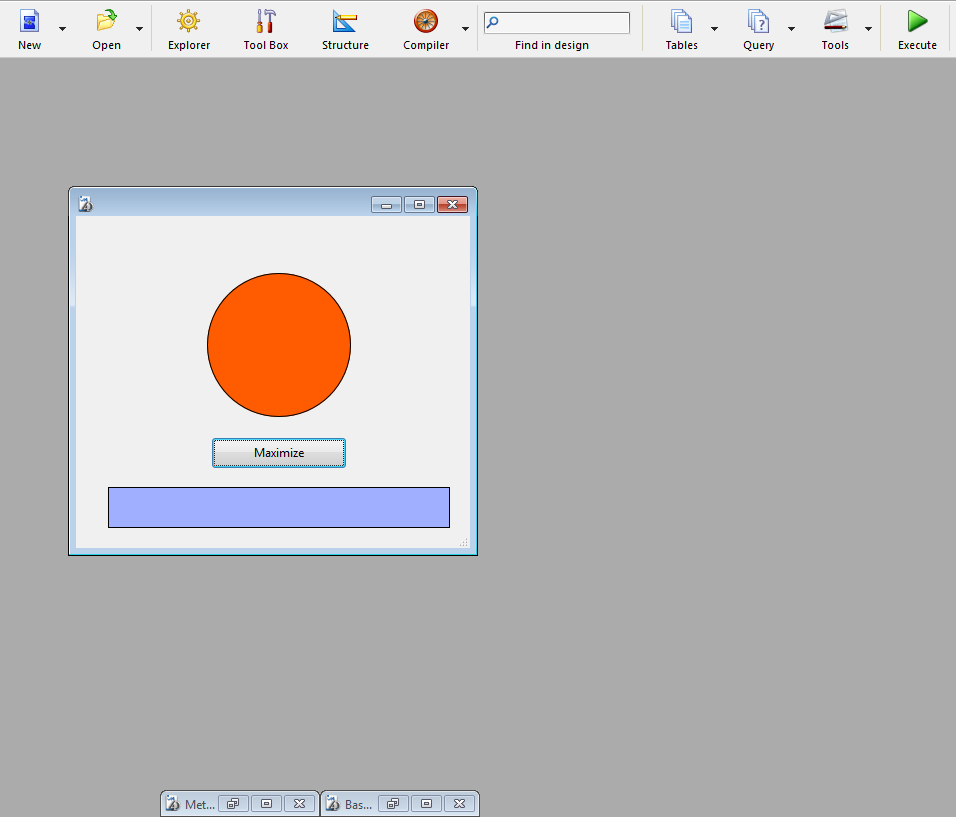

<!--REF #_command_.MAXIMIZE WINDOW.Syntax-->**MAXIMIZE WINDOW** {( *ventana* )}<!-- END REF-->
<!--REF #_command_.MAXIMIZE WINDOW.Params-->
| Parámetro | Tipo |  | Descripción |
| --- | --- | --- | --- |
| ventana | Integer | &#8594;  | Número de referencia de la ventana Si se omite = todas las ventanas (Windows) o Ventana del primer plano del proceso actual (Mac OS) |

<!-- END REF-->

*Este comando no es hilo seguro, no puede ser utilizado en código apropiativo.*


#### Descripción 

<!--REF #_command_.MAXIMIZE WINDOW.Summary-->El comando MAXIMIZE WINDOW provoca el zoom de la ventana cuyo número de referencia se pasa en *ventana*.<!-- END REF--> Si se omite este parámetro, el efecto es el mismo pero se aplica a todas las ventanas de la aplicación (Windows) o de la ventana del primer plano del proceso actual (Mac OS). 

Este comando tiene el mismo efecto que un clic en el zoom de una ventana de la aplicación 4D. En Windows, la ventana que desea maximizar debe tener un cuadro de zoom. Si el tipo de *ventana* no tiene un cuadro de zoom, el comando no hace nada.

Un clic posterior en la cuadro de zoom o la llamada al comando [MINIMIZE WINDOW](minimize-window.md) reduce la ventana a su tamaño inicial. En Windows, una llamada a [MINIMIZE WINDOW](minimize-window.md) sin parámetros hace que todas las ventanas de la aplicación vuelvan a su tamaño inicial.

Si *ventana* ya está maximizada, el comando no hace nada.

##### En Windows 

El tamaño de la ventana se incrementa para coincidir con el tamaño actual de la ventana de la aplicación (modo MDI) o la pantalla (modo SDI). La ventana maximizada pasa al primer plano. Si no pasa el parámetro *ventana*, el comando se aplica a todas las ventanas de la aplicación.


Zoom (botón para agrandar) bajo Windows

En casos en que se aplica el comando a una ventana cuyo tamaño está sujeto a restricciones (por ejemplo, una ventana formulario): 

* Si ninguna restricción de tamaño está en conflicto con el tamaño objetivo, la ventana se "maximiza" (es decir, se restaura del tamaño de la ventana MDI ("Multiple Document Interface"); su barra de título y sus bordes están ocultos y su botones de control, minimizar, restaurar y cerrar, se ubican a la derecha de la barra de menú de la aplicación).
* Si al menos una restricción de tamaño está en conflicto (por ejemplo, si el ancho de la ventana MDI es 100 y el ancho máximo de la ventana de formulario es 80), la ventana no se "maximiza", sólo se restaura a su tamaño máximo permitido. Este tamaño se define ya sea por la ventana MDI, o por la restricción. De esta manera, la interfaz sigue siendo coherente cuando se redimensionan ventanas con restricciones.

##### En Mac OS 

La ventana se agranda de manera que pueda mostrar la totalidad de su contenido. Si no pasa el parámeto *ventana*, el comando se aplica a la ventana del primer plano del proceso actual. 


Zoom en Mac OS

* El zoom se basa en el contenido de la ventana; así, el comando debe llamarse en un contexto en el que se definen el contenido de la ventana, por ejemplo, en un método formulario. De lo contrario, el comando no hace nada.
* La ventana está dimensionada en su tamaño "máximo". Si la ventana es un formulario cuyo tamaño se define en las Propiedades del formulario, el tamaño de la ventana se establece en esos valores.

#### Ejemplo 1 

Usted quiere que su formulario se abra en una ventana "abierta totalmente". Para alcanzar esto, usted coloca el siguiente código en el método de formulario:

```4d
  // Método de formulario
 MAXIMIZE WINDOW
```

#### Ejemplo 2 

Este ejemplo ilustra cómo las restricciones de tamaño se manejan en Windows (modo MDI). El siguiente formulario tiene una restricción de tamaño (ancho máximo=400):


El método del botón contiene únicamente:

```4d
 MAXIMIZE WINDOW(Current form window)
```

En este contexto, si el usuario hace clic en el botón:



... la ventana no se "maximiza"; sólo aumenta el alto:


#### Ver también 

[Is window maximized](is-window-maximized.md)  
[MINIMIZE WINDOW](minimize-window.md)  
[REDUCE RESTORE WINDOW](reduce-restore-window.md)  