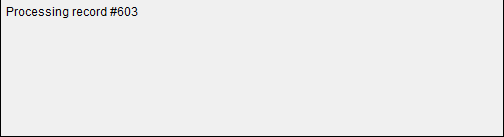
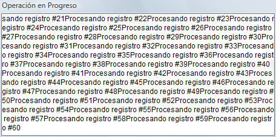
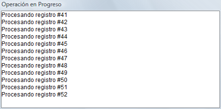
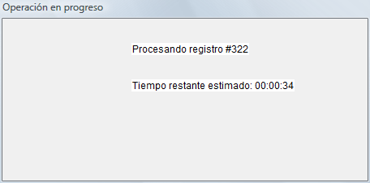

<!--REF #_command_.MESSAGE.Syntax-->**MESSAGE** ( *mensaje* )<!-- END REF-->
<!--REF #_command_.MESSAGE.Params-->
| Parámetro | Tipo |  | Descripción |
| --- | --- | --- | --- |
| mensaje | Text | &#8594;  | Mensaje a mostrar |

<!-- END REF-->

*Este comando no es hilo seguro, no puede ser utilizado en código apropiativo.*


#### Descripción 

<!--REF #_command_.MESSAGE.Summary-->El comando MESSAGE generalmente se utiliza para informar al usuario sobre alguna actividad.<!-- END REF--> Muestra *mensaje* en la pantalla en una ventana de mensaje especial que se abre y cierra cada vez que usted llama a MESSAGE, a menos que usted trabaje con una ventana que abrió previamente utilizando [Open window](open-window.md) (ver los siguientes detalles). El mensaje es temporal y se borra tan pronto como se muestre un formulario o se detenga la ejecución del método. Si se ejecuta otro comando MESSAGE, el mensaje anterior se borra.

Si se abre una ventana con [Open window](open-window.md "Open window"), todas las llamadas posteriores al comando MESSAGE muestran los mensajes en esa ventana. La ventana se comporta como un terminal:

* Los mensajes sucesivos no borran los mensajes anteriores cuando se muestran en la ventana, se concadenan en mensajes existentes.
* Si un mensaje es más largo que la ventana, 4D inserta automáticamente un retorno a la línea.
* Si un mensaje tiene más líneas que la ventana, 4D automáticamente desplaza el mensaje en la ventana.
* Para controlar los saltos de línea automáticos, incluya retornos de carro, — **Char(13)** —, en su mensaje.
* Para mostrar el texto en un lugar en particular de la ventana, llame [GOTO XY](goto-xy.md)..
* Para borrar los contenidos de la ventana, llame [ERASE WINDOW](erase-window.md)..
* La ventana es sólo una ventana de salida y su contenido no puede ser rediseñado cuando otras ventanas se colocan sobre ella.
* Puede modificar la fuente y el tamaño de los caracteres mostrados en la ventana a través de la página "Interfaz" en las Propiedades de la base.

**Nota:** **MESSAGE** es compatible con el comando [Open form window](open-form-window.md); sin embargo, en este contexto, el segundo parámetro *\** de [Open form window](open-form-window.md), que guarda el tamaño y la posición de la ventana, no es compatible.

#### Ejemplo 1 

El siguiente ejemplo procesa una selección de registros y llama MESSAGE para informar al usuario sobre el progreso de la operación:

```4d
 For($vlRegistro;1;Records in selection([todaTabla]))
    MESSAGE("Proceso del registro #"+String($vlRegistro))
  // Hacer algo con el registro
    NEXT RECORD([todaTabla])
 End for
```

La siguiente ventana aparece y desaparece cada vez que se llama MESSAGE:



#### Ejemplo 2 

Con el fin de evitar la ventana "titilante", puede mostrar los mensajes en una ventana abierta utilizando [Open window](open-window.md "Open window"), como en este ejemplo:

```4d
 Open window(50;50;500;250;5;"Operación en progreso")
 For($vlRegistro;1;Records in selection([todaTabla]))
    MESSAGE("Procesando registro #"+String($vlRegistro))
  // Hacer algo con el registro
    NEXT RECORD([todaTabla])
 End for
 CLOSE WINDOW
```

El resultado es el siguiente (en Windows):



#### Ejemplo 3 

Añadiendo un retorno de carro mejora la presentación:

```4d
 Open window(50;50;500;250;5;"Operación en progreso")
 For($vlRegistro;1;Records in selection([todaTabla]))
    MESSAGE("Procesando registro #"+String($vlRegistro)+Char(Carriage return))
  // Hacer algo con el registro
    NEXT RECORD([todaTabla])
 End for
 CLOSE WINDOW
```

Este es el resultado (en Windows):



#### Ejemplo 4 

Utilizando [GOTO XY](goto-xy.md "GOTO XY") y escribiendo algunas líneas adicionales:

```4d
 Open window(50;50;500;250;5;"Operación en progreso")
 $vlNbRegistros:=Records in selection([todaTabla])
 $vhStartTime:=Current time
 For($vlRegistro;1;$vlNbRegistros)
    GOTO XY(5;2)
    MESSAGE("Procesando registro #"+String($vlRegistro)+Char(Carriage return))
  // Hacer algo con el registro
    NEXT RECORD([todaTabla])
    GOTO XY(5;5)
    $vlResto:=(($vlNbRegistros/$vlRegistro)-1)*(Current time-$vhHoraInicio)
    MESSAGE("Tiempo restante estimado: "+Time string($vlResto))
 End for
 CLOSE WINDOW
```

El resultado es el siguiente (en Windows):



#### Ver también 

[CLOSE WINDOW](close-window.md)  
[ERASE WINDOW](erase-window.md)  
[GOTO XY](goto-xy.md)  
[Open window](open-window.md)  