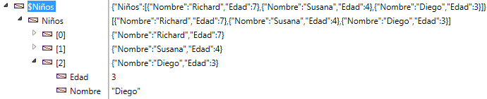
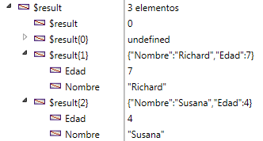

<!--REF #_command_.OB GET ARRAY.Syntax-->**OB GET ARRAY** ( *objeto* ; *propiedad* ; *array* )<!-- END REF-->
<!--REF #_command_.OB GET ARRAY.Params-->
| Parámetro | Tipo |  | Descripción |
| --- | --- | --- | --- |
| objeto | Object, Campo Object | &#8594;  | Objeto estructurado |
| propiedad | Text | &#8594;  | Nombre de la propiedad a leer |
| array | Text array, Real array, Boolean array, Object array, Pointer array, Integer array | &#8592; | Array valor de la propiedad |

<!-- END REF-->

#### Descripción 

<!--REF #_command_.OB GET ARRAY.Summary-->El comando **OB GET ARRAY** recupera en *array*, el array de valores almacenados en la *propiedad* del objeto de lenguaje designado por el parámetro *objeto*.<!-- END REF-->  
  
*objeto* debe haber sido definido con el comando [C\_OBJECT](c-object.md) o designar un campo objeto 4D.  
  
En el parámetro *propiedad*, pase la etiqueta de la propiedad a leer. Tenga en cuenta que el parámetro *propiedad* tiene en cuenta las mayúsculas y minúsculas.

#### Ejemplo 1 

Dado un objeto array definido en el ejemplo del comando [OB SET ARRAY](ob-set-array.md):

  
  
Queremos recuperar estos valores:

```4d
 ARRAY OBJECT($result;0)
 OB GET ARRAY($Children;"Children";$result)
```



#### Ejemplo 2 

Queremos cambiar un valor en el primer elemento del array:  
  
```4d
  // Cambiar el valor de "age":
 ARRAY OBJECT($refs)
 OB GET ARRAY($refEmployees;"__ENTITIES";$refs)
 OB SET($refs{1};"age";25)
```

#### Ver también 

*Conversiones de tipo entre las colecciones y los arrays 4D*  
[OB SET ARRAY](ob-set-array.md)  