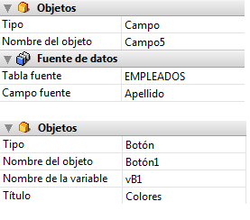

<!--REF #_command_.OBJECT SET DATA SOURCE.Syntax-->**OBJECT SET DATA SOURCE** ( {* ;} *objeto* ; *fuenteDatos* )<!-- END REF-->
<!--REF #_command_.OBJECT SET DATA SOURCE.Params-->
| Parámetro | Tipo |  | Descripción |
| --- | --- | --- | --- |
| * | Operador | &#8594;  | Si se especifica, objeto es un nombre de objeto (cadena)<br/>Si se omite, objeto es un campo o una variable |
| objeto | any | &#8594;  | Nombre de objeto (si se especifica *) o<br/>Campo o variable (si se omite *) |
| fuenteDatos | Pointer | &#8594;  | Puntero a la nueva fuente de datos del objeto |

<!-- END REF-->

*Este comando no es hilo seguro, no puede ser utilizado en código apropiativo.*


#### Descripción 

<!--REF #_command_.OBJECT SET DATA SOURCE.Summary-->El comando **OBJECT SET DATA SOURCE** modifica la fuente de datos de los objetos designados por los parámetros *objeto* y *\** .<!-- END REF-->  
  
Si pasa el parámetro opcional *\** indica que el parámetro *objeto* es un nombre de objeto (cadena). Si no pasa este parámetro, indica que el parámetro objeto es un campo o una variable. En este caso, se pasa una referencia de campo o variable en lugar de una cadena (campo o variable objeto únicamente).  
  
La fuente de datos es el campo o la variable cuyo valor es representado por el objeto cuando se ejecuta el formulario. En modo Diseño, la fuente de datos se define en la lista de propiedades, por lo general a través de las líneas Fuente y Campo fuente (campos) o Nombre de variable (variables):



A excepción de los list box (ver más adelante), todas las fuentes de datos del formulario pueden ser modificadas por este comando. Es responsabilidad del desarrollador asegurar la consistencia de los cambios realizados.  
  
En el caso de los list box, se deben tener en cuenta los siguientes puntos:

* Los cambios de fuentes de datos deben tener en cuenta el tipo de list box: por ejemplo, no es posible utilizar un campo como fuente de datos de una columna de en un list box de tipo array.
* Para los list box de tipo selección, no es posible modificar o leer la fuente de datos del objeto list box en sí: ​​en este caso, se trata de una referencia interna y no de una fuente de datos.
* Este comando se utiliza en el contexto de los list box de tipo array. Para los list box de tipo selección, puede en vez utilizar el comando \[[LISTBOX SET COLUMN FORMULA](listbox-set-column-formula.md)

Si este comando se aplica a una fuente de datos que no se puede editar, no hace nada.

#### Ejemplo 

Cambio de la fuente de datos para un área de entrada:

```4d
 var $ptrField : Pointer
 $ptrField:=Field(3;2)
 OBJECT SET DATA SOURCE(*;"Input";$ptrField)
```

#### Ver también 

[LISTBOX SET COLUMN FORMULA](listbox-set-column-formula.md)  
[OBJECT Get data source](object-get-data-source.md)  